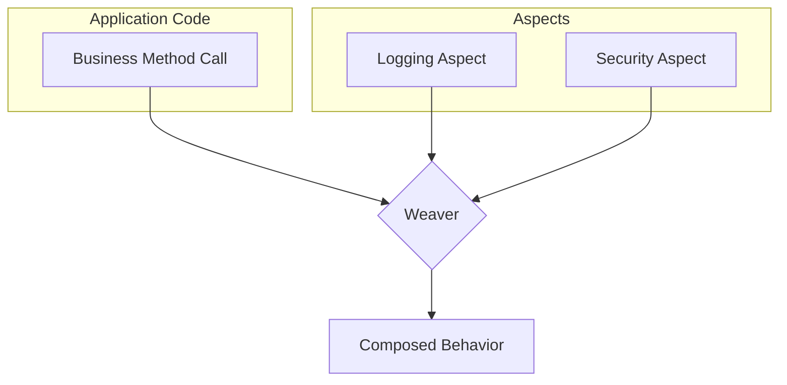
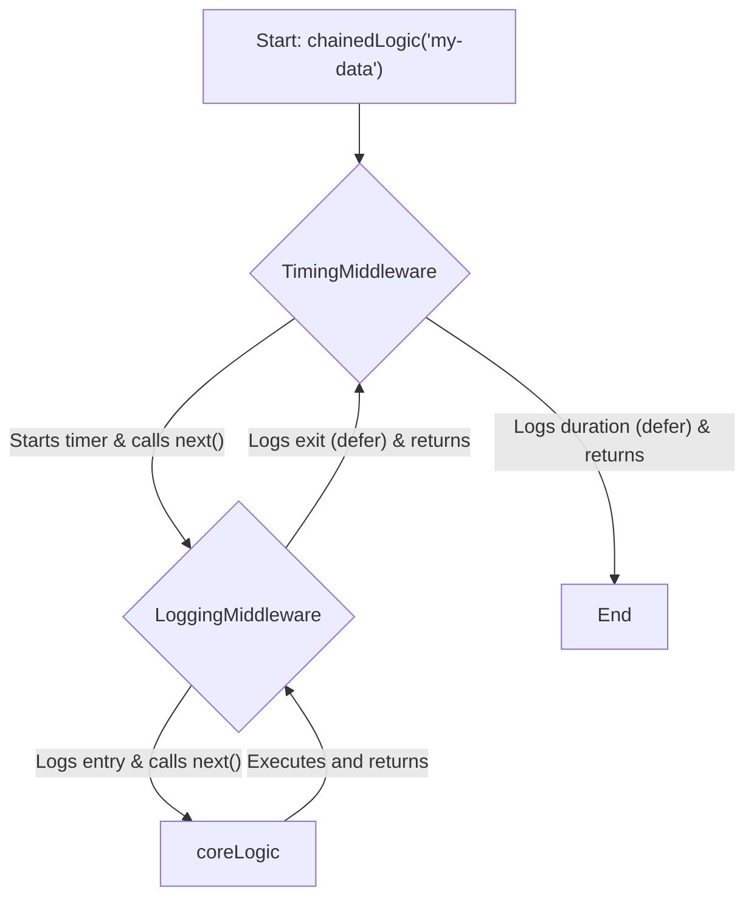

title: "Aspect-Oriented Programming"
description: "Learn about Aspect-Oriented Programming (AOP), a paradigm for modularizing cross-cutting concerns like logging and security."
sidebar_position: 6
hide_title: true
---

<Hero
  title="Aspect-Oriented Programming"
  description="Modularize cross‑cutting concerns like logging, auth, and transactions without tangling business logic"
  size="large"
/>

<Head>
  <meta name="description" content="Learn about Aspect-Oriented Programming (AOP), a paradigm for modularizing cross-cutting concerns like logging and security." />
  <meta property="og:title" content="Aspect-Oriented Programming" />
  <meta property="og:description" content="Learn about Aspect-Oriented Programming (AOP), a paradigm for modularizing cross-cutting concerns like logging and security." />
  <meta property="og:image" content="https://archman.dev/img/archman-social-card.webp" />
  <meta name="twitter:card" content="summary_large_image" />
  
  
</Head>

> "Aspect-Oriented Programming is about modularizing things that would otherwise be scattered and tangled throughout your code."
> — Gregor Kiczales

Aspect-Oriented Programming (AOP) is a paradigm that aims to increase modularity by allowing the separation of **cross-cutting concerns**. These are functionalities like logging, authentication, or transaction management that "cut across" multiple points in an application's business logic. AOP provides mechanisms to define these concerns in one place (an "aspect") and apply them declaratively.

## Core ideas

- **Aspect**: A module that encapsulates a cross-cutting concern. For example, a `LoggingAspect` could contain all logging-related logic.
- **Join Point**: A specific point during the execution of a program, such as a method call or an exception being thrown. This is where an aspect *can* be applied.
- **Advice**: The action taken by an aspect at a particular join point. Common advice types include `before`, `after`, and `around` (wrapping the join point).
- **Pointcut**: A predicate that matches join points. A pointcut expression (e.g., "all public methods in the `service` package") determines where advice is executed.
- **Weaving**: The process of linking aspects with the main application code. This can be done at compile time, load time, or runtime.

<Figure caption="AOP Weaving Process: Aspects are woven into the application code at specified join points to create composed behavior.">

</Figure>

## Examples

Modern AOP is often implemented using decorators (in Python, TypeScript) or middleware/proxies (in Go, Java) which act as a lightweight form of runtime weaving.

<Tabs groupId="lang" queryString>
  <TabItem value="python" label="Python">
```python title="middleware.py" showLineNumbers
import functools
import time

def timing_aspect(fn):
    """A decorator that logs the execution time of a function."""
    @functools.wraps(fn)
    def wrapper(*args, **kwargs):
        start_time = time.perf_counter()
        try:
            result = fn(*args, **kwargs)
            return result
        finally:
            end_time = time.perf_counter()
            run_time = end_time - start_time
            print(f"Finished {fn.__name__!r} in {run_time:.4f} secs")
    return wrapper

@timing_aspect
def process_data(data):
    """Simulates a business logic function."""
    time.sleep(0.1)
    return len(data)

process_data([1, 2, 3])
```
  </TabItem>
  <TabItem value="go" label="Go">
```go title="middleware.go" showLineNumbers
package main

import (
    "log"
    "time"
)

// BusinessLogic is the core function type.
type BusinessLogic func(string) error

// LoggingMiddleware is an aspect that logs method entry and exit.
func LoggingMiddleware(next BusinessLogic) BusinessLogic {
    return func(data string) error {
        log.Printf("Executing with data: %s", data)
        defer log.Println("Finished execution.")
        return next(data)
    }
}

// TimingMiddleware measures execution time.
func TimingMiddleware(next BusinessLogic) BusinessLogic {
    return func(data string) error {
        start := time.Now()
        defer func() {
            log.Printf("Execution time: %v", time.Since(start))
        }()
        return next(data)
    }
}

func main() {
    // Core business logic
    coreLogic := func(data string) error {
        log.Printf("Core logic processing: %s", data)
        return nil
    }

    // Weave aspects via middleware chaining
    chainedLogic := TimingMiddleware(LoggingMiddleware(coreLogic))
    chainedLogic("my-data")
}
```
  </TabItem>
  <TabItem value="node" label="Node.js (Proxy)">
```javascript title="proxy.js" showLineNumbers
const performanceAspect = {
  apply(target, thisArg, args) {
    console.time(target.name);
    const result = Reflect.apply(target, thisArg, args);
    console.timeEnd(target.name);
    return result;
  }
};

function someBusinessLogic(a, b) {
  // complex calculation
  return a + b;
}

// Weave the aspect using a Proxy
const proxiedLogic = new Proxy(someBusinessLogic, performanceAspect);

proxiedLogic(10, 20); // Logs execution time to the console
```
  </TabItem>
</Tabs>

<Figure caption="Call flow for the Go middleware example, showing how aspects (middleware) wrap the core logic.">

</Figure>

<Vs highlight={[0,1,0,0]} title="When to Use vs. When to Reconsider"
  items={[
{
    label: "When to Use",
    points: [
"**Centralizing common concerns**: Perfect for logging, caching, security checks, and transaction management that would otherwise be scattered across the codebase.",
        "**Enforcing policies**: When you need to uniformly apply a policy (e.g., all service-layer methods must be timed) without relying on developers to remember.",
        "**Extending third-party code**: Can be used to add functionality to libraries or frameworks where you don't control the source code.",
    ],
    highlightTone: "warning"
  },
{
    label: "Weaving Strategy",
    points: [
"**Centralizing common concerns**: Perfect for logging, caching, security checks, and transaction management that would otherwise be scattered across the codebase.",
        "**Enforcing policies**: When you need to uniformly apply a policy (e.g., all service-layer methods must be timed) without relying on developers to remember.",
        "**Extending third-party code**: Can be used to add functionality to libraries or frameworks where you don't control the source code.",
    ],
    highlightTone: "info"
  },
{
    label: "Observability",
    points: [
"**Centralizing common concerns**: Perfect for logging, caching, security checks, and transaction management that would otherwise be scattered across the codebase.",
        "**Enforcing policies**: When you need to uniformly apply a policy (e.g., all service-layer methods must be timed) without relying on developers to remember.",
        "**Extending third-party code**: Can be used to add functionality to libraries or frameworks where you don't control the source code.",
    ],
    highlightTone: "info"
  },
{
    label: "Debugging",
    points: [
"**Centralizing common concerns**: Perfect for logging, caching, security checks, and transaction management that would otherwise be scattered across the codebase.",
        "**Enforcing policies**: When you need to uniformly apply a policy (e.g., all service-layer methods must be timed) without relying on developers to remember.",
        "**Extending third-party code**: Can be used to add functionality to libraries or frameworks where you don't control the source code.",
    ],
    highlightTone: "info"
  }
]} />

<Checklist
  title="Design Review Checklist"
  items={[
    "Is the concern truly cross-cutting, or is it part of the domain's core logic?",
    "Is the pointcut expression specific enough to avoid unintended side effects?",
    "Does the aspect introduce 'action at a distance' that makes the code hard to follow?",
    "Is the performance impact of runtime weaving acceptable for the use case?",
    "Are aspects and their configurations well-documented?",
  ]}
/>

## Common Aspects in Production

### Authorization Aspect

```javascript
// Check permissions before method execution
function authorizeAspect(requiredPermission) {
    return function(target, propertyKey, descriptor) {
        const originalMethod = descriptor.value;

        descriptor.value = async function(...args) {
            const user = this.currentUser;
            if (!user || !user.permissions.includes(requiredPermission)) {
                throw new Error(`Unauthorized: requires ${requiredPermission}`);
            }
            return originalMethod.apply(this, args);
        };

        return descriptor;
    };
}

class AccountService {
    @authorizeAspect('admin')
    deleteUser(userId) {
        // Only executed if user has 'admin' permission
    }
}
```

### Caching Aspect

```python
from functools import wraps
import hashlib
import json

def caching_aspect(ttl_seconds=3600):
    """Cache method results for ttl_seconds."""
    cache = {}

    def decorator(fn):
        @wraps(fn)
        def wrapper(*args, **kwargs):
            # Create cache key from args
            key_data = json.dumps([args, sorted(kwargs.items())], default=str, sort_keys=True)
            cache_key = hashlib.sha256(key_data.encode()).hexdigest()

            if cache_key in cache:
                result, timestamp = cache[cache_key]
                if time.time() - timestamp < ttl_seconds:
                    return result

            # Not in cache or expired
            result = fn(*args, **kwargs)
            cache[cache_key] = (result, time.time())
            return result

        return wrapper
    return decorator

class UserService:
    @caching_aspect(ttl_seconds=300)
    def get_user(self, user_id):
        # Expensive database query
        return db.query(f"SELECT * FROM users WHERE id = {user_id}")
```

### Retry Aspect

```go
func retryAspect(maxRetries int, backoff time.Duration) func(func() error) error {
    return func(operation func() error) error {
        var lastErr error

        for attempt := 0; attempt <= maxRetries; attempt++ {
            err := operation()
            if err == nil {
                return nil
            }

            lastErr = err
            if attempt < maxRetries {
                time.Sleep(backoff * time.Duration(1<<uint(attempt)))  // Exponential backoff
            }
        }

        return lastErr
    }
}

// Usage
retryAspect(3, 100*time.Millisecond)(func() error {
    return callUnreliableAPI()
})
```

## When AOP Becomes a Liability

**Over-use of AOP can hide control flow:**
- Hard to trace where logging happens
- Difficult to debug (aspect fires, code doesn't)
- Performance impact not obvious
- Aspect interactions not clear

**Better alternatives in many cases:**
- Middleware (Express, FastAPI): explicit, linear
- Decorators for single responsibility (Python, Java)
- Higher-order functions for composition (JavaScript)

**Use AOP when:**
- Same concern scattered across many methods (cross-cutting)
- Concern is orthogonal to business logic
- Aspect library handles it well (Spring AOP, AspectJ)

## Design Review Checklist

- Is the concern truly cross-cutting, or is it part of the domain's core logic?
- Is the pointcut expression specific enough to avoid unintended side effects?
- Does the aspect introduce 'action at a distance' that makes the code hard to follow?
- Is the performance impact of runtime weaving acceptable for the use case?
- Are aspects and their configurations well-documented?
- Can you easily trace which aspects apply to a given method?
- Are aspect interactions tested (multiple aspects on same method)?
- Is the team comfortable with the abstraction level?

## Related topics

- [Architecture Governance & Organization](/docs/architecture-governance-and-organization)
- [Design Patterns](/docs/design-patterns) (specifically [Decorator](/docs/design-patterns/structural/decorator) and [Proxy](/docs/design-patterns/structural/proxy))
- [Middleware Patterns](/docs/design-patterns/structural/middleware)
- [Dependency Injection](/docs/foundational-concepts/design-principles/dependency-injection)

## References

1.  [Gregor Kiczales, et al. "Aspect-Oriented Programming."](https://www.cs.ubc.ca/~gregor/papers/kiczales-ECOOP1997-AOP.pdf) *ECOOP'97 — Object-Oriented Programming*, vol. 1241, 1997, pp. 220–242. ↗️ — The original paper that introduced AOP, providing the foundational concepts and motivation.
2.  [A Guide to Spring AOP](https://www.baeldung.com/spring-aop) ↗️ — A practical guide to implementing Aspect-Oriented Programming using the Spring Framework, a popular real-world use case.
3.  [Practical Decorator Pattern in Python](https://realpython.com/primer-on-python-decorators/) ↗️ — Decorators as a lightweight alternative to AOP in Python.

