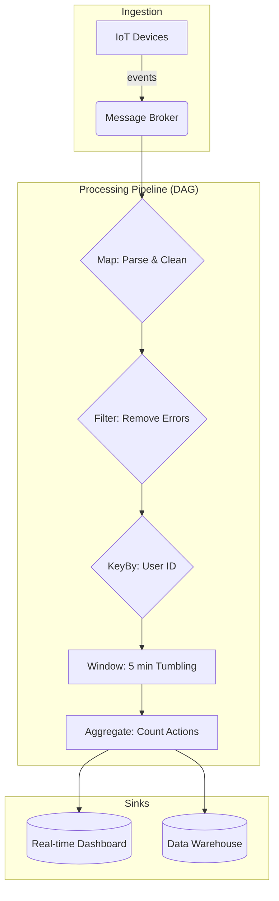
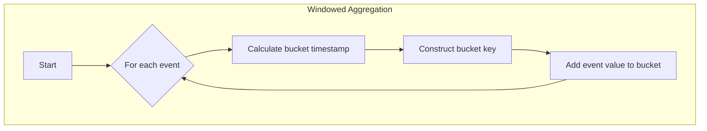
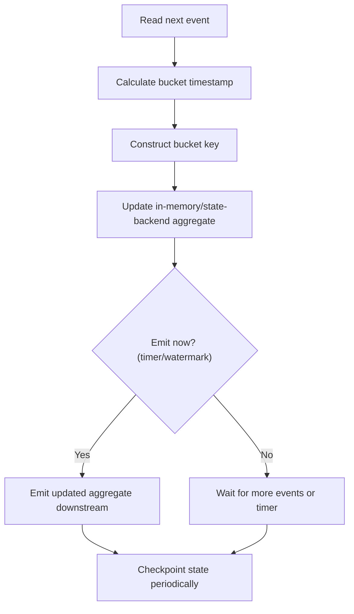

title: "Dataflow & Stream Processing"
description: "Pipelines of operators over unbounded streams—time, windows, state, and exactly-once semantics."
sidebar_position: 5
hide_title: true
---

<Hero
  title="Dataflow & Stream Processing"
  description="Pipelines of operators over unbounded streams—time, windows, state, and delivery semantics"
  size="large"
/>

<Head>
  <meta name="description" content="Pipelines of operators over unbounded streams—time, windows, state, and exactly-once semantics." />
  <meta property="og:title" content="Dataflow & Stream Processing" />
  <meta property="og:description" content="Pipelines of operators over unbounded streams—time, windows, state, and exactly-once semantics." />
  <meta property="og:image" content="https://archman.dev/img/archman-social-card.webp" />
  <meta name="twitter:card" content="summary_large_image" />
  
  
</Head>

Dataflow programming is a paradigm that models a program as a directed graph of data flowing between operations. Stream processing applies this model to unbounded, continuous streams of data, treating data not as a static collection but as a series of events in motion. It's the foundation for real-time analytics, large-scale event processing, and reactive systems.

> "The world is a stream of events. Why should our data architecture be any different?"
> — Jay Kreps

<Figure caption="A stream processing pipeline modeled as a Directed Acyclic Graph (DAG).">

</Figure>

## Core ideas

- **Streams**: Unbounded, time-ordered sequences of immutable event records.
- **Operators**: Functions that transform streams. Common operators include `map`, `filter`, `join`, and `aggregate`.
- **Directed Acyclic Graph (DAG)**: A pipeline is modeled as a DAG where streams are edges and operators are vertices.
- **Windowing**: Grouping infinite stream elements into finite "windows" based on time or count, allowing for aggregations over bounded sets.
- **State Management**: Many stream operations (like windowing or joins) are stateful. The system must provide fault-tolerant state storage.
- **Time Semantics**: Distinguishing between **Event Time** (when the event occurred at the source) and **Processing Time** (when the event is observed by the processing engine).

<Figure caption="A conceptual view of a windowed aggregation function.">

</Figure>

## Examples

The examples show a simple, conceptual windowed aggregation. Real-world stream processors like Flink or Kafka Streams provide robust, fault-tolerant implementations of these concepts.

<Figure caption="Sequential call flow for windowed aggregation across all language tabs.">

</Figure>

<Tabs groupId="lang" queryString>
  <TabItem value="python" label="Python (Conceptual)">
```python title="conceptual_pipeline.py" showLineNumbers
# Conceptual example of windowed aggregation
from collections import defaultdict

def windowed_sum(events, window_seconds):
    """
    Aggregates event values into time-based windows.
    `events` is an iterator of dictionaries like {'ts': 1672531205, 'key': 'A', 'value': 10}
    """
    buckets = defaultdict(int)
    for event in events:
        # Integer division creates discrete time buckets
        bucket_timestamp = (event["ts"] // window_seconds) * window_seconds
        key = (event["key"], bucket_timestamp)
        buckets[key] += event["value"]
    return buckets

# Example usage:
# stream = get_event_stream()
# aggregated_windows = windowed_sum(stream, 300) # 5-minute windows
```
  </TabItem>
  <TabItem value="go" label="Go (Conceptual)">
```go title="conceptual_pipeline.go" showLineNumbers
package main

import "fmt"

type Event struct {
    Timestamp int64
    Key       string
    Value     int
}

// WindowedSum aggregates events into time-based windows.
func WindowedSum(events <-chan Event, windowSeconds int64) map[string]int {
    buckets := make(map[string]int)
    for e := range events {
        bucketTimestamp := (e.Timestamp / windowSeconds) * windowSeconds
        key := fmt.Sprintf("%s:%d", e.Key, bucketTimestamp)
        buckets[key] += e.Value
    }
    return buckets
}

func main() {
    // In a real app, events would come from a source like Kafka.
    eventChan := make(chan Event, 2)
    eventChan <- Event{1672531205, "A", 10}
    eventChan <- Event{1672531215, "A", 5}
    close(eventChan)

    results := WindowedSum(eventChan, 300)
    fmt.Println(results) // map[A:1672531200:15]
}
```
  </TabItem>
  <TabItem value="node" label="Node.js (Streams)">
```javascript title="pipeline.mjs" showLineNumbers
import { Transform } from 'node:stream';

// A transform stream to perform windowed aggregation.
export function createWindowedAggregator(windowMs) {
    const buckets = new Map(); // Stores aggregated values for each window

    return new Transform({
        objectMode: true,
        transform(event, _encoding, callback) {
            // { ts: 1672531205, key: 'A', value: 10 }
            const bucketTimestamp = Math.floor(event.ts / windowMs) * windowMs;
            const bucketKey = `${event.key}:${bucketTimestamp}`;

            const currentSum = buckets.get(bucketKey) || 0;
            buckets.set(bucketKey, currentSum + event.value);

            // In a real system, you'd emit based on watermarks or timers.
            // For simplicity, we emit the updated aggregate immediately.
            this.push({ bucketKey, sum: buckets.get(bucketKey) });
            callback();
        },
    });
}
```
  </TabItem>
</Tabs>

<Vs highlight={[0,1,0,0]} title="When to Use vs. When to Reconsider"
  items={[
{
    label: "When to Use",
    points: [
"**Real-time monitoring and analytics**: Dashboards, alerting systems, and anomaly detection that require insights with sub-second latency.",
        "**Event-driven architectures**: As the processing engine that reacts to, transforms, and enriches event streams from services.",
        "**Large-scale data transformation (ETL)**: For continuous, low-latency ETL jobs, replacing traditional batch processing.",
    ],
    highlightTone: "warning"
  },
{
    label: "State & Fault Tolerance",
    points: [
"**Real-time monitoring and analytics**: Dashboards, alerting systems, and anomaly detection that require insights with sub-second latency.",
        "**Event-driven architectures**: As the processing engine that reacts to, transforms, and enriches event streams from services.",
        "**Large-scale data transformation (ETL)**: For continuous, low-latency ETL jobs, replacing traditional batch processing.",
    ],
    highlightTone: "info"
  },
{
    label: "Backpressure",
    points: [
"**Real-time monitoring and analytics**: Dashboards, alerting systems, and anomaly detection that require insights with sub-second latency.",
        "**Event-driven architectures**: As the processing engine that reacts to, transforms, and enriches event streams from services.",
        "**Large-scale data transformation (ETL)**: For continuous, low-latency ETL jobs, replacing traditional batch processing.",
    ],
    highlightTone: "info"
  },
{
    label: "Schema Evolution",
    points: [
"**Real-time monitoring and analytics**: Dashboards, alerting systems, and anomaly detection that require insights with sub-second latency.",
        "**Event-driven architectures**: As the processing engine that reacts to, transforms, and enriches event streams from services.",
        "**Large-scale data transformation (ETL)**: For continuous, low-latency ETL jobs, replacing traditional batch processing.",
    ],
    highlightTone: "info"
  },
{
    label: "Reprocessing & Replays",
    points: [
"**Real-time monitoring and analytics**: Dashboards, alerting systems, and anomaly detection that require insights with sub-second latency.",
        "**Event-driven architectures**: As the processing engine that reacts to, transforms, and enriches event streams from services.",
        "**Large-scale data transformation (ETL)**: For continuous, low-latency ETL jobs, replacing traditional batch processing.",
    ],
    highlightTone: "info"
  }
]} />

## Edge cases

- Late or out‑of‑order events: use watermarks and allowed lateness; route extreme lateness to side outputs.
- Hot keys/skew: shard keys (e.g., add random salt) and re‑aggregate; consider load‑aware partitioning.
- Large windows/state: enable incremental aggregation and compaction; set state TTLs.
- Exactly‑once sinks: prefer idempotent upserts and transactional/atomic writes where supported; avoid dual‑write hazards.

<Showcase
    title="Security Considerations"
    sections={[
        {
            label: "Data Encryption",
            body: "Ensure data is encrypted both in transit (e.g., using TLS for streams between nodes and brokers) and at rest (e.g., for state backends and durable logs).",
        },
        {
            label: "Authentication & Authorization",
            body: "Processing pipelines should authenticate with data sources and sinks. Use mechanisms like mTLS, OAuth, or SASL. Enforce authorization to control which components can read from or write to specific streams.",
        },
        {
            label: "Data Privacy and Governance",
            body: "For sensitive data, implement data masking or tokenization within your stream operators. Be aware of data residency requirements and ensure your processing topology complies with them.",
        },
  ]}
/>

<Showcase
    title="Observability"
    sections={[
        {
            label: "Metrics",
            body: "Monitor key performance indicators (KPIs) like message throughput, latency (end-to-end, processing time), consumer lag, and watermark progress. Expose these via a monitoring system like Prometheus.",
        },
        {
            label: "Logging",
            body: "Implement structured logging within operators. Include correlation IDs to trace a single event or transaction as it flows through the entire DAG.",
        },
        {
            label: "Tracing",
            body: "Use distributed tracing to visualize the complete lifecycle of an event across multiple operators and services, helping to pinpoint bottlenecks and errors.",
        },
  ]}
/>

## Testing

- Deterministic window tests: feed synthetic, time‑stamped events (with reordering) and assert window outputs under configured watermarks.
- State recovery: crash between checkpoints and verify exactly‑once/at‑least‑once guarantees per design.
- Backpressure: simulate bursty sources and slow sinks; assert throughput and bounded latency within SLOs.
- Schema evolution: validate forward/backward compatibility via a registry (Avro/Protobuf) and consumer‑driven contracts.

<Checklist
  title="Design Review Checklist"
  items={[
    "Is the distinction between Event Time and Processing Time understood and handled correctly?",
    "Is the windowing strategy (tumbling, sliding, session) appropriate for the business problem?",
    "How is late-arriving data handled (e.g., allowed lateness, side outputs)?",
    "Are all stateful operations configured with fault-tolerant state backends?",
    "Is the end-to-end delivery guarantee (at-least-once vs. exactly-once) defined and implemented correctly?",
    "Is there a strategy for monitoring pipeline health, including consumer lag and watermarks?",
  ]}
/>

## Related topics

- [Event-Driven & Reactive](./event-driven-and-reactive)
- [Data Architecture & Persistence](../../data-architecture-and-persistence)
- [Distributed Systems & Microservices](../../distributed-systems-and-microservices)

## References

1.  <a href="https://www.oreilly.com/library/view/designing-data-intensive-applications/9781491903063/" target="_blank" rel="nofollow noopener noreferrer">Designing Data-Intensive Applications by Martin Kleppmann ↗️</a>
2.  <a href="https://flink.apache.org/" target="_blank" rel="nofollow noopener noreferrer">Apache Flink Documentation ↗️</a>
3.  <a href="https://kafka.apache.org/documentation/streams/" target="_blank" rel="nofollow noopener noreferrer">Kafka Streams Documentation ↗️</a>
