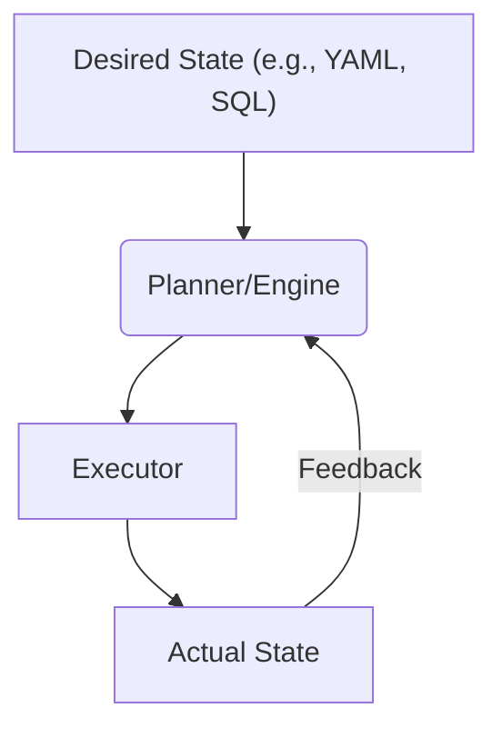

# Declarative & Logic

Declarative programming focuses on describing **what** the desired outcome is, leaving the **how** to the underlying system. Instead of writing step-by-step instructions, you define a goal, and the engine (e.g., a database query optimizer, a UI framework, or an infrastructure provisioner) determines the most efficient plan to achieve it. Logic programming is a subset of this, using formal logic, facts, and rules to deduce answers from a knowledge base.

> "In a declarative system, you don't tell the computer what to do. You tell it what you want."
> — Rich Hickey

import Tabs from "@theme/Tabs";
import TabItem from "@theme/TabItem";
import Vs from "@site/src/components/Vs";
import Showcase from "@site/src/components/Showcase";
import Checklist from "@site/src/components/Checklist";
import Figure from '@site/src/components/Figure';

<Figure caption="The declarative reconciliation loop: the engine continuously works to make the actual state match the desired state.">

</Figure>

## Core ideas

- **Intent over Mechanics**: You specify the desired end state (e.g., "I want a server with these specs" or "I want all users over 18"), not the sequence of commands to get there.
- **Reconciliation Loop**: A core engine continuously compares the desired state with the actual state and takes action to make them match (converge).
- **Logic & Inference**: In logic programming, you provide a set of facts and rules. The system uses an inference engine to answer queries by logically deducing new facts.
- **Prevalence**: This paradigm powers SQL, Infrastructure as Code (Terraform, Kubernetes), policy engines (OPA), and modern UI frameworks (React, SwiftUI).


## Examples

<Tabs groupId="lang" queryString>
  <TabItem value="python" label="Python">

```python title="filters.py" showLineNumbers
# Declarative-style filtering with list comprehensions
nums = [1, 2, 3, 4, 5, 6]
evens = [n for n in nums if n % 2 == 0]

# Policy as data (declarative)
POLICY = {
    "min_age": 18,
    "countries_allowed": {"US", "DE"},
}

user = {"age": 21, "country": "US"}
# The logic to check eligibility is separate from the policy data
is_eligible = (user["age"] >= POLICY["min_age"]) and \
              (user["country"] in POLICY["countries_allowed"])
```

  </TabItem>
  <TabItem value="sql" label="SQL">

```sql title="query.sql" showLineNumbers
-- You declare WHAT you want, not HOW to get it.
-- The database query optimizer creates the execution plan.
SELECT user_id, email
FROM users
WHERE country = 'US' AND age >= 18;
```

  </TabItem>
  <TabItem value="hcl" label="Terraform">

```hcl title="main.tf" showLineNumbers
# Declare the desired state of the infrastructure.
# Terraform's engine figures out how to create/update it.
resource "aws_instance" "web" {
  ami           = "ami-0c55b159cbfafe1f0"
  instance_type = "t2.micro"

  tags = {
    Name = "HelloWorld"
  }
}
```

  </TabItem>
</Tabs>

<Vs
  title="When to Use vs. When to Reconsider"
  items={[
    {
      label: "When to Use",
      points: [
        "**Infrastructure as Code (IaC)**: Managing cloud resources where the end state is what matters.",
        "**Data Querying**: SQL is the quintessential declarative language for retrieving data.",
        "**Policy Enforcement**: Defining rules (e.g., who can access what) without coding the enforcement logic.",
        "**UI State Management**: Modern UI libraries (like React) let you declare the UI for a given state, and the framework handles the DOM updates.",
      ],
    },
    {
      label: "When to Reconsider",
      points: [
        "**Complex, Algorithmic Tasks**: When you need fine-grained control over a sequence of operations, imperative code is often clearer and more direct.",
        "**Performance-Critical Loops**: The overhead of the declarative engine can sometimes be slower than a hand-optimized imperative loop.",
        "**Debugging Execution Plans**: When the engine's plan is suboptimal or incorrect, it can be difficult to debug the 'black box'.",
      ],
    },
  ]}
  highlight={0}
  highlightTone="positive"
/>

<Showcase
  title="Operational Considerations"
  sections={[
    {
      label: "Idempotency & Convergence",
      body: "Declarative systems are naturally idempotent. Applying the same configuration multiple times should result in the same state, which is key for reliable automation.",
    },
    {
      label: "Plan & Apply Lifecycle",
      body: "Most declarative tools (like Terraform) have a 'plan' phase that shows you what changes will be made before you 'apply' them. This is a critical safety feature.",
    },
    {
      label: "Drift Detection",
      body: "It's crucial to continuously monitor for differences between the desired state (in your config) and the actual state (in the real world) and have a process to reconcile them.",
    },
  ]}
/>

<Checklist
  title="Design Review Checklist"
  items={[
    "Is the desired state expressed as serializable data (e.g., YAML, HCL, SQL)?",
    "Is the reconciliation loop observable? Can you see why the engine is making certain changes?",
    "Are failure modes clear? What happens if the engine cannot reach the desired state?",
    "Is the system designed for eventual consistency?",
    "Is there a clear process for detecting and managing configuration drift?",
  ]}
/>

## Related topics

- [Dataflow & Stream Processing](/docs/foundational-concepts/programming-paradigms/dataflow-stream-processing)
- [Data Architecture & Persistence](/docs/data-architecture-and-persistence)
- [Architecture Governance](/docs/architecture-governance-and-organization)

## References

1.  <a
      href="https://www.openpolicyagent.org/"
      target="_blank"
      rel="nofollow noopener noreferrer"
    >
      Open Policy Agent (OPA) ↗️
    </a>
2.  <a
      href="https://www.terraform.io/language"
      target="_blank"
      rel="nofollow noopener noreferrer"
    >
      Terraform Language Documentation ↗️
    </a>
3.  <a
      href="https://www.w3schools.com/sql/"
      target="_blank"
      rel="nofollow noopener noreferrer"
    >
      SQL Tutorial (W3Schools) ↗️
    </a>
