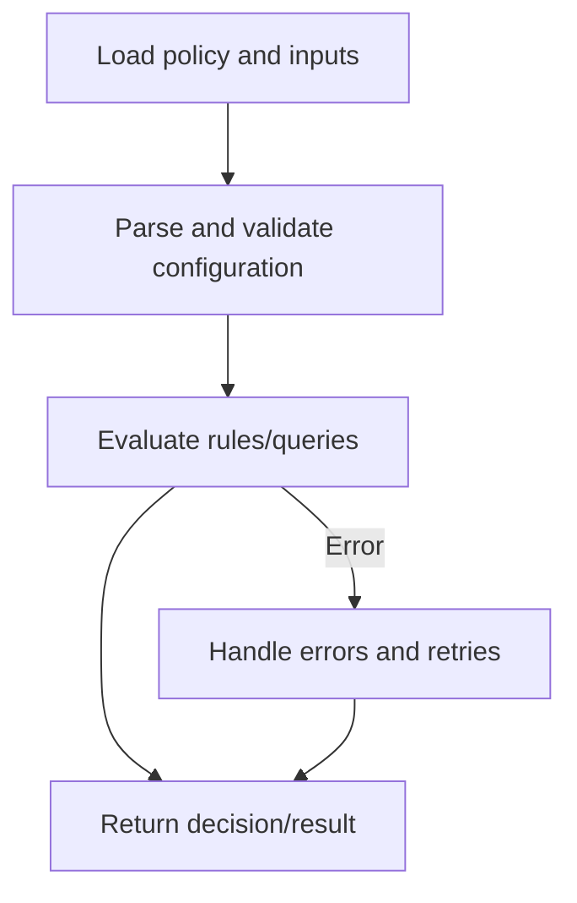

# Declarative & Logic Programming

> "In a declarative system, you don't tell the computer what to do. You tell it what you want."
> — Rich Hickey

import Tabs from "@theme/Tabs";
import TabItem from "@theme/TabItem";
import Vs from "@site/src/components/Vs";
import Showcase from "@site/src/components/Showcase";
import Checklist from "@site/src/components/Checklist";
import Figure from '@site/src/components/Figure';


## Scope and Boundaries

This article provides a comprehensive, practical guide to **declarative** and **logic programming** paradigms, focusing on their principles, real-world applications, and operational implications. It covers:

- What declarative and logic programming are, and how they differ from imperative paradigms
- Core concepts, reconciliation loops, and inference engines
- Decision models, trade-offs, and when to use (or avoid) these paradigms
- Implementation patterns, edge cases, and operational, security, and observability considerations

**Out of scope:** Deep dives into specific declarative languages (e.g., SQL, Terraform, Prolog) and advanced logic programming techniques are covered in sibling articles. This article links to those for further exploration.


## Introduction

Declarative programming is a paradigm where you describe **what** you want to achieve, not **how** to achieve it. The underlying system (engine, optimizer, or interpreter) is responsible for determining the steps to reach the desired outcome. Logic programming is a specialized form of declarative programming that uses formal logic, facts, and rules to deduce answers from a knowledge base.

These paradigms are foundational to modern software, powering everything from database queries (SQL), infrastructure as code (Terraform, Kubernetes), and policy engines (OPA), to UI frameworks (React, SwiftUI) and AI rule systems.


<Figure caption="The declarative reconciliation loop: the engine continuously works to make the actual state match the desired state.">

</Figure>


## Core Principles

- **Intent over Mechanics**: Specify the end state (e.g., "All users over 18"), not the step-by-step process.
- **Reconciliation Loop**: The system continuously compares the desired and actual state, taking action to converge them.
- **Logic & Inference**: In logic programming, you provide facts and rules; the system deduces new facts or answers queries.
- **Idempotency & Convergence**: Applying the same configuration repeatedly yields the same result—crucial for automation and reliability.
- **Separation of Policy and Mechanism**: Policies (the "what") are defined separately from the logic that enforces them (the "how").


## How Declarative Systems Work: Step-by-Step

1. **Define Desired State**: Express the goal in a high-level, serializable format (YAML, SQL, HCL, etc.).
2. **Engine Plans**: The system parses the desired state and plans the necessary actions.
3. **Execution**: The engine applies changes to move the actual state toward the desired state.
4. **Feedback & Drift Detection**: The system monitors for drift (differences between desired and actual) and re-applies as needed.

<Figure caption="Sequence of a declarative system applying and reconciling state.">

</Figure>


## Decision Model: Declarative vs Imperative

<Figure caption="Decision flow: Should you use a declarative or imperative approach?">

</Figure>

<Vs
  title="Declarative vs Imperative: When to Use Each"
  items={[
    {
      label: "Declarative",
      points: [
        "**Infrastructure as Code (IaC)**: Managing cloud resources where the end state is what matters.",
        "**Data Querying**: SQL is the quintessential declarative language for retrieving data.",
        "**Policy Enforcement**: Defining rules (e.g., who can access what) without coding the enforcement logic.",
        "**UI State Management**: Modern UI libraries (like React) let you declare the UI for a given state, and the framework handles the DOM updates.",
        "**Idempotent Operations**: Repeated application yields the same result.",
      ],
    },
    {
      label: "Imperative",
      points: [
        "**Complex, Algorithmic Tasks**: When you need fine-grained control over a sequence of operations, imperative code is often clearer and more direct.",
        "**Performance-Critical Loops**: The overhead of the declarative engine can sometimes be slower than a hand-optimized imperative loop.",
        "**Debugging Execution Plans**: When the engine's plan is suboptimal or incorrect, it can be difficult to debug the 'black box'.",
        "**Dynamic, Unpredictable Flows**: When the steps depend on runtime conditions that are hard to express declaratively.",
      ],
    },
  ]}
  highlight={0}
  highlightTone="positive"
/>


## When to Use

- Declarative configs are the source of truth and drift must be auto-corrected
- Policies/constraints change frequently and should be edited without code deploys
- You can express goals as data/rules and rely on an engine/optimizer
- Repeatable, idempotent operations are required (infra, databases, CI pipelines)

## When Not to Use

- Tight, algorithmic control is required (custom data structures, hot loops)
- Goals are ambiguous or context-heavy and cannot be captured as data/rules
- Engine plans are opaque and debugging cost outweighs the abstraction benefits
- Hard real-time constraints where planner overhead risks deadlines

## Decision Matrix (Paradigm Fit)

| Criterion | Declarative | Logic | Imperative |
| --- | --- | --- | --- |
| Goal clarity (what vs how) | Excellent | Excellent | Fair |
| Debuggability of execution | Medium | Medium–Low | High |
| Performance control | Medium | Low | High |
| Expressing constraints/policies | High | Very High | Low |
| Tooling maturity (common stacks) | High | Medium | High |
| Typical use cases | IaC, SQL, UI state | Rules, inference, planning | Algorithms, systems code |


## Examples: Declarative and Logic Programming in Practice

<Figure caption="Call flow shared by all language examples: from policy and inputs to a decision, including error handling.">

</Figure>

<Tabs groupId="lang" queryString>
  <TabItem value="python" label="Python">

```python title="filters.py" showLineNumbers
# Declarative-style filtering with list comprehensions
nums = [1, 2, 3, 4, 5, 6]
evens = [n for n in nums if n % 2 == 0]

# Policy as data (declarative)
POLICY = {
    "min_age": 18,
    "countries_allowed": {"US", "DE"},
}

user = {"age": 21, "country": "US"}
# The logic to check eligibility is separate from the policy data
is_eligible = (user["age"] >= POLICY["min_age"]) and \
              (user["country"] in POLICY["countries_allowed"])
```

  </TabItem>
  <TabItem value="go" label="Go">

```go title="filters.go" showLineNumbers
// Declarative-style filtering with slices
nums := []int{1, 2, 3, 4, 5, 6}
evens := []int{}
for _, n := range nums {
    if n%2 == 0 {
        evens = append(evens, n)
    }
}
// Policy as data (declarative)
type Policy struct {
    MinAge int
    CountriesAllowed map[string]bool
}
policy := Policy{MinAge: 18, CountriesAllowed: map[string]bool{"US": true, "DE": true}}
user := map[string]interface{}{ "age": 21, "country": "US" }
isEligible := user["age"].(int) >= policy.MinAge && policy.CountriesAllowed[user["country"].(string)]
```

  </TabItem>
  <TabItem value="node" label="Node.js">

```javascript title="filters.js" showLineNumbers
// Declarative-style filtering with array methods
const nums = [1, 2, 3, 4, 5, 6];
const evens = nums.filter(n => n % 2 === 0);

// Policy as data (declarative)
const POLICY = {
  min_age: 18,
  countries_allowed: new Set(["US", "DE"]),
};
const user = { age: 21, country: "US" };
const isEligible = user.age >= POLICY.min_age && POLICY.countries_allowed.has(user.country);
```

  </TabItem>
  <TabItem value="sql" label="SQL">

```sql title="query.sql" showLineNumbers
-- You declare WHAT you want, not HOW to get it.
-- The database query optimizer creates the execution plan.
SELECT user_id, email
FROM users
WHERE country = 'US' AND age >= 18;
```

  </TabItem>
  <TabItem value="hcl" label="Terraform">

```hcl title="main.tf" showLineNumbers
# Declare the desired state of the infrastructure.
# Terraform's engine figures out how to create/update it.
resource "aws_instance" "web" {
  ami           = "ami-0c55b159cbfafe1f0"
  instance_type = "t2.micro"

  tags = {
    Name = "HelloWorld"
  }
}
```

  </TabItem>
</Tabs>


## Implementation Patterns, Pitfalls, and Edge Cases

<Showcase
  title="Operational Considerations"
  sections={[
    {
      label: "Idempotency & Convergence",
      body: "Declarative systems are naturally idempotent. Applying the same configuration multiple times should result in the same state, which is key for reliable automation.",
    },
    {
      label: "Plan & Apply Lifecycle",
      body: "Most declarative tools (like Terraform) have a 'plan' phase that shows you what changes will be made before you 'apply' them. This is a critical safety feature.",
    },
    {
      label: "Drift Detection",
      body: "It's crucial to continuously monitor for differences between the desired state (in your config) and the actual state (in the real world) and have a process to reconcile them.",
    },
    {
      label: "Error Handling & Recovery",
      body: "Declarative engines must handle partial failures, retries, and rollbacks. Always design for clear error reporting and safe recovery.",
    },
    {
      label: "Multi-Tenancy & Isolation",
      body: "In shared environments, ensure that desired state definitions and reconciliation do not leak or cross boundaries between tenants.",
    },
    {
      label: "Performance & Scalability",
      body: "Declarative engines may introduce overhead. Profile and monitor for bottlenecks, especially in large-scale or real-time systems.",
    },
  ]}
/>


### Edge Cases

- Partial application: systems may stop mid-reconciliation; ensure safe retries
- Order sensitivity: non-commutative changes (e.g., create-before-attach) need guards
- Time-of-check vs time-of-use: drift between plan and apply must be detected
- Conflicting rules: logic engines should report unsatisfied constraints clearly
- Cycles/dependencies: detect and break cycles in desired-state graphs


## Security, Privacy, and Compliance

Declarative systems often manage sensitive configurations (infrastructure, access policies, data pipelines). Consider:

- **Access Controls**: Who can define or modify the desired state?
- **Secrets Management**: Never store secrets in plain text within declarative configs; use secret stores or encrypted references.
- **Auditability**: Track changes to desired state definitions for compliance and troubleshooting.
- **Policy Enforcement**: Use policy-as-code tools (e.g., OPA) to enforce security and compliance rules declaratively.


## Observability

Observability is essential for safe operation of declarative systems:

- **Logs**: Record every reconciliation attempt, drift detection, and error.
- **Metrics**: Track convergence time, drift frequency, and error rates.
- **Traces**: For distributed systems, trace the flow from desired state submission to actual state realization.
- **Dashboards & Alerts**: Set up alerts for drift, failed reconciliations, and policy violations.


## Testing

- Unit-test rules/policies as data: golden tests for inputs → expected decisions
- Property-based tests for rule sets (e.g., monotonicity, boundary conditions)
- Integration tests that assert convergence: from an initial state to desired end state
- Contract tests for policy interfaces and schema (breaking-change detection)
- Determinism checks: same inputs produce same plan/apply results


## Design Review Checklist

<Checklist
  title="Design Review Checklist"
  items={[
    "Is the desired state expressed as serializable data (e.g., YAML, HCL, SQL)?",
    "Is the reconciliation loop observable? Can you see why the engine is making certain changes?",
    "Are failure modes clear? What happens if the engine cannot reach the desired state?",
    "Is the system designed for eventual consistency?",
    "Is there a clear process for detecting and managing configuration drift?",
    "Are secrets and sensitive data handled securely?",
    "Is there a clear separation between policy and mechanism?",
    "Are operational metrics and logs available for monitoring?",
    "Is multi-tenant isolation enforced where applicable?",
    "Are error handling and rollback strategies defined?",
    "Is the system scalable for large or complex desired states?",
    "Are compliance and audit requirements addressed?",
  ]}
/>


## Alternatives and Related Topics

- [Procedural / Structured Programming](./procedural-structured)
- [Functional Programming](./functional)
- [Dataflow & Stream Processing](./dataflow-stream-processing)
- [Data Architecture & Persistence](../../data-architecture-and-persistence)
- [Architecture Governance](../../architecture-governance-and-organization)


## References

1.  <a
      href="https://www.openpolicyagent.org/"
      target="_blank"
      rel="nofollow noopener noreferrer"
    >
      Open Policy Agent (OPA) ↗️
    </a>
2.  <a
      href="https://www.terraform.io/language"
      target="_blank"
      rel="nofollow noopener noreferrer"
    >
      Terraform Language Documentation ↗️
    </a>
3.  <a
      href="https://www.w3schools.com/sql/"
      target="_blank"
      rel="nofollow noopener noreferrer"
    >
      SQL Tutorial (W3Schools) ↗️
    </a>
4.  <a
      href="https://en.wikipedia.org/wiki/Declarative_programming"
      target="_blank"
      rel="nofollow noopener noreferrer"
    >
      Declarative Programming (Wikipedia) ↗️
    </a>
5.  <a
      href="https://en.wikipedia.org/wiki/Logic_programming"
      target="_blank"
      rel="nofollow noopener noreferrer"
    >
      Logic Programming (Wikipedia) ↗️
    </a>
