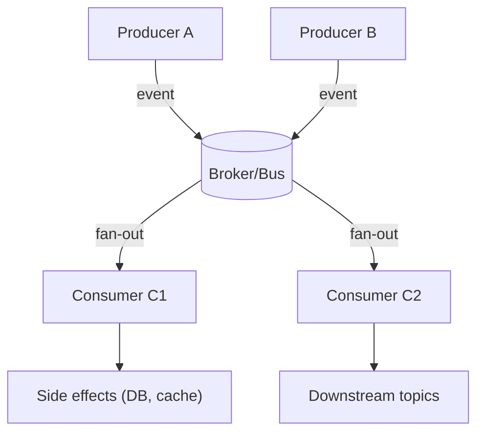

# Event-Driven & Reactive

Event-Driven Architecture (EDA) is a paradigm where systems respond to **events**—immutable facts about something that has happened. Producers publish events without knowing who will consume them, enabling loose coupling and asynchronicity. Reactive programming is a related paradigm that focuses on composing asynchronous and event-based programs with observable streams, providing tools for managing backpressure and complex data flows.

> "In an event-driven system, the flow of control is determined by events. This is a fundamental shift from traditional, request-driven architectures."
> — Jonas Bonér

import Tabs from "@theme/Tabs";
import TabItem from "@theme/TabItem";
import Vs from "@site/src/components/Vs";
import Showcase from "@site/src/components/Showcase";
import Checklist from "@site/src/components/Checklist";
import Figure from '@site/src/components/Figure';

<Figure caption="A typical event-driven topology with producers, a broker, and consumers.">

</Figure>

## Core ideas

- **Event as a Fact**: An event is an immutable record of a business fact (e.g., `OrderPlaced`, `PaymentProcessed`). It contains all necessary data for a consumer to act.
- **Producers and Consumers**: Producers emit events to a message broker or event bus. Consumers subscribe to topics and react to events asynchronously.
- **Loose Coupling**: Producers and consumers are independent. They don't need to know about each other, which allows them to be developed, deployed, and scaled separately.
- **Backpressure**: Consumers signal to producers when they are overwhelmed, allowing the system to gracefully handle load by slowing down producers, buffering, or dropping events.


## Examples

<Tabs groupId="lang" queryString>
  <TabItem value="python" label="Python">
```python title="consumer.py" showLineNumbers
import asyncio
from typing import Any, Dict, Set

processed: Set[str] = set()

async def handle_event(evt: Dict[str, Any]) -> None:
  # Idempotency guard
  key = evt.get("id")
  if key in processed:
    return

  # Business logic (pure-ish), then side effects
  order_total = sum(i["qty"] * i["price"] for i in evt["items"])
  await persist_result({"order_id": evt["id"], "total": order_total})
  processed.add(key)

async def persist_result(doc: Dict[str, Any]) -> None:
  await asyncio.sleep(0)  # simulate non-blocking IO

async def consumer(stream):
  # stream is an async iterator yielding events
  sem = asyncio.Semaphore(50)  # backpressure via concurrency cap
  async for evt in stream:
    await sem.acquire()
    asyncio.create_task(_run(evt, sem))

async def _run(evt, sem):
  try:
    await handle_event(evt)
  finally:
    sem.release()
```
  </TabItem>
  <TabItem value="go" label="Go">
```go title="main.go" showLineNumbers
package main

import (
  "context"
  "log"
  "sync"
)

type Event struct{ ID string; Items []Item }
type Item struct{ Qty int; Price int }

func handleEvent(ctx context.Context, e Event) error {
  // TODO: check idempotency store for e.ID
  var total int
  for _, it := range e.Items {
    total += it.Qty * it.Price
  }
  // TODO: persist total (use ctx)
  _ = total
  return nil
}

func worker(ctx context.Context, wg *sync.WaitGroup, events <-chan Event) {
  defer wg.Done()
  for e := range events {
    if err := handleEvent(ctx, e); err != nil {
      log.Printf("failed: %v", err)
      // TODO: retry/DLQ
    }
  }
}

func main() {
  ctx := context.Background()
  events := make(chan Event, 100) // bounded buffer for backpressure
  var wg sync.WaitGroup

  for i := 0; i < 32; i++ {
    wg.Add(1)
    go worker(ctx, &wg, events)
  }

  // TODO: poll from broker, decode, push into events
  // close(events) when done to stop workers
  // wg.Wait() to ensure all events are processed
}
```
  </TabItem>
  <TabItem value="node" label="Node.js (RxJS)">
```javascript title="pipeline.js" showLineNumbers
// Pseudo-RxJS API for clarity
import { fromEvent, mergeMap, map, bufferCount } from "rxjs"

const events$ = fromEvent(broker, "order-event")

const totals$ = events$
  .pipe(
    mergeMap(evt => computeTotal(evt), 64), // concurrency limit (backpressure)
    bufferCount(100), // micro-batches
    map(batch => batch.reduce((acc, t) => acc + t, 0))
  )

totals$.subscribe({
  next: val => console.log("batch total", val),
  error: err => console.error("stream error", err)
})

async function computeTotal(evt) {
  return evt.items.reduce((sum, i) => sum + i.qty * i.price, 0)
}
```
  </TabItem>
</Tabs>

<Vs
  title="When to Use vs. When to Reconsider"
  items={[
    {
      label: "When to Use",
      points: [
        "**High-throughput, asynchronous workflows**: Ideal for systems that need to handle many concurrent requests, like IoT data ingestion, real-time notifications, or financial tickers.",
        "**Decoupling microservices**: Allows services to evolve independently. A producer can change without affecting consumers, as long as the event contract is maintained.",
        "**Streaming data processing**: Perfect for Change Data Capture (CDC), log processing, and real-time analytics where data is treated as an infinite stream.",
      ],
    },
    {
      label: "When to Reconsider",
      points: [
        "**Simple, synchronous request/response**: The complexity of brokers, delivery semantics, and asynchronous logic is overkill for simple CRUD services.",
        "**Systems requiring strong transactional consistency**: Achieving end-to-end transactional guarantees in a distributed, event-driven system is extremely complex.",
        "**When a clear, linear control flow is needed**: Debugging and reasoning about a system where control flow is distributed across many independent consumers can be challenging.",
      ],
    },
  ]}
  highlight={0}
  highlightTone="positive"
/>

<Showcase
  title="Operational Considerations"
  sections={[
    {
      label: "Delivery Semantics",
      body: "Choose your guarantee: at-most-once (fast, but lossy), at-least-once (retries, but requires idempotent consumers), or exactly-once (complex, often emulated).",
    },
    {
      label: "Idempotency",
      body: "Consumers must be designed to handle duplicate events without causing incorrect side effects. This is critical for at-least-once delivery.",
    },
    {
      label: "Backpressure & Monitoring",
      body: "Monitor consumer lag and queue depth. Implement backpressure strategies (e.g., bounded buffers, rate limiting) to prevent consumers from being overwhelmed.",
    },
  ]}
/>

<Checklist
  title="Design Review Checklist"
  items={[
    "Is the event schema well-defined and versioned?",
    "Are delivery semantics (at-most/at-least/exactly-once) explicitly defined and handled?",
    "Are all consumers idempotent?",
    "Is there a strategy for handling backpressure?",
    "How are failed events handled (retries, dead-letter queues)?",
    "Is distributed tracing in place to track the flow of an event across multiple services?",
  ]}
/>

## Related topics

- [Dataflow & Stream Processing](/docs/foundational-concepts/programming-paradigms/dataflow-stream-processing)
- [Distributed Systems & Microservices](/docs/distributed-systems-and-microservices)
- [Reliability, Resilience & Performance](/docs/reliability-resilience-and-performance-engineering)
