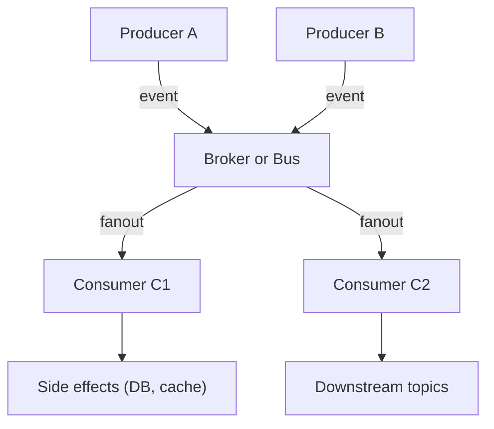
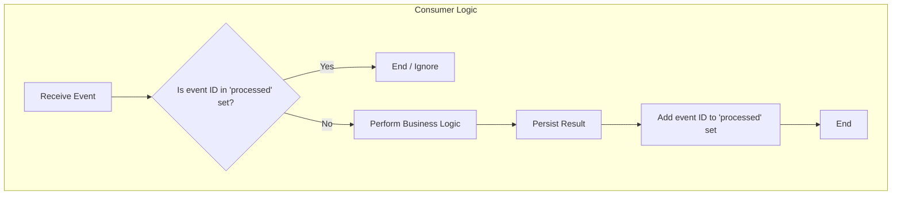

title: "Event-Driven & Reactive"
description: "Events as facts and reactive streams for asynchronous, resilient systems—when and how to apply."
sidebar_position: 4
hide_title: true
---

<Hero
  title="Event-Driven & Reactive"
  description="Events as facts and reactive streams for asynchronous, resilient systems—when and how to apply"
  size="large"
/>

<Head>
  <meta name="description" content="Events as facts and reactive streams for asynchronous, resilient systems—when and how to apply." />
  <meta property="og:title" content="Event-Driven & Reactive" />
  <meta property="og:description" content="Events as facts and reactive streams for asynchronous, resilient systems—when and how to apply." />
  <meta property="og:image" content="https://archman.dev/img/archman-social-card.webp" />
  <meta name="twitter:card" content="summary_large_image" />
  
  
</Head>

Event-Driven Architecture (EDA) is a paradigm where systems respond to **events**—immutable facts about something that has happened. Producers publish events without knowing who will consume them, enabling loose coupling and asynchronicity. Reactive programming is a related paradigm that focuses on composing asynchronous and event-based programs with observable streams, providing tools for managing backpressure and complex data flows.

> "In an event-driven system, the flow of control is determined by events. This is a fundamental shift from traditional, request-driven architectures."
> — Jonas Bonér

<Figure caption="A typical event-driven topology with producers, a broker, and consumers.">

</Figure>

## Core ideas

- **Event as a Fact**: An event is an immutable record of a business fact (e.g., `OrderPlaced`, `PaymentProcessed`). It contains all necessary data for a consumer to act.
- **Producers and Consumers**: Producers emit events to a message broker or event bus. Consumers subscribe to topics and react to events asynchronously.
- **Loose Coupling**: Producers and consumers are independent. They don't need to know about each other, which allows them to be developed, deployed, and scaled separately.
- **Backpressure**: Consumers signal to producers when they are overwhelmed, allowing the system to gracefully handle load by slowing down producers, buffering, or dropping events.

## Examples

<Figure caption="Sequential control flow for handling a single event.">

</Figure>

<Tabs groupId="lang" queryString>
  <TabItem value="python" label="Python">
```python title="consumer.py" showLineNumbers
import asyncio
from typing import Any, Dict, Set

processed: Set[str] = set()

async def handle_event(evt: Dict[str, Any]) -> None:
    # Idempotency guard
    key = evt.get("id")
    if key in processed:
        return

    # Business logic (pure-ish), then side effects
    order_total = sum(i["qty"] * i["price"] for i in evt["items"])
    await persist_result({"order_id": evt["id"], "total": order_total})
    processed.add(key)

async def persist_result(doc: Dict[str, Any]) -> None:
    await asyncio.sleep(0)  # simulate non-blocking IO

async def consumer(stream):
    # stream is an async iterator yielding events
    sem = asyncio.Semaphore(50)  # backpressure via concurrency cap
    async for evt in stream:
        await sem.acquire()
        asyncio.create_task(_run(evt, sem))

async def _run(evt, sem):
    try:
        await handle_event(evt)
    finally:
        sem.release()
```
  </TabItem>
  <TabItem value="go" label="Go">
```go title="main.go" showLineNumbers
package main

import (
    "context"
    "log"
    "sync"
)

type Event struct{ ID string; Items []Item }
type Item struct{ Qty int; Price int }

func handleEvent(ctx context.Context, e Event) error {
    // TODO: check idempotency store for e.ID
    var total int
    for _, it := range e.Items {
        total += it.Qty * it.Price
    }
    // TODO: persist total (use ctx)
    _ = total
    return nil
}

func worker(ctx context.Context, wg *sync.WaitGroup, events <-chan Event) {
    defer wg.Done()
    for e := range events {
        if err := handleEvent(ctx, e); err != nil {
            log.Printf("failed: %v", err)
            // TODO: retry/DLQ
        }
    }
}

func main() {
    ctx := context.Background()
    events := make(chan Event, 100) // bounded buffer for backpressure
    var wg sync.WaitGroup

    for i := 0; i < 32; i++ {
        wg.Add(1)
        go worker(ctx, &wg, events)
    }

    // TODO: poll from broker, decode, push into events
    // close(events) when done to stop workers
    // wg.Wait() to ensure all events are processed
}
```
  </TabItem>
  <TabItem value="node" label="Node.js (RxJS)">
```javascript title="pipeline.js" showLineNumbers
// Pseudo-RxJS API for clarity
import { fromEvent, mergeMap, map, bufferCount } from "rxjs"

const events$ = fromEvent(broker, "order-event")

const totals$ = events$
    .pipe(
        mergeMap(evt => computeTotal(evt), 64), // concurrency limit (backpressure)
        bufferCount(100), // micro-batches
        map(batch => batch.reduce((acc, t) => acc + t, 0))
    )

totals$.subscribe({
    next: val => console.log("batch total", val),
    error: err => console.error("stream error", err)
})

async function computeTotal(evt) {
    return evt.items.reduce((sum, i) => sum + i.qty * i.price, 0)
}
```
  </TabItem>
</Tabs>

<Vs highlight={[0,1,0,0]} title="When to Use vs. When to Reconsider"
  items={[
{
    label: "When to Use",
    points: [
"**High-throughput, asynchronous workflows**: Ideal for systems that need to handle many concurrent requests, like IoT data ingestion, real-time notifications, or financial tickers.",
        "**Decoupling microservices**: Allows services to evolve independently. A producer can change without affecting consumers, as long as the event contract is maintained.",
        "**Streaming data processing**: Perfect for Change Data Capture (CDC), log processing, and real-time analytics where data is treated as an infinite stream.",
    ],
    highlightTone: "warning"
  },
{
    label: "Delivery Semantics",
    points: [
"**High-throughput, asynchronous workflows**: Ideal for systems that need to handle many concurrent requests, like IoT data ingestion, real-time notifications, or financial tickers.",
        "**Decoupling microservices**: Allows services to evolve independently. A producer can change without affecting consumers, as long as the event contract is maintained.",
        "**Streaming data processing**: Perfect for Change Data Capture (CDC), log processing, and real-time analytics where data is treated as an infinite stream.",
    ],
    highlightTone: "info"
  },
{
    label: "Idempotency",
    points: [
"**High-throughput, asynchronous workflows**: Ideal for systems that need to handle many concurrent requests, like IoT data ingestion, real-time notifications, or financial tickers.",
        "**Decoupling microservices**: Allows services to evolve independently. A producer can change without affecting consumers, as long as the event contract is maintained.",
        "**Streaming data processing**: Perfect for Change Data Capture (CDC), log processing, and real-time analytics where data is treated as an infinite stream.",
    ],
    highlightTone: "info"
  },
{
    label: "Backpressure & Monitoring",
    points: [
"**High-throughput, asynchronous workflows**: Ideal for systems that need to handle many concurrent requests, like IoT data ingestion, real-time notifications, or financial tickers.",
        "**Decoupling microservices**: Allows services to evolve independently. A producer can change without affecting consumers, as long as the event contract is maintained.",
        "**Streaming data processing**: Perfect for Change Data Capture (CDC), log processing, and real-time analytics where data is treated as an infinite stream.",
    ],
    highlightTone: "info"
  }
]} />

<Checklist
  title="Design Review Checklist"
  items={[
    "Is the event schema well-defined and versioned?",
    "Are delivery semantics (at-most/at-least/exactly-once) explicitly defined and handled?",
    "Are all consumers idempotent?",
    "Is there a strategy for handling backpressure?",
    "How are failed events handled (retries, dead-letter queues)?",
    "Is distributed tracing in place to track the flow of an event across multiple services?",
  ]}
/>

## Edge cases

- Duplicate or out-of-order events: enforce idempotency keys and tolerate reordering with sequence numbers or versioning.
- Poison messages: implement retry with backoff and a Dead Letter Queue (DLQ) with alerting and quarantine procedures.
- Large payloads: prefer reference-based events (IDs/URIs) over embedding large blobs; set broker size limits.
- Slow consumers: use bounded buffers, consumer groups, and autoscaling; apply backpressure or drop policies where acceptable.
- Multi-tenant isolation: partition topics by tenant or include tenant IDs and authorize at the topic/partition level.

## Observability

- Logs: emit structured logs with correlation/trace IDs on produce, consume, handle, and ack/nack paths.
- Metrics: track publish latency, end-to-end event age, consumer lag, DLQ rates, retry counts, and handler success/error rates.
- Traces: propagate context via headers/attributes (e.g., W3C Trace Context) across producer → broker → consumer spans.
- Dashboards/alerts: alert on growing lag, DLQ spikes, and increased end-to-end latency versus SLOs.

## Testing

- Contract tests: validate event schemas (Avro/JSON Schema/Protobuf) and evolution rules with consumer-driven contracts.
- Idempotency tests: replay the same event N times and assert single side-effect.
- Failure tests: inject broker timeouts, handler exceptions, and verify retry/backoff/DLQ behavior.
- Load tests: simulate bursty event streams to verify backpressure and autoscaling responses.

## Related topics

- [Dataflow & Stream Processing](./dataflow-stream-processing)
- [Distributed Systems & Microservices](../../distributed-systems-and-microservices)
- [Reliability, Resilience & Performance](../../reliability-resilience-and-performance-engineering)

<Showcase
  title="Security, Privacy, and Compliance"
  sections={[
    {
      label: "Event Payload Security",
      body: "Ensure that no sensitive data (PII, credentials) is leaked into events. Use tokenization or reference-based payloads (e.g., `orderId` instead of the full order details) and require consumers to fetch sensitive data via authenticated, authorized APIs. Encrypt event payloads at rest and in transit.",
    },
    {
      label: "Authentication and Authorization",
      body: "Producers and consumers must authenticate with the broker (e.g., via mTLS, SASL). Enforce topic-level authorization so that only approved services can publish or subscribe to specific topics. This prevents unauthorized data access and rogue producers.",
    },
    {
      label: "Replay Attack Prevention",
      body: "Idempotency checks based on a unique event ID are the primary defense against replay attacks, where an attacker re-sends a valid event to trigger duplicate processing. Including a timestamp in the event and rejecting events older than a certain threshold can also help.",
    },
  ]}
/>

## References

1.  Bonér, J., et al. (2014). <a href="https://www.reactivemanifesto.org/" target="_blank" rel="nofollow noopener noreferrer">The Reactive Manifesto ↗️</a>.
2.  Richards, M., & Ford, N. (2020). <a href="https://www.oreilly.com/library/view/fundamentals-of-software/9781492043447/" target="_blank" rel="nofollow noopener noreferrer">Fundamentals of Software Architecture ↗️</a>. O'Reilly Media.
3.  Kafka Documentation. (n.d.). <a href="https://kafka.apache.org/documentation/#security" target="_blank" rel="nofollow noopener noreferrer">Security ↗️</a>.
