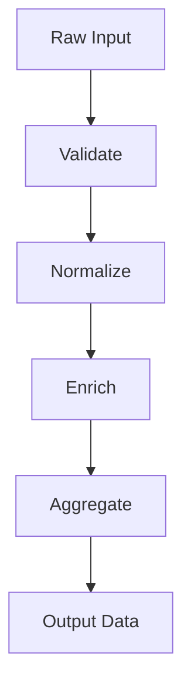
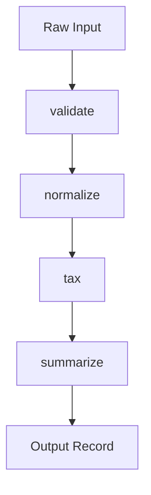
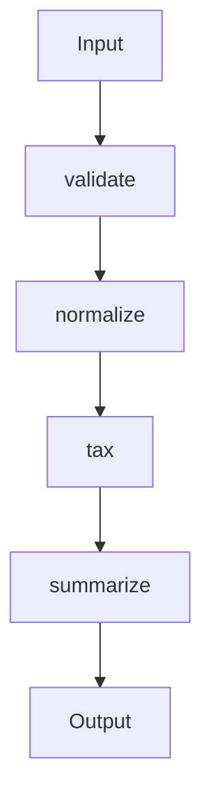

title: Functional Programming
description: "Pure functions, immutability, and composition for correctness, concurrency, and testability."
docType: deep-dive
difficulty: intermediate
estimatedTime: 14
lastReviewed: 2025-09-10
personas: ["engineer","architect","lead"]
keywords: ["functional programming","pure functions","immutability","composition","concurrency","parallelism","data pipelines","testing","observability"]
image: /img/archman-social-card.webp
tags: ["programming-paradigms","functional","immutability","pure-functions","composition","concurrency","parallelism","testing","observability","quality-attributes"]
hide_title: true
---

<Hero
  title="Functional Programming"
  description="Pure functions, immutability, and composition—apply FP pragmatically for correctness and concurrency"
  size="large"
/>

## TL;DR

Functional programming emphasizes pure functions and immutable data to make systems predictable, parallelizable, and testable. Use FP for deterministic data transforms and concurrency safety; isolate IO at the edges and watch memory when copying large structures.

## Learning objectives

- You will be able to identify pure functions and isolate side effects at boundaries.
- You will be able to compose pipelines that are deterministic and testable.
- You will be able to reason about concurrency using immutability rather than locks.
- You will be able to measure and manage allocation overhead in FP pipelines.

## Motivating scenario

You are building an analytics enrichment service that ingests purchase events at high throughput. The service must validate, normalize, compute tax and totals, and emit enriched records to downstream systems. A functional pipeline of pure steps enables horizontal parallelism without lock contention, clear unit tests, and safe rollbacks by swapping implementations step‑by‑step.

 

Functional Programming (FP) treats computation as the evaluation of mathematical functions. It emphasizes **pure functions**, **immutable data**, and **composition** to build software. By avoiding shared state and mutable data, FP makes code easier to reason about, test, and parallelize, which is especially valuable in concurrent and data-intensive systems.

> "The essence of functional programming is to have a very small number of ways to compose things, and to have those ways be very general."
> — John Hughes

<Figure caption="A functional pipeline transforms data through a series of pure functions.">

</Figure>

## Scope and Boundaries

This article covers the core principles, practical implementation, and operational realities of **functional programming** (FP) as a paradigm for building robust, testable, and scalable systems. It focuses on pure functions, immutability, and composition, and how these enable safe concurrency, easier reasoning, and high testability. Topics like [Object-Oriented Programming](./object-oriented), [Procedural / Structured Programming](./procedural-structured), and [Event-Driven & Reactive](./event-driven-and-reactive) are covered in their own articles; this article will cross-link to them for comparison and integration patterns.

## Core Ideas

- **Pure Functions**: Functions that, for the same input, always return the same output and have no observable side effects (e.g., no network or disk I/O, no modifying external state).
- **Immutability**: Data structures cannot be changed after they are created. Instead of modifying data, pure functions create new data structures with the updated values.
- **Composition**: Build complex behavior by composing small, reusable functions together, often in a pipeline-like fashion.
- **Side Effects at the Edges**: Isolate impure actions (like database writes or API calls) at the boundaries of the system, keeping the core logic pure and predictable.

## Practical Examples and Real-World Scenarios

Functional programming is especially powerful for data transformation pipelines, analytics, and business rules engines. The following example demonstrates a multi-step transformation pipeline, implemented in Python, Go, and Node.js. The pipeline validates input, normalizes data, calculates tax, and summarizes the result. This pattern is common in ETL, financial processing, and event stream analytics.

Edge cases to consider:
- What if the input is missing required fields? (Handled by validation step.)
- What if the amount is negative or non-numeric? (Validation and normalization must guard.)
- How do you handle very large or empty datasets? (Functional pipelines scale well, but memory usage must be considered.)
- How do you isolate side effects (e.g., logging, database writes)? (Keep IO at the edges; the pipeline itself is pure.)

<Figure caption="Sequential call flow for a functional data pipeline (applies to all code tabs below).">

</Figure>

<Tabs groupId="lang" queryString>
  <TabItem value="python" label="Python">

```python title="pipeline.py" showLineNumbers
from __future__ import annotations
from typing import Callable, Dict, Any

Record = Dict[str, Any]
Transform = Callable[[Record], Record]

def compose(*funcs: Transform) -> Transform:
    def run(x: Record) -> Record:
        for f in funcs:
            x = f(x)
        return x
    return run

def validate(r: Record) -> Record:
    if not (isinstance(r.get("amount"), (int, float)) and r.get("user_id")):
        raise ValueError("invalid input")
    return r

def normalize(r: Record) -> Record:
    return {**r, "amount_cents": int(float(r["amount"]) * 100)}

def tax(r: Record) -> Record:
    cents = r["amount_cents"]
    return {**r, "tax_cents": int(cents * 0.1)}

def summarize(r: Record) -> Record:
    total = r["amount_cents"] + r["tax_cents"]
    return {**r, "total_cents": total}

pipeline = compose(validate, normalize, tax, summarize)

def process(payload: Record) -> Record:
    # Pure pipeline returns a new record; caller handles IO
    return pipeline(payload)
```

  </TabItem>
  <TabItem value="go" label="Go">

```go title="fp.go" showLineNumbers
package fp

import "fmt"

type Record map[string]interface{}
type Transform func(Record) (Record, error)

func Compose(funcs ...Transform) Transform {
    return func(r Record) (Record, error) {
        var err error
        for _, f := range funcs {
            r, err = f(r)
            if err != nil {
                return nil, err
            }
        }
        return r, nil
    }
}

func Validate(r Record) (Record, error) {
    amount, ok := r["amount"].(float64)
    if !ok {
        if v, ok2 := r["amount"].(int); ok2 {
            amount = float64(v)
        } else {
            return nil, fmt.Errorf("invalid input")
        }
    }
    if _, ok := r["user_id"].(string); !ok {
        return nil, fmt.Errorf("invalid input")
    }
    r["amount"] = amount
    return r, nil
}

func Normalize(r Record) (Record, error) {
    amount := r["amount"].(float64)
    r["amount_cents"] = int(amount * 100)
    return r, nil
}

func Tax(r Record) (Record, error) {
    cents := r["amount_cents"].(int)
    r["tax_cents"] = int(float64(cents) * 0.1)
    return r, nil
}

func Summarize(r Record) (Record, error) {
    total := r["amount_cents"].(int) + r["tax_cents"].(int)
    r["total_cents"] = total
    return r, nil
}

var Pipeline = Compose(Validate, Normalize, Tax, Summarize)

func Process(payload Record) (Record, error) {
    return Pipeline(payload)
}
```

  </TabItem>
  <TabItem value="node" label="Node.js">

```javascript title="pipeline.mjs" showLineNumbers
/** @typedef {{user_id:string, amount:number}} Input */

const validate = (r) => {
    if (!r.user_id || typeof r.amount !== "number") throw new Error("invalid input")
    return r
}

const normalize = (r) => ({ ...r, amount_cents: Math.trunc(r.amount * 100) })
const tax = (r) => ({ ...r, tax_cents: Math.trunc(r.amount_cents * 0.1) })
const summarize = (r) => ({ ...r, total_cents: r.amount_cents + r.tax_cents })

const compose = (...fns) => (x) => fns.reduce((v, f) => f(v), x)
export const process = compose(validate, normalize, tax, summarize)
```

  </TabItem>
</Tabs>

<Vs highlight={[0,1,0,0]} title="When to Use vs. When to Reconsider"
  items={[
{
    label: "When to Use",
    points: [
"**Data transformation pipelines**: Ideal for ETL, analytics, and rules engines where data flows through a series of predictable steps.",
        "**High-concurrency systems**: Immutability and the absence of side effects eliminate the need for locks, making it easier to write safe, concurrent code.",
        "**Complex, state-dependent logic**: When behavior is highly dependent on state, modeling it with pure functions that transform state makes the logic explicit and testable.",
        "**Test-driven development**: Pure functions are easy to test in isolation, reducing the need for mocks and stubs.",
        "**Parallel and distributed processing**: Immutability and statelessness simplify scaling across threads and nodes.",
    ],
    highlightTone: "warning"
  },
{
    label: "Use Case",
    points: [
"**Data transformation pipelines**: Ideal for ETL, analytics, and rules engines where data flows through a series of predictable steps.",
        "**High-concurrency systems**: Immutability and the absence of side effects eliminate the need for locks, making it easier to write safe, concurrent code.",
        "**Complex, state-dependent logic**: When behavior is highly dependent on state, modeling it with pure functions that transform state makes the logic explicit and testable.",
        "**Test-driven development**: Pure functions are easy to test in isolation, reducing the need for mocks and stubs.",
        "**Parallel and distributed processing**: Immutability and statelessness simplify scaling across threads and nodes.",
    ],
    highlightTone: "info"
  },
{
    label: "Functional",
    points: [
"**Data transformation pipelines**: Ideal for ETL, analytics, and rules engines where data flows through a series of predictable steps.",
        "**High-concurrency systems**: Immutability and the absence of side effects eliminate the need for locks, making it easier to write safe, concurrent code.",
        "**Complex, state-dependent logic**: When behavior is highly dependent on state, modeling it with pure functions that transform state makes the logic explicit and testable.",
        "**Test-driven development**: Pure functions are easy to test in isolation, reducing the need for mocks and stubs.",
        "**Parallel and distributed processing**: Immutability and statelessness simplify scaling across threads and nodes.",
    ],
    highlightTone: "info"
  },
{
    label: "Object-Oriented",
    points: [
"**Data transformation pipelines**: Ideal for ETL, analytics, and rules engines where data flows through a series of predictable steps.",
        "**High-concurrency systems**: Immutability and the absence of side effects eliminate the need for locks, making it easier to write safe, concurrent code.",
        "**Complex, state-dependent logic**: When behavior is highly dependent on state, modeling it with pure functions that transform state makes the logic explicit and testable.",
        "**Test-driven development**: Pure functions are easy to test in isolation, reducing the need for mocks and stubs.",
        "**Parallel and distributed processing**: Immutability and statelessness simplify scaling across threads and nodes.",
    ],
    highlightTone: "info"
  },
{
    label: "Procedural / Structured",
    points: [
"**Data transformation pipelines**: Ideal for ETL, analytics, and rules engines where data flows through a series of predictable steps.",
        "**High-concurrency systems**: Immutability and the absence of side effects eliminate the need for locks, making it easier to write safe, concurrent code.",
        "**Complex, state-dependent logic**: When behavior is highly dependent on state, modeling it with pure functions that transform state makes the logic explicit and testable.",
        "**Test-driven development**: Pure functions are easy to test in isolation, reducing the need for mocks and stubs.",
        "**Parallel and distributed processing**: Immutability and statelessness simplify scaling across threads and nodes.",
    ],
    highlightTone: "info"
  },
{
    label: "Event-Driven / Reactive",
    points: [
"**Data transformation pipelines**: Ideal for ETL, analytics, and rules engines where data flows through a series of predictable steps.",
        "**High-concurrency systems**: Immutability and the absence of side effects eliminate the need for locks, making it easier to write safe, concurrent code.",
        "**Complex, state-dependent logic**: When behavior is highly dependent on state, modeling it with pure functions that transform state makes the logic explicit and testable.",
        "**Test-driven development**: Pure functions are easy to test in isolation, reducing the need for mocks and stubs.",
        "**Parallel and distributed processing**: Immutability and statelessness simplify scaling across threads and nodes.",
    ],
    highlightTone: "info"
  },
{
    label: "State Management",
    points: [
"**Data transformation pipelines**: Ideal for ETL, analytics, and rules engines where data flows through a series of predictable steps.",
        "**High-concurrency systems**: Immutability and the absence of side effects eliminate the need for locks, making it easier to write safe, concurrent code.",
        "**Complex, state-dependent logic**: When behavior is highly dependent on state, modeling it with pure functions that transform state makes the logic explicit and testable.",
        "**Test-driven development**: Pure functions are easy to test in isolation, reducing the need for mocks and stubs.",
        "**Parallel and distributed processing**: Immutability and statelessness simplify scaling across threads and nodes.",
    ],
    highlightTone: "info"
  },
{
    label: "Performance",
    points: [
"**Data transformation pipelines**: Ideal for ETL, analytics, and rules engines where data flows through a series of predictable steps.",
        "**High-concurrency systems**: Immutability and the absence of side effects eliminate the need for locks, making it easier to write safe, concurrent code.",
        "**Complex, state-dependent logic**: When behavior is highly dependent on state, modeling it with pure functions that transform state makes the logic explicit and testable.",
        "**Test-driven development**: Pure functions are easy to test in isolation, reducing the need for mocks and stubs.",
        "**Parallel and distributed processing**: Immutability and statelessness simplify scaling across threads and nodes.",
    ],
    highlightTone: "info"
  },
{
    label: "Debugging",
    points: [
"**Data transformation pipelines**: Ideal for ETL, analytics, and rules engines where data flows through a series of predictable steps.",
        "**High-concurrency systems**: Immutability and the absence of side effects eliminate the need for locks, making it easier to write safe, concurrent code.",
        "**Complex, state-dependent logic**: When behavior is highly dependent on state, modeling it with pure functions that transform state makes the logic explicit and testable.",
        "**Test-driven development**: Pure functions are easy to test in isolation, reducing the need for mocks and stubs.",
        "**Parallel and distributed processing**: Immutability and statelessness simplify scaling across threads and nodes.",
    ],
    highlightTone: "info"
  },
{
    label: "Security & Privacy",
    points: [
"**Data transformation pipelines**: Ideal for ETL, analytics, and rules engines where data flows through a series of predictable steps.",
        "**High-concurrency systems**: Immutability and the absence of side effects eliminate the need for locks, making it easier to write safe, concurrent code.",
        "**Complex, state-dependent logic**: When behavior is highly dependent on state, modeling it with pure functions that transform state makes the logic explicit and testable.",
        "**Test-driven development**: Pure functions are easy to test in isolation, reducing the need for mocks and stubs.",
        "**Parallel and distributed processing**: Immutability and statelessness simplify scaling across threads and nodes.",
    ],
    highlightTone: "info"
  },
{
    label: "Observability",
    points: [
"**Data transformation pipelines**: Ideal for ETL, analytics, and rules engines where data flows through a series of predictable steps.",
        "**High-concurrency systems**: Immutability and the absence of side effects eliminate the need for locks, making it easier to write safe, concurrent code.",
        "**Complex, state-dependent logic**: When behavior is highly dependent on state, modeling it with pure functions that transform state makes the logic explicit and testable.",
        "**Test-driven development**: Pure functions are easy to test in isolation, reducing the need for mocks and stubs.",
        "**Parallel and distributed processing**: Immutability and statelessness simplify scaling across threads and nodes.",
    ],
    highlightTone: "info"
  },
{
    label: "Edge Cases",
    points: [
"**Data transformation pipelines**: Ideal for ETL, analytics, and rules engines where data flows through a series of predictable steps.",
        "**High-concurrency systems**: Immutability and the absence of side effects eliminate the need for locks, making it easier to write safe, concurrent code.",
        "**Complex, state-dependent logic**: When behavior is highly dependent on state, modeling it with pure functions that transform state makes the logic explicit and testable.",
        "**Test-driven development**: Pure functions are easy to test in isolation, reducing the need for mocks and stubs.",
        "**Parallel and distributed processing**: Immutability and statelessness simplify scaling across threads and nodes.",
    ],
    highlightTone: "info"
  },
{
    label: "Rollout & Rollback",
    points: [
"**Data transformation pipelines**: Ideal for ETL, analytics, and rules engines where data flows through a series of predictable steps.",
        "**High-concurrency systems**: Immutability and the absence of side effects eliminate the need for locks, making it easier to write safe, concurrent code.",
        "**Complex, state-dependent logic**: When behavior is highly dependent on state, modeling it with pure functions that transform state makes the logic explicit and testable.",
        "**Test-driven development**: Pure functions are easy to test in isolation, reducing the need for mocks and stubs.",
        "**Parallel and distributed processing**: Immutability and statelessness simplify scaling across threads and nodes.",
    ],
    highlightTone: "info"
  },
{
    label: "Limits & Quotas",
    points: [
"**Data transformation pipelines**: Ideal for ETL, analytics, and rules engines where data flows through a series of predictable steps.",
        "**High-concurrency systems**: Immutability and the absence of side effects eliminate the need for locks, making it easier to write safe, concurrent code.",
        "**Complex, state-dependent logic**: When behavior is highly dependent on state, modeling it with pure functions that transform state makes the logic explicit and testable.",
        "**Test-driven development**: Pure functions are easy to test in isolation, reducing the need for mocks and stubs.",
        "**Parallel and distributed processing**: Immutability and statelessness simplify scaling across threads and nodes.",
    ],
    highlightTone: "info"
  }
]} />

<Checklist
  title="Design Review Checklist"
  items={[
    "Are functions pure wherever possible?",
    "Is all data treated as immutable?",
    "Are side effects (IO, database calls, logging) isolated at the system's edges?",
    "Is the flow of data through the system explicit and easy to follow?",
    "Can functions be easily tested in isolation without requiring mocks or stubs?",
    "Are edge cases (empty, null, large input) handled gracefully?",
    "Is state passed explicitly, not hidden in closures or globals?",
    "Are secrets and sensitive data kept out of pure functions?",
    "Is memory usage monitored and controlled for large/long-running pipelines?",
    "Are logs, metrics, and traces available at each pipeline stage?",
    "Is the system safe for parallel/concurrent execution?",
    "Are multi-tenant data isolation and concurrency risks addressed?",
  ]}
/>

### Hands-on exercise

Try the pipeline locally.

<Figure caption="Hands-on flow: compose validate → normalize → tax → summarize.">

</Figure>

<Tabs groupId="lang" queryString>
  <TabItem value="python" label="Python">

  ```python title="pipeline.py" showLineNumbers
  def compose(*funcs):
      def run(x):
          for f in funcs:
              x = f(x)
          return x
      return run

  def validate(r):
      if not r.get("user_id") or not isinstance(r.get("amount"), (int, float)):
          raise ValueError("invalid input")
      return r

  def normalize(r):
      return {**r, "amount_cents": int(r["amount"] * 100)}

  def tax(r):
      return {**r, "tax_cents": int(r["amount_cents"] * 0.1)}

  def summarize(r):
      return {**r, "total_cents": r["amount_cents"] + r["tax_cents"]}

  process = compose(validate, normalize, tax, summarize)

  if __name__ == "__main__":
      print(process({"user_id": "u1", "amount": 12.34}))
  ```

  </TabItem>
  <TabItem value="go" label="Go">

  ```go title="main.go" showLineNumbers
  package main

  import (
      "fmt"
  )

  type Record map[string]interface{}
  type Transform func(Record) (Record, error)

  func Compose(funcs ...Transform) Transform {
      return func(r Record) (Record, error) {
          var err error
          for _, f := range funcs {
              r, err = f(r)
              if err != nil {
                  return nil, err
              }
          }
          return r, nil
      }
  }

  func Validate(r Record) (Record, error) {
      if _, ok := r["user_id"].(string); !ok {
          return nil, fmt.Errorf("invalid input")
      }
      if _, ok := r["amount"].(float64); !ok {
          return nil, fmt.Errorf("invalid input")
      }
      return r, nil
  }

  func Normalize(r Record) (Record, error) {
      r["amount_cents"] = int(r["amount"].(float64) * 100)
      return r, nil
  }

  func Tax(r Record) (Record, error) {
      r["tax_cents"] = int(float64(r["amount_cents"].(int)) * 0.1)
      return r, nil
  }

  func Summarize(r Record) (Record, error) {
      r["total_cents"] = r["amount_cents"].(int) + r["tax_cents"].(int)
      return r, nil
  }

  func main() {
      pipeline := Compose(Validate, Normalize, Tax, Summarize)
      out, _ := pipeline(Record{"user_id": "u1", "amount": 12.34})
      fmt.Println(out)
  }
  ```

  </TabItem>
  <TabItem value="node" label="Node.js">

  ```javascript title="pipeline.mjs" showLineNumbers
  const compose = (...fns) => (x) => fns.reduce((v, f) => f(v), x)
  const validate = (r) => {
      if (!r.user_id || typeof r.amount !== 'number') throw new Error('invalid input')
      return r
  }
  const normalize = (r) => ({ ...r, amount_cents: Math.trunc(r.amount * 100) })
  const tax = (r) => ({ ...r, tax_cents: Math.trunc(r.amount_cents * 0.1) })
  const summarize = (r) => ({ ...r, total_cents: r.amount_cents + r.tax_cents })
  const process = compose(validate, normalize, tax, summarize)
  console.log(process({ user_id: 'u1', amount: 12.34 }))
  ```

  </TabItem>
</Tabs>

Steps

1) Save one of the snippets to a file.
2) Run it with your language toolchain.
3) Change the tax logic and re-run to observe deterministic behavior.
4) Add a logging side effect at the boundary to see data flow; keep core pure.

## Self‑check

1. What makes a function pure, and why does that improve testability?
2. How does immutability enable safe concurrency without locks?
3. Where should side effects live in an FP‑oriented system, and why?

<Showcase
  title="Signals & Anti‑signals"
  sections={[
    { label: 'Signals (apply FP)', body: 'Deterministic transforms, heavy parallelism, clear step pipelines, property‑based testability', tone: 'positive' },
    { label: 'Anti‑signals (reconsider)', body: 'Hot mutation of huge data structures, IO‑heavy imperative orchestration, entity‑identity centric modeling', tone: 'warning' }
  ]}
/>

<Showcase
  title="Next Steps"
  tone="info"
  sections={[
    { label: 'Internal', body: "Read Procedural/Structured, Object-Oriented, and Event-Driven and Reactive for comparisons. For data-heavy work, see Data Architecture and Persistence and Influence on Architecture.", tone: "neutral" },
    { label: 'External', body: "Why Functional Programming Matters (Hughes, 1989) — foundational paper on composability and laziness.", tone: "neutral" }
  ]}
/>

<ProsCons
  pros={[
    'Determinism and referential transparency',
    'Natural parallelism via immutability',
    'Excellent unit/property testing ergonomics'
  ]}
  cons={[
    'Allocation overhead for large data',
    'Steeper learning curve for effect management',
    'Potential verbosity without persistent data structures'
  ]}
/>

<Showcase
  title="One thing to remember"
  sections={[
    { label: 'Takeaway', body: 'Model your core as a pure, deterministic pipeline; push effects to the edges.', tone: 'info' }
  ]}
/>

<Checklist
  title="Design review checklist (quick)"
  items={[
    'Pure functions dominate; effects isolated at edges',
    'Immutability enforced; persistent structures considered',
    'Throughput and allocations measured on hot paths',
    'Observability at each pipeline stage (logs/metrics/traces)'
  ]}
/>

## Related topics

- [Object-Oriented Programming](./object-oriented)
- [Procedural / Structured Programming](./procedural-structured)
- [Event-Driven & Reactive](./event-driven-and-reactive)
- [Dataflow & Stream Processing](./dataflow-stream-processing)
- [Influence on Architecture](./influence-on-architecture)

## References

1.  <a
      href="https://www.cs.kent.ac.uk/people/staff/dat/miranda/whyfp90.pdf"
      target="_blank"
      rel="nofollow noopener noreferrer"
    >
      Why Functional Programming Matters - John Hughes (PDF, University of Kent) ↗️
    </a>
2.  <a
      href="https://mitpress.mit.edu/sites/default/files/sicp/full-text/book/book.html"
      target="_blank"
      rel="nofollow noopener noreferrer"
    >
      Structure and Interpretation of Computer Programs (SICP) ↗️
    </a>
3.  <a
      href="https://fsharpforfunandprofit.com/"
      target="_blank"
      rel="nofollow noopener noreferrer"
    >
      Domain Modeling Made Functional - Scott Wlaschin (F# for Fun and Profit) ↗️
    </a>
4.  <a
      href="https://en.wikipedia.org/wiki/Functional_programming"
      target="_blank"
      rel="nofollow noopener noreferrer"
    >
      Functional Programming - Wikipedia ↗️
    </a>
5.  <a
      href="https://www.haskell.org/documentation/"
      target="_blank"
      rel="nofollow noopener noreferrer"
    >
      Haskell Documentation ↗️
    </a>
