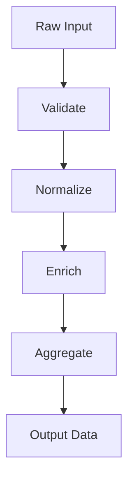
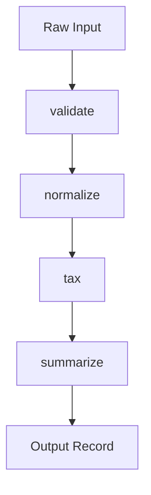

# Functional

Functional Programming (FP) treats computation as the evaluation of mathematical functions. It emphasizes **pure functions**, **immutable data**, and **composition** to build software. By avoiding shared state and mutable data, FP makes code easier to reason about, test, and parallelize, which is especially valuable in concurrent and data-intensive systems.

> "The essence of functional programming is to have a very small number of ways to compose things, and to have those ways be very general."
> — John Hughes

import Tabs from "@theme/Tabs";
import TabItem from "@theme/TabItem";
import Vs from "@site/src/components/Vs";
import Showcase from "@site/src/components/Showcase";
import Checklist from "@site/src/components/Checklist";
import Figure from '@site/src/components/Figure';

<Figure caption="A functional pipeline transforms data through a series of pure functions.">

</Figure>


## Scope and Boundaries

This article covers the core principles, practical implementation, and operational realities of **functional programming** (FP) as a paradigm for building robust, testable, and scalable systems. It focuses on pure functions, immutability, and composition, and how these enable safe concurrency, easier reasoning, and high testability. Topics like [Object-Oriented Programming](./object-oriented), [Procedural / Structured Programming](./procedural-structured), and [Event-Driven & Reactive](./event-driven-and-reactive) are covered in their own articles; this article will cross-link to them for comparison and integration patterns.

## Core Ideas

- **Pure Functions**: Functions that, for the same input, always return the same output and have no observable side effects (e.g., no network or disk I/O, no modifying external state).
- **Immutability**: Data structures cannot be changed after they are created. Instead of modifying data, pure functions create new data structures with the updated values.
- **Composition**: Build complex behavior by composing small, reusable functions together, often in a pipeline-like fashion.
- **Side Effects at the Edges**: Isolate impure actions (like database writes or API calls) at the boundaries of the system, keeping the core logic pure and predictable.


## Practical Examples and Real-World Scenarios

Functional programming is especially powerful for data transformation pipelines, analytics, and business rules engines. The following example demonstrates a multi-step transformation pipeline, implemented in Python, Go, and Node.js. The pipeline validates input, normalizes data, calculates tax, and summarizes the result. This pattern is common in ETL, financial processing, and event stream analytics.

Edge cases to consider:
- What if the input is missing required fields? (Handled by validation step.)
- What if the amount is negative or non-numeric? (Validation and normalization must guard.)
- How do you handle very large or empty datasets? (Functional pipelines scale well, but memory usage must be considered.)
- How do you isolate side effects (e.g., logging, database writes)? (Keep IO at the edges; the pipeline itself is pure.)

<Figure caption="Sequential call flow for a functional data pipeline (applies to all code tabs below).">

</Figure>

<Tabs groupId="lang" queryString>
  <TabItem value="python" label="Python">

```python title="pipeline.py" showLineNumbers
from __future__ import annotations
from typing import Callable, Dict, Any

Record = Dict[str, Any]
Transform = Callable[[Record], Record]

def compose(*funcs: Transform) -> Transform:
    def run(x: Record) -> Record:
        for f in funcs:
            x = f(x)
        return x
    return run

def validate(r: Record) -> Record:
    if not (isinstance(r.get("amount"), (int, float)) and r.get("user_id")):
        raise ValueError("invalid input")
    return r

def normalize(r: Record) -> Record:
    return {**r, "amount_cents": int(float(r["amount"]) * 100)}

def tax(r: Record) -> Record:
    cents = r["amount_cents"]
    return {**r, "tax_cents": int(cents * 0.1)}

def summarize(r: Record) -> Record:
    total = r["amount_cents"] + r["tax_cents"]
    return {**r, "total_cents": total}

pipeline = compose(validate, normalize, tax, summarize)

def process(payload: Record) -> Record:
    # Pure pipeline returns a new record; caller handles IO
    return pipeline(payload)
```

  </TabItem>
  <TabItem value="go" label="Go">

```go title="fp.go" showLineNumbers
package fp

import "fmt"

type Record map[string]interface{}
type Transform func(Record) (Record, error)

func Compose(funcs ...Transform) Transform {
    return func(r Record) (Record, error) {
        var err error
        for _, f := range funcs {
            r, err = f(r)
            if err != nil {
                return nil, err
            }
        }
        return r, nil
    }
}

func Validate(r Record) (Record, error) {
    amount, ok := r["amount"].(float64)
    if !ok {
        if v, ok2 := r["amount"].(int); ok2 {
            amount = float64(v)
        } else {
            return nil, fmt.Errorf("invalid input")
        }
    }
    if _, ok := r["user_id"].(string); !ok {
        return nil, fmt.Errorf("invalid input")
    }
    r["amount"] = amount
    return r, nil
}

func Normalize(r Record) (Record, error) {
    amount := r["amount"].(float64)
    r["amount_cents"] = int(amount * 100)
    return r, nil
}

func Tax(r Record) (Record, error) {
    cents := r["amount_cents"].(int)
    r["tax_cents"] = int(float64(cents) * 0.1)
    return r, nil
}

func Summarize(r Record) (Record, error) {
    total := r["amount_cents"].(int) + r["tax_cents"].(int)
    r["total_cents"] = total
    return r, nil
}

var Pipeline = Compose(Validate, Normalize, Tax, Summarize)

func Process(payload Record) (Record, error) {
    return Pipeline(payload)
}
```

  </TabItem>
  <TabItem value="node" label="Node.js">

```javascript title="pipeline.mjs" showLineNumbers
/** @typedef {{user_id:string, amount:number}} Input */

const validate = (r) => {
    if (!r.user_id || typeof r.amount !== "number") throw new Error("invalid input")
    return r
}

const normalize = (r) => ({ ...r, amount_cents: Math.trunc(r.amount * 100) })
const tax = (r) => ({ ...r, tax_cents: Math.trunc(r.amount_cents * 0.1) })
const summarize = (r) => ({ ...r, total_cents: r.amount_cents + r.tax_cents })

const compose = (...fns) => (x) => fns.reduce((v, f) => f(v), x)
export const process = compose(validate, normalize, tax, summarize)
```

  </TabItem>
</Tabs>


<Vs
  title="When to Use vs. When to Reconsider"
  items={[
    {
      label: "When to Use",
      points: [
        "**Data transformation pipelines**: Ideal for ETL, analytics, and rules engines where data flows through a series of predictable steps.",
        "**High-concurrency systems**: Immutability and the absence of side effects eliminate the need for locks, making it easier to write safe, concurrent code.",
        "**Complex, state-dependent logic**: When behavior is highly dependent on state, modeling it with pure functions that transform state makes the logic explicit and testable.",
        "**Test-driven development**: Pure functions are easy to test in isolation, reducing the need for mocks and stubs.",
        "**Parallel and distributed processing**: Immutability and statelessness simplify scaling across threads and nodes.",
      ],
    },
    {
      label: "When to Reconsider",
      points: [
        "**Performance-critical systems with large data**: The overhead of creating new data structures instead of mutating existing ones can impact performance and memory usage.",
        "**IO-heavy applications**: While possible, managing extensive side effects requires discipline and can lead to complex abstractions (like Monads) that may be unfamiliar to the team.",
        "**Systems with a strong entity focus**: If the domain is better modeled as a collection of stateful objects with distinct identities, OOP might be a more natural fit.",
        "**Low-level systems programming**: Direct memory manipulation and hardware access are often easier in imperative or procedural styles.",
      ],
    },
  ]}
  highlight={0}
  highlightTone="positive"
/>

## Patterns and Pitfalls

- Prefer small, single-purpose functions; compose for behavior.
- Avoid hidden state in closures; pass state explicitly.
- Watch allocations with large data; prefer chunking/streaming.
- Keep side effects at edges; inject IO as parameters to pure cores.
- Use persistent data structures where available to mitigate copy costs.

<Showcase
  title="Decision Matrix: Paradigm Fit by Use Case"
  sections={[
    {
      label: "Use Case",
      body: "Data transformation, analytics, rules engines, concurrent processing, stateful logic, IO-heavy, entity modeling, low-level programming"
    },
    {
      label: "Functional",
      body: "✅ Data transformation, analytics, rules engines, concurrent processing, stateful logic (with explicit state passing)"
    },
    {
      label: "Object-Oriented",
      body: "✅ Entity modeling, stateful objects, domain-driven design, UI frameworks"
    },
    {
      label: "Procedural / Structured",
      body: "✅ Low-level programming, scripts, stepwise workflows, system utilities"
    },
    {
      label: "Event-Driven / Reactive",
      body: "✅ Asynchronous workflows, real-time systems, decoupled services"
    },
  ]}
  tone="info"
/>


## Testing

- Unit-test pure functions with table-driven cases; assert inputs → outputs.
- Property-based testing: generate inputs to validate invariants (e.g., idempotence).
- Contract tests for IO boundaries that call the pure core.
- Benchmark allocations and latency for hot paths; track regressions.

<Showcase
  title="Operational, Security, and Observability Considerations"
  sections={[
    {
      label: "State Management",
      body: "For stateful processes, explicitly pass state through functions. Avoid creating hidden state in closures or global variables. Use persistent data structures where possible."
    },
    {
      label: "Performance",
      body: "Be mindful of memory allocation. Use languages with persistent data structures to minimize the overhead of immutability. For large datasets, consider chunking or streaming to avoid memory bloat."
    },
    {
      label: "Debugging",
      body: "Tracing a pipeline of functions can be challenging. Use logging or tracing at the boundaries of each function to observe the data as it flows through the system."
    },
    {
      label: "Security & Privacy",
      body: "Pure functions are less likely to leak sensitive data via side effects. However, always validate and sanitize inputs at the boundaries. Isolate secrets and sensitive state outside the pure core."
    },
    {
      label: "Observability",
      body: "Functional pipelines are highly observable: log inputs/outputs at each stage, and use correlation IDs to trace data through the pipeline. Avoid hidden state that can obscure root causes."
    },
    {
      label: "Edge Cases",
      body: "Handle empty, null, or malformed inputs gracefully. For concurrency, ensure that parallel execution does not introduce race conditions (immutability helps). For multi-tenant systems, never share mutable state between tenants."
    },
    {
      label: "Rollout & Rollback",
      body: "Because pure functions are deterministic, rolling out or rolling back changes is safer—test new logic in isolation, then swap in the new function."
    },
    {
      label: "Limits & Quotas",
      body: "Immutability can increase memory usage. Monitor for excessive allocation, especially in long-running or high-throughput systems."
    },
  ]}
/>


<Checklist
  title="Design Review Checklist"
  items={[
    "Are functions pure wherever possible?",
    "Is all data treated as immutable?",
    "Are side effects (IO, database calls, logging) isolated at the system's edges?",
    "Is the flow of data through the system explicit and easy to follow?",
    "Can functions be easily tested in isolation without requiring mocks or stubs?",
    "Are edge cases (empty, null, large input) handled gracefully?",
    "Is state passed explicitly, not hidden in closures or globals?",
    "Are secrets and sensitive data kept out of pure functions?",
    "Is memory usage monitored and controlled for large/long-running pipelines?",
    "Are logs, metrics, and traces available at each pipeline stage?",
    "Is the system safe for parallel/concurrent execution?",
    "Are multi-tenant data isolation and concurrency risks addressed?",
  ]}
/>


## Related topics

- [Object-Oriented Programming](./object-oriented)
- [Procedural / Structured Programming](./procedural-structured)
- [Dataflow & Stream Processing](./dataflow-stream-processing)
- [Event-Driven & Reactive](./event-driven-and-reactive)
- [Data Architecture & Persistence](../../data-architecture-and-persistence)
- [Influence on Architecture](./influence-on-architecture)


## References

1.  <a
      href="https://www.cs.kent.ac.uk/people/staff/dat/miranda/whyfp90.pdf"
      target="_blank"
      rel="nofollow noopener noreferrer"
    >
      Why Functional Programming Matters - John Hughes (PDF, University of Kent) ↗️
    </a>
2.  <a
      href="https://mitpress.mit.edu/sites/default/files/sicp/full-text/book/book.html"
      target="_blank"
      rel="nofollow noopener noreferrer"
    >
      Structure and Interpretation of Computer Programs (SICP) ↗️
    </a>
3.  <a
      href="https://fsharpforfunandprofit.com/"
      target="_blank"
      rel="nofollow noopener noreferrer"
    >
      Domain Modeling Made Functional - Scott Wlaschin (F# for Fun and Profit) ↗️
    </a>
4.  <a
      href="https://en.wikipedia.org/wiki/Functional_programming"
      target="_blank"
      rel="nofollow noopener noreferrer"
    >
      Functional Programming - Wikipedia ↗️
    </a>
5.  <a
      href="https://www.haskell.org/documentation/"
      target="_blank"
      rel="nofollow noopener noreferrer"
    >
      Haskell Documentation ↗️
    </a>
