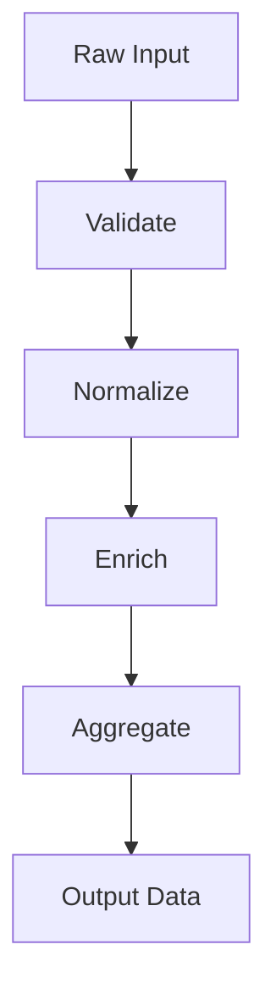

# Functional

Functional Programming (FP) treats computation as the evaluation of mathematical functions. It emphasizes **pure functions**, **immutable data**, and **composition** to build software. By avoiding shared state and mutable data, FP makes code easier to reason about, test, and parallelize, which is especially valuable in concurrent and data-intensive systems.

> "The essence of functional programming is to have a very small number of ways to compose things, and to have those ways be very general."
> — John Hughes

import Tabs from "@theme/Tabs";
import TabItem from "@theme/TabItem";
import Vs from "@site/src/components/Vs";
import Showcase from "@site/src/components/Showcase";
import Checklist from "@site/src/components/Checklist";
import Figure from '@site/src/components/Figure';

<Figure caption="A functional pipeline transforms data through a series of pure functions.">

</Figure>

## Core ideas

- **Pure Functions**: Functions that, for the same input, always return the same output and have no observable side effects (e.g., no network or disk I/O, no modifying external state).
- **Immutability**: Data structures cannot be changed after they are created. Instead of modifying data, pure functions create new data structures with the updated values.
- **Composition**: Build complex behavior by composing small, reusable functions together, often in a pipeline-like fashion.
- **Side Effects at the Edges**: Isolate impure actions (like database writes or API calls) at the boundaries of the system, keeping the core logic pure and predictable.


## Examples

<Tabs groupId="lang" queryString>
  <TabItem value="python" label="Python">

```python title="pipeline.py" showLineNumbers
from __future__ import annotations
from typing import Callable, Dict, Any

Record = Dict[str, Any]
Transform = Callable[[Record], Record]

def compose(*funcs: Transform) -> Transform:
    def run(x: Record) -> Record:
        for f in funcs:
            x = f(x)
        return x
    return run

def validate(r: Record) -> Record:
    if not (isinstance(r.get("amount"), (int, float)) and r.get("user_id")):
        raise ValueError("invalid input")
    return r

def normalize(r: Record) -> Record:
    return {**r, "amount_cents": int(float(r["amount"]) * 100)}

def tax(r: Record) -> Record:
    cents = r["amount_cents"]
    return {**r, "tax_cents": int(cents * 0.1)}

def summarize(r: Record) -> Record:
    total = r["amount_cents"] + r["tax_cents"]
    return {**r, "total_cents": total}

pipeline = compose(validate, normalize, tax, summarize)

def process(payload: Record) -> Record:
    # Pure pipeline returns a new record; caller handles IO
    return pipeline(payload)
```

  </TabItem>
  <TabItem value="go" label="Go">

```go title="fp.go" showLineNumbers
package fp

import "fmt"

type Record map[string]interface{}
type Transform func(Record) (Record, error)

func Compose(funcs ...Transform) Transform {
    return func(r Record) (Record, error) {
        var err error
        for _, f := range funcs {
            r, err = f(r)
            if err != nil {
                return nil, err
            }
        }
        return r, nil
    }
}
```

  </TabItem>
  <TabItem value="node" label="Node.js">

```javascript title="pipeline.mjs" showLineNumbers
/** @typedef {{user_id:string, amount:number}} Input */

const validate = (r) => {
    if (!r.user_id || typeof r.amount !== "number") throw new Error("invalid input")
    return r
}

const normalize = (r) => ({ ...r, amount_cents: Math.trunc(r.amount * 100) })
const tax = (r) => ({ ...r, tax_cents: Math.trunc(r.amount_cents * 0.1) })
const summarize = (r) => ({ ...r, total_cents: r.amount_cents + r.tax_cents })

const compose = (...fns) => (x) => fns.reduce((v, f) => f(v), x)
export const process = compose(validate, normalize, tax, summarize)
```

  </TabItem>
</Tabs>

<Vs
  title="When to Use vs. When to Reconsider"
  items={[
    {
      label: "When to Use",
      points: [
        "**Data transformation pipelines**: Ideal for ETL, analytics, and rules engines where data flows through a series of predictable steps.",
        "**High-concurrency systems**: Immutability and the absence of side effects eliminate the need for locks, making it easier to write safe, concurrent code.",
        "**Complex, state-dependent logic**: When behavior is highly dependent on state, modeling it with pure functions that transform state makes the logic explicit and testable.",
      ],
    },
    {
      label: "When to Reconsider",
      points: [
        "**Performance-critical systems with large data**: The overhead of creating new data structures instead of mutating existing ones can impact performance and memory usage.",
        "**IO-heavy applications**: While possible, managing extensive side effects requires discipline and can lead to complex abstractions (like Monads) that may be unfamiliar to the team.",
        "**Systems with a strong entity focus**: If the domain is better modeled as a collection of stateful objects with distinct identities, OOP might be a more natural fit.",
      ],
    },
  ]}
  highlight={0}
  highlightTone="positive"
/>

<Showcase
  title="Operational Considerations"
  sections={[
    {
      label: "State Management",
      body: "For stateful processes, explicitly pass state through functions. Avoid creating hidden state in closures or global variables.",
    },
    {
      label: "Performance",
      body: "Be mindful of memory allocation. Use languages with persistent data structures to minimize the overhead of immutability.",
    },
    {
      label: "Debugging",
      body: "Tracing a pipeline of functions can be challenging. Use logging or tracing at the boundaries of each function to observe the data as it flows through the system.",
    },
  ]}
/>

<Checklist
  title="Design Review Checklist"
  items={[
    "Are functions pure wherever possible?",
    "Is all data treated as immutable?",
    "Are side effects (IO, database calls) isolated at the system's edges?",
    "Is the flow of data through the system explicit and easy to follow?",
    "Can functions be easily tested in isolation without requiring mocks or stubs?",
  ]}
/>

## Related topics

- [Dataflow & Stream Processing](/docs/foundational-concepts/programming-paradigms/dataflow-stream-processing)
- [Event-Driven & Reactive](/docs/foundational-concepts/programming-paradigms/event-driven-and-reactive)
- [Data Architecture & Persistence](/docs/data-architecture-and-persistence)

## References

1.  <a
      href="https://www.cs.cmu.edu/~crary/819-f09/Hughes90.pdf"
      target="_blank"
      rel="nofollow noopener noreferrer"
    >
      Why Functional Programming Matters - John Hughes ↗️
    </a>
2.  <a
      href="https://mitpress.mit.edu/sites/default/files/sicp/full-text/book/book.html"
      target="_blank"
      rel="nofollow noopener noreferrer"
    >
      Structure and Interpretation of Computer Programs (SICP) ↗️
    </a>
3.  <a
      href="https://www.oreilly.com/library/view/domain-modeling-made/9781680502549/"
      target="_blank"
      rel="nofollow noopener noreferrer"
    >
      Domain Modeling Made Functional - Scott Wlaschin ↗️
    </a>
