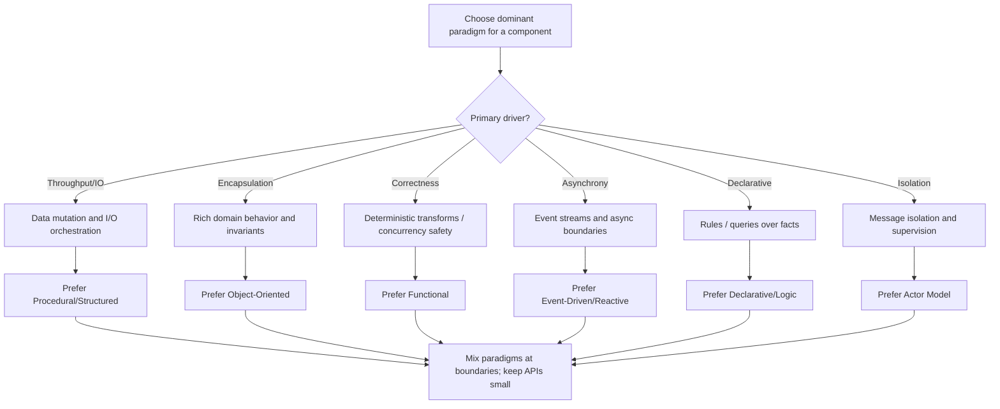

import DocCardList from "@theme/DocCardList";
import { useCurrentSidebarCategory } from "@docusaurus/theme-common";
import Figure from "@site/src/components/Figure";
import Head from "@docusaurus/Head";

<Head>
  <meta name="description" content="How to choose and combine programming paradigms per component to meet quality attributes like latency, correctness, and evolvability." />
  <meta property="og:title" content="Programming Paradigms" />
  <meta property="og:description" content="How to choose and combine programming paradigms per component to meet quality attributes like latency, correctness, and evolvability." />
  <meta property="og:image" content="https://archman.dev/img/archman-social-card.webp" />
  <meta name="twitter:card" content="summary_large_image" />
  <link rel="canonical" href="https://archman.dev/docs/foundational-concepts/programming-paradigms" />
  
  
</Head>

# Programming Paradigms

Choosing a programming paradigm is a design decision that shapes how you model state and behavior, how you reason about concurrency, and how you operate software in production. The goal is not to be dogmatic but to be intentional: select a dominant style per component, then mix paradigms at boundaries where it improves clarity or operability. Tie your choice to explicit **quality attributes** (e.g., latency, throughput, safety, evolvability) and the surrounding **system semantics**.

At a glance, you can think of paradigms as lenses for structuring computation:

- **[Procedural/Structured](./procedural-structured)** emphasizes clear control flow and localized mutation—great for I/O orchestration.
- **[Object‑Oriented](./object-oriented)** centers on encapsulated domain behavior and stable interfaces.
- **[Functional](./functional)** favors pure transforms and immutability for correctness and parallelism.
- **[Event‑Driven & Reactive](./event-driven-and-reactive)** models asynchronous streams, backpressure, and temporal coupling.
- **[Declarative & Logic](./declarative-and-logic)** states the “what” (rules, queries) instead of the “how”.
- **[Actor Model](./actor-model)** isolates state behind message boundaries with supervision.

Use the quick decision aid below to pick a default and then refine based on the component’s responsibilities, team expertise, and runtime constraints. Keep the broader architecture in view: connector choices, backpressure, idempotency, and failure modes often matter more than syntax or language features.

<Figure caption="A vertical decision aid to select a dominant paradigm per component.">

</Figure>

What you’ll take away

- **How to choose** a paradigm against constraints (latency, throughput, safety, changeability)
- **Where it fits** in your architecture: connectors, backpressure, idempotency, supervision
- **Trade‑offs and review cues** to avoid over‑abstraction and accidental complexity

Related topics

- See **Systems Thinking Basics** for components and connectors: [Components, Connectors, Configurations](../system-thinking-basics/components-connectors-configurations).
- For broader styles and boundaries, visit [Architectural Styles](../../architectural-styles).
- Anchor decisions in [Quality Attributes](../../quality-attributes), and plan day‑two needs in [Observability & Operations](../../observability-and-operations).

<DocCardList items={useCurrentSidebarCategory().items} />
