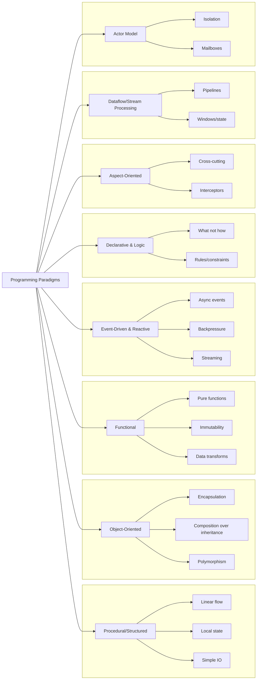

import DocCardList from "@theme/DocCardList";
import { useCurrentSidebarCategory } from "@docusaurus/theme-common";
import Figure from "@site/src/components/Figure";

# Programming Paradigms

A practical guide to the major paradigms—how they model state, behavior, and concurrency—and how those choices ripple into modularity, testing, deployment, and operability. Most real systems are multiparadigm: pick a dominant style per component and mix responsibly at boundaries.

What you’ll take away

- Mental models to choose a paradigm against constraints (latency, throughput, consistency, changeability)
- Idiomatic patterns in Python, Go, and Node.js for each paradigm
- Trade-offs, operational implications, and review checklists

<Figure caption="An overview of major programming paradigms and their core concepts.">

</Figure>

<DocCardList items={useCurrentSidebarCategory().items} />
