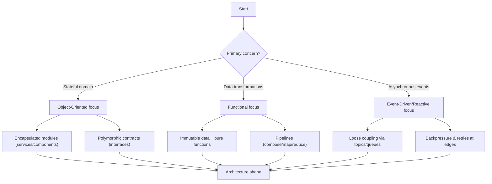
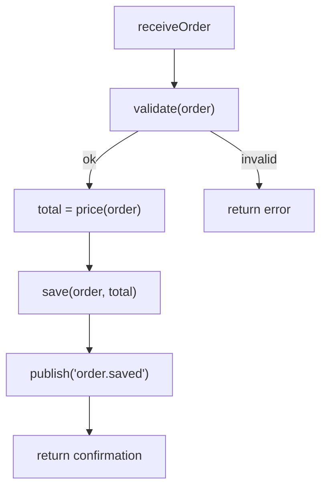

# Influence on Architecture

Programming paradigms are more than just a matter of coding style; they are the architectural DNA of a system. The choice between Object-Oriented, Functional, or Event-Driven approaches fundamentally shapes module boundaries, dictates data flow patterns, and influences runtime characteristics like concurrency and state management. An early, deliberate paradigm choice, aligned with domain constraints and desired quality attributes, is a foundational architectural decision.

> "The paradigm is the lens through which you view the problem. If your lens is narrow, you will find it difficult to see the full range of solutions."
> — Grady Booch

import Showcase from "@site/src/components/Showcase";
import Checklist from "@site/src/components/Checklist";
import ProsCons from "@site/src/components/ProsCons";
import Figure from '@site/src/components/Figure';
import Head from '@docusaurus/Head';
import Tabs from '@theme/Tabs';
import TabItem from '@theme/TabItem';

<Head>
  <meta name="description" content="How paradigm choices shape boundaries, data flow, concurrency, and operations—and how to choose wisely." />
  <meta property="og:title" content="Influence of Programming Paradigms on Architecture" />
  <meta property="og:description" content="How paradigm choices shape boundaries, data flow, concurrency, and operations—and how to choose wisely." />
  <meta property="og:image" content="https://archman.dev/img/archman-social-card.webp" />
  <meta name="twitter:card" content="summary_large_image" />
  <script type="application/ld+json">{JSON.stringify({
    "@context": "https://schema.org",
    "@type": "Article",
    "headline": "Influence of Programming Paradigms on Architecture",
    "description": "How paradigm choices shape boundaries, data flow, concurrency, and operations—and how to choose wisely.",
    "image": "https://archman.dev/img/archman-social-card.webp",
    "keywords": [
      "programming paradigms","architecture","quality attributes","object-oriented","functional","event-driven","reactive","declarative","actor model","dataflow","immutability","encapsulation","concurrency","backpressure"
    ],
    "author": {"@type":"Person","name":"Archman"},
    "dateModified": "2025-09-10"
  })}</script>
  <script type="application/ld+json">{JSON.stringify({
    "@context":"https://schema.org",
    "@type":"BreadcrumbList",
    "itemListElement":[
      {"@type":"ListItem","position":1,"name":"Foundational Concepts","item":"https://archman.dev/docs/foundational-concepts"},
      {"@type":"ListItem","position":2,"name":"Programming Paradigms","item":"https://archman.dev/docs/foundational-concepts/programming-paradigms"},
      {"@type":"ListItem","position":3,"name":"Influence on Architecture","item":"https://archman.dev/docs/foundational-concepts/programming-paradigms/influence-on-architecture"}
    ]
  })}</script>
</Head>

## TL;DR

Choose a dominant paradigm per component based on top quality attributes (e.g., correctness, latency, scalability), then mix paradigms at boundaries. Encapsulation (OO), immutability (Functional), and asynchrony (Event‑Driven/Reactive) lead to different architecture shapes, operational risks, and observability needs.

## Learning objectives

- You will be able to map paradigm choices to quality attributes and risks.
- You will be able to choose a dominant paradigm per component with justification.
- You will be able to design boundaries, connectors, and contracts consistent with the chosen paradigm.
- You will be able to plan observability, testing, and rollout strategies that fit the paradigm.

## Motivating scenario

Your platform team is designing an Order component. The domain has rich invariants (discount rules, inventory holds), high write throughput during sales, and async integrations (notifications, analytics). Picking OO across the board seems natural, but contention on shared state could limit concurrency. A functional core improves determinism and parallelism, while event‑driven edges decouple integrations and absorb spikes. You need a principled way to decide and to combine these styles safely.

<Figure caption="Vertical decision flow: how paradigm emphasis influences architectural shape.">

</Figure>

<ProsCons
  pros={[
    'Signals: frequent independent changes, concurrency needs, or async integrations suggest Functional or Event‑Driven emphasis',
    'Signals: complex invariants and stable domain objects suggest an OO emphasis with clear interfaces',
  ]}
  cons={[
    'Anti‑signals: pervasive shared mutable state and tight temporal coupling indicate a need to refactor toward Functional/EDA boundaries',
    'Anti‑signals: over‑abstracted OO hierarchies or over‑composed functional pipelines are harming readability and operability',
  ]}
/>

## Mental Model for Selection

Choosing a primary paradigm is a trade-off analysis. The right fit depends on the system's core purpose and most critical quality attributes. Use this mental model:

1.  **Domain First**: Analyze the business domain. Is it a set of stable, stateful entities (favors OO), a series of data transformations (favors Functional), or a collection of asynchronous, real-world events (favors Event-Driven)?
2.  **Constraints-Driven**: Identify non-negotiable constraints. High-concurrency requirements push towards Functional or Event-Driven. Strict data integrity and consistency might favor OO's encapsulation.
3.  **Composition is Key**: No single paradigm fits all parts of a complex system. Aim for a primary paradigm at the macro level but allow for different, compatible paradigms at the micro-level (e.g., a functional core inside an event-driven service).

## Paradigm vs. Quality Attribute Alignment

| Quality Attribute         | Object-Oriented                                 | Functional                                    | Event-Driven / Reactive                       |
| ------------------------- | ----------------------------------------------- | --------------------------------------------- | --------------------------------------------- |
| **Maintainability**       | ✅ High (with clear boundaries)                 | ✅ High (pure functions are easy to test)     | 🟡 Medium (can be hard to trace)              |
| **Scalability/Concurrency** | 🟡 Medium (shared state needs locks)            | ✅ High (immutability avoids side effects)    | ✅ High (inherently asynchronous)             |
| **Testability**           | 🟡 Medium (state and dependencies)              | ✅ High (predictable, no mocks needed)        | 🟡 Medium (requires infrastructure)            |
| **Resilience**            | 🟡 Medium (failures can cascade)                | ✅ High (composition of fault-tolerant steps) | ✅ High (decoupling isolates failures)        |
| **Performance**           | 🟡 Medium (indirection, allocation overhead)    | 🟡 Medium (immutability can increase churn)  | ✅ High (non-blocking I/O)                    |

<Showcase
  title="Operational Considerations"
  sections={[
    {
      label: "Observability",
      body: "Paradigm choice dictates instrumentation. OO requires object-level monitoring, Functional needs pipeline tracing, and Event-Driven demands distributed tracing with context propagation.",
    },
    {
      label: "Resilience",
      body: "Async and event-driven paradigms require robust error handling like dead-letter queues, circuit breakers, and idempotent consumers to prevent data loss or processing loops.",
    },
  ]}
/>

<Checklist
  title="Design Review Checklist"
  items={[
    "Is the primary paradigm choice explicitly justified by the system's top 2-3 quality attributes?",
    "Are the boundaries (e.g., services, modules, functions) consistent with the chosen paradigm?",
    "How does the data flow model align with the paradigm (e.g., mutable objects vs. immutable data)?",
    "Are the operational risks (e.g., state management, debugging complexity) identified and mitigated?",
    "Is there a strategy for integrating other paradigms where they fit better?",
  ]}
/>

## Practical example: same capability, different paradigm shapes

The capability: validate an order, compute its total, persist it, and publish an event. The architectural shape differs with the chosen paradigm, even though the steps are similar.

<Figure caption="Sequential call flow for the example across all language tabs.">

</Figure>

<Tabs groupId="lang" queryString>
  <TabItem value="python" label="Python">

  ```python title="order_service.py" showLineNumbers
  from dataclasses import dataclass

  @dataclass(frozen=True)
  class Order:
      items: list

  def validate(order: Order) -> None:
      if not order.items:
          raise ValueError("empty order")

  def price(order: Order) -> int:
      return sum(item["qty"] * item["unit_price"] for item in order.items)

  def save(order: Order, total: int) -> None:
      # persist immutably; return nothing to keep purity at edges
      pass

  def publish(event: str) -> None:
      pass

  def receive_order(order: Order) -> dict:
      validate(order)
      total = price(order)
      save(order, total)
      publish("order.saved")
      return {"total": total}
  ```

  </TabItem>
  <TabItem value="go" label="Go">

  ```go title="order_service.go" showLineNumbers
  package orders

  type Item struct { Qty int; UnitPrice int }
  type Order struct { Items []Item }

  func Validate(o Order) error {
      if len(o.Items) == 0 { return fmt.Errorf("empty order") }
      return nil
  }

  func Price(o Order) int {
      total := 0
      for _, it := range o.Items { total += it.Qty * it.UnitPrice }
      return total
  }

  func Save(o Order, total int) error { return nil }
  func Publish(event string) error { return nil }

  func ReceiveOrder(o Order) (int, error) {
      if err := Validate(o); err != nil { return 0, err }
      total := Price(o)
      if err := Save(o, total); err != nil { return 0, err }
      _ = Publish("order.saved")
      return total, nil
  }
  ```

  </TabItem>
  <TabItem value="node" label="Node.js">

  ```javascript title="orderService.js" showLineNumbers
  export function validate(order) {
      if (!order.items?.length) throw new Error('empty order')
  }

  export function price(order) {
      return order.items.reduce((t, i) => t + i.qty * i.unitPrice, 0)
  }

  export async function save(order, total) { /* persist */ }
  export async function publish(event) { /* emit */ }

  export async function receiveOrder(order) {
      validate(order)
      const total = price(order)
      await save(order, total)
      await publish('order.saved')
      return { total }
  }
  ```

  </TabItem>
</Tabs>

Notes:

- **OO shape**: methods often live on rich domain objects; persistence behind repositories; contracts expressed via interfaces.
- **Functional shape**: small pure functions composed into a pipeline; side effects at the edges; immutability simplifies concurrency.
- **Event-driven shape**: the same steps are decoupled into handlers with retries, DLQs, and idempotent consumers.

## Hands‑on exercise

Implement idempotent publishing at the edge. Add a simple deduplication key to avoid double‑processing on retries.

```python title="publisher.py" showLineNumbers
from typing import Set

seen: Set[str] = set()

def publish_once(event_key: str, payload: dict) -> bool:
    if event_key in seen:
        return False
    seen.add(event_key)
    # send to broker here
    return True
```

Steps:
1. Generate a stable `event_key` (e.g., `orderId:version`).
2. Call `publish_once(event_key, payload)` at the edge of the flow.
3. In an Event‑Driven variant, also make consumers idempotent using a processed‑keys store.
4. Add metrics: publish attempts vs. deduplicated; alert on rising dedup ratio.

## Related topics

- [Core Design & Programming Principles](../../core-design-and-programming-principles)
- [Quality Attributes](../../quality-attributes)
- [Observability & Operations](../../observability-and-operations)
- [Architectural Styles](../../architectural-styles)

## Self‑check

1. Which two quality attributes most influenced your paradigm choice? How are they protected in code and contracts?
2. Where are side effects isolated, and how would retries/timeouts affect correctness?
3. What observability signals (logs/metrics/traces) distinguish healthy from unhealthy flows in your chosen paradigm?

## Implementation notes, patterns, and pitfalls

- **Boundaries follow the paradigm**: OO favors entity/service boundaries; Functional favors data pipeline stages; Event-driven favors message semantics and topic design.
- **Avoid the golden hammer**: do not force one paradigm in all layers. Composition across boundaries is healthy when contracts isolate concerns.
- **Debuggability trade-offs**: event-driven systems can be harder to trace without end-to-end correlation; functional pipelines can hide context if over-composed.
- **Coupling hazards**: implicit shared state (OO) and implicit shared clocks (EDA) both create hidden coupling; make them explicit via contracts and timeouts.

:::info
One takeaway: Pick a paradigm to optimize for your top attribute, then isolate trade‑offs at boundaries. Mixed paradigms are a strength when contracts are explicit.
:::

## Edge cases to consider

- **Idempotency**: ensure handlers and saves are idempotent under retries.
- **Ordering**: event streams may deliver out-of-order; design with sequence keys or reconciliation.
- **Large payloads**: prefer references (object storage) in events; fetch on demand.
- **Partial failure**: isolate side effects; apply sagas/compensation where needed.

## Operational considerations

- **SLOs/SLIs**: define latency and success-rate targets per step (validate, price, save, publish).
- **Rollouts**: use feature flags for switching paradigms or pipelines; canary new handlers.
- **Limits**: enforce backpressure and concurrency limits at edges; use queues where appropriate.

## Security, privacy, and compliance

- **Data classification**: avoid PII in event payloads; use tokens/ids.
- **Authn/Authz**: protect write paths; validate producer identity for events.
- **Secrets**: keep credentials out of code; rotate and audit.

## Observability (logs, metrics, traces)

- **Logs**: structured logs with orderId, correlationId, and step name.
- **Metrics**: per-step latency, throughput, error rates; queue depth for EDA.
- **Traces**: propagate context across services/handlers; surface spans for retries and DLQ moves.

## Testing strategy

- **Unit tests**: pure functions (Functional) are trivial to test; OO methods require fixture builders.
- **Contract tests**: verify event schemas and REST/RPC contracts to prevent drift.
- **Integration tests**: exercise the full flow with in-memory brokers or test topics.

## When to use

- **OO**: rich domain invariants, complex lifecycle rules, and encapsulation.
- **Functional**: CPU-bound transformations, concurrency, and deterministic pipelines.
- **Event-driven**: asynchronous workflows, integration across bounded contexts, and elasticity.

## When not to use

- **OO**: when shared mutable state amplifies contention or hinders scaling.
- **Functional**: when heavy copying/immutability costs dominate hot paths without offsetting benefits.
- **Event-driven**: when strong consistency and simple request/response semantics suffice.

## Next steps

- Explore [Components, Connectors, Configurations](../system-thinking-basics/components-connectors-configurations).
- Review [Quality Attributes](../../quality-attributes) to anchor trade‑offs.
- See [Observability & Operations](../../observability-and-operations) to plan signals and alerts.
- Compare [Architectural Styles](../../architectural-styles) for macro‑structure implications.
- Read <a href="https://www.reactive-streams.org/" target="_blank" rel="nofollow noopener noreferrer">Reactive Streams specification ↗️</a> for backpressure patterns.

## Questions this article answers

- How do paradigms shape module boundaries and data flow?
- When should I prefer OO vs Functional vs Event‑Driven?
- What operational risks change with each paradigm?

## References

1. <a href="https://www.reactivemanifesto.org/" target="_blank" rel="nofollow noopener noreferrer">The Reactive Manifesto ↗️</a>
2. <a href="https://martinfowler.com/articles/collection-pipeline/" target="_blank" rel="nofollow noopener noreferrer">Martin Fowler, Collection Pipeline ↗️</a>
3. <a href="https://www.amazon.com/Object-Oriented-Analysis-Design-Applications-3rd/dp/020189551X" target="_blank" rel="nofollow noopener noreferrer">Grady Booch, OOAD with Applications ↗️</a>
