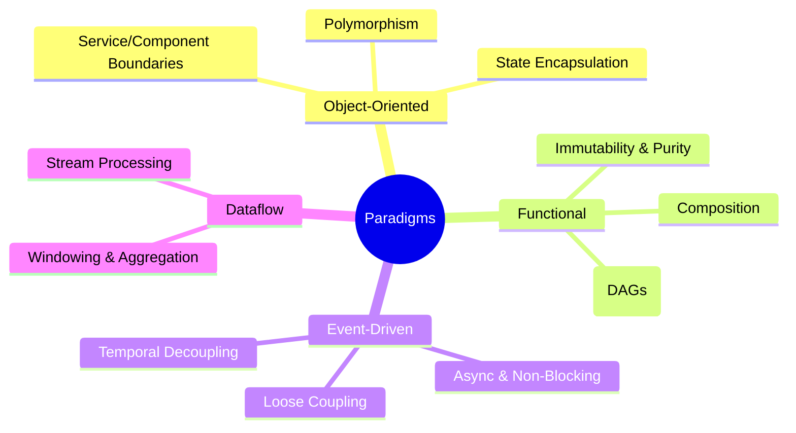

# Influence on Architecture

Programming paradigms are more than just a matter of coding style; they are the architectural DNA of a system. The choice between Object-Oriented, Functional, or Event-Driven approaches fundamentally shapes module boundaries, dictates data flow patterns, and influences runtime characteristics like concurrency and state management. An early, deliberate paradigm choice, aligned with domain constraints and desired quality attributes, is a foundational architectural decision.

> "The paradigm is the lens through which you view the problem. If your lens is narrow, you will find it difficult to see the full range of solutions."
> — Grady Booch

import ProsCons from "@site/src/components/ProsCons";
import Showcase from "@site/src/components/Showcase";
import Checklist from "@site/src/components/Checklist";
import Figure from '@site/src/components/Figure';

<Figure caption="The influence of programming paradigms on architectural design.">

</Figure>

## Mental Model for Selection

Choosing a primary paradigm is a trade-off analysis. The right fit depends on the system's core purpose and most critical quality attributes. Use this mental model:

1.  **Domain First**: Analyze the business domain. Is it a set of stable, stateful entities (favors OO), a series of data transformations (favors Functional), or a collection of asynchronous, real-world events (favors Event-Driven)?
2.  **Constraints-Driven**: Identify non-negotiable constraints. High-concurrency requirements push towards Functional or Event-Driven. Strict data integrity and consistency might favor OO's encapsulation.
3.  **Composition is Key**: No single paradigm fits all parts of a complex system. Aim for a primary paradigm at the macro level but allow for different, compatible paradigms at the micro-level (e.g., a functional core inside an event-driven service).

## Paradigm vs. Quality Attribute Alignment

| Quality Attribute         | Object-Oriented                                 | Functional                                    | Event-Driven / Reactive                       |
| ------------------------- | ----------------------------------------------- | --------------------------------------------- | --------------------------------------------- |
| **Maintainability**       | ✅ High (with clear boundaries)                 | ✅ High (pure functions are easy to test)     | 🟡 Medium (can be hard to trace)              |
| **Scalability/Concurrency** | 🟡 Medium (shared state needs locks)            | ✅ High (immutability avoids side effects)    | ✅ High (inherently asynchronous)             |
| **Testability**           | 🟡 Medium (state and dependencies)              | ✅ High (predictable, no mocks needed)        | 🟡 Medium (requires infrastructure)            |
| **Resilience**            | 🟡 Medium (failures can cascade)                | ✅ High (composition of fault-tolerant steps) | ✅ High (decoupling isolates failures)        |
| **Performance**           | 🟡 Medium (indirection, allocation overhead)    | 🟡 Medium (immutability can increase churn)  | ✅ High (non-blocking I/O)                    |

<Showcase
  title="Operational Considerations"
  sections={[
    {
      label: "Observability",
      body: "Paradigm choice dictates instrumentation. OO requires object-level monitoring, Functional needs pipeline tracing, and Event-Driven demands distributed tracing with context propagation.",
    },
    {
      label: "Resilience",
      body: "Async and event-driven paradigms require robust error handling like dead-letter queues, circuit breakers, and idempotent consumers to prevent data loss or processing loops.",
    },
  ]}
/>

<Checklist
  title="Design Review Checklist"
  items={[
    "Is the primary paradigm choice explicitly justified by the system's top 2-3 quality attributes?",
    "Are the boundaries (e.g., services, modules, functions) consistent with the chosen paradigm?",
    "How does the data flow model align with the paradigm (e.g., mutable objects vs. immutable data)?",
    "Are the operational risks (e.g., state management, debugging complexity) identified and mitigated?",
    "Is there a strategy for integrating other paradigms where they fit better?",
  ]}
/>

## Related topics

- [Core Design & Programming Principles](/docs/core-design-and-programming-principles)
- [Quality Attributes](/docs/quality-attributes)
- [Architecture Decision Records](/docs/documentation-and-modeling/architecture-decision-records-adr)
