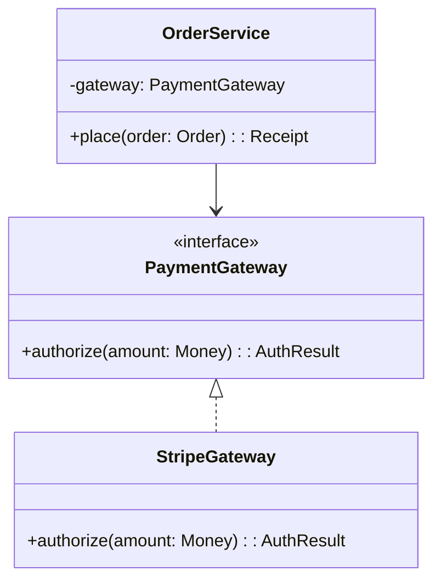
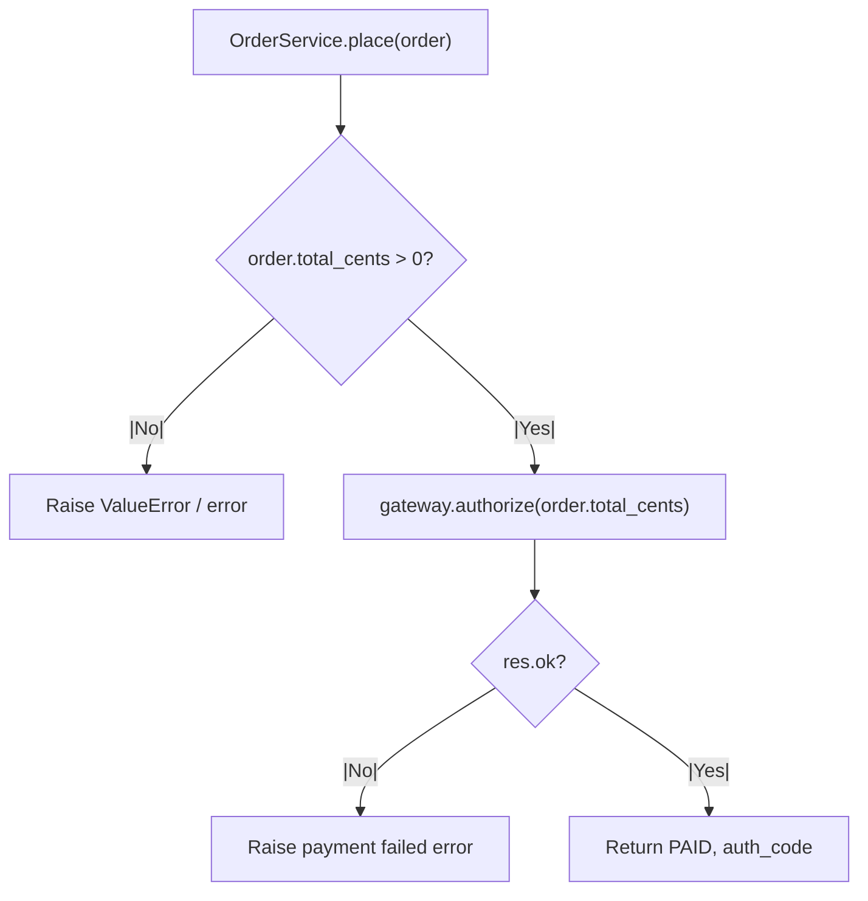

import Tabs from "@theme/Tabs";
import TabItem from "@theme/TabItem";
import Vs from "@site/src/components/Vs";
import Showcase from "@site/src/components/Showcase";
import Checklist from "@site/src/components/Checklist";
import Figure from "@site/src/components/Figure";


# Object-Oriented Programming

> "The basic idea of object-oriented programming is this: we're going to hide the state, and we're going to expose functions that operate on that state."
> — Robert C. Martin

Object-Oriented Programming (OOP) is a foundational paradigm for modeling software as a collection of collaborating objects, each encapsulating state and exposing behavior through methods. OOP is central to modern software engineering, enabling modularity, maintainability, and testability at scale. This article provides a comprehensive, end-to-end guide to OOP: its principles, trade-offs, real-world patterns, operational and security considerations, and practical implementation guidance. After reading, you will understand not only how OOP works, but when, why, and how to apply it for robust, production-grade systems.

## Scope and Boundaries

This article covers:

- Core OOP principles: encapsulation, composition, inheritance, polymorphism, dependency inversion
- Real-world design patterns and anti-patterns
- Practical code examples in Python, Go, and Node.js
- Decision models for when to use OOP (and when not to)
- Operational, security, and observability implications
- Design review checklist and related topics

Out of scope: deep dives into specific design patterns (see [Design Patterns](/docs/design-patterns)), language-specific OOP features, and advanced metaprogramming (see [Advanced Programming Concepts](/docs/foundational-concepts/programming-paradigms/functional)).

## Core Concepts

- **Encapsulation**: Internal state is hidden; only stable, public methods expose behavior.
- **Composition over Inheritance**: Prefer assembling small, focused objects over deep class hierarchies for flexibility and testability.
- **Polymorphism**: Program to interfaces or abstract types, enabling interchangeable components and plug-in architectures.
- **Dependency Inversion**: High-level modules depend on abstractions, not concrete implementations, decoupling system layers.
- **Inheritance**: Mechanism for code reuse, but should be used judiciously—favor composition for most cases.

<Figure caption="A dependency-inverted design for an order service, programming to the PaymentGateway interface.">

</Figure>

## OOP Call Flow Example (Order Placement)

<Figure caption="Order placement call flow: service delegates to gateway, handles errors, and returns result.">

</Figure>

## Practical Examples (Composition + Interfaces)

<Tabs groupId="lang" queryString>
  <TabItem value="python" label="Python">
```python title="orders.py" showLineNumbers
from abc import ABC, abstractmethod
from dataclasses import dataclass

class PaymentGateway(ABC):
    @abstractmethod
    def authorize(self, amount: int) -> dict:
        pass

class StripeGateway(PaymentGateway):
    def authorize(self, amount: int) -> dict:
        return {"ok": True, "auth_code": "XYZ"}

@dataclass
class Order:
    user_id: str
    total_cents: int

class OrderService:
    def __init__(self, gateway: PaymentGateway):
        self._gateway = gateway

    def place(self, order: Order) -> dict:
        if order.total_cents <= 0:
            raise ValueError("invalid total")
        res = self._gateway.authorize(order.total_cents)
        if not res.get("ok"):
            raise RuntimeError("payment failed")
        return {"status": "PAID", "auth_code": res["auth_code"]}
```
  </TabItem>
  <TabItem value="go" label="Go">
```go title="orders.go" showLineNumbers
package orders

import "fmt"

type PaymentGateway interface {
    Authorize(amountCents int) (authCode string, ok bool)
}

type Order struct {
    UserID     string
    TotalCents int
}

type Service struct {
    gateway PaymentGateway
}

func NewService(g PaymentGateway) *Service {
    return &Service{gateway: g}
}

func (s *Service) Place(o Order) (string, error) {
    if o.TotalCents <= 0 {
        return "", fmt.Errorf("invalid total")
    }
    code, ok := s.gateway.Authorize(o.TotalCents)
    if !ok {
        return "", fmt.Errorf("payment failed")
    }
    return code, nil
}
```
  </TabItem>
  <TabItem value="node" label="Node.js">
```javascript title="orderService.js" showLineNumbers
/**
 * @typedef {{ authorize: (amountCents: number) => Promise<{ok: boolean, code?: string}> }} PaymentGateway
 */

export class OrderService {
    /** @param {PaymentGateway} gateway */
    constructor(gateway) {
        this.gateway = gateway;
    }
    /** @param {{userId: string, totalCents: number}} order */
    async place(order) {
        if (order.totalCents <= 0) throw new Error("invalid total");
        const res = await this.gateway.authorize(order.totalCents);
        if (!res.ok) throw new Error("payment failed");
        return { status: "PAID", auth_code: res.code };
    }
}
```
  </TabItem>
</Tabs>

## Decision Matrix: OOP vs. Other Paradigms

| Use Case                                 | OOP Strength | Functional | Procedural | Dataflow |
|------------------------------------------|:------------:|:----------:|:----------:|:--------:|
| Modeling business entities & rules       |     ✅       |     ⚪     |     ⚪     |    ⚪    |
| Plug-in/strategy architectures           |     ✅       |     ⚪     |     ⚪     |    ⚪    |
| High-concurrency data processing         |     ⚪       |     ✅     |     ⚪     |    ✅    |
| Stateless utilities & pure transformations|     ⚪       |     ✅     |     ✅     |    ⚪    |
| UI with complex, reactive state          |     ⚪       |     ✅     |     ⚪     |    ⚪    |

Legend: ✅ = strong fit, ⚪ = possible fit

## Implementation Patterns, Pitfalls, and Anti-Patterns

- **Favor composition**: Use small, focused objects; avoid deep inheritance trees ([Composition Over Inheritance](/docs/core-design-and-programming-principles)).
- **Program to interfaces**: Depend on abstractions, not concrete types ([Dependency Inversion](/docs/core-design-and-programming-principles/solid)).
- **Enforce invariants**: Objects should always be valid after construction and during state transitions.
- **Avoid God Objects**: Do not centralize too much responsibility in a single class ([God Object](/docs/anti-patterns-and-pitfalls/god-object)).
- **Beware Anemic Domain Models**: Business logic should live in domain objects, not just in services ([Anemic Domain Model](/docs/anti-patterns-and-pitfalls/anemic-domain-model)).
- **Testability**: Inject dependencies to enable mocking and isolation in tests.
- **Immutability for value objects**: Use immutable types for things like Money, Email, etc.

## Operational, Security, and Observability Considerations

<Showcase
  title="Operational Considerations"
  sections={[
    {
      label: "State Management & Invariants",
      body: "Ensure objects are always in a valid state by enforcing invariants in the constructor. Private state should only be modified through public methods."
    },
    {
      label: "Dependency Injection",
      body: "Inject dependencies (collaborators) via constructors to make classes testable and to decouple them from concrete implementations."
    },
    {
      label: "Value Objects",
      body: "Use immutable value objects (e.g., `Money`, `EmailAddress`) instead of primitive types to enforce business rules and avoid primitive obsession."
    },
    {
      label: "Security Boundaries",
      body: "Encapsulation helps prevent unauthorized access to sensitive state. Always validate inputs and enforce access controls at method boundaries."
    },
    {
      label: "Observability",
      body: "Expose key state transitions and errors via structured logs and metrics. Use correlation IDs for tracing object lifecycles in distributed systems."
    },
    {
      label: "Concurrency & Isolation",
      body: "Be cautious with shared mutable state. Use synchronization primitives or prefer immutable objects in concurrent scenarios."
    },
    {
      label: "Edge Cases",
      body: "Handle empty/null objects, large input sizes, and ensure idempotency where required."
    }
  ]}
/>

## When to Use vs. When to Reconsider

<Vs
  title="When to Use vs. When to Reconsider"
  items={[
    {
      label: "When to Use",
      points: [
        "**Modeling stable, stateful domains**: Excellent for systems with well-defined business entities (e.g., `Customer`, `Account`, `Policy`) that have both data and behavior.",
        "**Building complex, maintainable systems**: Encapsulation and clear boundaries help manage complexity in large applications like enterprise software or large-scale backend services.",
        "**Creating plug-in architectures**: Polymorphism allows you to define stable interfaces and swap out implementations, perfect for supporting different databases, payment gateways, or notification services.",
        "**Domain-Driven Design**: OOP is the foundation for DDD, aggregates, and value objects ([Domain-Driven Design](/docs/domain-driven-design))."
      ],
    },
    {
      label: "When to Reconsider",
      points: [
        "**High-concurrency data processing**: Managing state and locks can become a bottleneck. Functional or dataflow paradigms are often a better fit for parallel data pipelines.",
        "**Simple, stateless services**: The boilerplate of classes and interfaces can be overkill for simple functions or utilities that just transform data.",
        "**UI development with complex state**: Modern UI frameworks often favor functional and reactive patterns for managing UI state, which can be simpler than traditional object-oriented approaches.",
        "**Performance-critical, low-level code**: Sometimes, procedural or data-oriented design yields better performance and predictability."
      ],
    },
  ]}
  highlight={0}
  highlightTone="positive"
/>

## Design Review Checklist

<Checklist
  title="Design Review Checklist"
  items={[
    "Are dependencies injected and bound to interfaces, not concrete types?",
    "Is composition favored over deep or complex inheritance hierarchies?",
    "Do objects enforce their own invariants upon creation and during state transitions?",
    "Are responsibilities clearly segregated into small, cohesive classes (Single Responsibility Principle)?",
    "Can objects be easily tested in isolation by providing mock or stub dependencies?",
    "Are value objects immutable and used for domain concepts?",
    "Is there any evidence of God Objects or Anemic Domain Models?",
    "Are error and edge cases (empty/null, large input, concurrency) handled explicitly?",
    "Are security boundaries enforced via encapsulation and method-level validation?",
    "Are observability hooks (logs, metrics, traces) present for key state transitions?",
    "Is the design documented and cross-linked to related patterns and principles?"
  ]}
/>

## Related topics

- [Domain-Driven Design](/docs/domain-driven-design)
- [Design Patterns](/docs/design-patterns)
- [SOLID Principles](/docs/core-design-and-programming-principles/solid)
- [Composition Over Inheritance](/docs/core-design-and-programming-principles)
- [God Object](/docs/anti-patterns-and-pitfalls/god-object)
- [Anemic Domain Model](/docs/anti-patterns-and-pitfalls/anemic-domain-model)

## References

1.  <a
      href="https://www.oreilly.com/library/view/design-patterns-elements/0201633612/"
      target="_blank"
      rel="nofollow noopener noreferrer"
    >
      Design Patterns: Elements of Reusable Object-Oriented Software ↗️
    </a>
2.  <a
      href="https://www.oreilly.com/library/view/clean-architecture-a/9780134494166/"
      target="_blank"
      rel="nofollow noopener noreferrer"
    >
      Clean Architecture: A Craftsman's Guide to Software Structure and Design ↗️
    </a>
3.  <a
      href="https://martinfowler.com/bliki/AnemicDomainModel.html"
      target="_blank"
      rel="nofollow noopener noreferrer"
    >
      Anemic Domain Model (Martin Fowler) ↗️
    </a>
4.  <a
      href="https://refactoring.guru/design-patterns"
      target="_blank"
      rel="nofollow noopener noreferrer"
    >
      Refactoring Guru: Design Patterns ↗️
    </a>
