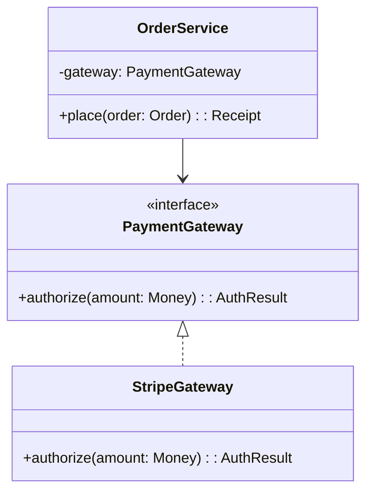

import Tabs from "@theme/Tabs";
import TabItem from "@theme/TabItem";
import Vs from "@site/src/components/Vs";
import Showcase from "@site/src/components/Showcase";
import Checklist from "@site/src/components/Checklist";
import Figure from "@site/src/components/Figure";

# Object-Oriented Programming

> "The basic idea of object-oriented programming is this: we're going to hide the state, and we're going to expose functions that operate on that state."
> — Robert C. Martin

Object-Oriented Programming (OOP) models complex systems as a collection of collaborating objects. Each object encapsulates its own state and exposes behavior through methods. Modern OOP emphasizes **composition over inheritance**, dependency inversion, and programming to interfaces to build modular, maintainable, and testable software.

## Core ideas

- **Encapsulation**: Hide internal data; expose stable behavior through methods.
- **Composition over Inheritance**: Build complex behavior by assembling smaller, focused objects rather than creating deep class hierarchies.
- **Polymorphism**: Program to interfaces (or abstract classes), not concrete implementations, allowing for interchangeable components.
- **Dependency Inversion**: High-level modules should not depend on low-level modules; both should depend on abstractions.

<Figure caption="A dependency-inverted design for an order service, programming to the PaymentGateway interface.">

</Figure>

## Examples (Composition + Interfaces)

<Tabs groupId="lang" queryString>
  <TabItem value="python" label="Python">
```python title="orders.py" showLineNumbers
from abc import ABC, abstractmethod
from dataclasses import dataclass

class PaymentGateway(ABC):
  @abstractmethod
  def authorize(self, amount: int) -> dict: ...

class StripeGateway(PaymentGateway):
  def authorize(self, amount: int) -> dict:
    return {"ok": True, "auth_code": "XYZ"}

@dataclass
class Order:
  user_id: str
  total_cents: int

class OrderService:
  def __init__(self, gateway: PaymentGateway):
    self._gateway = gateway

  def place(self, order: Order) -> dict:
    if order.total_cents <= 0:
      raise ValueError("invalid total")
    res = self._gateway.authorize(order.total_cents)
    if not res.get("ok"):
      raise RuntimeError("payment failed")
    return {"status": "PAID", "auth_code": res["auth_code"]}
```
  </TabItem>
  <TabItem value="go" label="Go">
```go title="orders.go" showLineNumbers
package orders

import "fmt"

type PaymentGateway interface {
  Authorize(amountCents int) (authCode string, ok bool)
}

type Order struct {
  UserID     string
  TotalCents int
}

type Service struct{ gateway PaymentGateway }

func NewService(g PaymentGateway) *Service { return &Service{gateway: g} }

func (s *Service) Place(o Order) (string, error) {
  if o.TotalCents <= 0 {
    return "", fmt.Errorf("invalid total")
  }
  code, ok := s.gateway.Authorize(o.TotalCents)
  if !ok {
    return "", fmt.Errorf("payment failed")
  }
  return code, nil
}
```
  </TabItem>
  <TabItem value="node" label="Node.js">
```javascript title="orderService.js" showLineNumbers
/** @typedef {{ authorize: (amountCents: number) => Promise<{ok:boolean, code?:string}> }} PaymentGateway */

export class OrderService {
  /** @param {PaymentGateway} gateway */
  constructor(gateway) {
    this.gateway = gateway
  }
  /** @param {{userId:string,totalCents:number}} order */
  async place(order) {
    if (order.total_cents <= 0) throw new Error("invalid total")
    const res = await this.gateway.authorize(order.totalCents)
    if (!res.ok) throw new Error("payment failed")
    return { status: "PAID", auth_code: res.code }
  }
}
```
  </TabItem>
</Tabs>

<Vs
  title="When to Use vs. When to Reconsider"
  items={[
    {
      label: "When to Use",
      points: [
        "**Modeling stable, stateful domains**: Excellent for systems with well-defined business entities (e.g., `Customer`, `Account`, `Policy`) that have both data and behavior.",
        "**Building complex, maintainable systems**: Encapsulation and clear boundaries help manage complexity in large applications like enterprise software or large-scale backend services.",
        "**Creating plug-in architectures**: Polymorphism allows you to define stable interfaces and swap out implementations, perfect for supporting different databases, payment gateways, or notification services.",
      ],
    },
    {
      label: "When to Reconsider",
      points: [
        "**High-concurrency data processing**: Managing state and locks can become a bottleneck. Functional or dataflow paradigms are often a better fit for parallel data pipelines.",
        "**Simple, stateless services**: The boilerplate of classes and interfaces can be overkill for simple functions or utilities that just transform data.",
        "**UI development with complex state**: Modern UI frameworks often favor functional and reactive patterns for managing UI state, which can be simpler than traditional object-oriented approaches.",
      ],
    },
  ]}
  highlight={0}
  highlightTone="positive"
/>

<Showcase
  title="Operational Considerations"
  sections={[
    {
      label: "State Management & Invariants",
      body: "Ensure objects are always in a valid state by enforcing invariants in the constructor. Private state should only be modified through public methods.",
    },
    {
      label: "Dependency Injection",
      body: "Inject dependencies (collaborators) via constructors to make classes testable and to decouple them from concrete implementations.",
    },
    {
      label: "Value Objects",
      body: "Use immutable value objects (e.g., `Money`, `EmailAddress`) instead of primitive types to enforce business rules and avoid primitive obsession.",
    },
  ]}
/>

<Checklist
  title="Design Review Checklist"
  items={[
    "Are dependencies injected and bound to interfaces, not concrete types?",
    "Is composition favored over deep or complex inheritance hierarchies?",
    "Do objects enforce their own invariants upon creation and during state transitions?",
    "Are responsibilities clearly segregated into small, cohesive classes (Single Responsibility Principle)?",
    "Can objects be easily tested in isolation by providing mock or stub dependencies?",
  ]}
/>

## Related topics

- [Domain-Driven Design](/docs/domain-driven-design)
- [Design Patterns](/docs/design-patterns)
- [SOLID Principles](/docs/core-design-and-programming-principles/solid)

## References

1.  <a
      href="https://www.oreilly.com/library/view/design-patterns-elements/0201633612/"
      target="_blank"
      rel="nofollow noopener noreferrer"
    >
      Design Patterns: Elements of Reusable Object-Oriented Software ↗️
    </a>
2.  <a
      href="https://www.oreilly.com/library/view/clean-architecture-a/9780134494166/"
      target="_blank"
      rel="nofollow noopener noreferrer"
    >
      Clean Architecture: A Craftsman's Guide to Software Structure and Design ↗️
    </a>
