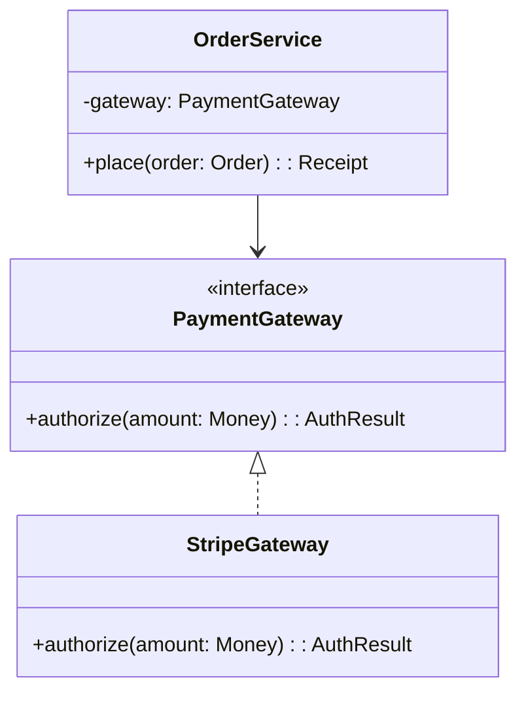
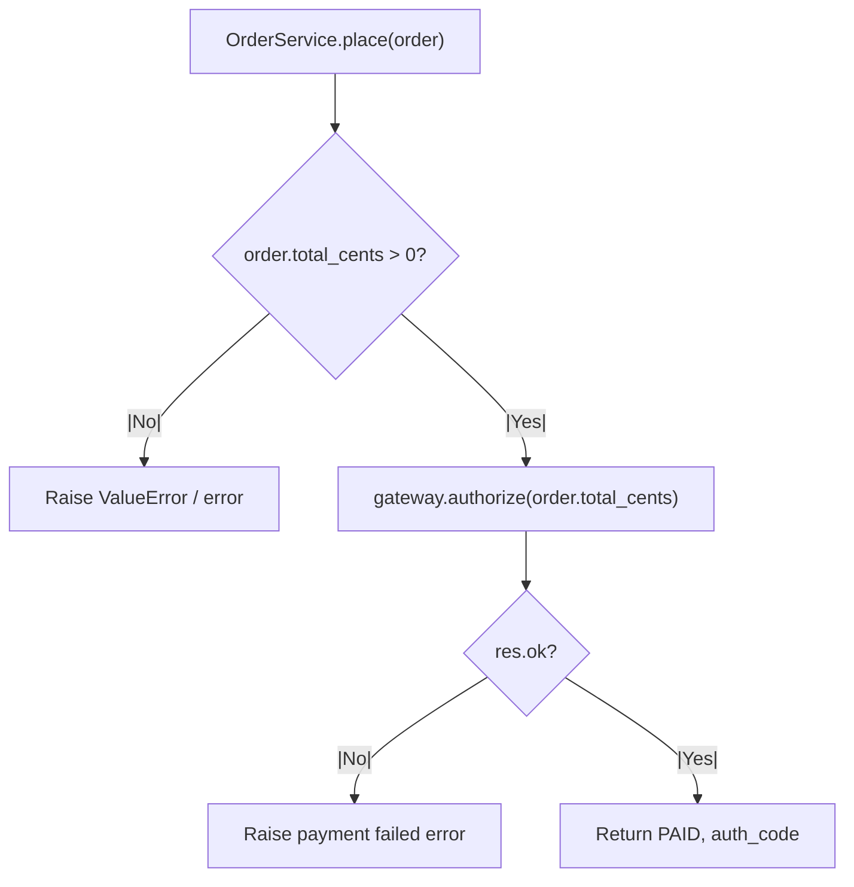

<Hero
  title="Object-Oriented Programming"
  description="Encapsulation, composition over inheritance, and programming to interfaces—how to apply OOP pragmatically"
  size="large"
/>

> "The basic idea of object-oriented programming is this: we're going to hide the state, and we're going to expose functions that operate on that state."
> — Robert C. Martin

Object-Oriented Programming (OOP) is a foundational paradigm for modeling software as a collection of collaborating objects, each encapsulating state and exposing behavior through methods. OOP is central to modern software engineering, enabling modularity, maintainability, and testability at scale. This article provides a comprehensive, end-to-end guide to OOP: its principles, trade-offs, real-world patterns, operational and security considerations, and practical implementation guidance. After reading, you will understand not only how OOP works, but when, why, and how to apply it for robust, production-grade systems.

## Scope and Boundaries

This article covers:

- Core OOP principles: encapsulation, composition, inheritance, polymorphism, dependency inversion
- Real-world design patterns and anti-patterns
- Practical code examples in Python, Go, and Node.js
- Decision models for when to use OOP (and when not to)
- Operational, security, and observability implications
- Design review checklist and related topics

Out of scope: deep dives into specific design patterns (see [Design Patterns](/docs/design-patterns)), language-specific OOP features, and advanced metaprogramming (see [Advanced Programming Concepts](/docs/foundational-concepts/programming-paradigms/functional)).

## Core Concepts

- **Encapsulation**: Internal state is hidden; only stable, public methods expose behavior.
- **Composition over Inheritance**: Prefer assembling small, focused objects over deep class hierarchies for flexibility and testability.
- **Polymorphism**: Program to interfaces or abstract types, enabling interchangeable components and plug-in architectures.
- **Dependency Inversion**: High-level modules depend on abstractions, not concrete implementations, decoupling system layers.
- **Inheritance**: Mechanism for code reuse, but should be used judiciously—favor composition for most cases.

<Figure caption="A dependency-inverted design for an order service, programming to the PaymentGateway interface.">

</Figure>

## OOP Call Flow Example (Order Placement)

<Figure caption="Order placement call flow: service delegates to gateway, handles errors, and returns result.">

</Figure>

## Practical Examples (Composition + Interfaces)

<Tabs groupId="lang" queryString>
  <TabItem value="python" label="Python">
```python title="orders.py" showLineNumbers
from abc import ABC, abstractmethod
from dataclasses import dataclass

class PaymentGateway(ABC):
    @abstractmethod
    def authorize(self, amount: int) -> dict:
        pass

class StripeGateway(PaymentGateway):
    def authorize(self, amount: int) -> dict:
        return {"ok": True, "auth_code": "XYZ"}

@dataclass
class Order:
    user_id: str
    total_cents: int

class OrderService:
    def __init__(self, gateway: PaymentGateway):
        self._gateway = gateway

    def place(self, order: Order) -> dict:
        if order.total_cents <= 0:
            raise ValueError("invalid total")
        res = self._gateway.authorize(order.total_cents)
        if not res.get("ok"):
            raise RuntimeError("payment failed")
        return {"status": "PAID", "auth_code": res["auth_code"]}
```
  </TabItem>
  <TabItem value="go" label="Go">
```go title="orders.go" showLineNumbers
package orders

import "fmt"

type PaymentGateway interface {
    Authorize(amountCents int) (authCode string, ok bool)
}

type Order struct {
    UserID     string
    TotalCents int
}

type Service struct {
    gateway PaymentGateway
}

func NewService(g PaymentGateway) *Service {
    return &Service{gateway: g}
}

func (s *Service) Place(o Order) (string, error) {
    if o.TotalCents <= 0 {
        return "", fmt.Errorf("invalid total")
    }
    code, ok := s.gateway.Authorize(o.TotalCents)
    if !ok {
        return "", fmt.Errorf("payment failed")
    }
    return code, nil
}
```
  </TabItem>
  <TabItem value="node" label="Node.js">
```javascript title="orderService.js" showLineNumbers
/**
 * @typedef {{ authorize: (amountCents: number) => Promise<{ok: boolean, code?: string}> }} PaymentGateway
 */

export class OrderService {
    /** @param {PaymentGateway} gateway */
    constructor(gateway) {
        this.gateway = gateway;
    }
    /** @param {{userId: string, totalCents: number}} order */
    async place(order) {
        if (order.totalCents <= 0) throw new Error("invalid total");
        const res = await this.gateway.authorize(order.totalCents);
        if (!res.ok) throw new Error("payment failed");
        return { status: "PAID", auth_code: res.code };
    }
}
```
  </TabItem>
</Tabs>

## Decision Matrix: OOP vs. Other Paradigms

| Use Case                                 | OOP Strength | Functional | Procedural | Dataflow |
|------------------------------------------|:------------:|:----------:|:----------:|:--------:|
| Modeling business entities & rules       |     ✅       |     ⚪     |     ⚪     |    ⚪    |
| Plug-in/strategy architectures           |     ✅       |     ⚪     |     ⚪     |    ⚪    |
| High-concurrency data processing         |     ⚪       |     ✅     |     ⚪     |    ✅    |
| Stateless utilities & pure transformations|     ⚪       |     ✅     |     ✅     |    ⚪    |
| UI with complex, reactive state          |     ⚪       |     ✅     |     ⚪     |    ⚪    |

Legend: ✅ = strong fit, ⚪ = possible fit

## Implementation Patterns, Pitfalls, and Anti-Patterns

- **Favor composition**: Use small, focused objects; avoid deep inheritance trees ([Composition Over Inheritance](/docs/core-design-and-programming-principles/general-principles/composition-over-inheritance)).
- **Program to interfaces**: Depend on abstractions, not concrete types ([Dependency Inversion](/docs/core-design-and-programming-principles/solid)).
- **Enforce invariants**: Objects should always be valid after construction and during state transitions.
- **Avoid God Objects**: Do not centralize too much responsibility in a single class ([God Object](/docs/anti-patterns-and-pitfalls/god-object-god-class)).
- **Beware Anemic Domain Models**: Business logic should live in domain objects, not just in services ([Anemic Domain Model](/docs/anti-patterns-and-pitfalls/anemic-domain-model)).
- **Testability**: Inject dependencies to enable mocking and isolation in tests.
- **Immutability for value objects**: Use immutable types for things like Money, Email, etc.

## Operational, Security, and Observability Considerations

<Showcase
  title="Operational Considerations"
  sections={[
    {
      label: "State Management & Invariants",
      body: "Ensure objects are always in a valid state by enforcing invariants in the constructor. Private state should only be modified through public methods."
    },
    {
      label: "Dependency Injection",
      body: "Inject dependencies (collaborators) via constructors to make classes testable and to decouple them from concrete implementations."
    },
    {
      label: "Value Objects",
      body: "Use immutable value objects (e.g., `Money`, `EmailAddress`) instead of primitive types to enforce business rules and avoid primitive obsession."
    },
    {
      label: "Security Boundaries",
      body: "Encapsulation helps prevent unauthorized access to sensitive state. Always validate inputs and enforce access controls at method boundaries."
    },
    {
      label: "Observability",
      body: "Expose key state transitions and errors via structured logs and metrics. Use correlation IDs for tracing object lifecycles in distributed systems."
    },
    {
      label: "Concurrency & Isolation",
      body: "Be cautious with shared mutable state. Use synchronization primitives or prefer immutable objects in concurrent scenarios."
    },
    {
      label: "Edge Cases",
      body: "Handle empty/null objects, large input sizes, and ensure idempotency where required."
    },
    {
      label: "Rollout & Change Safety",
      body: "Define SLOs/SLIs for critical flows, use canary releases or feature flags for risky changes, and document explicit rollback paths."
    }
  ]}
/>

## When to Use vs. When to Reconsider

<Vs highlight={[0, 1]} items={[
{
    label: "When to Use",
    points: [
      "**Modeling stable, stateful domains**: Excellent for systems with well-defined business entities (e.g., `Customer`, `Account`, `Policy`) that have both data and behavior.",
      "**Building complex, maintainable systems**: Encapsulation and clear boundaries help manage complexity in large applications like enterprise software or large-scale backend services."
    ],
    highlightTone: "positive"
  },
{
    label: "When to Use",
    points: [
      "**Creating plug-in architectures**: Polymorphism allows you to define stable interfaces and swap out implementations, perfect for supporting different databases, payment gateways, or notification services."
    ],
    highlightTone: "warning"
  }
]} />

## Related topics

- [Domain-Driven Design](/docs/domain-driven-design)
- [Design Patterns](/docs/design-patterns)
- [SOLID Principles](/docs/core-design-and-programming-principles/solid)
- [Composition Over Inheritance](/docs/core-design-and-programming-principles)
- [God Object](/docs/anti-patterns-and-pitfalls/god-object-god-class)
- [Anemic Domain Model](/docs/anti-patterns-and-pitfalls/anemic-domain-model)

## Design Patterns for OOP

### Strategy Pattern

Encapsulate algorithms so they can be swapped at runtime.

```python
# Without strategy: Hard-wired payment logic
class Order:
    def pay_by_credit_card(self, card):
        # Charge card logic
        pass

    def pay_by_paypal(self, account):
        # PayPal logic
        pass

    def pay_by_apple_pay(self, token):
        # Apple Pay logic
        pass

# With strategy: Swap payment methods at runtime
class PaymentStrategy:
    def execute(self, amount):
        raise NotImplementedError

class CreditCardPayment(PaymentStrategy):
    def __init__(self, card):
        self.card = card

    def execute(self, amount):
        # Charge card
        return self.card.charge(amount)

class Order:
    def __init__(self, payment_strategy):
        self.payment_strategy = payment_strategy

    def pay(self, amount):
        return self.payment_strategy.execute(amount)

# Usage: Strategy swapped based on user preference
if user.preferred_payment == 'credit_card':
    strategy = CreditCardPayment(user.card)
else:
    strategy = PaypalPayment(user.paypal_account)

order = Order(strategy)
order.pay(100)
```

### Observer Pattern

Notify multiple objects when something changes.

```python
# Without observer: Tight coupling
class UserService:
    def create_user(self, name, email):
        user = User(name, email)
        # Save to database
        db.insert(user)

        # Now what? Email service needs to send welcome email
        # But UserService shouldn't know about EmailService
        # And if we add SMS notifications, we have to modify UserService again

# With observer: Loose coupling
class Observer(ABC):
    @abstractmethod
    def update(self, user):
        pass

class EmailObserver(Observer):
    def update(self, user):
        send_welcome_email(user.email)

class SMSObserver(Observer):
    def update(self, user):
        send_welcome_sms(user.phone)

class UserService:
    def __init__(self):
        self.observers = []

    def register_observer(self, observer):
        self.observers.append(observer)

    def create_user(self, name, email):
        user = User(name, email)
        db.insert(user)

        # Notify all observers
        for observer in self.observers:
            observer.update(user)

# Usage: Add observers without modifying UserService
service = UserService()
service.register_observer(EmailObserver())
service.register_observer(SMSObserver())
service.create_user("Alice", "alice@example.com")
# Both observers are notified automatically
```

## Advanced OOP Concepts

### Inheritance Misuse

```python
# BAD: Inheritance for code reuse
class Bird:
    def fly(self):
        return "flying"

class Penguin(Bird):  # Penguins don't fly!
    def fly(self):
        raise NotImplementedError("Penguins can't fly")

# GOOD: Composition
class Bird:
    def __init__(self, flyer):
        self.flyer = flyer

    def move(self):
        return self.flyer.move()

class FlyingBird(Bird):
    def __init__(self):
        super().__init__(FlyingMover())

class Penguin(Bird):
    def __init__(self):
        super().__init__(SwimmingMover())  # Waddles and swims
```

### Value Objects vs. Entities

```python
# Value Object: identity doesn't matter, immutable
@dataclass(frozen=True)
class Money:
    amount: int
    currency: str

    def add(self, other):
        if self.currency != other.currency:
            raise ValueError("Cannot add different currencies")
        return Money(self.amount + other.amount, self.currency)

# Entity: identity matters, mutable
class Account:
    def __init__(self, account_id, owner, balance: Money):
        self.account_id = account_id
        self.owner = owner
        self._balance = balance

    def withdraw(self, amount: Money):
        if amount.amount > self._balance.amount:
            raise ValueError("Insufficient funds")
        self._balance = self._balance.add(Money(-amount.amount, amount.currency))

# Usage
money1 = Money(100, "USD")
money2 = Money(100, "USD")
money1 == money2  # True: value objects compare by value

account1 = Account("123", "Alice", Money(1000, "USD"))
account2 = Account("123", "Alice", Money(1000, "USD"))
account1 == account2  # False: entities compare by identity (even same data)
```

### Dependency Injection

```python
# Tight coupling (BAD)
class OrderService:
    def __init__(self):
        self.payment_gateway = StripeGateway()  # Hard-wired dependency

    def place_order(self, order):
        self.payment_gateway.charge(order.total)

# Dependency injection (GOOD)
class OrderService:
    def __init__(self, payment_gateway):  # Injected
        self.payment_gateway = payment_gateway

    def place_order(self, order):
        self.payment_gateway.charge(order.total)

# Testable: inject mock for testing
@pytest.fixture
def mock_gateway():
    class MockGateway:
        def charge(self, amount):
            return {"status": "success"}
    return MockGateway()

def test_place_order(mock_gateway):
    service = OrderService(mock_gateway)
    order = Order(total_cents=9999)
    result = service.place_order(order)
    assert result["status"] == "success"
```

### Single Responsibility Principle (SRP)

```python
# BAD: Multiple responsibilities
class User:
    def __init__(self, name, email):
        self.name = name
        self.email = email

    def validate_email(self):
        return "@" in self.email

    def save_to_database(self):
        # Database code here
        pass

    def send_welcome_email(self):
        # Email code here
        pass

# GOOD: Single responsibility
class User:
    def __init__(self, name, email):
        self.name = name
        self.email = email

class UserValidator:
    def is_valid(self, user):
        return "@" in user.email

class UserRepository:
    def save(self, user):
        # Database code
        pass

class EmailService:
    def send_welcome(self, user):
        # Email code
        pass
```

## Self-Check

1. **Identify**: In your code, find a class that does more than one thing. How could you separate responsibilities?

2. **Composition**: Find inheritance that should be composition. Can you refactor it?

3. **Dependencies**: Are your classes tightly coupled to concrete implementations? Could dependency injection improve testability?

4. **Immutability**: Which of your objects should be immutable? (Value objects, records, data classes)

5. **Encapsulation**: What internal state is exposed that shouldn't be? Can you make it private?

:::info
**One Takeaway**: OOP is powerful for modeling stateful, complex domains—business entities, rules, workflows. But it's not the answer to every problem. Master encapsulation, composition, and dependency inversion. Know when to use inheritance (rarely) and when to use composition (usually). Test your objects in isolation by injecting dependencies. A well-designed OOP system is a joy to extend; a poorly designed one is a maintenance nightmare.

:::

## Next Steps

- Study [Design Patterns](/docs/design-patterns) for common OOP solutions
- Learn [SOLID Principles](/docs/core-design-and-programming-principles/solid) for robust object design
- Explore [Domain-Driven Design](/docs/domain-driven-design) for modeling complex business domains
- Review [Anti-Patterns](/docs/anti-patterns-and-pitfalls) to avoid common OOP mistakes

## References

1. <a href="https://www.oreilly.com/library/view/design-patterns-elements/0201633612/" target="_blank" rel="nofollow noopener noreferrer">Design Patterns: Elements of Reusable Object-Oriented Software ↗️</a>
2. <a href="https://www.oreilly.com/library/view/clean-architecture-a/9780134494272/" target="_blank" rel="nofollow noopener noreferrer">Clean Architecture: A Craftsman's Guide to Software Structure and Design ↗️</a>
3. <a href="https://martinfowler.com/bliki/AnemicDomainModel.html" target="_blank" rel="nofollow noopener noreferrer">Anemic Domain Model (Martin Fowler) ↗️</a>
4. <a href="https://refactoring.guru/design-patterns" target="_blank" rel="nofollow noopener noreferrer">Refactoring Guru: Design Patterns ↗️</a>
5. <a href="https://www.domainlanguage.com/ddd/" target="_blank" rel="nofollow noopener noreferrer">Domain-Driven Design by Eric Evans ↗️</a>
