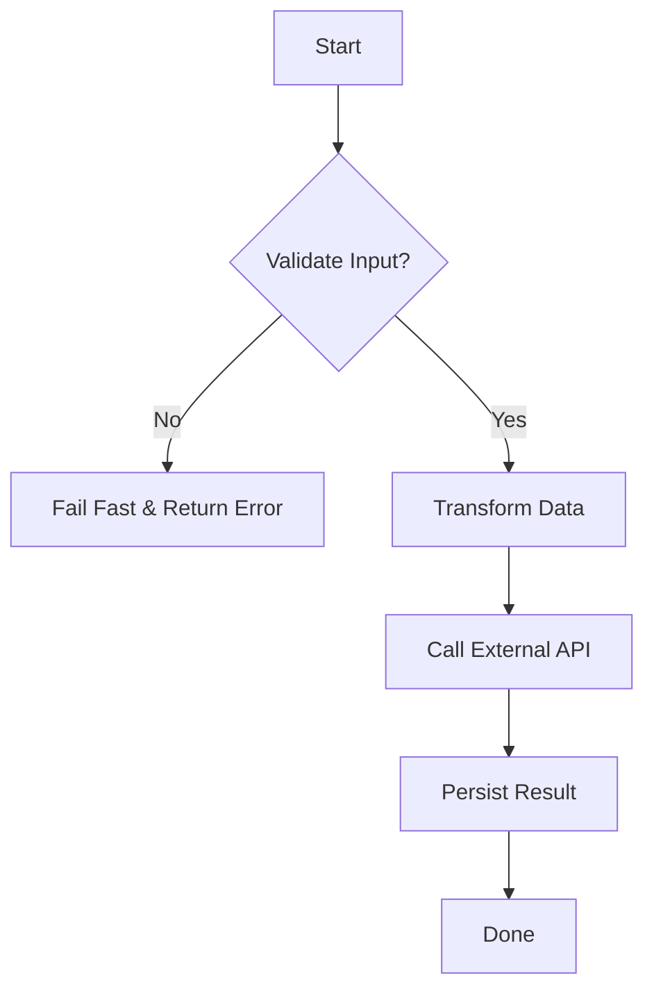

# Procedural / Structured

Procedural programming, enhanced by structured principles, is the bedrock of imperative coding. It organizes software into a linear sequence of procedures or functions that operate on data. By enforcing clear control flow constructs—sequence, selection (if/else), and iteration (loops)—it eliminates the chaotic "spaghetti code" of older, `goto`-based styles. This paradigm is direct, explicit, and highly effective for tasks with a clear, step-by-step process, making it a go-to for scripts, command-line tools, and foundational services.

> "The essence of structured programming is to control complexity through disciplined use of a few basic control structures and a process of stepwise refinement."
> — Niklaus Wirth

import Tabs from "@theme/Tabs";
import TabItem from "@theme/TabItem";
import Vs from "@site/src/components/Vs";
import Showcase from "@site/src/components/Showcase";
import Checklist from "@site/src/components/Checklist";
import Figure from '@site/src/components/Figure';

<Figure caption="A typical procedural flow for processing a payment.">

</Figure>

## Core ideas

- **Modularity**: Break programs into reusable functions that perform a single task.
- **Control Flow**: Use structured constructs (sequence, selection, iteration) to create clear, predictable execution paths.
- **Data Flow**: Pass data explicitly through function parameters and return values to minimize side effects.


## Examples

<Tabs groupId="lang" queryString>
  <TabItem value="python" label="Python">

```python title="process_payment.py" showLineNumbers
from typing import Any, Dict

def validate(payload: Dict[str, Any]) -> bool:
    required = {"user_id", "amount"}
    return required.issubset(payload) and float(payload["amount"]) > 0

def transform(payload: Dict[str, Any]) -> Dict[str, Any]:
    return {**payload, "amount_cents": int(float(payload["amount"]) * 100)}

def call_gateway(data: Dict[str, Any]) -> Dict[str, Any]:  # Simulates requests.post(...)
    return {"ok": True, "auth_code": "XYZ"}

def persist(result: Dict[str, Any]) -> None:  # Simulates insert into DB
    pass

def process_payment(payload: Dict[str, Any]) -> str:
    if not validate(payload):
        raise ValueError("invalid input")
    data = transform(payload)
    resp = call_gateway(data)
    if not resp.get("ok"):
        raise RuntimeError("gateway failed")
    persist({**data, **resp})
    return resp["auth_code"]
```

  </TabItem>
  <TabItem value="go" label="Go">

```go title="process_payment.go" showLineNumbers
package main

import (
    "errors"
)

type Payload struct {
    UserID string
    Amount float64
}

func validate(p Payload) bool {
    return p.UserID != "" && p.Amount > 0
}

func transform(p Payload) map[string]interface{} {
    return map[string]interface{}{
        "user_id":      p.UserID,
        "amount_cents": int(p.Amount * 100),
    }
}

func callGateway(data map[string]interface{}) (map[string]interface{}, error) {
    return map[string]interface{}{"ok": true, "auth_code": "XYZ"}, nil
}

func persist(result map[string]interface{}) error { return nil }

func ProcessPayment(p Payload) (string, error) {
    if !validate(p) {
        return "", errors.New("invalid input")
    }
    data := transform(p)
    resp, err := callGateway(data)
    if err != nil || resp["ok"] == false {
        return "", errors.New("gateway failed")
    }
    if err := persist(resp); err != nil {
        return "", err
    }
    return resp["auth_code"].(string), nil
}
```

  </TabItem>
  <TabItem value="node" label="Node.js">

```javascript title="processPayment.js" showLineNumbers
function validate(payload) {
    return Boolean(payload.user_id) && Number(payload.amount) > 0
}

function transform(payload) {
    return { ...payload, amount_cents: Math.trunc(Number(payload.amount) * 100) }
}

async function callGateway(data) { return { ok: true, auth_code: "XYZ" } }
async function persist(result) { /* insert into DB */ }

export async function processPayment(payload) {
    if (!validate(payload)) throw new Error("invalid input")
    const data = transform(payload)
    const resp = await callGateway(data)
    if (!resp.ok) throw new Error("gateway failed")
    await persist({ ...data, ...resp })
    return resp.auth_code
}
```

  </TabItem>
</Tabs>

<Vs
  title="When to Use vs. When to Reconsider"
  items={[
    {
      label: "When to Use",
      points: [
        "**Linear, predictable workflows**: Ideal for tasks that follow a clear sequence, like data processing scripts or build automation.",
        "**Small to medium-sized applications**: Simplicity and directness make it easy for small teams to build and maintain CLIs, utilities, and simple services.",
        "**Performance-critical computations**: Low overhead and direct control over execution flow can be beneficial for numerical and scientific computing.",
      ],
    },
    {
      label: "When to Reconsider",
      points: [
        "**Complex state management**: As shared mutable state grows, it becomes difficult to track dependencies and prevent race conditions.",
        "**Large, evolving systems**: Without the strong encapsulation of OOP or the composition of FP, codebases can become tightly coupled and hard to refactor.",
        "**Concurrent or asynchronous applications**: Managing concurrent operations often requires more advanced paradigms like event-driven or actor-based models.",
      ],
    },
  ]}
  highlight={0}
  highlightTone="positive"
/>

<Showcase
  title="Operational Considerations"
  sections={[
    {
      label: "IO at the Edges",
      body: "Keep core logic pure by isolating side effects (disk, network, database) at the beginning or end of a procedure. Pass data, not connections, into functions.",
    },
    {
      label: "State Management",
      body: "Minimize shared mutable state. If state is necessary, keep its scope as small as possible to prevent unintended side effects and simplify testing.",
    },
    {
      label: "Error Handling",
      body: "Validate inputs early and adopt a consistent error-handling strategy, such as returning error codes or using exceptions, to ensure predictable failure modes.",
    },
  ]}
/>

<Checklist
  title="Design Review Checklist"
  items={[
    "Does each function have a single, clear responsibility?",
    "Is shared or global state avoided wherever possible?",
    "Are function inputs and outputs well-defined and predictable?",
    "Is error handling explicit and consistent across all procedures?",
    "Can the procedural flow be easily tested as a series of unit-testable functions?",
  ]}
/>

## Related topics

- [Core Design & Programming Principles](/docs/core-design-and-programming-principles)
- [Design Patterns](/docs/design-patterns)
- [Testing Strategy](/docs/testing-strategy)

## References

1.  <a
      href="https://en.wikipedia.org/wiki/Structured_programming"
      target="_blank"
      rel="nofollow noopener noreferrer"
    >
      Structured Programming (Wikipedia) ↗️
    </a>
2.  <a
      href="https://github.com/ryanmcdermott/clean-code-javascript"
      target="_blank"
      rel="nofollow noopener noreferrer"
    >
      Clean Code Principles (Free Summary) ↗️
    </a>
