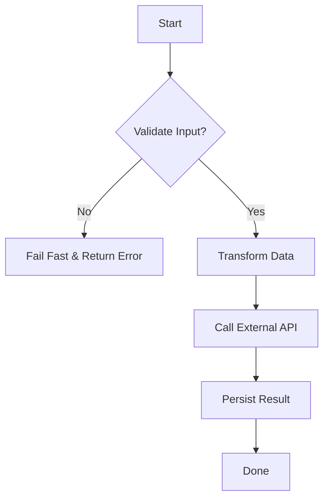
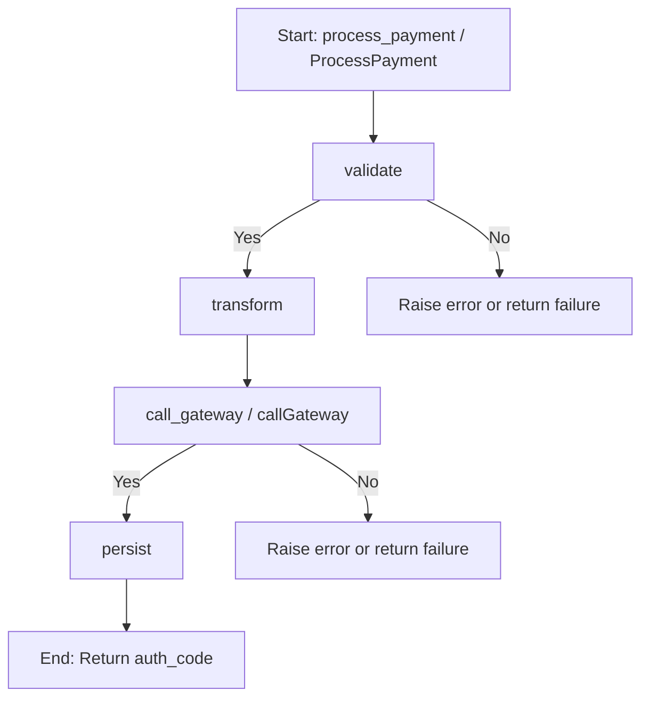

# Procedural / Structured

Procedural programming, enhanced by structured principles, is the bedrock of imperative coding. It organizes software into a linear sequence of procedures or functions that operate on data. By enforcing clear control flow constructs—sequence, selection (if/else), and iteration (loops)—it eliminates the chaotic "spaghetti code" of older, `goto`-based styles. This paradigm is direct, explicit, and highly effective for tasks with a clear, step-by-step process, making it a go-to for scripts, command-line tools, and foundational services.

**Scope and Boundaries**

Procedural/structured programming is foundational for all imperative languages and underpins many modern systems. It is best suited for workflows that are linear, predictable, and where state transitions are explicit and easy to follow. This paradigm is not intended for highly concurrent, event-driven, or stateful systems with complex object relationships—those are better addressed by [Object-Oriented](./object-oriented) or [Functional](./functional) paradigms. Here, we focus on the strengths, trade-offs, and operational realities of procedural/structured approaches.

> "The essence of structured programming is to control complexity through disciplined use of a few basic control structures and a process of stepwise refinement."
> — Niklaus Wirth

import Tabs from "@theme/Tabs";
import TabItem from "@theme/TabItem";
import Vs from "@site/src/components/Vs";
import Showcase from "@site/src/components/Showcase";
import Checklist from "@site/src/components/Checklist";
import Figure from '@site/src/components/Figure';

<Figure caption="A typical procedural flow for processing a payment.">

</Figure>


## Core Ideas

- **Modularity**: Break programs into reusable functions that perform a single, well-defined task. This enables easier testing, maintenance, and reuse.
- **Control Flow**: Use structured constructs (sequence, selection, iteration) to create clear, predictable execution paths. Avoid unstructured jumps (e.g., `goto`).
- **Data Flow**: Pass data explicitly through function parameters and return values to minimize side effects and global state.
- **Stepwise Refinement**: Decompose problems into smaller, manageable procedures, refining each step until the solution is clear and testable.
- **Explicit State**: State is managed through local variables and function arguments, not hidden in objects or closures.


## Practical Examples and Real-World Scenarios

<Figure caption="Sequential call flow for the payment processing example (applies to Python, Go, and Node.js tabs below).">

</Figure>


<Tabs groupId="lang" queryString>
  <TabItem value="python" label="Python">

```python title="process_payment.py" showLineNumbers
from typing import Any, Dict

def validate(payload: Dict[str, Any]) -> bool:
    required = {"user_id", "amount"}
    return required.issubset(payload) and float(payload["amount"]) > 0

def transform(payload: Dict[str, Any]) -> Dict[str, Any]:
    return {**payload, "amount_cents": int(float(payload["amount"]) * 100)}

def call_gateway(data: Dict[str, Any]) -> Dict[str, Any]:
    # Simulates requests.post(...)
    return {"ok": True, "auth_code": "XYZ"}

def persist(result: Dict[str, Any]) -> None:
    # Simulates insert into DB
    pass

def process_payment(payload: Dict[str, Any]) -> str:
    if not validate(payload):
        raise ValueError("invalid input")
    data = transform(payload)
    resp = call_gateway(data)
    if not resp.get("ok"):
        raise RuntimeError("gateway failed")
    persist({**data, **resp})
    return resp["auth_code"]
```

  </TabItem>
  <TabItem value="go" label="Go">

```go title="process_payment.go" showLineNumbers
package main

import (
    "errors"
)

type Payload struct {
    UserID string
    Amount float64
}

func validate(p Payload) bool {
    return p.UserID != "" && p.Amount > 0
}

func transform(p Payload) map[string]interface{} {
    return map[string]interface{}{
        "user_id":      p.UserID,
        "amount_cents": int(p.Amount * 100),
    }
}

func callGateway(data map[string]interface{}) (map[string]interface{}, error) {
    // Simulates external API call
    return map[string]interface{}{"ok": true, "auth_code": "XYZ"}, nil
}

func persist(result map[string]interface{}) error {
    // Simulates DB insert
    return nil
}

func ProcessPayment(p Payload) (string, error) {
    if !validate(p) {
        return "", errors.New("invalid input")
    }
    data := transform(p)
    resp, err := callGateway(data)
    if err != nil || resp["ok"] == false {
        return "", errors.New("gateway failed")
    }
    if err := persist(resp); err != nil {
        return "", err
    }
    return resp["auth_code"].(string), nil
}
```

  </TabItem>
  <TabItem value="node" label="Node.js">

```javascript title="processPayment.js" showLineNumbers
function validate(payload) {
    return Boolean(payload.user_id) && Number(payload.amount) > 0;
}

function transform(payload) {
    return { ...payload, amount_cents: Math.trunc(Number(payload.amount) * 100) };
}

async function callGateway(data) {
    // Simulates external API call
    return { ok: true, auth_code: "XYZ" };
}

async function persist(result) {
    // Simulates DB insert
}

export async function processPayment(payload) {
    if (!validate(payload)) throw new Error("invalid input");
    const data = transform(payload);
    const resp = await callGateway(data);
    if (!resp.ok) throw new Error("gateway failed");
    await persist({ ...data, ...resp });
    return resp.auth_code;
}
```

  </TabItem>
</Tabs>

**Real-World Scenarios:**

- **Batch Data Processing:** ETL jobs, log parsing, and data migration scripts are often written procedurally for clarity and reliability.
- **System Utilities:** Command-line tools, backup/restore scripts, and monitoring agents benefit from the directness of procedural flow.
- **Embedded Systems:** Many firmware and device drivers use procedural logic for deterministic control and resource efficiency.

## Testing strategy

- **Unit tests**: Validate each function (`validate`, `transform`, `call_gateway`/`callGateway`, `persist`) independently with happy paths and error cases.
- **Input validation**: Include table-driven tests for boundary values (zero/negative amounts, missing fields) to ensure failures are explicit and deterministic.
- **Contract tests**: If `call_gateway` talks to an external API, define a contract (fixtures/schemas) and verify both success and failure payloads to catch drift.
- **Integration tests**: Exercise `process_payment` end-to-end using test doubles for the gateway and persistence; assert idempotency on retries.
- **Observability assertions**: Verify that errors and key decisions emit structured logs/metrics for traceability.

## Edge cases and pitfalls

- **Global State:** Overuse of global variables can lead to hidden dependencies and bugs. Always prefer passing state explicitly.
- **Error Propagation:** Without a consistent error-handling strategy, failures may be silently ignored or mishandled.
- **Concurrency:** Procedural code is not inherently safe for concurrent execution; shared state must be protected or avoided.


<Vs
  title="When to Use vs. When to Reconsider"
  items={[
    {
      label: "When to Use",
      points: [
        "**Linear, predictable workflows**: Ideal for tasks that follow a clear sequence, like data processing scripts, ETL pipelines, or build automation.",
        "**Small to medium-sized applications**: Simplicity and directness make it easy for small teams to build and maintain CLIs, utilities, and simple services.",
        "**Performance-critical computations**: Low overhead and direct control over execution flow can be beneficial for numerical and scientific computing.",
        "**Deterministic logic**: When you need to guarantee the same output for the same input, procedural code is easy to reason about and test.",
      ],
    },
    {
      label: "When to Reconsider",
      points: [
        "**Complex state management**: As shared mutable state grows, it becomes difficult to track dependencies and prevent race conditions. Consider [Object-Oriented](./object-oriented) or [Functional](./functional) approaches.",
        "**Large, evolving systems**: Without the strong encapsulation of OOP or the composition of FP, codebases can become tightly coupled and hard to refactor.",
        "**Concurrent or asynchronous applications**: Managing concurrent operations often requires more advanced paradigms like event-driven or actor-based models.",
        "**Domain complexity**: If your domain logic is deeply hierarchical or requires polymorphism, procedural code can become unwieldy.",
      ],
    },
  ]}
  highlight={0}
  highlightTone="positive"
/>


<Showcase
  title="Operational Considerations"
  sections={[
    {
      label: "IO at the Edges",
      body: "Keep core logic pure by isolating side effects (disk, network, database) at the beginning or end of a procedure. Pass data, not connections, into functions. This makes core logic easier to test and reason about.",
    },
    {
      label: "State Management",
      body: "Minimize shared mutable state. If state is necessary, keep its scope as small as possible to prevent unintended side effects and simplify testing. Use local variables and function arguments instead of globals.",
    },
    {
      label: "Error Handling",
      body: "Validate inputs early and adopt a consistent error-handling strategy, such as returning error codes or using exceptions, to ensure predictable failure modes. Document all error paths.",
    },
    {
      label: "Observability",
      body: "Instrument procedures with logging at key decision points and errors. Use structured logs and correlation IDs for traceability. Metrics can be added for performance-critical paths.",
      tone: "info"
    },
    {
      label: "Security & Privacy",
      body: "Procedural code should validate and sanitize all inputs to prevent injection attacks. Avoid leaking sensitive data in logs or error messages. Limit access to secrets and credentials to the smallest possible scope.",
      tone: "warning"
    },
    {
      label: "Rollout & Rollback",
      body: "Procedural scripts and utilities should support idempotency and safe retries. For critical operations, implement checkpoints or transaction logs to enable safe rollback.",
      tone: "info"
    },
  ]}
/>


<Checklist
  title="Design Review Checklist"
  items={[
    "Does each function have a single, clear responsibility?",
    "Is shared or global state avoided wherever possible?",
    "Are function inputs and outputs well-defined and predictable?",
    "Is error handling explicit and consistent across all procedures?",
    "Can the procedural flow be easily tested as a series of unit-testable functions?",
    "Are all side effects (IO, network, DB) isolated at the edges?",
    "Is input validation performed early and thoroughly?",
    "Are error paths and edge cases (empty/null, retries, timeouts) handled?",
    "Is sensitive data protected and not leaked in logs or errors?",
    "Are observability hooks (logs, metrics) present for key operations?",
    "Is the code easy to refactor and extend for new requirements?",
  ]}
/>


## Related topics

- [Core Design & Programming Principles](../../core-design-and-programming-principles)
- [Object-Oriented](./object-oriented)
- [Functional](./functional)
- [Testing Strategy](../../testing-strategy)
- [Design Patterns](../../design-patterns)


## References

1.  <a
      href="https://en.wikipedia.org/wiki/Structured_programming"
      target="_blank"
      rel="nofollow noopener noreferrer"
    >
      Structured Programming (Wikipedia) ↗️
    </a>
2.  <a
      href="https://github.com/ryanmcdermott/clean-code-javascript"
      target="_blank"
      rel="nofollow noopener noreferrer"
    >
      Clean Code Principles (Free Summary) ↗️
    </a>
3.  <a
      href="https://www.cs.utexas.edu/users/EWD/ewd02xx/EWD249.PDF"
      target="_blank"
      rel="nofollow noopener noreferrer"
    >
      Dijkstra: Notes on Structured Programming (PDF) ↗️
    </a>
4.  <a
      href="https://refactoring.guru/design-patterns/procedural"
      target="_blank"
      rel="nofollow noopener noreferrer"
    >
      Refactoring.Guru: Procedural Programming ↗️
    </a>
