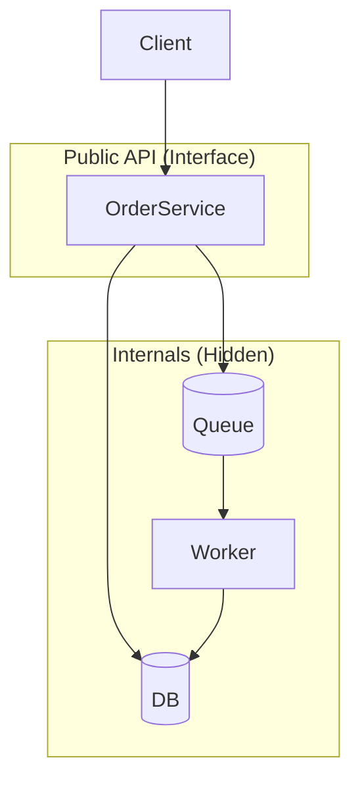
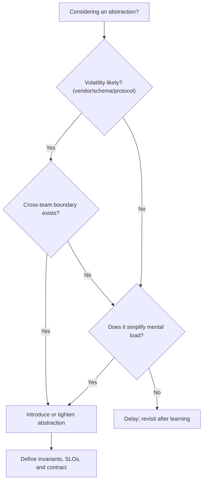

# Abstractions & Encapsulation

import Showcase from "@site/src/components/Showcase";
import Vs from "@site/src/components/Vs";

Abstraction simplifies by focusing on the essential. Encapsulation enforces boundaries by hiding internals. Together, they reduce coupling, protect invariants, and enable change.

## Scope and boundaries

- Scope: conceptual guidance and practical patterns for defining abstractions and encapsulating variability.
- Out of scope: language-specific features; see [Core Design & Programming Principles](../../core-design-and-programming-principles/) for SOLID and related principles.

## Core ideas

- Abstraction: expose what consumers need; omit details they don’t.
- Encapsulation: prevent direct access to internals; enforce invariants through interfaces.
- Stable abstractions: evolve behavior compatibly; separate policy from mechanism.

### What “good” looks like

- Narrow surface area with coherent operations (do one thing well).
- Strong invariants at the boundary (validate early, fail fast with clear errors).
- Information hiding: consumers can’t rely on volatile details (schemas, vendors, file layout).
- Replaceable internals: swap storage/transport without consumer changes.
- Measurable contracts: latency/throughput envelopes and error modes are explicit.



## Practical examples

- Repository abstraction: hides data access specifics; switch from Postgres to a read model without leaking.
- Payment gateway port: encapsulates HTTP details; swap providers behind a stable interface. See [Hexagonal / Ports & Adapters](../../architectural-styles/hexagonal-ports-and-adapters).

### Example: module facade with enforced invariants (TypeScript)

```ts title="orders/index.ts" showLineNumbers
// Public facade: only re-export stable types and functions
export type { Order, CreateOrderInput } from './model';
export { createOrder } from './service';
// Note: repositories, mappers, and HTTP clients remain private (not exported)
```

```ts title="orders/service.ts" showLineNumbers
import { repo } from './repo';
import type { CreateOrderInput, Order } from './model';

export async function createOrder(input: CreateOrderInput): Promise<Order> {
  assertValid(input); // boundary validation enforces invariants
  const exists = await repo.exists(input.id);
  if (exists) throw new ConflictError('order_exists');
  const stored = await repo.save(mapToRecord(input));
  return mapToPublic(stored);
}
```

```json title="package.json (excerpt)" showLineNumbers
{
  "name": "@acme/orders",
  "exports": {
    ".": "./dist/index.js"
  },
  "types": "./dist/index.d.ts"
}
```

This keeps implementation files unaddressable by consumers, enforcing encapsulation at package level.

## Patterns and pitfalls

- Favor composition over inheritance when adding behavior. See [Composition Over Inheritance](../../core-design-and-programming-principles/general-principles/composition-over-inheritance)
- Avoid over-abstracting; too many layers harm readability. See [Over-Abstracting / Too Many Layers](../../anti-patterns-and-pitfalls/over-abstracting-too-many-layers)
- Encapsulate what varies: create boundaries around churn-heavy parts (e.g., vendors, schemas, auth providers).

Additional guidance

- Prefer “seams” at protocol/provider boundaries (payment, email, storage) and domain seams (policy vs mechanism).
- Don’t abstract the unproven: let duplication live until variation is understood.
- Use adapters at the edges; keep your core in domain language, not vendor types.

Common anti-patterns

- Leaky abstractions: exposing DB columns, HTTP codes, or vendor error objects through public APIs.
- Anemic façades: pass-through layers providing no invariants or simplification.
- Generic “manager/service/util” types with unclear responsibilities.

## When to use

- Libraries/SDKs, cross-team APIs, plugin points, and domain seams.

## When not to use

- Simple scripts or prototypes where indirection slows learning.

## Related topics

- [Interfaces & Contracts](./interfaces-and-contracts)
- [Separation of Concerns (SoC)](../../core-design-and-programming-principles/general-principles/separation-of-concerns)
- [High Cohesion, Low Coupling](../../core-design-and-programming-principles/general-principles/high-cohesion-low-coupling)

## Decision guide: introduce or tighten an abstraction?



- Volatility: does the underlying choice change (vendors, schemas, protocols)?
- Cross-team boundary: will consumers integrate independently from implementers?
- Invariant strength: can we meaningfully enforce constraints at the boundary?
- Complexity: does a boundary simplify consumer mental load and testing?
- Observability: can we measure the boundary’s SLOs and error modes?

If “yes” to 3+ items, introduce or strengthen the abstraction.

<Showcase
  title="Boundary review (quick cues)"
  sections={[
    {
      label: "Invariants",
      body: (
        <>
          Validate inputs at the facade; surface clear, stable errors. Keep
          invariants centralized and testable.
        </>
      ),
      tone: "info",
    },
    {
      label: "Replaceability",
      body: (
        <>
          Can you swap storage/transport/providers without changing public
          types? If not, you’re leaking internals.
        </>
      ),
    },
    {
      label: "Metrics",
      body: (
        <>
          Define facade-level SLIs (success rate, P95 latency); add correlation
          IDs to track requests end-to-end.
        </>
      ),
    },
  ]}
/>

## Encapsulation techniques (language-agnostic)

- Package-level exports: only export façades; keep internals unexported/private.
- Process boundaries: encapsulate via service/process; expose API/protocol, not internals.
- Type boundaries: map external/vendor types to your domain types at the edge.
- Access modifiers and modules: use private/internal/"internal" packages (e.g., Go internal/, Java modules).
- Data hiding: avoid exposing mutable structures; prefer immutable views or copies.

## Testing and verification

- Black-box tests at the facade: assert invariants and observable behavior only.
- Characterization tests around legacy internals before refactors.
- Contract tests at seams (ports/adapters) to prevent leakage of vendor details.
- Mutation tests or error injection to validate invariants hold under fault.

```yaml title="ci.yaml (excerpt)" showLineNumbers
jobs:
  verify_boundary:
    steps:
      - run: npm run test:public # only tests under tests/public/**
      - run: oas-diff --fail-on-breaking old.yaml new.yaml # if API exposed
```

## Operational considerations

- SLOs: define facade-level latency bands (e.g., P95 ≤ 200ms) and success rate.
- Rollouts: hide provider swaps behind feature flags; use canaries; dual-write/read to validate.
- Limits: document payload ceilings, rate limits/quotas; enforce with backpressure.

## Security, privacy, and compliance

- Enforce authn/authz at the facade; prefer least-privilege to internals.
- Classify data (PII/PCI) crossing the boundary; scrub in logs and error payloads.
- Protect secrets in configuration; rotate credentials without consumer impact.

## Observability

- Include correlation IDs; add semantic logs at boundary with stable error codes.
- Expose metrics: request rate, success rate, P50/P95/P99 latency, saturation.
- Trace key steps across adapters; annotate provider choices for diagnosis.

## Design review checklist

- Facade exposes coherent operations and hides internals; no leaking vendor types.
- Boundary validates inputs and enforces invariants with clear, stable errors.
- Replaceability proven via adapter: provider swap requires no consumer changes.
- Contract documented: schemas, error envelope, SLOs, limits/quotas.
- Observability in place: correlation IDs, metrics, traces at the facade.
- Security reviewed: authn/authz model, data classification, secrets handling.
- Rollout strategy: flags/canaries; rollback is safe and fast.
- Tests cover facade behavior (black-box), CDC at seams, and error injection.

## Edge cases and trade-offs

- Performance: extra layers add overhead; measure and collapse layers that don’t add invariants.
- Debuggability: hiding internals can hinder diagnosis; add structured logs/metrics at the boundary.
- Concurrency: encapsulate synchronization (locks/ETags/idempotency), don’t leak retry semantics.
- Evolution: keep mapping/adapter layers thin to ease provider swaps.

## References

<!-- markdownlint-disable MD033 -->
1. <a href="https://en.wikipedia.org/wiki/Encapsulation_(computer_programming)" target="_blank" rel="nofollow noopener noreferrer">Encapsulation ↗️</a>
2. <a href="https://en.wikipedia.org/wiki/Abstraction_principle_(computer_programming)" target="_blank" rel="nofollow noopener noreferrer">Abstraction principle ↗️</a>
<!-- markdownlint-enable MD033 -->
