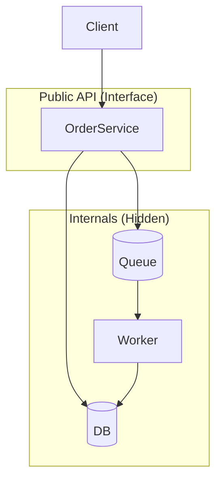
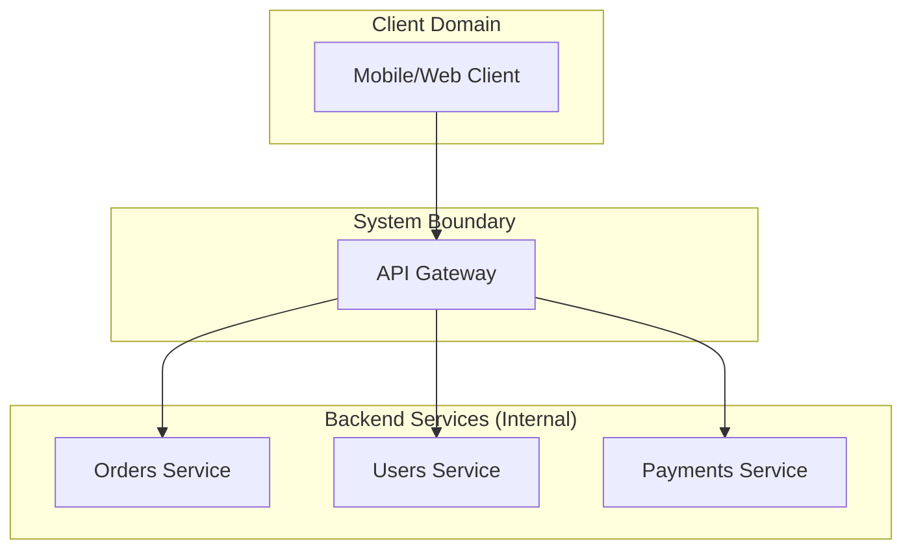
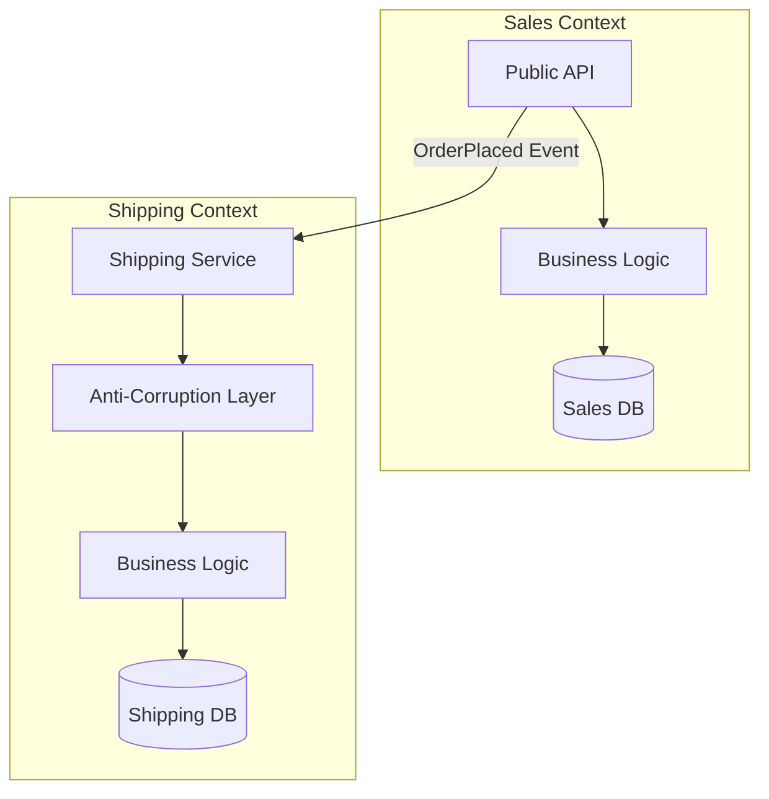
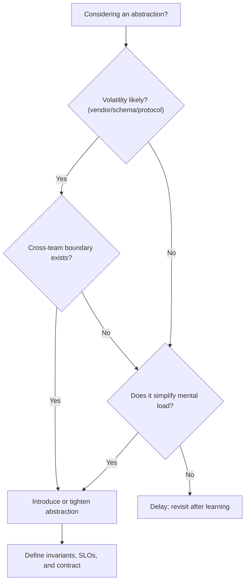
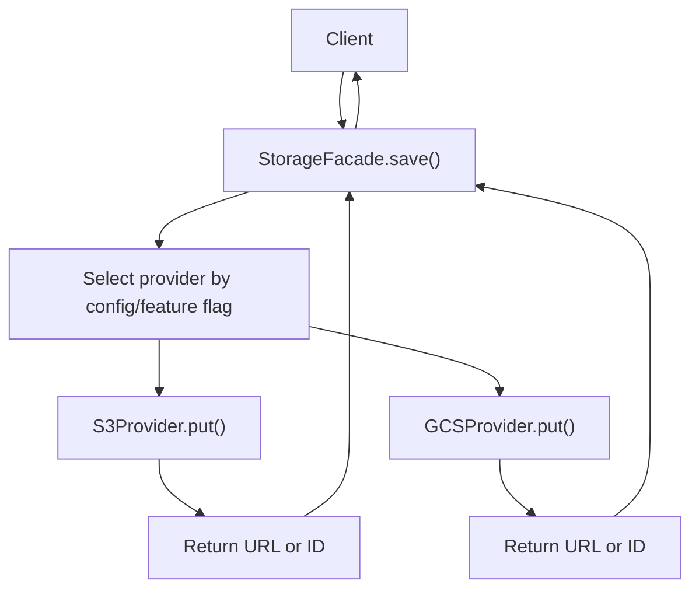

# Abstractions & Encapsulation

import Head from '@docusaurus/Head';
import Showcase from "@site/src/components/Showcase";
import Vs from "@site/src/components/Vs";
import Figure from "@site/src/components/Figure";
import Checklist from "@site/src/components/Checklist";
import DecisionMatrix from "@site/src/components/DecisionMatrix";
import Tabs from "@theme/Tabs";
import TabItem from "@theme/TabItem";

<Head>
  <meta
    name="description"
    content="Use stable façades and information hiding to manage complexity, evolve safely, and enforce boundaries."
  />
  <meta property="og:title" content="Abstractions & Encapsulation" />
  <meta
    property="og:description"
    content="Use stable façades and information hiding to manage complexity, evolve safely, and enforce boundaries."
  />
  <meta property="og:image" content="https://archman.dev/img/archman-social-card.webp" />
  <meta name="twitter:card" content="summary_large_image" />
  <link rel="canonical" href="https://archman.dev/docs/foundational-concepts/system-thinking-basics/abstractions-and-encapsulation" />
  <script type="application/ld+json">{JSON.stringify({
    "@context": "https://schema.org",
    "@type": "Article",
    "headline": "Abstractions & Encapsulation",
    "description": "Use stable façades and information hiding to manage complexity, evolve safely, and enforce boundaries.",
    "image": "https://archman.dev/img/archman-social-card.webp",
    "keywords": [
      "abstraction","encapsulation","information hiding","facade","boundaries","contracts","invariants","api gateway","bounded context","anti-corruption layer"
    ],
    "author": {"@type":"Person","name":"Archman"},
    "dateModified": "2025-09-10"
  })}</script>
  <script type="application/ld+json">{JSON.stringify({
    "@context":"https://schema.org",
    "@type":"BreadcrumbList",
    "itemListElement":[
      {"@type":"ListItem","position":1,"name":"Foundational Concepts","item":"https://archman.dev/docs/foundational-concepts"},
      {"@type":"ListItem","position":2,"name":"System Thinking Basics","item":"https://archman.dev/docs/foundational-concepts/system-thinking-basics"},
      {"@type":"ListItem","position":3,"name":"Abstractions & Encapsulation","item":"https://archman.dev/docs/foundational-concepts/system-thinking-basics/abstractions-and-encapsulation"}
    ]
  })}</script>
</Head>

**Abstraction simplifies by focusing on the essential, while encapsulation enforces boundaries by hiding internals.** Together, they are foundational for creating systems that are robust, maintainable, and able to evolve safely.

## TL;DR

Use narrow façades that validate inputs, enforce invariants, and hide implementation details. Keep contracts stable while allowing internals to change. Measure boundaries (SLIs/SLOs), plan safe rollouts behind flags, and prevent leaks of vendor or schema details to consumers.

## Learning objectives

- You will be able to distinguish abstraction from encapsulation and apply both together.
- You will be able to design façades that are stable at the boundary and replaceable inside.
- You will be able to identify leaks (vendor types, error codes) and seal them.
- You will be able to set SLIs/SLOs and observability at boundaries.

## Motivating scenario

A product team wants to switch object storage from Provider A to Provider B to reduce costs. Multiple clients upload/download artifacts. By introducing a `StorageFacade` with a stable contract and encapsulating provider specifics, the team can flip providers behind a feature flag, dual‑write to validate, and roll out safely without breaking any consumers.

## Scope and boundaries

- Scope: conceptual guidance and practical patterns for defining abstractions and encapsulating variability.
- Out of scope: language-specific features; see [Core Design & Programming Principles](../../core-design-and-programming-principles/) for SOLID and related principles.

## Core ideas

- **Abstraction**: Exposing what a system component does (its capabilities) while hiding how it does it. Consumers interact with a stable, well-defined interface, ignorant of the internal complexity.
- **Encapsulation**: Bundling a component's data and logic together and protecting it from outside interference. This is achieved by defining explicit boundaries and preventing direct access to a component's internal state.
- **Stable Abstractions**: Designing interfaces (like APIs or event contracts) that can evolve without breaking consumers. This often involves separating the "what" (policy) from the "how" (mechanism).

### What “good” looks like

- Narrow surface area with coherent operations (do one thing well).
- Strong invariants at the boundary (validate early, fail fast with clear errors).
- Information hiding: consumers can’t rely on volatile details (schemas, vendors, file layout).
- Replaceable internals: swap storage/transport without consumer changes.
- Measurable contracts: latency/throughput envelopes and error modes are explicit.

<Figure caption="A client interacts with a public interface (OrderService), which hides internal components like the database, queue, and workers.">

</Figure>

## Architectural Examples

<Showcase
  title="API Gateway as an Abstraction Layer"
  sections={[
    {
      label: 'Abstraction',
      body: (
        <>
          An <a href="../../distributed-systems-and-microservices/communication/api-gateway" >API Gateway</a> provides a single, stable entry point for a group of backend services. It abstracts away the underlying service topology, discovery mechanisms, and communication protocols. Clients interact with a simplified, unified API, ignorant of the complexity behind it.
        </>
      ),
    },
    {
      label: 'Encapsulation',
      body: 'The gateway encapsulates cross-cutting concerns like authentication, rate limiting, request logging, and response caching. This prevents logic from being scattered and duplicated across multiple services, enforcing policy at the edge.',
    },
  ]}
/>

<Figure caption="An API Gateway abstracts multiple backend microservices, providing a single interface for clients and encapsulating shared concerns.">

</Figure>

<Showcase
  title="Bounded Context as an Encapsulation Boundary"
  sections={[
    {
      label: 'Abstraction',
      body: (
        <>
          In Domain-Driven Design (DDD), a <a href="../../domain-driven-design/strategic-design/bounded-contexts">Bounded Context</a> exposes its capabilities through well-defined public contracts, such as APIs or published domain events. It abstracts its internal data model, business rules, and implementation details.
        </>
      ),
    },
    {
      label: 'Encapsulation',
      body: 'A Bounded Context encapsulates a specific part of the business domain, including its own ubiquitous language, data persistence, and logic. Direct access to its database from another context is strictly forbidden, protecting its integrity and autonomy.',
    },
  ]}
/>

<Figure caption="Two Bounded Contexts interact via public APIs and an Anti-Corruption Layer (ACL), encapsulating their internal models.">

</Figure>

## Patterns and pitfalls

- Favor system composition: Build systems from loosely coupled, well-bounded services or components, rather than monolithic architectures.
- Avoid distributed monoliths: Excessive inter-service dependencies or chatty communication patterns undermine encapsulation and increase fragility.
- Encapsulate what varies: Place boundaries around volatile or rapidly changing subsystems (e.g., vendor APIs, external data feeds, compliance modules).

### Additional guidance

- Prefer seams at integration points: Use gateways, message brokers, or event buses to decouple domains and enable independent evolution.
- Don’t abstract the unproven: Let operational duplication persist until a clear need for a shared abstraction emerges at the system level.
- Use anti-corruption layers: When integrating with legacy or external systems, mediate interactions to protect your system’s model and contracts.

### Common anti-patterns

- Leaky boundaries: Exposing internal data models, error codes, or operational details through public APIs or events.
- Anemic gateways: Pass-through proxies that do not enforce policy, validation, or observability at the system edge.
- Over-centralized control: Single points of failure or bottlenecks that violate the principle of distributed responsibility.

## When to use

- Distributed systems, microservices, and service-oriented architectures where independent evolution, resilience, and clear contracts are required.
- Platform boundaries, such as between internal systems and external partners, or between business domains.
- Any system where change isolation, compliance, or operational safety is a concern.

## When not to use

- Simple, single-purpose systems or prototypes where the cost of indirection and boundary management outweighs the benefits.
- Monolithic applications with tightly coupled logic that do not require independent deployment or scaling.

## Related topics

- [Interfaces & Contracts](./interfaces-and-contracts)
- [Separation of Concerns (SoC)](../../core-design-and-programming-principles/general-principles/separation-of-concerns)
- [High Cohesion, Low Coupling](../../core-design-and-programming-principles/general-principles/high-cohesion-low-coupling)

## Decision guide: introduce or tighten an abstraction?

<Figure caption="A decision flow for introducing or tightening an abstraction, based on factors like volatility, team boundaries, and complexity.">

</Figure>

- Volatility: does the underlying choice change (vendors, schemas, protocols)?
- Cross-team boundary: will consumers integrate independently from implementers?
- Invariant strength: can we meaningfully enforce constraints at the boundary?
- Complexity: does a boundary simplify consumer mental load and testing?
- Observability: can we measure the boundary’s SLOs and error modes?

If “yes” to 3+ items, introduce or strengthen the abstraction.

<Showcase
  title="Boundary review (quick cues)"
  sections={[
    {
      label: "Invariants",
      body: (
        <>
          Validate inputs at the facade; surface clear, stable errors. Keep
          invariants centralized and testable.
        </>
      ),
      tone: "info",
    },
    {
      label: "Replaceability",
      body: (
        <>
          Can you swap storage/transport/providers without changing public
          types? If not, you’re leaking internals.
        </>
      ),
    },
    {
      label: "Metrics",
      body: (
        <>
          Define facade-level SLIs (success rate, P95 latency); add correlation
          IDs to track requests end-to-end.
        </>
      ),
    },
  ]}
/>

## Decision matrix

<DecisionMatrix
  caption="How different abstraction levels affect consumers and change isolation"
  columns={["Cognitive load (consumer)", "Change isolation", "Runtime overhead"]}
  rows={[
    { name: "No abstraction (direct calls)", cells: ["High","Low","Low"], highlightTone: "warning" },
    { name: "Library/module facade", cells: ["Medium","Medium","Low"], highlightTone: "info" },
    { name: "Service facade / API Gateway", cells: ["Low","High","Medium"], highlightTone: "positive" }
  ]}
/>

## Practical example: Facade hides provider details

<Figure caption="Call flow: client invokes facade which selects a provider and handles errors, keeping internals hidden from the caller.">

</Figure>

<Tabs groupId="lang" queryString>
  <TabItem value="python" label="Python">

  ```python title="storage_facade.py" showLineNumbers
  from typing import Protocol

  class Storage(Protocol):
      def put(self, key: str, data: bytes) -> str: ...

  class S3Storage:
      def put(self, key: str, data: bytes) -> str:
          # call AWS SDK
          return f"s3://bucket/{key}"

  class GCSStorage:
      def put(self, key: str, data: bytes) -> str:
          # call GCP SDK
          return f"gs://bucket/{key}"

  class StorageFacade:
      def __init__(self, primary: Storage, fallback: Storage | None = None):
          self.primary = primary
          self.fallback = fallback

      def save(self, key: str, data: bytes) -> str:
          try:
              return self.primary.put(key, data)
          except Exception:
              if self.fallback is None:
                  raise
              return self.fallback.put(key, data)

  # Usage
  facade = StorageFacade(S3Storage(), GCSStorage())
  facade.save("order/123.json", b"{}")
  ```

  </TabItem>
  <TabItem value="go" label="Go">

  ```go title="storage_facade.go" showLineNumbers
  package storage

  type Storage interface {
      Put(key string, data []byte) (string, error)
  }

  type S3Storage struct{}
  func (S3Storage) Put(key string, data []byte) (string, error) {
      return "s3://bucket/" + key, nil
  }

  type GCSStorage struct{}
  func (GCSStorage) Put(key string, data []byte) (string, error) {
      return "gs://bucket/" + key, nil
  }

  type Facade struct{
      Primary Storage
      Fallback Storage
  }

  func (f Facade) Save(key string, data []byte) (string, error) {
      if url, err := f.Primary.Put(key, data); err == nil { return url, nil }
      if f.Fallback == nil { return "", fmt.Errorf("no fallback") }
      return f.Fallback.Put(key, data)
  }
  ```

  </TabItem>
  <TabItem value="node" label="Node.js">

  ```javascript title="storageFacade.js" showLineNumbers
  class S3Storage {
      put(key, data) {
          return `s3://bucket/${key}`
      }
  }

  class GCSStorage {
      put(key, data) {
          return `gs://bucket/${key}`
      }
  }

  class StorageFacade {
      constructor(primary, fallback) {
          this.primary = primary
          this.fallback = fallback
      }
      save(key, data) {
          try { return this.primary.put(key, data) }
          catch (e) {
              if (!this.fallback) throw e
              return this.fallback.put(key, data)
          }
      }
  }

  // Usage
  const facade = new StorageFacade(new S3Storage(), new GCSStorage())
  facade.save('order/123.json', Buffer.from('{}'))
  ```

  </TabItem>
</Tabs>

## Hands‑on exercise

Follow these steps to introduce a façade without breaking consumers.

1. Define the public contract (methods, request/response shapes, errors). Keep provider‑specific details internal.
2. Implement adapters for Provider A and Provider B behind the façade.
3. Add metrics at the façade: success rate, P95 latency; propagate correlation IDs.
4. Roll out with a feature flag: dual‑write/read during canary; compare results and error rates.

## Encapsulation techniques (language-agnostic)

- Service boundaries: Encapsulate logic and data within services, exposing only well-defined APIs or event contracts.
- Network boundaries: Use gateways, firewalls, and service meshes to enforce access control and observability at system edges.
- Data encapsulation: Share data between systems via immutable events, APIs, or contracts—never direct database access.
- Policy enforcement: Centralize authentication, authorization, and validation at system boundaries, not within internal components.
- Operational isolation: Use separate deployment units, scaling policies, and failure domains to prevent cascading failures.

## Testing and verification

- End-to-end system tests: Validate that system boundaries enforce contracts, invariants, and error handling as expected.
- Contract testing: Ensure that APIs, events, and integration points remain compatible as systems evolve.
- Chaos engineering: Inject failures at the network, service, or infrastructure level to verify system resilience and encapsulation.
- Observability validation: Confirm that logs, metrics, and traces are emitted at boundaries and can be correlated across the system.

## Operational considerations

- SLOs: define facade-level latency bands (e.g., P95 ≤ 200ms) and success rate.
- Rollouts: hide provider swaps behind feature flags; use canaries; dual-write/read to validate.
- Limits: document payload ceilings, rate limits/quotas; enforce with backpressure.

## Security, privacy, and compliance

- Enforce authn/authz at the facade; prefer least-privilege to internals.
- Classify data (PII/PCI) crossing the boundary; scrub in logs and error payloads.
- Protect secrets in configuration; rotate credentials without consumer impact.

## Observability

- Include correlation IDs; add semantic logs at boundary with stable error codes.
- Expose metrics: request rate, success rate, P50/P95/P99 latency, saturation.
- Trace key steps across adapters; annotate provider choices for diagnosis.

<Checklist
  title="Design Review Checklist"
  items={[
    { label: "Facade exposes coherent operations and hides internals; no leaking vendor types." },
    { label: "Boundary validates inputs and enforces invariants with clear, stable errors." },
    { label: "Replaceability proven via adapter: provider swap requires no consumer changes." },
    { label: "Contract documented: schemas, error envelope, SLOs, limits/quotas." },
    { label: "Observability in place: correlation IDs, metrics, traces at the facade." },
    { label: "Security reviewed: authn/authz model, data classification, secrets handling." },
    { label: "Rollout strategy: flags/canaries; rollback is safe and fast." },
    { label: "Tests cover facade behavior (black-box), CDC at seams, and error injection." },
  ]}
/>

## Signals & anti‑signals

<Showcase
  title="When stronger abstractions are helpful vs overkill"
  sections={[
    { label: 'Signals', body: <>Multiple independent consumers; provider churn; regulated data; long‑lived clients; need for canary/provider swaps.</>, tone: 'positive' },
    { label: 'Anti‑signals', body: <>Single team, in‑process calls; prototyping; no external consumers; frequent breaking refactors expected.</>, tone: 'info' }
  ]}
/>

## Next steps

- Read [Interfaces & Contracts](./interfaces-and-contracts)
- Compare [Components, Connectors, and Configurations](./components-connectors-configurations)
- Explore [API Gateway](../../distributed-systems-and-microservices/communication/api-gateway)
- See [Bounded Contexts](../../domain-driven-design/strategic-design/bounded-contexts)

## Self‑check

1. Where does abstraction end and encapsulation begin at a boundary?
2. What are three signs your boundary is leaking?
3. Which SLIs best capture boundary health for your façade?

::::info
One takeaway: Strong boundaries trade a little indirection for safer change and faster evolution.
::::

## Edge cases and trade-offs

- Performance: Additional boundaries (gateways, brokers) can introduce latency and operational overhead; balance encapsulation with system efficiency.
- Debuggability: Encapsulation can obscure root causes; invest in distributed tracing and boundary-level logging.
- Consistency: System boundaries may require eventual consistency and careful contract management.
- Evolution: Keep integration layers and anti-corruption boundaries as thin as possible to ease future migrations or provider swaps.

## References

<!-- markdownlint-disable MD033 -->
1. <a href="https://en.wikipedia.org/wiki/Encapsulation_(computer_programming)" target="_blank" rel="nofollow noopener noreferrer">Encapsulation ↗️</a>
2. <a href="https://en.wikipedia.org/wiki/Abstraction_principle_(computer_programming)" target="_blank" rel="nofollow noopener noreferrer">Abstraction principle ↗️</a>
<!-- markdownlint-enable MD033 -->
