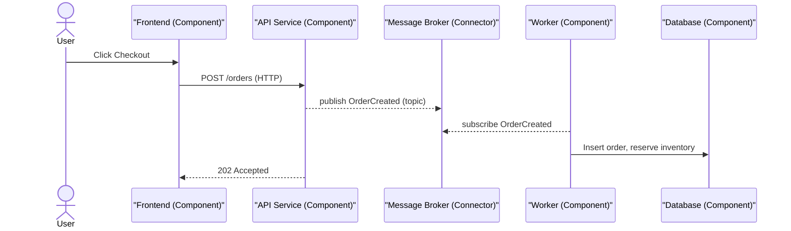
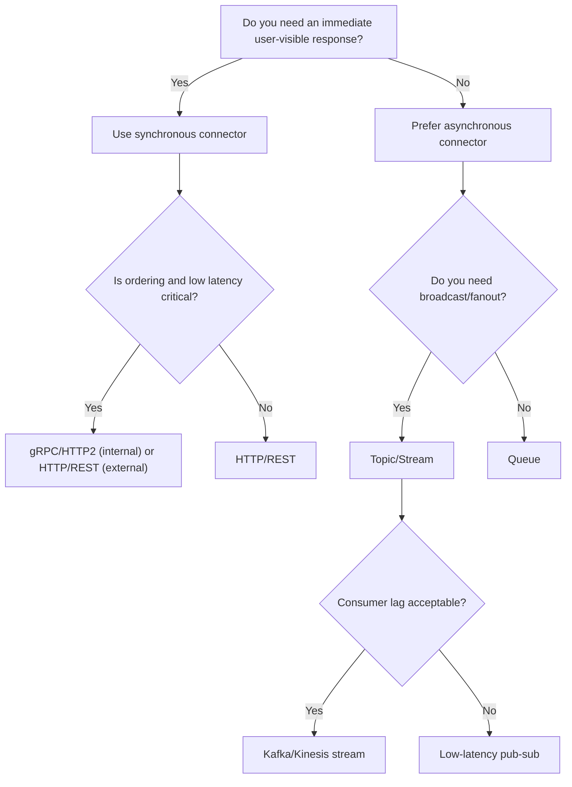

# Components, Connectors, Configurations

import Showcase from '@site/src/components/Showcase';
import Vs from '@site/src/components/Vs';

This article defines the foundational building blocks of a software system and how they relate. Scope: conceptual modeling and practical choices for structuring systems. Out of scope: specific architectural styles (see [Architectural Styles](../../architectural-styles/)) and detailed deployment tooling.

## Why it matters

Clear separation of parts and their interactions reduces cognitive load, enables independent change, and improves reliability. Misunderstandings here lead to chatty dependencies, distributed monoliths, and brittle deployments.

## Core concepts

- Components: cohesive units with clear responsibilities and explicit boundaries. Types commonly used:
  - Runtime components (deployable units): services, workers, UIs.
  - Library components (linked at build time): shared modules, SDKs.
  - Data components: databases, caches, logs, topics.
- Connectors: the interaction mechanisms between components. Favor explicit, well-specified connectors over implicit coupling.
  - Synchronous: in-process call, HTTP/REST, gRPC.
  - Asynchronous: queues (point-to-point), topics/streams (pub/sub), file/log handoff.
  - Special cases: shared DB (discouraged for integration), memory/shared cache, CLI/process.
- Configuration: the arrangement and parameterization of components and connectors per environment (dev/test/prod). This includes:
  - Topology (who talks to whom), network zones, and policies (authn/z, mTLS).
  - Runtime levers: timeouts, retries/backoff, circuit breakers, concurrency/parallelism, idempotency keys, ordering, delivery semantics.
  - Observability: correlation/trace IDs, metrics (latency, error rate), logs.



## Practical examples

- Web app with background processing: API (component) exposes a REST interface, communicates async via a broker (connector) to worker components, which update a database (component). Configuration decides topics, retries, and timeouts.
- Data pipeline: Producer components write to a log (connector), processors transform to read models, consumers serve queries.

## Choosing connectors (decision aid)



### Connector decision matrix (rule of thumb)

| Need                          | REST (HTTP/1.1)  | gRPC (HTTP/2)   | Queue (P2P)         | Topic/Stream (Pub/Sub) |
| ----------------------------- | ---------------- | --------------- | ------------------- | ---------------------- |
| User-facing request/response  | Good, ubiquitous | Good (internal) | Poor                | Poor                   |
| Low latency, strong contracts | Okay             | Best            | N/A                 | N/A                    |
| Fan-out/broadcast             | Weak             | Weak            | Poor                | Best                   |
| Backpressure and decoupling   | Weak             | Weak            | Best                | Good                   |
| Ordering guarantees           | Weak             | Weak            | Queue FIFO (scoped) | Partition-ordered      |
| Cross-team evolution          | Okay             | Okay            | Good                | Good                   |

Notes

- Choose one primary connector per interaction. Don’t “double-integrate” (e.g., REST + shared DB) unless you have a justified pattern.
- For external consumers, prefer REST/JSON unless there’s a clear benefit to gRPC (performance, schema rigor) and tooling alignment.

<Vs
  title="Sync vs Async (internal services)"
  items={[
    {
      label: 'Synchronous (REST/gRPC)',
      points: [
        'Simple request/response',
        'Tight coupling to availability/latency',
        'Great for user-facing flows',
      ],
      highlightTone: 'info',
    },
    {
      label: 'Asynchronous (queue/topic)',
      points: [
        'Decoupled and resilient',
        'Throughput/backpressure friendly',
        'Eventual consistency and ordering trade-offs',
      ],
      highlightTone: 'positive',
    },
  ]}
  highlight={[1]}
/>

## Implementation notes and pitfalls

- Keep component responsibilities cohesive; avoid god components. See [God Object / God Class](../../anti-patterns-and-pitfalls/god-object-god-class).
- Avoid shared databases as implicit connectors; prefer explicit APIs or events. See [Shared Database Across Services](../../anti-patterns-and-pitfalls/shared-database-across-services).
- Treat configuration as code where possible, with validation and defaults. See [Infrastructure as Code](../../delivery-engineering/infrastructure-as-code/).

### Configuration levers (apply intentionally)

- Timeouts per hop (SLA budget); enforce deadlines in gRPC and client-side timeouts in REST.
- Retries with jittered backoff; make idempotent or use idempotency keys.
- Circuit breaker for failing dependencies; fast-fail and fallback when safe.
- Concurrency limits per component; avoid thundering herds; apply queue depth limits.
- Delivery semantics: at-least-once (default for async) with dedupe; idempotent handlers.
- Ordering: partition by key when order matters; otherwise prefer concurrency.
- Observability: include correlation IDs, span attributes for connector type and payload size.

<Showcase
  title="Signals & guardrails"
  sections={[
    { label: 'Signals', body: 'SLOs per hop, error rate, queue depth, consumer lag' },
    { label: 'Guardrails', body: <>Dead-letter queues, circuit breakers, rate limits</>, tone: 'warning' },
  ]}
/>

```yaml title="connector-config.yaml" showLineNumbers
service:
  httpClient:
    timeout: 2s
    retries:
      attempts: 3
      backoff: 200ms..2s
      jitter: true
    circuitBreaker:
      failureRateThreshold: 50%
      rollingWindow: 60s
  queueConsumer:
    maxConcurrency: 16
    prefetch: 32
    deadLetter: order.events.dlq
    idempotencyKeyHeader: X-Idempotency-Key
```

### Edge cases to plan for

- Split-brain connectors: producer thinks a message sent; consumer never sees it—monitor end-to-end, not just send success.
- Fan-out overload: pub/sub can overwhelm downstreams—use quotas and consumer-side backpressure.
- Partial failures in sagas: design compensations; don’t rely on two-phase commit across services.
- Cold-start and burst traffic: warm pools, token buckets; keep sync paths thin.

## Operational considerations

- SLOs per hop: P95/P99 latency targets; success rates; consumer lag thresholds.
- Rollouts: gradual config changes, canary consumers/producers; backpressure safety.
- Limits: payload ceilings, concurrency caps; quotas documented and enforced.

## Security, privacy, and compliance

- Enforce authz per connector (mTLS internal, OAuth2 for public APIs).
- Data classification across connectors; encrypt at rest and in transit; mask PII in logs.
- Secrets management: rotate credentials for brokers/DBs without downtime.

## Observability

- Propagate correlation/trace IDs across connectors; sample with bias under errors.
- Emit per-connector metrics: latency, error rate, queue depth, DLQ count.
- Create dashboards per critical interaction; alerts on SLO burn rate.

## Design review checklist

- Clear responsibilities per component; no shared database coupling.
- Connector choice justified with decision aid; single primary connector per integration.
- Timeouts/retries/backoff/circuit breakers configured intentionally.
- Idempotency and ordering strategies documented; DLQ path defined.
- Security posture defined: authn/authz, encryption, secrets rotation.
- Observability in place: correlation IDs, metrics, traces, dashboards and alerts.
- Rollout/rollback plan documented; quotas/limits enforced.

## When to use

- At project inception to establish shared vocabulary and boundaries.
- During refactoring to disentangle a distributed monolith.
- When formalizing cross-team contracts and decoupling through async boundaries.

## When not to use

- When a simple script suffices; over-modeling adds overhead.
- When teams cannot own components end-to-end (run/observe/fix); do that first.

## Related topics

- [Interfaces & Contracts](./interfaces-and-contracts)
- [Abstractions & Encapsulation](./abstractions-and-encapsulation)
- [API & Interface Design](../../api-and-interface-design/)

## References

<!-- markdownlint-disable MD033 -->
1. <a href="https://wiki.sei.cmu.edu/sad/Component-and-Connector_Viewtype" target="_blank" rel="nofollow noopener noreferrer">SEI, Component-and-Connector Viewtype ↗️</a>
2. <a href="https://www.enterpriseintegrationpatterns.com/patterns/messaging" target="_blank" rel="nofollow noopener noreferrer">Enterprise Integration Patterns (Messaging Patterns) ↗️</a>
<!-- markdownlint-enable MD033 -->
