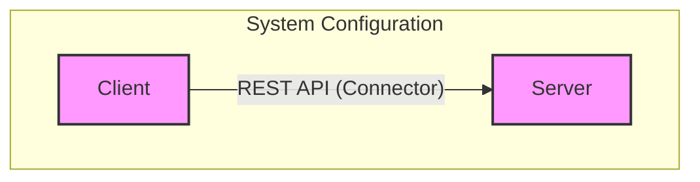
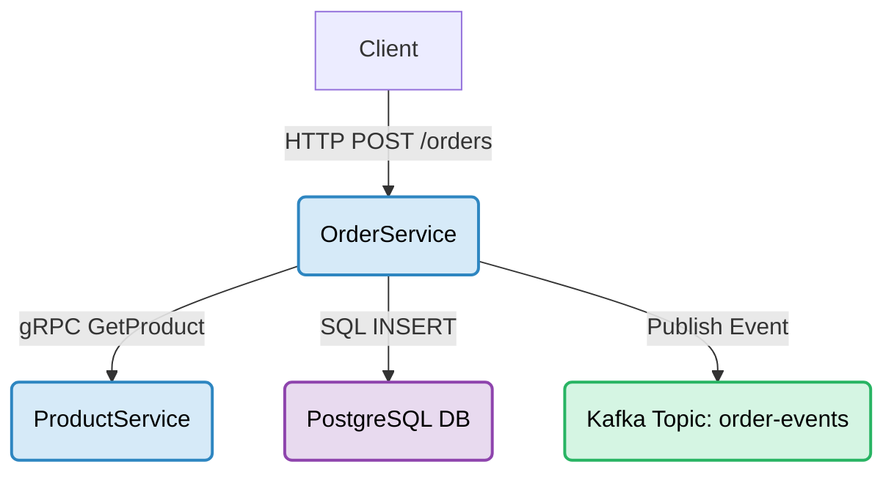
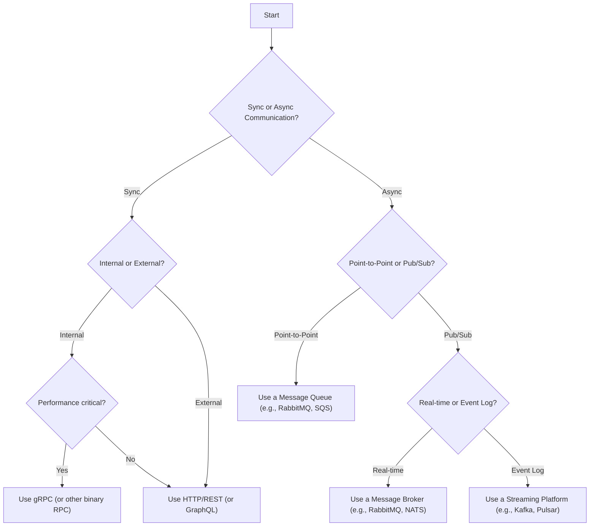

import Tabs from '@theme/Tabs';
import TabItem from '@theme/TabItem';
import Figure from '@site/src/components/Figure';
import Checklist from '@site/src/components/Checklist';
import Vs from '@site/src/components/Vs';
import Showcase from '@site/src/components/Showcase';
import ProsCons from '@site/src/components/ProsCons';

# Components, Connectors, and Configurations

In software architecture, **system thinking** is the practice of viewing a system as a holistic collection of interacting parts. The most fundamental of these parts are **components**, the **connectors** that link them, and the **configurations** that arrange them. Understanding these three elements is the first step toward designing robust, scalable, and maintainable systems.

A system's architecture is defined by its components, how they are connected, and the rules that govern their interaction. This structure dictates the system's capabilities, its quality attributes (like performance and reliability), and how it can evolve over time.

## Core Concepts

### Components
A **component** is a deployable unit of computation or a data store—such as a service, database, or message broker. It is modular, independently deployable, and replaceable, encapsulating a set of related functions or data. Components have well-defined interfaces that hide their internal implementation details.

- **Examples**: A microservice, a database, a message queue, a client-side web application.

### Connectors
A **connector** is a mechanism that mediates communication, coordination, or cooperation among components. Connectors are the "plumbing" of an architecture, enabling data and control flow. They are distinct from the components themselves and can range from simple procedure calls to complex, network-based protocols.

- **Examples**: A REST API call, a gRPC connection, a message bus, an event stream, or a shared memory buffer.

### Configurations
A **configuration** is the structural arrangement of components and connectors. It describes the topology of the system—how the parts are wired together to form a whole. The configuration defines the system's runtime structure and dictates how components interact to fulfill the system's purpose.

- **Examples**: A client-server topology, a pipeline of data-processing services, a star-shaped topology with a central message broker.

<Figure caption="A simple client-server configuration showing two components (Client, Server) linked by a connector (REST API).">

</Figure>

## Practical Examples and Real-World Scenarios

Let's consider a simple e-commerce system.

- **Components**:
    - `ProductService`: Manages product information.
    - `OrderService`: Handles order creation and processing.
    - `PostgreSQL DB`: A relational database for storing order data.
    - `Kafka Topic`: An event stream for publishing order events.
- **Connectors**:
    - `gRPC`: Used for synchronous, internal communication between `OrderService` and `ProductService`.
    - `Postgres Driver`: The connector used by `OrderService` to interact with its database.
    - `Kafka Producer/Consumer`: The mechanism for writing to and reading from the `Order-Events` topic.
- **Configuration**:
    The `OrderService` receives a request, calls the `ProductService` via gRPC to validate product details, persists the order to its `PostgreSQL DB`, and publishes an `OrderCreated` event to a `Kafka Topic`.

<Figure caption="Configuration for an e-commerce system's order processing flow.">

</Figure>

## Decision Model: Choosing the Right Connector

The choice of connector is a critical architectural decision that impacts performance, reliability, and coupling. Use this mental model to guide your selection.

<Figure caption="A decision flow for selecting a connector based on communication style and guarantees.">

</Figure>

## Decision Matrix: Connector Trade-offs

| Connector Type      | Coupling | Performance | Complexity | Use Case                               |
| ------------------- | -------- | ----------- | ---------- | -------------------------------------- |
| **REST API**        | Low      | Medium      | Low        | External-facing APIs, simple services. |
| **gRPC**            | Medium   | High        | Medium     | Internal service-to-service comms.     |
| **Message Queue**   | Very Low | High        | Medium     | Decoupled tasks, load leveling.        |
| **Event Stream**    | Very Low | Very High   | High       | Event sourcing, stream processing.     |
| **Shared Database** | High     | High        | Low        | (Anti-pattern) Monoliths, simple apps. |

## Implementation Notes / Patterns / Pitfalls

<ProsCons
  prosTitle="Do"
  consTitle="Don't"
  pros={[
    'Define clear, stable interfaces for your components.',
    'Choose connectors that match your coupling and performance needs.',
    'Isolate components to allow for independent deployment and scaling.',
    'Use asynchronous connectors to improve resilience and elasticity.'
  ]}
  cons={[
    'Do not let components bypass connectors and interact directly (e.g., direct DB access across services).',
    'Avoid creating a "distributed monolith" by using synchronous, blocking calls everywhere.',
    'Do not share databases between components (services) as it creates high coupling.',
    'Do not build custom connector logic when a standard, off-the-shelf solution exists.'
  ]}
  highlight="pros"
  highlightTone="positive"
/>

## Operational Considerations

- **SLOs/SLIs**: Each component should have defined Service Level Objectives (SLOs). For example, the `ProductService` might have an SLO for 99.9% availability and a 50ms 99th percentile latency. Connector behavior (e.g., retry policies, timeouts) directly impacts these metrics.
- **Rollouts**: Components should be independently deployable. A change to the `OrderService` should not require a redeployment of the `ProductService`. Use techniques like blue-green or canary deployments to roll out new component versions safely.
- **Quotas/Limits**: Implement rate limiting and quotas on component interfaces to prevent cascading failures. A connector like an API Gateway is an ideal place to enforce these policies.

## Security, Privacy, and Compliance

- **Authentication & Authorization**: Connectors must enforce security. For example, an API Gateway can validate JWTs for external requests, while a service mesh can enforce mTLS for internal gRPC calls.
- **Data Classification**: Components handle data of varying sensitivity. Ensure that connectors prevent leakage. For instance, an `OrderService` should not expose PII through an insecure connector.
- **Secrets Management**: Components often need secrets (API keys, credentials) to use connectors. These must be managed securely via a vault, not hardcoded in configurations.

## Observability

- **Logs**: Components should produce structured logs. Connectors should add correlation IDs to trace requests as they flow through the system.
- **Metrics**: Each component should expose key metrics (e.g., request rate, error rate, duration - RED metrics). Connectors can also provide metrics, such as queue length for a message broker.
- **Traces**: Use distributed tracing to visualize the entire lifecycle of a request across multiple components and connectors. This is invaluable for debugging performance issues.

## When to Use / When Not to Use

### When to formally define Components, Connectors, and Configurations:
- When designing a new system from scratch.
- When decomposing a monolith into microservices.
- When your system is becoming complex and you need to manage dependencies.
- When you need to communicate the architecture to new team members.

### When this level of formalism might be overkill:
- For very small, single-purpose applications or scripts.
- In the early stages of a prototype where speed is more important than structure.

## Design Review Checklist

<Checklist
  title="Component & Connector Design Checklist"
  items={[
    { label: 'Is the component’s responsibility well-defined and cohesive?' },
    { label: 'Is the component’s interface clear and hiding implementation details?' },
    { label: 'Does the chosen connector match the required performance and reliability?' },
    { label: 'Is the communication pattern (sync/async) appropriate for the use case?' },
    { label: 'Can the component be deployed and scaled independently?' },
    { label: 'Are security controls (authn/authz) enforced by the connector?' },
    { label: 'Is there a clear strategy for versioning the component’s interface?' },
    { label: 'Are observability hooks (logs, metrics, traces) built into the component and connector?' },
    { label: 'Have you avoided shared mutable state between components?' }
  ]}
/>

## Related Topics
- [System Thinking Overview](../index.mdx)
- [Interfaces & Contracts](./interfaces-and-contracts.mdx)
- [Abstractions & Encapsulation](./abstractions-and-encapsulation.mdx)
- [Architectural Styles](../../architectural-styles)

## References
1. <a href="https://www.pearson.com/en-us/subject-catalog/p/software-architecture-in-practice/P200000007481/9780321815736" target="_blank" rel="nofollow noopener noreferrer">Software Architecture in Practice, 3rd Edition ↗️</a>
2. <a href="https://www.sei.cmu.edu/our-work/software-architecture/" target="_blank" rel="nofollow noopener noreferrer">SEI: Software Architecture Patterns & Resources ↗️</a>
