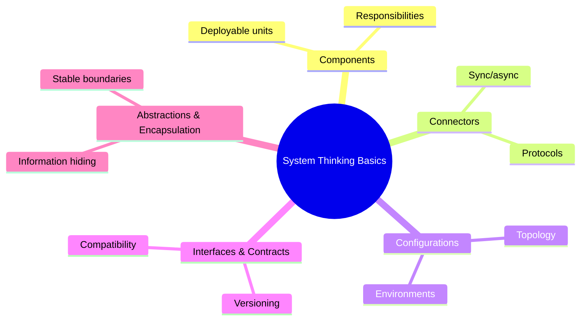

import DocCardList from "@theme/DocCardList";
import { useCurrentSidebarCategory } from "@docusaurus/theme-common";
import Figure from "@site/src/components/Figure";

# System Thinking Basics

A practical starter on how to see software as systems: components (the parts), connectors (their interactions), configurations (how parts are arranged), interfaces (the boundaries), and abstractions/encapsulation (how we manage complexity). Use this section to build shared language before diving into styles, patterns, and operations. The goal is to form mental models that help you reason about change, risk, and evolution—not to prescribe a specific stack.

> “A system is more than the sum of its parts.” — Donella Meadows

## How to use this section

- Start with the building blocks in [Components, Connectors, Configurations](./components-connectors-configurations). Learn to separate responsibilities, pick a single primary connector per interaction, and tune runtime levers (timeouts, retries, circuit breakers).
- Define crisp boundaries in [Interfaces & Contracts](./interfaces-and-contracts). Make behavior explicit and testable over time with contract tests, versioning, and clear error models.
- Keep complexity in check with [Abstractions & Encapsulation](./abstractions-and-encapsulation). Expose stable façades; hide implementation details; enforce invariants at boundaries.

## What you’ll gain

- A shared vocabulary to discuss topology, runtime behavior, and change impact.
- Decision cues to choose between sync/async connectors and to calibrate rigor.
- Practical checklists for operability (SLOs, observability), security (authn/z, data), and rollout safety (flags, canaries, rollback).

<Figure caption="A mind map overview of system thinking basics.">

</Figure>

## Common pitfalls to avoid

- Chatty, tightly coupled calls across components; prefer fewer, well‑designed interactions.
- Treating a shared database as an integration mechanism; use explicit APIs or events instead.
- Leaky abstractions that expose vendor/transport details to consumers.

<DocCardList items={useCurrentSidebarCategory().items} />

## References

<!-- markdownlint-disable MD033 -->
1. <a href="https://www.systems-thinking.org/" target="_blank" rel="nofollow noopener noreferrer">Systems Thinking: A Primer ↗️</a>
2. <a href="https://www.amazon.com/Thinking-Systems-Donella-H-Meadows/dp/1603580557" target="_blank" rel="nofollow noopener noreferrer">Donella Meadows, Thinking in Systems ↗️</a>
<!-- markdownlint-enable MD033 -->
