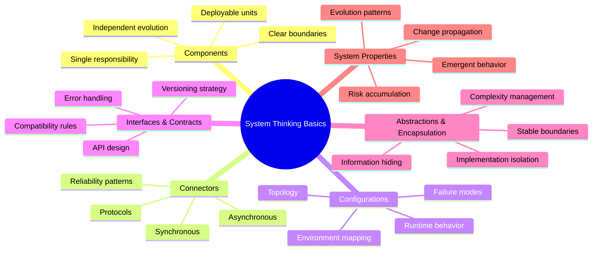

import { useCurrentSidebarCategory } from "@docusaurus/theme-common";

# System Thinking Basics

Systems thinking provides the foundational mental models for reasoning about software architecture. Rather than viewing software as isolated components, systems thinking helps you understand how **components** (the parts), **connectors** (their interactions), **configurations** (how parts are arranged), **interfaces** (the boundaries), and **abstractions** (how we manage complexity) work together to create emergent behaviors.

This section builds the shared vocabulary and mental scaffolding needed before diving into architectural styles, design patterns, and operational concerns. The goal is to develop intuition for how changes propagate through systems, where risks accumulate, and how to design for evolution rather than prescribing specific technologies.

## Why Systems Thinking Matters

Software systems exhibit emergent properties that cannot be understood by examining individual components in isolation. A microservice that performs well in isolation may fail catastrophically when integrated with others due to cascading failures, resource contention, or timing dependencies. Systems thinking helps you anticipate these interactions and design for them.

The principles here connect directly to adjacent foundations. When discussing non-functional outcomes, anchor them to the language of [Quality Attributes](../../quality-attributes). When reasoning about latency, failure, and coordination, connect to [Basic Distributed Systems Concepts](../basic-distributed-systems-concepts). Boundary design and compatibility live in [API & Interface Design](../../api-and-interface-design). Day-two concerns—SLOs, telemetry, and alerting—belong in [Observability & Operations](../../observability-and-operations). Confidentiality, integrity, and access control are covered in [Security Architecture](../../security-architecture).

> "A system is more than the sum of its parts." — Donella Meadows

## Core Mental Model

<Figure caption="A comprehensive mind map of system thinking fundamentals showing the relationships between key concepts.">

</Figure>

## Learning Path

**Start with the building blocks** in [Components, Connectors, Configurations](./components-connectors-configurations). Learn to separate responsibilities, prefer one primary connector per interaction, and tune runtime levers like [timeouts, retries, and backoff](../../reliability-resilience-and-performance-engineering/reliability-patterns/hedging-requests-timeouts-retries) and [circuit breakers](../../reliability-resilience-and-performance-engineering/reliability-patterns/bulkheads-circuit-breakers).

**Define crisp boundaries** in [Interfaces & Contracts](./interfaces-and-contracts). Make behavior explicit and testable over time with contract tests, versioning strategies, and clear error models that support independent evolution.

**Keep complexity in check** with [Abstractions & Encapsulation](./abstractions-and-encapsulation). Expose stable façades, hide implementation details, and enforce invariants at boundaries to prevent leaky abstractions.

## What You'll Gain

- **Shared vocabulary** to discuss topology, runtime behavior, and change impact across teams
- **Decision frameworks** to choose between sync/async connectors and calibrate rigor when evolving or integrating systems  
- **Practical checklists** for operability (SLOs, telemetry, alerting), security (authentication, authorization, data protection), and rollout safety (feature flags, canaries, rollback strategies)

## Common Pitfalls to Avoid

- **Chatty interfaces**: Tightly coupled calls across components; prefer fewer, well-designed interactions
- **Shared database integration**: Treating a shared database as an integration mechanism; use explicit APIs or events instead
- **Leaky abstractions**: Exposing vendor/transport details to consumers; maintain stable boundaries
- **Ignoring emergent behavior**: Focusing only on individual components without considering system-wide effects

<DocCardList items={useCurrentSidebarCategory().items} />

## Related Topics

- [Basic Distributed Systems Concepts](../basic-distributed-systems-concepts) — Understanding latency, failure, and coordination
- [API & Interface Design](../../api-and-interface-design) — Designing stable, evolvable boundaries
- [Quality Attributes](../../quality-attributes) — Non-functional requirements and trade-offs
- [Observability & Operations](../../observability-and-operations) — Monitoring and operating systems
- [Security Architecture](../../security-architecture) — Secure system design principles

## References

1. <a href="https://www.informit.com/store/software-architecture-in-practice-9780136886099" target="_blank" rel="nofollow noopener noreferrer">Bass, Clements, Kazman — Software Architecture in Practice (4th ed.) ↗️</a>
2. <a href="http://www.viewpoints-and-perspectives.info/" target="_blank" rel="nofollow noopener noreferrer">Rozanski & Woods — Software Systems Architecture: Viewpoints and Perspectives ↗️</a>
3. <a href="https://www.iso.org/standard/74393.html" target="_blank" rel="nofollow noopener noreferrer">ISO/IEC/IEEE 42010:2011 — Architecture description ↗️</a>
