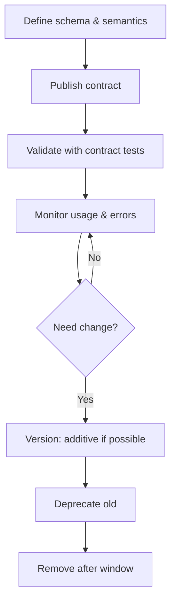
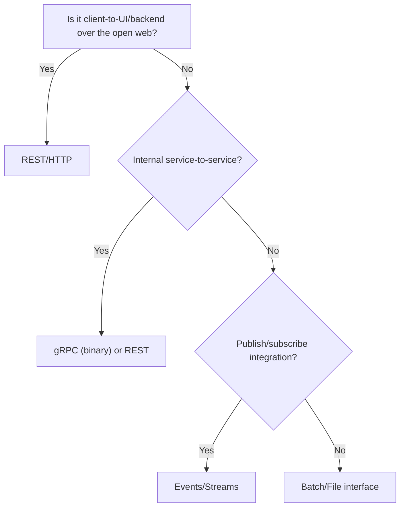

# Interfaces & Contracts

import Showcase from '@site/src/components/Showcase';
import Vs from '@site/src/components/Vs';

Interfaces define boundaries. Contracts make behavior explicit and testable over time. Scope: conceptual and practical guidance for defining, evolving, and verifying contracts. Out of scope: protocol-specific details beyond high-level comparisons—see [API & Interface Design](../../api-and-interface-design/) for REST/gRPC/GraphQL specifics.

## Why it matters

Stable interfaces enable independent teams to move fast without breaking consumers. Contracts reduce ambiguity and make integration failures detectable early.

## Core concepts

- Interface: the set of callable operations, messages, or events exposed by a component.
- Contract: the precise expectations about inputs, outputs, semantics, performance, and error behavior.
- Compatibility: backward/forward compatibility across versions; deprecation windows.

### Interface surface checklist

- Naming and resource model are consistent and predictable (nouns for resources, verbs for RPC).
- Inputs/outputs are validated at the boundary; schemas are explicit.
- Error contract is consistent across endpoints (shape, codes, retriable vs non‑retriable).
- Pagination, filtering, and sorting are documented and deterministic.
- Rate limits/quotas are communicated and discoverable.
- Idempotency/concurrency mechanisms are defined (idempotency keys, ETag/If‑Match).

### Contract scope

- Functional semantics: invariants, side‑effects, ordering guarantees.
- Non‑functional: latency SLO bands, throughput envelopes, payload ceilings.
- Security: authn/authz model (scopes/claims), multi‑tenant isolation.



## Practical examples

- REST API: OpenAPI-described endpoints with problem+json error contract, ETags for concurrency, and additive evolution avoiding breaking changes. See [RESTful API Design](../../api-and-interface-design/restful-api-design/).
- gRPC: Protobuf IDL with field numbering, using reserved fields to avoid reuse; deadlines for timeouts. See [gRPC / RPC](../../api-and-interface-design/grpc-rpc).
- Events: Schemas in a registry; semantic versioning and consumer-driven contract tests to prevent breaking downstream processors.

### Error contracts (problem+json)

```json title="error.json" showLineNumbers
{
  "type": "https://httpstatuses.com/409",
  "title": "Conflict",
  "status": 409,
  "detail": "Order already exists",
  "instance": "/orders/123",
  "correlationId": "c-abc123"
}
```

Guidance

- Use a small, fixed set of status codes; put specifics in the body.
- Always include a correlation ID and stable error codes for automation.

## Decision guide: choosing an interface style



<Vs
  title="Interface style (quick cues)"
  items={[
    { label: 'REST', points: ['Web-friendly', 'Great tooling/docs', 'Evolves additively'], highlightTone: 'info' },
    { label: 'gRPC', points: ['Binary & fast', 'Strong contracts', 'Best internal'], highlightTone: 'neutral' },
    { label: 'Events/Streams', points: ['Decouple producers/consumers', 'Fanout', 'Eventual consistency'], highlightTone: 'positive' },
  ]}
  highlight={[0,2]}
/>

## Evolution patterns

- Prefer additive changes: new optional fields, new endpoints/methods.
- Use explicit versioning at a stable boundary; avoid proliferation.
- Document deprecations with timelines; measure adoption.

Versioning options (pick one)

- Path segment (e.g., /v1) at gateway boundary; keep internals unversioned where possible.
- Header or media type versioning for public APIs to avoid URL churn.
- Event schemas: semantic versioning with backward‑compatible defaults.

Breaking changes (avoid or mitigate)

- Renames/removals without defaults; changing semantics; tightening validation.
- If unavoidable, dual‑write/dual‑read and provide a deprecation window with telemetry.

## Testing and verification

- Contract testing: consumer-driven contracts to catch breaking changes pre-release. See [Contract (CDC)](../../testing-strategy/testing-pyramid/contract-cdc).
- Compatibility tests: schema diff checks in CI; backward/forward validation.

Automation hooks

- OpenAPI/Protobuf schema diff in CI: fail on breaking changes.
- CDC provider verification on every build of the provider.
- Replay sampled production requests/events in staging to detect drift.

```yaml title="ci-contract-checks.yaml" showLineNumbers
jobs:
  contract_checks:
    steps:
      - run: oas-diff --fail-on-breaking old.yaml new.yaml
      - run: buf breaking --against '.git#branch=main'
      - run: pact-broker verify --consumer checkout --provider orders
```

## Operational considerations

- SLOs per operation: success rate and latency bands (P50/P95/P99); set budgets.
- Rollouts: additive changes first; use feature flags and dual-write/read for breaks.
- Limits: payload ceilings, rate limits/quotas; publish in docs and enforce.

## Security, privacy, and compliance

- Authn/authz model documented; least privilege enforced at the boundary.
- Data classification explicit; PII masked; secrets never leak to logs/errors.
- Multi-tenant isolation defined; per-tenant quotas and rate limits if applicable.

## Observability

- Correlation IDs required and propagated; structured logs at boundary.
- Per-operation metrics: success rate, latency, saturation; dashboards/alerts.
- Traces across hops; add attributes for operation, version, and error code.

## Design review checklist

- Interface surface is coherent and minimal; semantics and invariants are clear.
- Error contract standardized (problem+json or equivalent) with stable codes.
- Versioning approach chosen and documented; deprecation policy with telemetry.
- Compatibility checks automated in CI (schema diff, CDC verification).
- Security posture (authn/authz), data classification, and secrets handling clear.
- Observability in place: correlation IDs, metrics, traces, dashboards and alerts.
- Rollout/rollback strategy defined; limits and quotas enforced and documented.

## When to use

- Any component boundary crossing team/service/process/tech boundaries.

## When not to use

- In-process private methods—keep those internal and refactor freely.

## Related topics

- [Components & Connectors](./components-connectors-configurations)
- [Versioning strategies](../../api-and-interface-design/versioning-strategies)
- [Webhooks](../../api-and-interface-design/webhooks)

## Design details (practical guidance)

### Pagination & filtering

- Prefer cursor-based pagination for stability under change; avoid offset for large datasets.
- Make cursors opaque; include next/prev links.
- Define max page size; reject excessive requests.

### Idempotency & concurrency

- For create operations, accept an Idempotency‑Key; return the same result for retries.
- For updates, use ETag/If‑Match to avoid lost updates.
- In gRPC, design idempotent RPCs and document safe retries.

### Security & auth

- Document required scopes/claims per operation; return 403 (not 404) for unauthorized resource known to caller.
- Surface tenant context explicitly; never infer from data alone.
- Scrub secrets in errors/logs; classify PII fields.

### Observability (per-operation)

- Require a Correlation‑ID header and propagate it; add span attributes for operation and result.
- Publish per‑operation SLIs: success rate, P50/P95/P99 latency, saturation.

## Examples

```yaml title="openapi.yaml (excerpt)" showLineNumbers
openapi: 3.0.3
info: { title: Orders API, version: 1.2.0 }
paths:
  /orders:
    post:
      summary: Create order
      parameters:
        - in: header
          name: Idempotency-Key
          required: true
          schema: { type: string }
      requestBody:
        required: true
        content:
          application/json:
            schema: { $ref: '#/components/schemas/CreateOrder' }
      responses:
        '202':
          description: Accepted
          headers:
            ETag: { schema: { type: string } }
        '409':
          description: Conflict
          content:
            application/problem+json:
              schema: { $ref: '#/components/schemas/Problem' }
components:
  schemas:
    CreateOrder:
      type: object
      properties:
        orderId: { type: string }
        items: { type: array, items: { $ref: '#/components/schemas/Item' } }
      required: [ orderId, items ]
    Problem:
      type: object
      properties:
        type: { type: string }
        title: { type: string }
        status: { type: integer }
        detail: { type: string }
        correlationId: { type: string }
```

```protobuf title="orders.proto (excerpt)" showLineNumbers
syntax = "proto3";
package orders.v1;

message CreateOrderRequest {
  string idempotency_key = 1;
  string order_id = 2;
  repeated string item_ids = 3;
  reserved 4, 7;
  reserved "old_field";
}

message CreateOrderResponse {
  string etag = 1;
}

service Orders {
  rpc CreateOrder(CreateOrderRequest) returns (CreateOrderResponse) {}
}
```

## References

<!-- markdownlint-disable MD033 -->
1. <a href="https://martinfowler.com/articles/consumerDrivenContracts.html" target="_blank" rel="nofollow noopener noreferrer">Consumer-Driven Contracts ↗️</a>
2. <a href="https://www.openapis.org/what-is-openapi" target="_blank" rel="nofollow noopener noreferrer">OpenAPI Initiative ↗️</a>
3. <a href="https://grpc.io" target="_blank" rel="nofollow noopener noreferrer">gRPC ↗️</a>
<!-- markdownlint-enable MD033 -->
