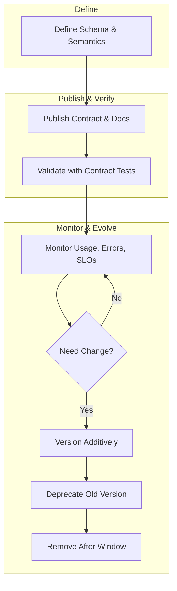
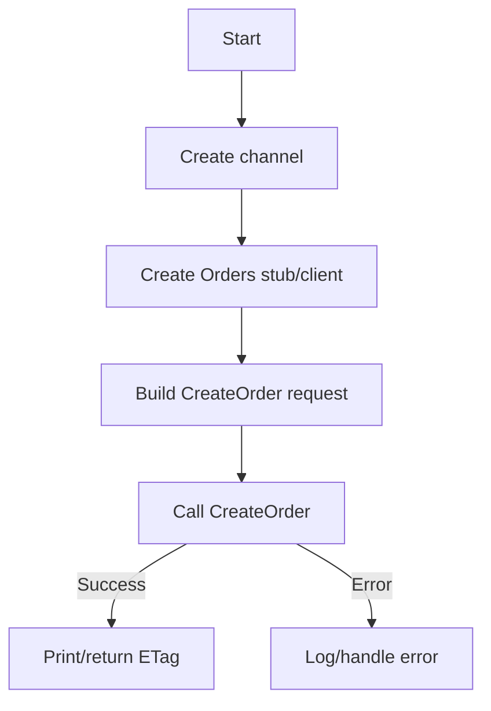

import Head from '@docusaurus/Head';
import Hero from "@site/src/components/Hero";
import Vs from '@site/src/components/Vs';
import Figure from '@site/src/components/Figure';
import Checklist from '@site/src/components/Checklist';
import DecisionMatrix from '@site/src/components/DecisionMatrix';
import Showcase from '@site/src/components/Showcase';
import Tabs from '@theme/Tabs';
import TabItem from '@theme/TabItem';

<Head>
  <meta
    name="description"
    content="Define crisp boundaries and explicit, testable contracts to decouple teams and evolve systems safely."
  />
  <meta property="og:title" content="Interfaces and Contracts" />
  <meta
    property="og:description"
    content="Define crisp boundaries and explicit, testable contracts to decouple teams and evolve systems safely."
  />
  <meta property="og:image" content="https://archman.dev/img/data-modeling/physical.png" />
  <meta name="twitter:card" content="summary_large_image" />
  <link rel="canonical" href="https://archman.dev/docs/foundational-concepts/system-thinking-basics/interfaces-and-contracts" />
  <script type="application/ld+json">{JSON.stringify({
    "@context": "https://schema.org",
    "@type": "Article",
    "headline": "Interfaces and Contracts",
    "description": "Define crisp boundaries and explicit, testable contracts to decouple teams and evolve systems safely.",
    "image": "https://archman.dev/img/data-modeling/physical.png",
    "keywords": [
      "interfaces","contracts","compatibility","versioning","api-first","idempotency","problem details","etags","contract testing","schema evolution","grpc","openapi","asyncapi"
    ],
    "author": {"@type":"Person","name":"Archman"},
    "dateModified": "2025-09-10"
  })}</script>
  <script type="application/ld+json">{JSON.stringify({
    "@context":"https://schema.org",
    "@type":"BreadcrumbList",
    "itemListElement":[
      {"@type":"ListItem","position":1,"name":"Foundational Concepts","item":"https://archman.dev/docs/foundational-concepts"},
      {"@type":"ListItem","position":2,"name":"System Thinking Basics","item":"https://archman.dev/docs/foundational-concepts/system-thinking-basics"},
      {"@type":"ListItem","position":3,"name":"Interfaces and Contracts","item":"https://archman.dev/docs/foundational-concepts/system-thinking-basics/interfaces-and-contracts"}
    ]
  })}</script>
</Head>

<Hero
  title="Interfaces and Contracts"
  subtitle="Define crisp boundaries and explicit, testable contracts to decouple teams and evolve systems safely"
  imageAlt="Interface and contract design illustration showing system boundaries and communication protocols"
  size="large"
/>

## What Are Interfaces and Contracts?

Interfaces define the boundaries between software components, while contracts make the behavior at those boundaries explicit, predictable, and testable. Well-defined interfaces and strong contracts are foundational to building scalable, maintainable, and evolvable systems, as they enable teams to work independently and components to be replaced or updated with confidence.

This article provides conceptual and practical guidance for defining, evolving, and verifying contracts.

**Out of Scope:** Protocol-specific implementation details are not covered here. For deeper dives into specific API styles, see [API & Interface Design](../../api-and-interface-design/), including guides for [REST](../../api-and-interface-design/restful-api-design/), [gRPC](../../api-and-interface-design/grpc-rpc), and [GraphQL](../../api-and-interface-design/graphql).

## TL;DR

Explicit, versioned, machine-readable contracts at component boundaries reduce coupling and breakage. Design first (OpenAPI/Protobuf/AsyncAPI), automate compatibility checks (schema diff, CDC tests), and roll out changes safely with additive evolution, deprecation windows, and strong error models.

## Learning objectives

- You will be able to articulate the difference between an interface and a contract.
- You will be able to choose an interface style that fits consumers and runtime constraints.
- You will be able to evolve contracts additively and plan safe deprecations.
- You will be able to enforce compatibility in CI using schema diffs and CDC tests.
- You will be able to design error and concurrency control (Problem Details, ETags) at boundaries.

## Motivating scenario

Your platform team exposes an Orders service consumed by web, mobile, and internal batch jobs. Product asks for a new attribute on order creation. You must add it without breaking existing clients, validate compatibility in CI, and roll out gradually across dozens of services. Well-defined contracts and a disciplined evolution strategy make this change safe and predictable.

## Core Concepts

At its heart, an interface is the set of operations, messages, or events a component exposes. A contract adds the critical layer of explicit expectations about inputs, outputs, behavior, performance, and error conditions.

-   **Interface**: The formal declaration of *what* a component can do. This includes method signatures, resource URLs, event types, and data schemas. It's the "how to call me" guide.
-   **Contract**: The precise, testable agreement on *how a component will behave* when its interface is used. This covers functional semantics (invariants, side effects), non-functional characteristics (latency, throughput), and security guarantees.
-   **Compatibility**: The strategy for managing change. Contracts must address backward compatibility (old consumers can talk to new providers) and forward compatibility (new consumers can talk to old providers) to prevent "big bang" upgrades.

<Figure caption="A contract lifecycle involves defining, publishing, and continuously validating the contract against real-world usage, with a formal process for versioning and deprecation.">

</Figure>

### Compatibility & versioning matrix

<DecisionMatrix
  caption="How to evolve a contract change safely"
  columns={["Backward compatible?", "Strategy", "Notes"]}
  rows={[
    { name: "Add optional field", cells: ["Yes", "Bump minor; default server behavior; ignore unknown fields", "Consumers gradually adopt"], highlightTone: "positive" },
    { name: "Tighten validation", cells: ["No", "Feature flag + canary; dual-validate; announce deprecation", "Measure error rates before enforcing"], highlightTone: "warning" },
    { name: "Rename/remove field", cells: ["No", "Add new → dual-write/read → deprecate old after window", "Publish migration plan and deadline"], highlightTone: "warning" },
    { name: "Change error model", cells: ["Maybe", "Introduce structured errors in parallel", "Map old → new codes; keep correlation IDs"], highlightTone: "info" }
  ]}
/>

## Practical Examples and Implementation

Contracts are most effective when they are machine-readable and integrated into the development lifecycle.

### API and Event Definitions

Here are excerpts of what a contract looks like in different styles for an "Orders" service.

<Tabs groupId="lang" queryString>
<TabItem value="openapi" label="OpenAPI (REST)">
```yaml title="openapi.yaml (excerpt)" showLineNumbers
openapi: 3.0.3
info: { title: Orders API, version: 1.2.0 }
paths:
  /orders:
    post:
      summary: Create order
      operationId: createOrder
      parameters:
        - in: header
          name: Idempotency-Key
          required: true
          schema: { type: string, format: uuid }
      requestBody:
        required: true
        content:
          application/json:
            schema: { $ref: '#/components/schemas/CreateOrder' }
      responses:
        '202':
          description: Accepted
          headers:
            ETag: { schema: { type: string } }
        '409':
          description: Conflict
          content:
            application/problem+json:
              schema: { $ref: '#/components/schemas/Problem' }
# ...
```
</TabItem>
<TabItem value="proto" label="Protobuf (gRPC)">
```protobuf title="orders.proto (excerpt)" showLineNumbers
syntax = "proto3";
package orders.v1;

message CreateOrderRequest {
  string idempotency_key = 1; // UUID format
  string order_id = 2;
  repeated string item_ids = 3;
  reserved 4, 7;
  reserved "old_field";
}

message CreateOrderResponse {
  string etag = 1;
}

service Orders {
  // Creates a new order.
  // Idempotent via idempotency_key.
  rpc CreateOrder(CreateOrderRequest) returns (CreateOrderResponse) {}
}
```
</TabItem>
<TabItem value="asyncapi" label="AsyncAPI (Events)">
```yaml title="asyncapi.yaml (excerpt)" showLineNumbers
asyncapi: '2.6.0'
info:
  title: Order Events
  version: '1.0.0'
channels:
  orders.events:
    subscribe:
      message:
        $ref: '#/components/messages/OrderCreated'
components:
  messages:
    OrderCreated:
      summary: An order was successfully created.
      payload:
        type: object
        properties:
          orderId: { type: string }
          customerId: { type: string }
          timestamp: { type: string, format: date-time }
```
</TabItem>
</Tabs>

### Client Implementation Example

A consumer interacting with the gRPC contract.

<Figure caption="Call flow for a client using the Orders gRPC contract (common to all languages).">

</Figure>

<Tabs groupId="client-lang" queryString>
<TabItem value="python" label="Python">
```python title="client.py" showLineNumbers
import grpc
import orders_pb2
import orders_pb2_grpc
import uuid

def run():
    with grpc.insecure_channel('localhost:50051') as channel:
        stub = orders_pb2_grpc.OrdersStub(channel)
        idempotency_key = str(uuid.uuid4())
        try:
            response = stub.CreateOrder(
                orders_pb2.CreateOrderRequest(
                    idempotency_key=idempotency_key,
                    order_id="ord-123",
                    item_ids=["item-abc", "item-def"]
                )
            )
            print(f"Order created with ETag: {response.etag}")
        except grpc.RpcError as e:
            print(f"RPC failed: {e.code()} - {e.details()}")

if __name__ == '__main__':
    run()
```
</TabItem>
<TabItem value="go" label="Go">
```go title="client.go" showLineNumbers
package main

import (
	"context"
	"log"
	"time"

	"google.golang.org/grpc"
	"google.golang.org/grpc/credentials/insecure"
	pb "path/to/your/gen/go/orders/v1"
)

func main() {
	conn, err := grpc.Dial("localhost:50051", grpc.WithTransportCredentials(insecure.NewCredentials()))
	if err != nil {
		log.Fatalf("did not connect: %v", err)
	}
	defer conn.Close()
	c := pb.NewOrdersClient(conn)

	ctx, cancel := context.WithTimeout(context.Background(), time.Second)
	defer cancel()

	req := &pb.CreateOrderRequest{
		IdempotencyKey: "a-unique-key",
		OrderId:      "ord-123",
		ItemIds:      []string{"item-abc", "item-def"},
	}
	r, err := c.CreateOrder(ctx, req)
	if err != nil {
		log.Fatalf("could not create order: %v", err)
	}
	log.Printf("Order created with ETag: %s", r.GetEtag())
}
```
</TabItem>
<TabItem value="node" label="Node.js">
```javascript title="client.js" showLineNumbers
const grpc = require('@grpc/grpc-js');
const protoLoader = require('@grpc/proto-loader');
const { v4: uuidv4 } = require('uuid');

const PROTO_PATH = './orders.proto';
const packageDefinition = protoLoader.loadSync(PROTO_PATH);
const orders_proto = grpc.loadPackageDefinition(packageDefinition).orders.v1;

function main() {
  const client = new orders_proto.Orders('localhost:50051', grpc.credentials.createInsecure());
  const idempotencyKey = uuidv4();

  client.createOrder({
    idempotency_key: idempotencyKey,
    order_id: "ord-123",
    item_ids: ["item-abc", "item-def"]
  }, (err, response) => {
    if (err) {
      console.error('Error: ', err);
      return;
    }
    console.log('Order created with ETag:', response.etag);
  });
}

main();
```
</TabItem>
</Tabs>

## Hands-on exercise: Add a field without breaking consumers

1. Define the new optional field in your contract (OpenAPI, Protobuf, or AsyncAPI) and regenerate stubs/schemas.
2. Implement provider logic to accept and ignore the field when absent; keep defaults stable.
3. Add CI checks to prevent breaking changes and verify CDCs.
4. Roll out with a canary and monitor error rates and p95/99 latency.

## Patterns and Pitfalls

### Patterns for Success

-   **Design First, Code Second**: Use tools like OpenAPI, Protobuf, or AsyncAPI to define and review contracts before writing implementation code. This is a core tenet of [API-First Design](../../api-and-interface-design/api-governance-and-api-first).
-   **Consumer-Driven Contracts**: Empower consumers to define the contract they need. The provider then implements tests to ensure they meet that contract, preventing breaking changes before they are deployed. See [Contract Testing](../../testing-strategy/testing-pyramid/contract-cdc).
-   **Semantic Versioning**: Use version numbers (e.g., `v1.2.3`) that clearly communicate the nature of changes (major, minor, patch). This is especially critical for event schemas and public APIs.
-   **Idempotency by Default**: Design operations that can be safely retried without causing unintended side effects. This is crucial for building reliable distributed systems. See [Idempotency](../../distributed-systems-and-microservices/fundamentals/idempotency).

### Common Pitfalls

-   **Implicit Contracts**: Relying on convention or tribal knowledge instead of explicit, machine-readable definitions. This leads to integration bugs and slow development.
-   **Leaky Abstractions**: Exposing internal implementation details in the interface. This creates tight coupling and makes future refactoring difficult. See [Abstractions and Encapsulation](./abstractions-and-encapsulation).
-   **Breaking Changes**: Renaming fields, removing endpoints, or tightening validation without a versioning and deprecation strategy. This breaks consumers and erodes trust.
-   **Anemic Error Contracts**: Returning generic error messages (e.g., `500 Internal Server Error`) without a structured body, stable error codes, or a correlation ID. This makes debugging and automated error handling nearly impossible. See [Error Formats & Problem Details](../../api-and-interface-design/restful-api-design/error-formats-and-problem-details).

## Edge Cases and Considerations

-   **Large Payloads**: How does the interface handle large requests or responses? Implement streaming or pagination, and enforce strict payload size limits to protect the service.
-   **Concurrency**: What happens when multiple clients try to modify the same resource simultaneously? Use mechanisms like [ETags](../../api-and-interface-design/restful-api-design/concurrency-control-etags) (`If-Match` header) for optimistic concurrency control.
-   **Timeouts and Partial Failures**: In a distributed system, network calls can be slow or fail. Contracts should include timeout and retry policies. See [Timeouts, Retries, and Backoff](../../distributed-systems-and-microservices/resilience-and-reliability-patterns/timeouts-retries-exponential-backoff-jitter).
-   **Multi-Tenancy**: In a multi-tenant system, the contract must define how tenant data is isolated and whether per-tenant rate limits or quotas are applied.

## Testing and Verification

A contract is only as good as its enforcement.

-   **Contract Testing**: Use tools like Pact to create consumer-driven contracts that verify interactions without requiring a fully integrated environment.
-   **Schema Validation**: Automate schema checks in your CI/CD pipeline. Tools like `buf breaking` for Protobuf or `oas-diff` for OpenAPI can fail a build if a breaking change is detected.
-   **Compatibility Testing**: Maintain a suite of tests that runs new provider versions against old consumer versions (and vice-versa) to guarantee backward and forward compatibility.
-   **Fuzz Testing**: Automatically generate a wide range of malformed or unexpected inputs to test the robustness of the interface and ensure it fails gracefully.

```yaml title="ci-contract-checks.yaml" showLineNumbers
jobs:
  contract_checks:
    name: Verify API Compatibility
    steps:
      # Check for breaking changes against the main branch
      - run: buf breaking --against '.git#branch=main'
      - run: oas-diff --fail-on-breaking base:main/spec.yaml head:spec.yaml

      # Verify provider against consumer-driven contracts
      - run: pact-broker verify --provider-version=$CI_COMMIT_SHA --provider-base-url=$PROVIDER_URL
```

## Operational Considerations

-   **SLOs**: Define and monitor Service Level Objectives (SLOs) for each critical operation, including success rate, latency (P50/P95/P99), and data freshness.
-   **Rollouts**: Use deployment strategies like blue-green or canary releases to roll out contract changes. For breaking changes, use feature flags and a dual-write/dual-read approach during the transition period.
-   **Rate Limiting and Quotas**: Implement and clearly document rate limits and resource quotas to protect the service from abuse and ensure fair use.

## Security and Compliance

-   **Authentication and Authorization**: The contract must specify the security model. Every operation should define the required authentication method (e.g., OAuth 2.0) and authorization scope (e.g., `orders:read`).
-   **Data Classification**: Explicitly classify data in the contract (e.g., PII, financial). This informs encryption, logging, and access control policies.
-   **Secrets Management**: Ensure that secrets, API keys, or tokens are never part of the interface's URL or logs.

## Observability

-   **Correlation IDs**: Mandate a correlation ID in all requests and ensure it's propagated through all downstream calls and included in every log message.
-   **Structured Logging**: Log all interface interactions at the boundary using a structured format (e.g., JSON), including operation name, parameters (with PII redacted), and outcome.
-   **Metrics and Tracing**: Instrument every operation with metrics for request rate, error rate, and duration (the RED method). Use distributed tracing to visualize the flow of requests across services.

## Design Review Checklist

Use this checklist to validate the quality and completeness of an interface contract during design reviews.

<Checklist
  title="Interface Contract Review"
  items={[
    { label: 'Interface is minimal, coherent, and avoids exposing internal details.' },
    { label: 'Contract is explicit, machine-readable (e.g., OpenAPI, Protobuf), and versioned.' },
    { label: 'Error contract is standardized (e.g., problem+json) with stable error codes.' },
    { label: 'Versioning and deprecation strategy is clearly defined.' },
    { label: 'Compatibility checks (schema diff, CDC tests) are automated in CI.' },
    { label: 'Security model (authn/authz) is defined per-operation.' },
    { label: 'Data classification is explicit, and PII handling is defined.' },
    { label: 'Observability is built-in: correlation IDs, structured logs, and RED metrics.' },
    { label: 'Rollout and rollback strategy is defined, especially for breaking changes.' },
    { label: 'Rate limits, quotas, and pagination are documented and enforced.' },
    { label: 'Edge cases like concurrency, large payloads, and retries are handled.' },
  ]}
/>

## Signals & anti‑signals

<Showcase
  title="When strong contracts are a good fit vs overkill"
  sections={[
    {
      label: 'Signals',
      body: (
        <>Multi-team integration; public API or widely consumed events; long‑lived clients; regulated data; need for parallel versions and safe rollouts.</>
      ),
      tone: 'positive'
    },
    {
      label: 'Anti‑signals',
      body: (
        <>Private, in‑process functions; single team, co‑deployed components; rapidly iterating prototypes with no external consumers.</>
      ),
      tone: 'info'
    }
  ]}
/>

## When to Use

-   At any boundary that crosses a team, service, process, or technology divide.
-   When building a platform or service that will be consumed by multiple independent clients.
-   When decoupling a monolith into microservices.

## When Not to Use

-   For private, in-process methods within a single, co-deployed component. These can be refactored freely without the overhead of formal contracts.

## Related Topics

-   [Components, Connectors, and Configurations](./components-connectors-configurations)
-   [Abstractions and Encapsulation](./abstractions-and-encapsulation)
-   [API Versioning Strategies](../../api-and-interface-design/versioning-strategies)
-   [Consumer-Driven Contract Testing](../../testing-strategy/testing-pyramid/contract-cdc)

## Next steps

- Read [API Governance & API‑First](../../api-and-interface-design/api-governance-and-api-first)
- Calibrate [Versioning Strategies](../../api-and-interface-design/versioning-strategies)
- Standardize [Error Formats & Problem Details](../../api-and-interface-design/restful-api-design/error-formats-and-problem-details)
- Enforce [Contract (CDC) Testing](../../testing-strategy/testing-pyramid/contract-cdc)
- Explore [Schema Evolution & Versioning](../../distributed-systems-and-microservices/data-in-microservices/schema-evolution-and-versioning)

## Self‑check

1. What is the difference between an interface and a contract?
2. Name two strategies to evolve a contract without breaking consumers.
3. Which CI checks help prevent accidental breaking changes?

:::info
One takeaway: Treat contracts as products. Version deliberately, test continuously, and deprecate with empathy.
:::

## References

1.  <a href="https://martinfowler.com/articles/consumerDrivenContracts.html" target="_blank" rel="nofollow noopener noreferrer">Consumer-Driven Contracts ↗️</a>
2.  <a href="https://www.openapis.org/what-is-openapi" target="_blank" rel="nofollow noopener noreferrer">OpenAPI Initiative ↗️</a>
3.  <a href="https://grpc.io" target="_blank" rel="nofollow noopener noreferrer">gRPC ↗️</a>
4.  <a href="https://www.asyncapi.com/" target="_blank" rel="nofollow noopener noreferrer">AsyncAPI Initiative ↗️</a>
5.  <a href="https://tools.ietf.org/html/rfc7807" target="_blank" rel="nofollow noopener noreferrer">Problem Details for HTTP APIs (RFC 7807) ↗️</a>
