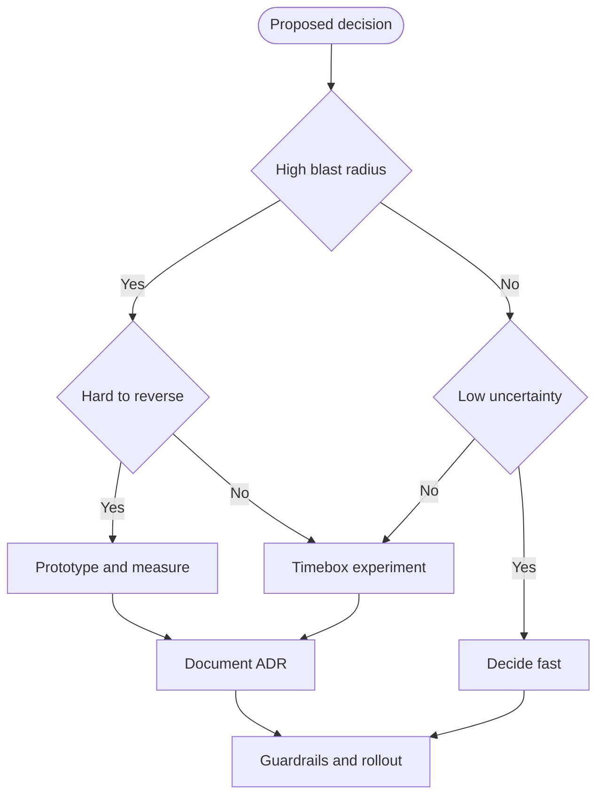

# Architectural Decision Impact & Cost of Change

import Showcase from '@site/src/components/Showcase';
import Vs from '@site/src/components/Vs';

Architectural decisions shape the system’s long-term qualities. The later you reverse a high-impact choice, the more expensive it becomes. This page helps you identify high‑leverage decisions, assess reversibility, and reduce the cost of change with deliberate techniques.

- Scope: decision impact, reversibility, cost‑of‑change dynamics, mitigation techniques, and when to formalize decisions.
- Out of scope: stakeholder responsibilities and governance (see [Stakeholders & Concerns](./stakeholders-and-concerns)); level boundaries (see [Architecture vs. Design vs. Implementation](./architecture-vs-design-vs-implementation)).

## Core concepts

| Concept         | What it means                                           | Why it matters                                                   |
| --------------- | ------------------------------------------------------- | ---------------------------------------------------------------- |
| Decision impact | The blast radius if the decision is wrong               | Guides formality and validation depth                            |
| Reversibility   | Ease of undoing or changing course                      | Drives urgency to prototype and the value of option preservation |
| Cost of change  | Effort, risk, and coordination required to change later | Typically rises with time and coupling                           |
| Option value    | Benefit of keeping alternatives open                    | Justifies modularity, seams, and incremental commitments         |
| Evidence loop   | Prototypes, benchmarks, and experiments                 | Reduces uncertainty before committing                            |

Two useful mental models:

- One‑way vs two‑way doors: one‑way are hard to reverse and deserve extra rigor; two‑way are revisitable and should be decided quickly to maintain flow.
- Cost‑of‑change curve: changes that span contracts, data, and deployments tend to get costlier as the system and organization evolve.

## Decision flow

Use this flow to calibrate rigor and timing.

Practical cues:

- High blast radius examples: data model and storage choice, core API shapes, inter‑service communication style, region and failover posture.
- Hard to reverse examples: shared database between services, globally visible IDs or event shapes, authentication and token formats.

## Showcases

<Vs
  title="Database per service vs Shared database"
  items={[
    {
      label: 'Database per service',
      points: [
        'Autonomous scaling & deploys',
        'Clear ownership boundaries',
        'Consistency work and duplication',
      ],
      highlightTone: 'positive',
    },
    {
      label: 'Shared database',
      points: [
        'Easy joins early',
        'Hidden coupling, cross‑team blast radius',
        'Hard to evolve schemas independently',
      ],
      highlightTone: 'warning',
    },
  ]}
  highlight={[0,1]}
/>

<Vs
  title="Sync request‑reply vs Async messaging (core workflows)"
  items={[
    {
      label: 'Sync request‑reply',
      points: [
        'Simple mental model',
        'Predictable latency when healthy',
        'Fragile under partial failure',
      ],
    },
    {
      label: 'Async messaging',
      points: [
        'Throughput smoothing & isolation',
        'Eventual consistency complexity',
        'Operational overhead (brokers, DLQs)',
      ],
    },
  ]}
/>

<Vs
  title="Multi‑region: Active‑active vs Active‑passive"
  items={[
    {
      label: 'Active‑active',
      points: [
        'Lower RTO/RPO',
        'Conflict/consistency challenges',
        'Higher operational cost',
      ],
    },
    {
      label: 'Active‑passive',
      points: [
        'Simpler runbooks',
        'Longer failovers acceptable',
        'Lower infra/complexity',
      ],
    },
  ]}
/>

## Lowering the cost of change

<Showcase
  title="Preserve options with seams"
  sections={[
    {
      label: 'Impact',
      body: (
        <>Keeps alternatives open and localizes risk, so late changes affect fewer modules and teams.</>
      ),
      tone: 'positive',
    },
    {
      label: 'Trade‑offs',
      body: (
        <>Adds indirection and upfront design effort; unused seams can become accidental complexity. Requires discipline to keep boundaries real.</>
      ),
      tone: 'warning',
    },
  ]}
>
- Modular monolith with clear boundaries before extracting services.
- Ports and adapters to isolate frameworks and external systems.
</Showcase>

<Showcase
  title="Shift left on evidence"
  sections={[
    {
      label: 'Impact',
      body: (
        <>Exposes feasibility and performance risks early, shrinking costly late‑stage reversals.</>
      ),
      tone: 'positive',
    },
    {
      label: 'Trade‑offs',
      body: (
        <>Spikes and canaries cost time/infra and can be noisy; avoid analysis paralysis with timeboxes and clear exit criteria.</>
      ),
      tone: 'warning',
    },
  ]}
>
- Timeboxed spikes; measure latency, throughput, and error behavior under load.
- Small A/B or canary rollouts to validate assumptions in production.
</Showcase>

<Showcase
  title="Reduce coupling"
  sections={[
    {
      label: 'Impact',
      body: (
        <>Decouples teams and deployables so changes can ship independently with fewer cascades.</>
      ),
      tone: 'positive',
    },
    {
      label: 'Trade‑offs',
      body: (
        <>Versioning, deprecations, and CDC add overhead; contract‑first slows initial delivery but pays back with safer evolution.</>
      ),
      tone: 'warning',
    },
  ]}
>
- Contract‑first APIs and consumer‑driven tests to avoid accidental drift.
- Events as integration contracts with versioning and deprecation policy.
</Showcase>

<Showcase
  title="Make change safe"
  sections={[
    {
      label: 'Impact',
      body: (
        <>Introduce changes gradually, observe, and roll back quickly when needed.</>
      ),
      tone: 'positive',
    },
    {
      label: 'Trade‑offs',
      body: (
        <>Feature flags create config sprawl and test matrix growth; clean up stale flags to reduce debt.</>
      ),
      tone: 'warning',
    },
  ]}
>
- Feature flags, dark launches, and kill switches.
- Strangler fig for legacy replacement; branch by abstraction for live migrations.
</Showcase>

## When to formalize with ADRs

Use Architecture Decision Records (ADRs) for decisions that are any of: high blast radius, cross‑team impact, long‑lived constraints, regulated or risky. Keep entries short: context, decision, consequences, status. See the ADR materials:

- [ADR Index](../../documentation-and-modeling/architecture-decision-records-adr/)
- [Template & Rationale](../../documentation-and-modeling/architecture-decision-records-adr/template-and-rationale)
- [Catalog & Traceability](../../documentation-and-modeling/architecture-decision-records-adr/catalog-and-traceability)
- [Linking to Code & Docs](../../documentation-and-modeling/architecture-decision-records-adr/linking-to-code-and-docs)

### Lightweight decisions

If a decision is low impact and reversible, prefer quick notes in issues or PRs over formal ADRs. Momentum is also a cost.

## Related topics

- [Architecture vs. Design vs. Implementation](./architecture-vs-design-vs-implementation)
- [Stakeholders & Concerns](./stakeholders-and-concerns)
- Broader guidance: [Documentation & Modeling](../../documentation-and-modeling/)

## References

<!-- markdownlint-disable MD033 -->
1. <a href="https://www.aboutamazon.com/news/company-news/2016-letter-to-shareholders" target="_blank" rel="nofollow noopener noreferrer">Bezos, 2016 Letter to Shareholders — high‑velocity decisions & two‑way doors ↗️</a>
2. <a href="https://evolutionaryarchitecture.com/precis.html" target="_blank" rel="nofollow noopener noreferrer">Ford, Parsons, Kua — Building Evolutionary Architectures (précis) ↗️</a>
3. <a href="https://cognitect.com/blog/2011/11/15/documenting-architecture-decisions" target="_blank" rel="nofollow noopener noreferrer">Nygard, Documenting Architecture Decisions ↗️</a>
<!-- markdownlint-enable MD033 -->
