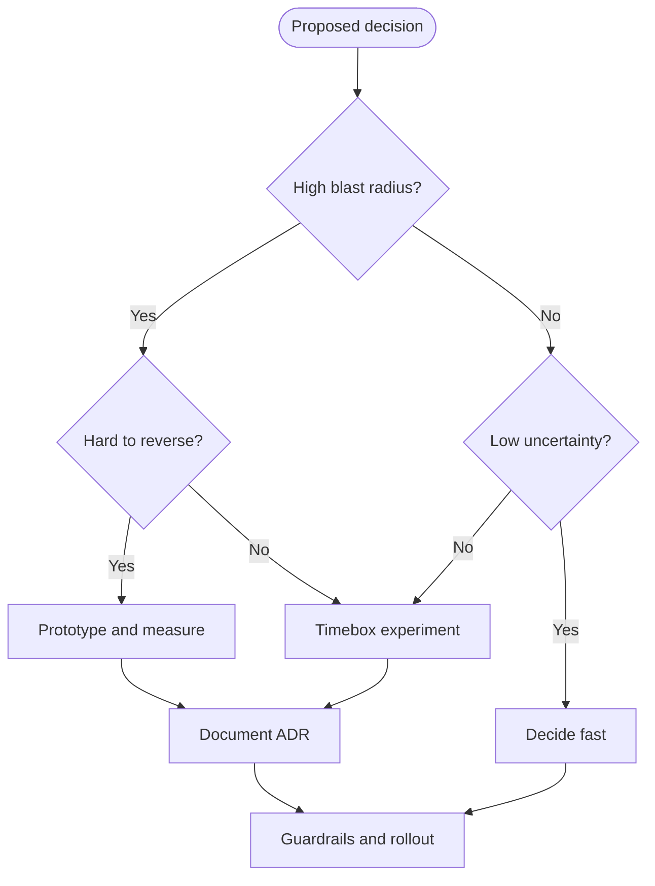

import Showcase from '@site/src/components/Showcase';
import Vs from '@site/src/components/Vs';
import Figure from '@site/src/components/Figure';
import Checklist from '@site/src/components/Checklist';
import DecisionMatrix from "@site/src/components/DecisionMatrix";

# Architectural Decision Impact & Cost of Change

Architectural decisions shape the system’s long-term qualities. The later you reverse a high-impact choice, the more expensive it becomes. This page helps you identify high‑leverage decisions, assess reversibility, and reduce the cost of change with deliberate techniques.

- Scope: decision impact, reversibility, cost‑of‑change dynamics, mitigation techniques, and when to formalize decisions.
- Out of scope: stakeholder responsibilities and governance (see [Stakeholders & Concerns](./stakeholders-and-concerns)); level boundaries (see [Architecture vs. Design vs. Implementation](./architecture-vs-design-vs-implementation)).

## Core concepts

| Concept         | What it means                                           | Why it matters                                                   |
| --------------- | ------------------------------------------------------- | ---------------------------------------------------------------- |
| Decision impact | The blast radius if the decision is wrong               | Guides formality and validation depth                            |
| Reversibility   | Ease of undoing or changing course                      | Drives urgency to prototype and the value of option preservation |
| Cost of change  | Effort, risk, and coordination required to change later | Typically rises with time and coupling                           |
| Option value    | Benefit of keeping alternatives open                    | Justifies modularity, seams, and incremental commitments         |
| Evidence loop   | Prototypes, benchmarks, and experiments                 | Reduces uncertainty before committing                            |

Two useful mental models:

- One‑way vs two‑way doors: one‑way are hard to reverse and deserve extra rigor; two‑way are revisitable and should be decided quickly to maintain flow.
- Cost‑of‑change curve: changes that span contracts, data, and deployments tend to get costlier as the system and organization evolve.

## Decision flow

Use this flow to calibrate rigor and timing.

<Figure caption="A flow for calibrating decision-making rigor based on impact, reversibility, and uncertainty.">

</Figure>

Practical cues:

- High blast radius examples: data model and storage choice, core API shapes, inter‑service communication style, region and failover posture.
- Hard to reverse examples: shared database between services, globally visible IDs or event shapes, authentication and token formats.

## Showcases

<Vs
  title="Database per service vs Shared database"
  items={[
    {
      label: 'Database per service',
      points: [
        'Autonomous scaling & deploys',
        'Clear ownership boundaries',
        'Consistency work and duplication',
      ],
      highlightTone: 'positive',
    },
    {
      label: 'Shared database',
      points: [
        'Easy joins early',
        'Hidden coupling, cross‑team blast radius',
        'Hard to evolve schemas independently',
      ],
      highlightTone: 'warning',
    },
  ]}
  highlight={[0,1]}
>
</Vs>

<Vs
  title="Sync request‑reply vs Async messaging (core workflows)"
  items={[
    {
      label: 'Sync request‑reply',
      points: [
        'Simple mental model',
        'Predictable latency when healthy',
        'Fragile under partial failure',
      ],
    },
    {
      label: 'Async messaging',
      points: [
        'Throughput smoothing & isolation',
        'Eventual consistency complexity',
        'Operational overhead (brokers, DLQs)',
      ],
    },
  ]}
>
</Vs>

<Vs
  title="Multi‑region: Active‑active vs Active‑passive"
  items={[
    {
      label: 'Active‑active',
      points: [
        'Lower RTO/RPO',
        'Conflict/consistency challenges',
        'Higher operational cost',
      ],
    },
    {
      label: 'Active‑passive',
      points: [
        'Simpler runbooks',
        'Longer failovers acceptable',
        'Lower infra/complexity',
      ],
    },
  ]}
>
</Vs>

## Lowering the cost of change

<Showcase
  title="Techniques to Lower the Cost of Change"
  sections={[
    {
      label: "Preserve options with seams",
      body: `**Impact**: Keeps alternatives open and localizes risk, so late changes affect fewer modules and teams.
      
**Examples**: Modular monolith with clear boundaries before extracting services; Ports and adapters to isolate frameworks.`,
      tone: 'positive',
    },
    {
      label: "Reduce uncertainty with evidence",
      body: `**Impact**: Replaces assumptions with data, de-risking high-impact decisions before full commitment.
      
**Examples**: Timeboxed spikes for new tech; Benchmarks for performance-critical paths; Small A/B or canary rollouts.`,
      tone: 'positive',
    },
    {
      label: "Design for evolution",
      body: `**Impact**: Builds change-tolerance into the system’s structure, lowering the cost of future adaptation.
      
**Examples**: API gateways to decouple clients from services; Events as integration contracts with versioning.`,
      tone: 'positive',
    },
    {
      label: "Use incremental migration patterns",
      body: `**Impact**: Allows large-scale change to happen gradually with less risk than a big-bang rewrite.
      
**Examples**: Strangler fig for legacy replacement; Branch by abstraction for live migrations.`,
      tone: 'positive',
    },
  ]}
/>

### Rigor calibration matrix (choose the lane)

<DecisionMatrix
  caption="Rigor calibration matrix"
  columns={["Impact", "Reversibility", "Uncertainty", "Recommended rigor"]}
  rows={[
    {
      cells: ["High", "Low", "High", "Prototype + benchmark, ADR, review, canary"],
      highlightTone: "warning",
    },
    {
      cells: ["High", "Low", "Low", "ADR, staged rollout, guardrails"],
    },
    {
      cells: ["Medium", "Medium", "Medium", "Timeboxed spike, notes, lightweight review"],
    },
    {
      cells: ["Low", "High", "Low", "Decide fast; document in PR/issue"],
      highlightTone: "info",
    },
  ]}
/>

## When to formalize with ADRs

Use Architecture Decision Records (ADRs) for decisions that are any of: high blast radius, cross‑team impact, long‑lived constraints, regulated or risky. Keep entries short: context, decision, consequences, status. See the ADR materials:

- [ADR Index](../../documentation-and-modeling/architecture-decision-records-adr/)
- [Template & Rationale](../../documentation-and-modeling/architecture-decision-records-adr/template-and-rationale)
- [Catalog & Traceability](../../documentation-and-modeling/architecture-decision-records-adr/catalog-and-traceability)
- [Linking to Code & Docs](../../documentation-and-modeling/architecture-decision-records-adr/linking-to-code-and-docs)

### Lightweight decisions

If a decision is low impact and reversible, prefer quick notes in issues or PRs over formal ADRs. Momentum is also a cost.

### Example: Feature flag to preserve options

```yaml title="flags/payment.yml" showLineNumbers
flags:
    psp_v2_enabled:
        default: false
        description: "Enable new PSP client for a subset of traffic"
        owners: ["payments-team"]
```

```go title="payment/client.go" showLineNumbers
package payment

import (
    "context"
)

type PSP interface {
    Authorize(ctx context.Context, req Request) (Response, error)
}

func Client(flagOn bool, v1 PSP, v2 PSP) PSP {
    if flagOn {
        return v2
    }
    return v1
}
```

```javascript title="payment/route.js" showLineNumbers
export async function postAuthorize(req, res) {
    const flagOn = await flags.isEnabled('psp_v2_enabled', { user: req.user?.id });
    const client = flagOn ? pspV2 : pspV1;
    const result = await client.authorize(req.body);
    return res.status(200).json(result);
}
```

## Design review checklist

<Checklist
  title="Design review checklist (decision impact)"
  items={[
    { label: 'Stakeholders and concerns identified; quality attribute scenarios drafted' },
    { label: 'Decision impact and reversibility assessed (one‑way vs two‑way door)' },
    { label: 'Evidence gathered for risky assumptions (prototype/benchmark/canary)' },
    { label: 'Contracts and data shapes versioned with deprecation policy' },
    { label: 'Operational plan: rollout, rollback, kill switch, SLO alerts' },
    { label: 'Security/privacy implications mapped (authn/z, data class, secrets)' },
    { label: 'Observability in place (logs/metrics/traces, correlation IDs)' },
    { label: 'ADR captured with context, decision, consequences, and status' },
  ]}
/>

## Operational, Security, and Testing Considerations

<Showcase
  title="Considerations by Decision Type"
  sections={[
    {
      label: "Operational Considerations",
      body: `**High-Impact Decisions** (e.g., region choice, failover strategy) demand rigorous operational planning, including automated failover tests, capacity planning, and detailed runbooks. Their SLOs are system-wide.
      
**Low-Impact Decisions** (e.g., a logging library change) require only local operational changes, like updating parsing rules in an observability pipeline.`,
      tone: "info",
    },
    {
      label: "Security, Privacy, and Compliance",
      body: `**High-Impact Decisions** like choosing an identity provider or defining data residency policies undergo strict security reviews and threat modeling. They set the security foundation.
      
**Low-Impact Decisions** must still adhere to the established security posture but are reviewed at the code/PR level (e.g., ensuring a new API endpoint correctly enforces its authorization policy).`,
      tone: "warning",
    },
    {
      label: "Observability",
      body: `For **high-impact decisions**, observability must be designed in. For example, when choosing an async messaging model, you must also design for distributed tracing, message-level monitoring, and dead-letter queue alerting.

For **low-impact decisions**, observability is about adding context to the existing framework, like adding a specific metric or log field.`,
      tone: "neutral",
    },
    {
      label: "Testing",
      body: `**High-Impact Decisions** are validated through end-to-end integration tests, contract testing, and often, chaos engineering to ensure the system's resilience.

**Low-Impact Decisions** are typically covered by unit and component tests, ensuring the change works as expected within its local boundary.`,
      tone: "positive",
    },
  ]}
/>

## Related topics

- [Architecture vs. Design vs. Implementation](./architecture-vs-design-vs-implementation)
- [Stakeholders & Concerns](./stakeholders-and-concerns)
- Broader guidance: [Documentation & Modeling](../../documentation-and-modeling/)

## References

<!-- markdownlint-disable MD033 -->
1. <a href="https://www.aboutamazon.com/news/company-news/2016-letter-to-shareholders" target="_blank" rel="nofollow noopener noreferrer">Bezos, 2016 Letter to Shareholders — high‑velocity decisions & two‑way doors ↗️</a>
2. <a href="https://evolutionaryarchitecture.com/precis.html" target="_blank" rel="nofollow noopener noreferrer">Ford, Parsons, Kua — Building Evolutionary Architectures (précis) ↗️</a>
3. <a href="https://cognitect.com/blog/2011/11/15/documenting-architecture-decisions" target="_blank" rel="nofollow noopener noreferrer">Nygard, Documenting Architecture Decisions ↗️</a>
<!-- markdownlint-enable MD033 -->
