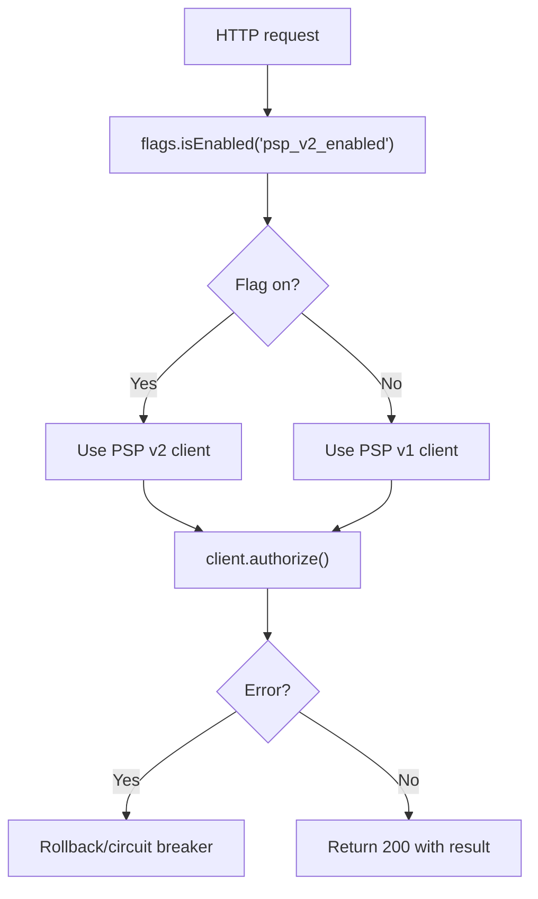

<Hero
  title="Architectural Decision Impact & Cost of Change"
  subtitle="Calibrate rigor with impact and reversibility; lower cost of change using seams, evidence, and staged rollouts"
  image="/img/archman-social-card.webp"
  imageAlt="Architectural decision making and cost of change illustration"
  size="large"
/>

## What Is Architectural Decision Impact & Cost of Change?

Architectural decisions shape the system's long-term qualities. The later you reverse a high-impact choice, the more expensive it becomes. This page helps you identify high‑leverage decisions, assess reversibility, and reduce the cost of change with deliberate techniques.

- **Scope**: decision impact, reversibility, cost‑of‑change dynamics, mitigation techniques, and when to formalize decisions.
- **Out of scope**: stakeholder responsibilities and governance (see [Stakeholders & Concerns](./stakeholders-and-concerns)); level boundaries (see [Architecture vs. Design vs. Implementation](./architecture-vs-design-vs-implementation)).

## TL;DR

High-impact, hard-to-reverse decisions deserve prototypes, evidence, and staged rollouts; reversible, low-blast-radius choices should be decided quickly to preserve flow. Reduce the cost of change by designing seams, versioning contracts, and gathering evidence before committing.

### Learning objectives

- You will be able to assess decision impact and reversibility to calibrate rigor.
- You will be able to lower cost of change using seams, flags, and versioning.
- You will be able to structure ADRs and plan staged rollouts with guardrails.

### Motivating scenario

Your team must choose between keeping a shared database or moving to database‑per‑service. The change could touch contracts, data migration, and deployment. Using impact and reversibility as guides, you prototype critical paths, capture an ADR, and plan a canary rollout to keep option value while de‑risking the path forward.

## Core Concepts

| Concept         | What it means                                           | Why it matters                                                   |
| --------------- | ------------------------------------------------------- | ---------------------------------------------------------------- |
| Decision impact | The blast radius if the decision is wrong               | Guides formality and validation depth                            |
| Reversibility   | Ease of undoing or changing course                      | Drives urgency to prototype and the value of option preservation |
| Cost of change  | Effort, risk, and coordination required to change later | Typically rises with time and coupling                           |
| Option value    | Benefit of keeping alternatives open                    | Justifies modularity, seams, and incremental commitments         |
| Evidence loop   | Prototypes, benchmarks, and experiments                 | Reduces uncertainty before committing                            |

### Mental Models

Two useful mental models guide architectural decision-making:

- **One‑way vs two‑way doors**: one‑way are hard to reverse and deserve extra rigor; two‑way are revisitable and should be decided quickly to maintain flow.
- **Cost‑of‑change curve**: changes that span contracts, data, and deployments tend to get costlier as the system and organization evolve.

## Decision Flow

Use this flow to calibrate rigor and timing for architectural decisions.

<Figure caption="A flow for calibrating decision-making rigor based on impact, reversibility, and uncertainty.">

</Figure>

Practical cues:

- High blast radius examples: data model and storage choice, core API shapes, inter‑service communication style, region and failover posture.
- Hard to reverse examples: shared database between services, globally visible IDs or event shapes, authentication and token formats.

## Decision Examples

<Vs title="Database per service vs Shared database"
  highlight={[0, 1]}
  items={[
{
      label: 'Database per service',
      points: [
        'Autonomous scaling and deploys',
        'Clear ownership boundaries',
        'Consistency work and duplication',
      ],
      highlightTone: 'positive',
    },
{
      label: 'Shared database',
      points: [
        'Simple joins and transactions',
        'Tight coupling between services',
        'Schema changes affect all consumers',
      ],
      highlightTone: 'warning',
    }
]} />

<Vs title="Sync request-reply vs Async messaging (core workflows)"
  highlight={[0, 1]}
  items={[
{
      label: 'Sync request-reply',
      points: [
        'Simple mental model',
        'Predictable latency when healthy',
        'Fragile under partial failure',
      ],
      highlightTone: 'info',
    },
{
      label: 'Async messaging',
      points: [
        'Resilient to partial failure',
        'Natural backpressure and buffering',
        'Complex debugging and ordering',
      ],
      highlightTone: 'info',
    }
]} />

<Vs title="Multi-region: Active-active vs Active-passive"
  highlight={[0, 1]}
  items={[
{
      label: 'Active-active',
      points: [
        'Lower RTO/RPO',
        'Conflict and consistency challenges',
        'Higher operational cost',
      ],
      highlightTone: 'info',
    },
{
      label: 'Active-passive',
      points: [
        'Simpler consistency model',
        'Higher RTO during failover',
        'Lower operational cost',
      ],
      highlightTone: 'info',
    }
]} />

## Lowering the Cost of Change

<Showcase
  title="Techniques to Lower the Cost of Change"
  sections={[
    {
      label: "Preserve options with seams",
      body: `**Impact**: Keeps alternatives open and localizes risk, so late changes affect fewer modules and teams.
      
**Examples**: Modular monolith with clear boundaries before extracting services; Ports and adapters to isolate frameworks.`,
      tone: 'positive',
    },
    {
      label: "Reduce uncertainty with evidence",
      body: `**Impact**: Replaces assumptions with data, de-risking high-impact decisions before full commitment.
      
**Examples**: Timeboxed spikes for new tech; Benchmarks for performance-critical paths; Small A/B or canary rollouts.`,
      tone: 'positive',
    },
    {
      label: "Design for evolution",
      body: `**Impact**: Builds change-tolerance into the system’s structure, lowering the cost of future adaptation.
      
**Examples**: API gateways to decouple clients from services; Events as integration contracts with versioning.`,
      tone: 'positive',
    },
    {
      label: "Use incremental migration patterns",
      body: `**Impact**: Allows large-scale change to happen gradually with less risk than a big-bang rewrite.
      
**Examples**: Strangler fig for legacy replacement; Branch by abstraction for live migrations.`,
      tone: 'positive',
    },
  ]}
/>

## Patterns and Pitfalls

- Favor seams and adapters to isolate irreversible vendor/framework choices; avoid leaking vendor types across domain boundaries.
- Prefer versioned contracts for APIs/events; avoid “flag day” migrations and shared mutable models.
- Capture irreversible cross-team decisions with an ADR; avoid tribal knowledge in chat threads.
- Beware entangled rollouts (DB schema + protocol + UI all at once). Stage changes and use compatibility shims.
- Avoid over-engineering for hypothetical futures; invest in option value where signals justify it.

## Edge Cases

- Long-lived clients pinned to old contracts: support parallel versions and measure tail adoption before removal.
- Partial failures in async flows: ensure idempotency keys and dead-letter handling to prevent duplicate side effects.
- Data residency/sovereignty: region moves may require re-encryption/re-keying and legal review—treat as one-way doors.
- High-throughput hot paths: micro-optimizations can harden coupling; measure first and encapsulate optimizations behind interfaces.

### Rigor Calibration Matrix

<DecisionMatrix
  caption="Rigor calibration matrix"
  columns={["Impact", "Reversibility", "Uncertainty", "Recommended rigor"]}
  rows={[
    {
      name: "High impact × Low reversibility × High uncertainty",
      cells: ["High", "Low", "High", "Prototype + benchmark, ADR, review, canary"],
      highlightTone: "warning",
    },
    {
      name: "High impact × Low reversibility × Low uncertainty",
      cells: ["High", "Low", "Low", "ADR, staged rollout, guardrails"],
    },
    {
      name: "Medium impact × Medium reversibility × Medium uncertainty",
      cells: ["Medium", "Medium", "Medium", "Timeboxed spike, notes, lightweight review"],
    },
    {
      name: "Low impact × High reversibility × Low uncertainty",
      cells: ["Low", "High", "Low", "Decide fast; document in PR/issue"],
      highlightTone: "info",
    },
  ]}
/>

## When to Use Heavy Rigor (and When Not To)

- Use heavy rigor when impact is high, reversibility is low, or uncertainty is high (e.g., data model choices, inter-service protocols, region strategy).
- Use lightweight notes when impact is low and reversibility is high (e.g., library swaps behind stable interfaces). Optimize for flow.

### Signals & Anti-Signals

<ProsCons
  pros={[
    'Impact spans contracts/data/deployments',
    'Reversal requires multi-team coordination',
    'Uncertainty or novelty is high (performance/security unclear)',
  ]}
  cons={[
    'Change is isolated behind a stable interface seam',
    'Low blast radius with trivial rollback path',
    'Evidence already strong and uncertainty is low',
  ]}
/>

## When to Formalize with ADRs

Use Architecture Decision Records (ADRs) for decisions that are any of: high blast radius, cross‑team impact, long‑lived constraints, regulated or risky. Keep entries short: context, decision, consequences, status. See the ADR materials:

- [ADR Index](../../documentation-and-modeling/architecture-decision-records-adr/)
- [Template & Rationale](../../documentation-and-modeling/architecture-decision-records-adr/template-and-rationale)
- [Catalog & Traceability](../../documentation-and-modeling/architecture-decision-records-adr/catalog-and-traceability)
- [Linking to Code & Docs](../../documentation-and-modeling/architecture-decision-records-adr/linking-to-code-and-docs)

### Lightweight Decisions

If a decision is low impact and reversible, prefer quick notes in issues or PRs over formal ADRs. Momentum is also a cost.

## Hands-On Exercise

Follow these steps to calibrate rigor and preserve options for a risky integration change.

1. Draft a quick hypothesis and risks for the decision (impact, reversibility, uncertainty).
2. Add a feature flag to route a small percentage of traffic to the new path.
3. Define rollback and observability guardrails (alerts, metrics, traces).
4. Capture an ADR summarizing context, decision, and consequences.

```md title="adr/0001-integration-choice.md" showLineNumbers
# Decision
Adopt PSP v2 behind a feature flag with staged rollout.

# Context
High potential impact across contracts and performance; reversibility is limited without a seam. Uncertainty around p95 latency.

# Consequences
Implement flag routing, benchmarks on hot paths, and canary rollout with rollback criteria. Version event contracts to avoid flag day.
```

### Example: Feature Flag to Preserve Options

<Figure caption="Sequential call flow for a feature-flagged payment authorization path.">

</Figure>

```yaml title="flags/payment.yml" showLineNumbers
flags:
    psp_v2_enabled:
        default: false
        description: "Enable new PSP client for a subset of traffic"
        owners: ["payments-team"]
```

<Tabs groupId="lang" queryString>
  <TabItem value="python" label="Python">

```python title="payment/client.py" showLineNumbers
from typing import Protocol

class PSP(Protocol):
    def authorize(self, request: dict) -> dict: ...

def client(flag_on: bool, v1: PSP, v2: PSP) -> PSP:
    if flag_on:
        return v2
    return v1

def post_authorize(request, flags, psp_v1: PSP, psp_v2: PSP):
    flag_on = flags.is_enabled("psp_v2_enabled", {"user": request.user.id})
    chosen = client(flag_on, psp_v1, psp_v2)
    result = chosen.authorize(request.json)
    return {"status": 200, "body": result}
```

  </TabItem>
  <TabItem value="go" label="Go">

```go title="payment/client.go" showLineNumbers
package payment

import (
    "context"
)

type PSP interface {
    Authorize(ctx context.Context, req Request) (Response, error)
}

func Client(flagOn bool, v1 PSP, v2 PSP) PSP {
    if flagOn {
        return v2
    }
    return v1
}
```

  </TabItem>
  <TabItem value="node" label="Node.js">

```javascript title="payment/route.js" showLineNumbers
export async function postAuthorize(req, res) {
    const flagOn = await flags.isEnabled('psp_v2_enabled', { user: req.user?.id });
    const client = flagOn ? pspV2 : pspV1;
    const result = await client.authorize(req.body);
    return res.status(200).json(result);
}
```

  </TabItem>
</Tabs>

## Design Review Checklist

<Checklist items={[
  "Stakeholders and concerns identified; quality attribute scenarios drafted",
  "Decision impact and reversibility assessed (one-way vs two-way door)",
  "Evidence gathered for risky assumptions (prototype/benchmark/canary)",
  "Contracts and data shapes versioned with deprecation policy",
  "Operational plan: rollout, rollback, kill switch, SLO alerts",
  "Security/privacy implications mapped (authn/z, data class, secrets)",
  "Observability in place (logs/metrics/traces, correlation IDs)",
  "ADR captured with context, decision, consequences, and status"
]} />

## Operational, Security, and Testing Considerations

<Showcase
  title="Considerations by Decision Type"
  sections={[
    {
      label: "Operational Considerations",
      body: `**High-Impact Decisions** (e.g., region choice, failover strategy) demand rigorous operational planning, including automated failover tests, capacity planning, and detailed runbooks. Their SLOs are system-wide.
      
**Low-Impact Decisions** (e.g., a logging library change) require only local operational changes, like updating parsing rules in an observability pipeline.`,
      tone: "info",
    },
    {
      label: "Security, Privacy, and Compliance",
      body: `**High-Impact Decisions** like choosing an identity provider or defining data residency policies undergo strict security reviews and threat modeling. They set the security foundation.
      
**Low-Impact Decisions** must still adhere to the established security posture but are reviewed at the code/PR level (e.g., ensuring a new API endpoint correctly enforces its authorization policy).`,
      tone: "warning",
    },
    {
      label: "Observability",
      body: `For **high-impact decisions**, observability must be designed in. For example, when choosing an async messaging model, you must also design for distributed tracing, message-level monitoring, and dead-letter queue alerting.

For **low-impact decisions**, observability is about adding context to the existing framework, like adding a specific metric or log field.`,
      tone: "neutral",
    },
    {
      label: "Testing",
      body: `**High-Impact Decisions** are validated through end-to-end integration tests, contract testing, and often, chaos engineering to ensure the system's resilience.

**Low-Impact Decisions** are typically covered by unit and component tests, ensuring the change works as expected within its local boundary.`,
      tone: "positive",
    },
  ]}
/>

## Self-Check

1. Can you explain when to choose heavy rigor using impact, reversibility, and uncertainty?
2. How would you lower the cost of reversing a vendor choice six months later?
3. What guardrails must be present before a canary rollout of a critical path?

## Questions This Article Answers

- How do I know when an architectural decision needs heavy rigor vs. quick decision-making?
- What techniques can I use to lower the cost of changing architectural decisions later?
- How do I assess the impact and reversibility of architectural decisions?
- When should I create an Architecture Decision Record (ADR)?
- What are the key patterns and pitfalls in architectural decision-making?
- How do I structure staged rollouts for high-impact architectural changes?

## Next Steps

- Read the ADR template and rationale: [Template & Rationale](../../documentation-and-modeling/architecture-decision-records-adr/template-and-rationale)
- Review rollout strategies and guardrails: [Delivery Engineering](../../delivery-engineering/)
- Strengthen observability for risky changes: [Observability & Operations](../../observability-and-operations/)
- Calibrate quality attributes that influence rigor: [Quality Attributes](../../quality-attributes/)
- External perspective on evolutionary change: <a href="https://evolutionaryarchitecture.com/precis.html" target="_blank" rel="nofollow noopener noreferrer">Building Evolutionary Architectures (précis) ↗️</a>

:::info
One takeaway: Treat impact and reversibility as first‑class drivers of rigor; invest in seams and evidence to keep option value high and the cost of change low.

:::

## Related Topics

- [Architecture vs. Design vs. Implementation](./architecture-vs-design-vs-implementation)
- [Stakeholders & Concerns](./stakeholders-and-concerns)
- Broader guidance: [Documentation & Modeling](../../documentation-and-modeling/)

## References

{/* markdownlint-disable MD033 */}
1. <a href="https://www.aboutamazon.com/news/company-news/2016-letter-to-shareholders" target="_blank" rel="nofollow noopener noreferrer">Bezos, 2016 Letter to Shareholders — high‑velocity decisions & two‑way doors ↗️</a>
2. <a href="https://evolutionaryarchitecture.com/precis.html" target="_blank" rel="nofollow noopener noreferrer">Ford, Parsons, Kua — Building Evolutionary Architectures (précis) ↗️</a>
3. <a href="https://cognitect.com/blog/2011/11/15/documenting-architecture-decisions" target="_blank" rel="nofollow noopener noreferrer">Nygard, Documenting Architecture Decisions ↗️</a>
{/* markdownlint-enable MD033 */}
