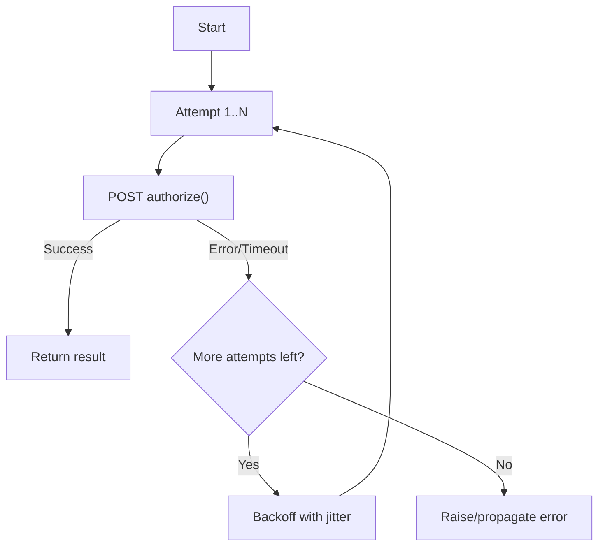

<Hero
  title="Architecture vs. Design vs. Implementation"
  subtitle="How to tell architecture decisions from design and implementation, with cues, examples, and a flow"
  image="/img/archman-social-card.webp"
  imageAlt="Software architecture decision-making process illustration"
  size="large"
/>

## What Is Architecture vs. Design vs. Implementation?

> "The architect's role is to balance the needs of the business, the constraints of the technology, and the art of the possible."
> — Grady Booch

This article clarifies the boundaries and handoffs between architecture, design, and implementation so teams make decisions at the right level and avoid rework.

**Scope**: definitions, responsibilities, decision types, and how to tell which level a decision belongs to. Includes examples, trade‑offs, and a quick decision flow.

**Out of scope**: deep analysis of change economics (see [Architectural Decision Impact & Cost of Change](./architectural-decision-impact-and-cost-of-change)), and stakeholder roles/process (see [Stakeholders & Concerns](./stakeholders-and-concerns)).

## TL;DR

Architecture sets long‑lived system boundaries and qualities; design shapes components and contracts to realize that architecture; implementation turns design into code and config. Place decisions by their blast radius and impact on quality attributes.

## Learning Objectives

You will be able to:

- **Classify decisions** as architecture, design, or implementation using clear criteria
- **Apply a decision flow** to choose the right level and artifact (ADR, contract, code)
- **Recognize cues and trade‑offs** that signal architectural significance
- **Plan operations, security, observability, and tests** appropriate to each level
- **Avoid common pitfalls** like design leakage and over-abstraction

## Motivating Scenario

Your team is building a checkout capability. Debates arise about database choices, API error formats, and retry policies. Using clear boundaries between architecture, design, and implementation helps you decide what must be stable and documented versus what can evolve locally in code.

**The challenge**: Without clear boundaries, teams either over-engineer simple decisions or under-document critical architectural choices, leading to technical debt and coordination overhead.

<Vs title="At a glance"
  items={[
{
      label: "Architecture",
      points: [
        "Aligns to business goals & quality attributes",
        "Sets boundaries, runtime topology, data & integration",
        "Long‑lived; costly to change",
      ],
    },
{
      label: "Design",
      points: [
        "Shapes modules/components & contracts",
        "Patterns, data models, error/caching strategies",
        "Medium horizon; medium cost to change",
      ],
    },
{
      label: "Implementation",
      points: [
        "Turns design into code, tests, configs",
        "Local choices: language, libs, structure, logging",
        "Short‑lived; relatively cheap to change",
      ],
    }
]}
  highlight={[0]}
  highlightTone="info"
/>

## Core Definitions

| Level          | Primary goal                                              | Typical scope                                           | Decision examples                                                                               | Time horizon | Cost of change | Common artifacts                                         |
| -------------- | --------------------------------------------------------- | ------------------------------------------------------- | ----------------------------------------------------------------------------------------------- | ------------ | -------------- | -------------------------------------------------------- |
| Architecture   | Align the system to business goals and quality attributes | System boundaries, runtime topology, data & integration | [Monolith](../../architectural-styles/monolith) vs [Microservices](../../architectural-styles/microservices); sync vs async; data ownership; security posture; deployment topology | Long‑lived   | High           | Architecture principles, views/diagrams, ADRs            |
| Design         | Shape modules/components to realize the architecture      | Module/API boundaries, data models, patterns            | Aggregates and repositories; interfaces; error handling strategy; caching strategy              | Medium       | Medium         | UML/C4 component views, API contracts, sequence diagrams |
| Implementation | Make the design executable, correct, and maintainable     | Code, tests, frameworks, configuration                  | Language, framework, libraries; function/class structure; logging; retries; feature flags       | Short        | Low            | Source code, tests, configs                              |

<Showcase
  title="Decision placement cues"
  sections={[
    {
      label: "Architecture",
      body: (
        <>
          If reversing the decision requires changing multiple services or data
          stores, or it changes quality attributes (availability, latency,
          security, evolvability), it’s architectural.
        </>
      ),
      tone: "info",
    },
    {
      label: "Design",
      body: (
        <>
          Changes public interfaces/contracts or cross‑cutting policies (error
          format, pagination, cache strategy) → design.
        </>
      ),
      tone: "neutral",
    },
    {
      label: "Implementation",
      body: (
        <>Local code choices with contained blast radius are implementation.</>
      ),
      tone: "neutral",
    },
  ]}
/>

## Decision Flow

Use this mental model to place a decision at the right level.

<Figure caption="A decision flow for categorizing decisions and identifying next steps.">

</Figure>

## Hands‑On Exercise

Follow these steps to practice placing decisions at the right level for your system.

1. Identify a pending decision (e.g., synchronous API vs. async messaging for order confirmation).
2. Run it through the decision flow above; note whether it affects system‑wide qualities.
3. Choose the artifact:
   - Architecture → capture an ADR with context, decision, consequences.
   - Design → update API contract, sequence diagram, or policy doc.
   - Implementation → change code and tests behind a feature flag.

```md title="adr-0010-order-confirmation-delivery.md (template)" showLineNumbers
Status: Proposed
Context: 
Decision: 
Consequences: 
```

## Real‑World Scenario: Checkout Service

Business goal: “Enable online checkout with low latency and high availability.”

<Showcase
  title="Checkout service plan"
  sections={[
    {
      label: "Architecture",
      body: (
        <>
          Choose modular monolith now with seams for later extraction; async{' '}
          <a href="../../distributed-systems-and-microservices/data-in-microservices/outbox-inbox-change-data-capture-cdc">outbox</a> for payment events;{' '}
          <a href="../../distributed-systems-and-microservices/data-in-microservices/database-per-service">database per service</a> at module boundaries; 99.9%
          availability target;{' '}
          <a href="../../delivery-engineering/ci-cd-pipelines/blue-green-rolling-canary">blue/green deployment</a>. Security posture:{' '}
          <a href="../../cloud-native-and-runtime-topology/networking/network-policies-mtls">mTLS</a> internal, OAuth2 for external APIs,{' '}
          <a href="../../security-architecture/data-protection/encryption-at-rest-envelope-encryption">PII encryption at rest</a>.
        </>
      ),
      tone: "info",
    },
    {
      label: "Design",
      body: (
        <>
          Domain model with Order aggregate; Payment as domain service;
          anti‑corruption layer for payment provider; idempotent command
          handling; standard error envelope for APIs. Sequence: API →
          Application service → Domain → Outbox → Worker → PSP.
        </>
      ),
    },
    {
      label: "Implementation",
      body: (
        <>
          Language/framework, retry with jitter on PSP calls, circuit breaker,
          structured logging with correlation IDs, feature flag to toggle a new
          PSP.
        </>
      ),
    },
  ]}
/>

## Self‑Check

1. Would reversing this decision change multiple services or quality attributes? If yes, it’s architectural.
2. Does this choice alter public interfaces or cross‑cutting policies? If yes, it’s design.
3. Can you change it locally with contained impact and tests? If yes, it’s implementation.

:::info
**One Takeaway**: Classify decisions by their blast radius and impact on quality attributes; let that dictate the artifact and rigor. Architecture decisions require ADRs and stakeholder review, design decisions need contracts and patterns, while implementation decisions can evolve through code reviews and tests.

:::

## Next Steps

- Read: [Architectural Decision Impact & Cost of Change](./architectural-decision-impact-and-cost-of-change)
- Review: [Stakeholders & Concerns](./stakeholders-and-concerns)
- Explore: [Core Design & Programming Principles](../../core-design-and-programming-principles/)
- See also: [Documentation & Modeling](../../documentation-and-modeling/)

## Frequently Asked Questions

**Q: How do I know if a decision is architectural versus design?**
A: Ask: "If I reverse this decision, does it require changing multiple services or affect system-wide quality attributes?" If yes, it's architectural. If it only affects interfaces or cross-cutting policies, it's design.

**Q: When should I write an ADR versus updating a contract or code?**
A: Write an ADR for architectural decisions that affect multiple teams or system qualities. Update contracts for design decisions that change public interfaces. Change code for implementation decisions with contained impact.

**Q: Can a decision start as implementation and become architectural?**
A: Yes, this happens when local choices create system-wide constraints. For example, choosing a specific database library might become architectural if it limits deployment options or creates vendor lock-in.

**Q: How do operations, security, observability, and testing differ by decision level?**
A: Architecture sets the overall strategy and SLOs, design defines component-level policies and contracts, and implementation handles specific tooling and configuration details.

### Example Artifacts (Abbreviated)

```yaml title="adr-0005-payment-integration.md (excerpt)" showLineNumbers
Status: Accepted
Context: External PSP has variable latency and failure modes.
Decision: Use async outbox + worker; PSP calls via circuit breaker; idempotency keys.
Consequences: Eventual consistency for payment status; simpler failure isolation.
```

```plaintext title="order-sequence.plain (simplified sequence)" showLineNumbers
Client -> API: POST /orders
API -> AppSvc: CreateOrder(cmd)
AppSvc -> Domain: Order.create()
Domain -> Outbox: enqueue(PaymentRequested)
Worker -> PSP: authorize()
PSP -> Worker: result
Worker -> Domain: apply(PaymentAuthorized|Failed)
```

<Figure caption="Call flow with retries and backoff for PSP authorization.">

</Figure>

The following code examples demonstrate the implementation-level retry logic with exponential backoff and jitter. This is implementation because it can be changed locally without affecting the overall architecture or design contracts.

<Tabs groupId="lang" queryString>
  <TabItem value="python" label="Python">

  ```python title="payment_client.py" showLineNumbers
  import requests, time, random

  def call_psp(payload, retries=3):
      for attempt in range(1, retries + 1):
          try:
              resp = requests.post('https://psp.example/authorize', json=payload, timeout=2)
              resp.raise_for_status()
              return resp.json()
          except Exception as e:
              if attempt == retries:
                  raise
              time.sleep(min(0.25 * (2 ** attempt) + random.uniform(0, 0.1), 2.0))
  ```

  </TabItem>
  <TabItem value="go" label="Go">

  ```go title="main.go" showLineNumbers
  package main

  import (
      "errors"
      "math"
      "math/rand"
      "net/http"
      "time"
  )

  func callPSP(payload []byte, retries int) ([]byte, error) {
      client := &http.Client{Timeout: 2 * time.Second}
      url := "https://psp.example/authorize"
      for attempt := 1; attempt <= retries; attempt++ {
          req, _ := http.NewRequest(http.MethodPost, url, nil)
          resp, err := client.Do(req)
          if err == nil && resp.StatusCode >= 200 && resp.StatusCode < 300 {
              return []byte("ok"), nil
          }
          if attempt == retries {
              if err != nil {
                  return nil, err
              }
              return nil, errors.New("psp failed")
          }
          backoff := math.Min(0.25*math.Pow(2, float64(attempt))+rand.Float64()*0.1, 2.0)
          time.Sleep(time.Duration(backoff * float64(time.Second)))
      }
      return nil, errors.New("unreachable")
  }
  ```

  </TabItem>
  <TabItem value="node" label="Node.js">

  ```javascript title="index.js" showLineNumbers

  export async function callPsp(payload, retries = 3) {
    const url = 'https://psp.example/authorize'
    for (let attempt = 1; attempt <= retries; attempt++) {
      try {
        const resp = await fetch(url, {
          method: 'POST',
          body: JSON.stringify(payload),
          headers: { 'content-type': 'application/json' },
          // emulate a timeout using AbortController in real code
        })
        if (resp.ok) return await resp.json()
        throw new Error(`psp ${resp.status}`)
      } catch (err) {
        if (attempt === retries) throw err
        const backoff = Math.min(0.25 * 2 ** attempt + Math.random() * 0.1, 2.0)
        await new Promise(r => setTimeout(r, backoff * 1000))
      }
    }
  }
  ```

  </TabItem>
</Tabs>

The ADR and sequence are architectural/design artifacts; the Python snippet is implementation—replaceable without revisiting the architecture.

## Patterns, Anti‑Patterns, and Tips

<Showcase
  title="Do’s and don’ts"
  sections={[
    {
      label: "Do",
      body: (
        <>
          Encourage thin architecture docs (principles, constraints, a few key
          views). Prefer decisions that keep options open (e.g., modular
          monolith with clear seams). Capture significant choices as{' '}
          <a href="../../documentation-and-modeling/architecture-decision-records-adr/">ADRs</a>; link
          to code and docs. Keep public contracts explicit; use{' '}
          <a href="../../quality-attributes/testability/contract-and-consumer-driven-tests">contract tests</a>.
          Treat quality attributes as first‑class.
        </>
      ),
      tone: "positive",
    },
    {
      label: "Avoid",
      body: (
        <>
          Architecture by library; design leakage across boundaries;
          over‑abstraction with layers that don’t add clarity.
        </>
      ),
      tone: "warning",
    },
  ]}
/>

## When to Use vs. When Not to Use Formal Architecture

<Vs highlight={[0,1]} items={[
{
      label: "Use",
      points: [
        "Decisions shape quality attributes or require coordinated change",
        "Cross trust boundaries or regulated data",
        "Many consumers depend on your contracts",
      ],
      highlightTone: "positive",
    },
{
      label: "Don’t overdo",
      points: [
        "Exploratory spikes or short‑lived tools where speed dominates",
        "Local refactors with contained impact—use lightweight notes in reviews",
      ],
      highlightTone: "warning",
    }
]}
  highlight={[0, 1]}
/>

<Checklist
  title="Design review checklist"
  items={[
    { label: 'Decision level is clear (architecture, design, or implementation)' },
    { label: 'Architectural decisions align with business goals and quality attributes' },
    { label: 'Design choices realize architecture without violating its constraints' },
    { label: 'Implementation details are confined and don’t leak into the design' },
    { label: 'Contracts and interfaces are explicit and tested' },
    { label: 'Significant architectural and design decisions are documented (e.g., in ADRs)' },
    { label: 'The cost and impact of reversing the decision have been considered' },
  ]}
/>

## Operational Considerations

The level of a decision directly impacts how it is operated, secured, and tested. Each level requires different approaches to monitoring, deployment, and maintenance.

### Deployment and Rollout Strategies

<Showcase
  title="Deployment Strategies by Level"
  sections={[
    {
      label: "Architecture Level",
      body: `**Blue/Green Deployments**: Full system cutover for architectural changes like database migrations or service topology changes.

**Canary Rollouts**: Gradual traffic shifting for new architectural patterns (e.g., introducing a new service mesh).

**Disaster Recovery**: Multi-region failover procedures and RTO/RPO targets defined at the architectural level.`,
      tone: "info",
    },
    {
      label: "Design Level",
      body: `**Feature Flags**: Toggle new API versions or component behaviors without architectural changes.

**Circuit Breakers**: Component-level failure isolation and recovery patterns.

**Load Balancing**: API-level traffic distribution and health check strategies.`,
      tone: "neutral",
    },
    {
      label: "Implementation Level",
      body: `**Hot Reloads**: Code changes that don't require service restarts.

**Configuration Updates**: Runtime parameter changes via environment variables or config services.

**Library Updates**: Dependency upgrades with backward compatibility.`,
      tone: "positive",
    },
  ]}
/>

### Security and Compliance

<Showcase
  title="Security Considerations by Level"
  sections={[
    {
      label: "Architecture Level",
      body: `**Trust Boundaries**: Define where authentication/authorization occurs and data classification policies.

**Security Posture**: Choose between mTLS, OAuth2, or other authentication models that affect the entire system.

**Compliance**: GDPR, HIPAA, or other regulatory requirements that shape data handling and retention policies.`,
      tone: "warning",
    },
    {
      label: "Design Level",
      body: `**API Security**: Rate limiting, input validation, and authorization policies for public interfaces.

**Data Encryption**: How data is encrypted in transit and at rest within component boundaries.

**Secret Management**: Patterns for handling API keys, certificates, and other sensitive configuration.`,
      tone: "info",
    },
    {
      label: "Implementation Level",
      body: `**Secure Coding**: Input sanitization, SQL injection prevention, and proper error handling.

**Vulnerability Scanning**: SAST/DAST tools and dependency scanning for known CVEs.

**Cryptographic APIs**: Correct usage of encryption libraries and key management.`,
      tone: "neutral",
    },
  ]}
/>

### Observability and Monitoring

<Showcase
  title="Observability Strategy by Level"
  sections={[
    {
      label: "Architecture Level",
      body: `**Distributed Tracing**: End-to-end request flow across services with correlation IDs.

**SLOs and SLIs**: System-wide availability, latency, and error rate targets.

**Service Maps**: Visual representation of service dependencies and data flow.`,
      tone: "info",
    },
    {
      label: "Design Level",
      body: `**Component Metrics**: RED metrics (Rate, Errors, Duration) for individual services.

**Structured Logging**: Consistent log format and correlation across components.

**Health Checks**: Liveness and readiness probes for service discovery and load balancing.`,
      tone: "neutral",
    },
    {
      label: "Implementation Level",
      body: `**Trace Spans**: Detailed instrumentation of function calls and database queries.

**Log Statements**: Specific error messages and debug information.

**Custom Metrics**: Business-specific counters and gauges for application logic.`,
      tone: "positive",
    },
  ]}
/>

### Testing Strategies

<Showcase
  title="Testing Approaches by Level"
  sections={[
    {
      label: "Architecture Level",
      body: `**Contract Tests**: Verify API compatibility between services without full integration.

**Chaos Engineering**: Test system resilience by injecting failures and measuring recovery.

**End-to-End Tests**: Critical user journeys that span multiple services and data stores.`,
      tone: "info",
    },
    {
      label: "Design Level",
      body: `**Integration Tests**: Verify component interactions and adherence to contracts.

**Performance Tests**: Load testing for specific APIs and data access patterns.

**Security Tests**: Penetration testing and vulnerability assessments for public interfaces.`,
      tone: "neutral",
    },
    {
      label: "Implementation Level",
      body: `**Unit Tests**: Test individual functions and classes with mocked dependencies.

**Property-Based Tests**: Generate test cases to verify invariants and edge cases.

**Mutation Testing**: Verify test quality by introducing code changes and checking test failure.`,
      tone: "positive",
    },
  ]}
/>

### Edge Cases and Anti-Patterns

**Decision Escalation**: Implementation choices can become architectural constraints over time. For example, choosing a specific ORM might limit database migration strategies, effectively becoming an architectural decision.

**Startup vs. Enterprise**: In early-stage companies, many "architectural" decisions are deferred and treated as design-level choices to accelerate delivery. The key is recognizing when a decision's impact grows beyond its original scope.

**Vendor Lock-in**: Library choices (implementation) can create vendor dependencies that become architectural constraints, limiting deployment options or requiring significant refactoring to change.

## Related Topics

- [Architectural Decision Impact & Cost of Change](./architectural-decision-impact-and-cost-of-change)
- [Stakeholders & Concerns](./stakeholders-and-concerns)
- See categories for deeper dives: [Core Design & Programming Principles](../../core-design-and-programming-principles/) and [Documentation & Modeling](../../documentation-and-modeling/)

## References

{/* markdownlint-disable MD033 */}

1.  <a
      href="https://www.iso.org/standard/74393.html"
      target="_blank"
      rel="nofollow noopener noreferrer"
    >
      ISO/IEC/IEEE 42010: Systems and software engineering — Architecture
      description ↗️
    </a>
2.  <a
      href="https://dl.acm.org/doi/10.5555/869077"
      target="_blank"
      rel="nofollow noopener noreferrer"
    >
      Bass, Clements, and Kazman. Software Architecture in Practice ↗️
    </a>
3.  <a href="https://martinfowler.com/architecture/" target="_blank" rel="nofollow noopener noreferrer">Martin Fowler, Architecture topics ↗️</a>
    {/* markdownlint-enable MD033 */}
