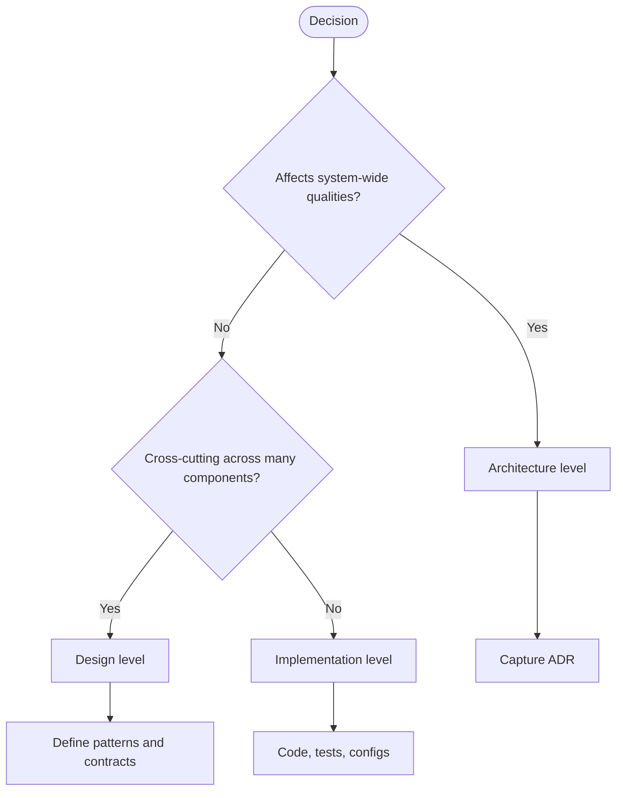
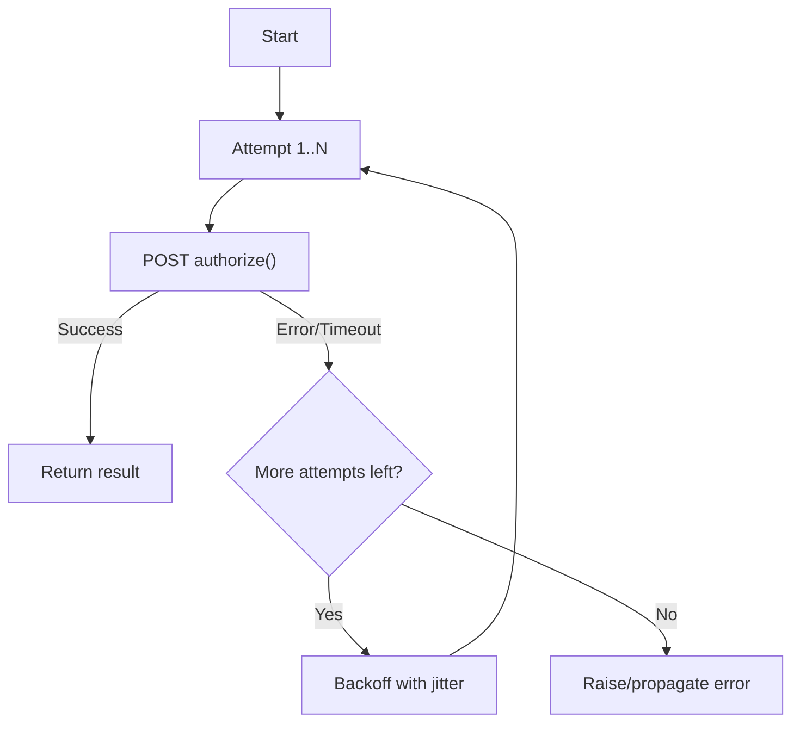

import Head from '@docusaurus/Head';
import Figure from '@site/src/components/Figure';
import Showcase from "@site/src/components/Showcase";
import Vs from "@site/src/components/Vs";
import Checklist from "@site/src/components/Checklist";
import Tabs from '@theme/Tabs';
import TabItem from '@theme/TabItem';

# Architecture vs. Design vs. Implementation

<Head>
  <meta name="description" content="How to tell architecture decisions from design and implementation, with cues, examples, and a flow." />
  <meta property="og:title" content="Architecture vs. Design vs. Implementation" />
  <meta property="og:description" content="How to tell architecture decisions from design and implementation, with cues, examples, and a flow." />
  <meta property="og:image" content="https://archman.dev/img/archman.webp" />
  <meta name="twitter:card" content="summary_large_image" />
  <script type="application/ld+json">{JSON.stringify({
    "@context": "https://schema.org",
    "@type": "Article",
    "headline": "Architecture vs. Design vs. Implementation",
    "description": "How to tell architecture decisions from design and implementation, with cues, examples, and a flow.",
    "image": "https://archman.dev/img/archman.webp",
    "keywords": [
      "architecture","design","implementation","quality attributes","adr","decision flow","trade-offs","contracts","patterns"
    ],
    "author": {"@type":"Person","name":"Archman"},
    "dateModified": "2025-09-10"
  })}</script>
  <script type="application/ld+json">{JSON.stringify({
    "@context":"https://schema.org",
    "@type":"BreadcrumbList",
    "itemListElement":[
      {"@type":"ListItem","position":1,"name":"Foundational Concepts","item":"https://archman.dev/docs/foundational-concepts"},
      {"@type":"ListItem","position":2,"name":"What Is Software Architecture","item":"https://archman.dev/docs/foundational-concepts/what-is-software-architecture"},
      {"@type":"ListItem","position":3,"name":"Architecture vs. Design vs. Implementation","item":"https://archman.dev/docs/foundational-concepts/what-is-software-architecture/architecture-vs-design-vs-implementation"}
    ]
  })}</script>
</Head>

> "The architect's role is to balance the needs of the business, the constraints of the technology, and the art of the possible."
> — Grady Booch

This article clarifies the boundaries and handoffs between architecture, design, and implementation so teams make decisions at the right level and avoid rework.

- Scope: definitions, responsibilities, decision types, and how to tell which level a decision belongs to. Includes examples, trade‑offs, and a quick decision flow.
- Out of scope: deep analysis of change economics (see [Architectural Decision Impact & Cost of Change](./architectural-decision-impact-and-cost-of-change)), and stakeholder roles/process (see [Stakeholders & Concerns](./stakeholders-and-concerns)).

## TL;DR

Architecture sets long‑lived system boundaries and qualities; design shapes components and contracts to realize that architecture; implementation turns design into code and config. Place decisions by their blast radius and impact on quality attributes.

## Learning objectives

- Understand how to classify decisions as architecture, design, or implementation.
- Apply a quick decision flow to choose the right level and artifact (ADR, contract, code).
- Recognize cues and trade‑offs that signal architectural significance.
- Plan operations, security, observability, and tests appropriate to each level.

## Motivating scenario

Your team is building a checkout capability. Debates arise about database choices, API error formats, and retry policies. Using clear boundaries between architecture, design, and implementation helps you decide what must be stable and documented versus what can evolve locally in code.

<Vs
  title="At a glance"
  items={[
    {
      label: "Architecture",
      points: [
        "Aligns to business goals & quality attributes",
        "Sets boundaries, runtime topology, data & integration",
        "Long‑lived; costly to change",
      ],
    },
    {
      label: "Design",
      points: [
        "Shapes modules/components & contracts",
        "Patterns, data models, error/caching strategies",
        "Medium horizon; medium cost to change",
      ],
    },
    {
      label: "Implementation",
      points: [
        "Turns design into code, tests, configs",
        "Local choices: language, libs, structure, logging",
        "Short‑lived; relatively cheap to change",
      ],
    },
  ]}
  highlight={[0]}
  highlightTone="info"
/>

## Core definitions

| Level          | Primary goal                                              | Typical scope                                           | Decision examples                                                                               | Time horizon | Cost of change | Common artifacts                                         |
| -------------- | --------------------------------------------------------- | ------------------------------------------------------- | ----------------------------------------------------------------------------------------------- | ------------ | -------------- | -------------------------------------------------------- |
| Architecture   | Align the system to business goals and quality attributes | System boundaries, runtime topology, data & integration | [Monolith](../../architectural-styles/monolith) vs [Microservices](../../architectural-styles/microservices); sync vs async; data ownership; security posture; deployment topology | Long‑lived   | High           | Architecture principles, views/diagrams, ADRs            |
| Design         | Shape modules/components to realize the architecture      | Module/API boundaries, data models, patterns            | Aggregates and repositories; interfaces; error handling strategy; caching strategy              | Medium       | Medium         | UML/C4 component views, API contracts, sequence diagrams |
| Implementation | Make the design executable, correct, and maintainable     | Code, tests, frameworks, configuration                  | Language, framework, libraries; function/class structure; logging; retries; feature flags       | Short        | Low            | Source code, tests, configs                              |

<Showcase
  title="Decision placement cues"
  sections={[
    {
      label: "Architecture",
      body: (
        <>
          If reversing the decision requires changing multiple services or data
          stores, or it changes quality attributes (availability, latency,
          security, evolvability), it’s architectural.
        </>
      ),
      tone: "info",
    },
    {
      label: "Design",
      body: (
        <>
          Changes public interfaces/contracts or cross‑cutting policies (error
          format, pagination, cache strategy) → design.
        </>
      ),
      tone: "neutral",
    },
    {
      label: "Implementation",
      body: (
        <>Local code choices with contained blast radius are implementation.</>
      ),
      tone: "neutral",
    },
  ]}
/>

## Quick decision flow

Use this mental model to place a decision at the right level.

<Figure caption="A decision flow for categorizing decisions and identifying next steps.">

</Figure>

## Hands‑on exercise

Follow these steps to practice placing decisions at the right level for your system.

1. Identify a pending decision (e.g., synchronous API vs. async messaging for order confirmation).
2. Run it through the decision flow above; note whether it affects system‑wide qualities.
3. Choose the artifact:
   - Architecture → capture an ADR with context, decision, consequences.
   - Design → update API contract, sequence diagram, or policy doc.
   - Implementation → change code and tests behind a feature flag.

```md title="adr-0010-order-confirmation-delivery.md (template)" showLineNumbers
Status: Proposed
Context: 
Decision: 
Consequences: 
```

## Real‑world scenario: checkout service

Business goal: “Enable online checkout with low latency and high availability.”

<Showcase
  title="Checkout service plan"
  sections={[
    {
      label: "Architecture",
      body: (
        <>
          Choose modular monolith now with seams for later extraction; async
          [outbox](../../distributed-systems-and-microservices/data-in-microservices/outbox-inbox-change-data-capture-cdc) for payment events; [database per service](../../distributed-systems-and-microservices/data-in-microservices/database-per-service) at module boundaries; 99.9%
          availability target; [blue/green deployment](../../delivery-engineering/ci-cd-pipelines/blue-green-rolling-canary). Security posture: [mTLS](../../cloud-native-and-runtime-topology/networking/network-policies-mtls)
          internal, OAuth2 for external APIs, [PII encryption at rest](../../security-architecture/data-protection/encryption-at-rest-envelope-encryption).
        </>
      ),
      tone: "info",
    },
    {
      label: "Design",
      body: (
        <>
          Domain model with Order aggregate; Payment as domain service;
          anti‑corruption layer for payment provider; idempotent command
          handling; standard error envelope for APIs. Sequence: API →
          Application service → Domain → Outbox → Worker → PSP.
        </>
      ),
    },
    {
      label: "Implementation",
      body: (
        <>
          Language/framework, retry with jitter on PSP calls, circuit breaker,
          structured logging with correlation IDs, feature flag to toggle a new
          PSP.
        </>
      ),
    },
  ]}
/>

## Self‑check

1. Would reversing this decision change multiple services or quality attributes? If yes, it’s architectural.
2. Does this choice alter public interfaces or cross‑cutting policies? If yes, it’s design.
3. Can you change it locally with contained impact and tests? If yes, it’s implementation.

:::info
One takeaway: Classify decisions by their blast radius and impact on quality attributes; let that dictate the artifact and rigor.
:::

## Next steps

- Read: [Architectural Decision Impact & Cost of Change](./architectural-decision-impact-and-cost-of-change)
- Review: [Stakeholders & Concerns](./stakeholders-and-concerns)
- Explore: [Core Design & Programming Principles](../../core-design-and-programming-principles/)
- See also: [Documentation & Modeling](../../documentation-and-modeling/)

## Questions this article answers

- How do I know if a decision is architectural versus design?
- When should I write an ADR versus updating a contract or code?
- How do operations, security, observability, and testing differ by decision level?

### Example artifacts (abbreviated)

```yaml title="adr-0005-payment-integration.md (excerpt)" showLineNumbers
Status: Accepted
Context: External PSP has variable latency and failure modes.
Decision: Use async outbox + worker; PSP calls via circuit breaker; idempotency keys.
Consequences: Eventual consistency for payment status; simpler failure isolation.
```

```plaintext title="order-sequence.plain (simplified sequence)" showLineNumbers
Client -> API: POST /orders
API -> AppSvc: CreateOrder(cmd)
AppSvc -> Domain: Order.create()
Domain -> Outbox: enqueue(PaymentRequested)
Worker -> PSP: authorize()
PSP -> Worker: result
Worker -> Domain: apply(PaymentAuthorized|Failed)
```

<Figure caption="Call flow with retries and backoff for PSP authorization.">

</Figure>

<Tabs groupId="lang" queryString>
  <TabItem value="python" label="Python">

  ```python title="payment_client.py" showLineNumbers
  import requests, time, random

  def call_psp(payload, retries=3):
      for attempt in range(1, retries + 1):
          try:
              resp = requests.post('https://psp.example/authorize', json=payload, timeout=2)
              resp.raise_for_status()
              return resp.json()
          except Exception as e:
              if attempt == retries:
                  raise
              time.sleep(min(0.25 * (2 ** attempt) + random.uniform(0, 0.1), 2.0))
  ```

  </TabItem>
  <TabItem value="go" label="Go">

  ```go title="main.go" showLineNumbers
  package main

  import (
      "errors"
      "math"
      "math/rand"
      "net/http"
      "time"
  )

  func callPSP(payload []byte, retries int) ([]byte, error) {
      client := &http.Client{Timeout: 2 * time.Second}
      url := "https://psp.example/authorize"
      for attempt := 1; attempt <= retries; attempt++ {
          req, _ := http.NewRequest(http.MethodPost, url, nil)
          resp, err := client.Do(req)
          if err == nil && resp.StatusCode >= 200 && resp.StatusCode < 300 {
              return []byte("ok"), nil
          }
          if attempt == retries {
              if err != nil {
                  return nil, err
              }
              return nil, errors.New("psp failed")
          }
          backoff := math.Min(0.25*math.Pow(2, float64(attempt))+rand.Float64()*0.1, 2.0)
          time.Sleep(time.Duration(backoff * float64(time.Second)))
      }
      return nil, errors.New("unreachable")
  }
  ```

  </TabItem>
  <TabItem value="node" label="Node.js">

  ```javascript title="index.js" showLineNumbers
  import fetch from 'node-fetch'

  export async function callPsp(payload, retries = 3) {
    const url = 'https://psp.example/authorize'
    for (let attempt = 1; attempt <= retries; attempt++) {
      try {
        const resp = await fetch(url, {
          method: 'POST',
          body: JSON.stringify(payload),
          headers: { 'content-type': 'application/json' },
          // emulate a timeout using AbortController in real code
        })
        if (resp.ok) return await resp.json()
        throw new Error(`psp ${resp.status}`)
      } catch (err) {
        if (attempt === retries) throw err
        const backoff = Math.min(0.25 * 2 ** attempt + Math.random() * 0.1, 2.0)
        await new Promise(r => setTimeout(r, backoff * 1000))
      }
    }
  }
  ```

  </TabItem>
</Tabs>

The ADR and sequence are architectural/design artifacts; the Python snippet is implementation—replaceable without revisiting the architecture.

## Patterns, anti‑patterns, and tips

<Showcase
  title="Do’s and don’ts"
  sections={[
    {
      label: "Do",
      body: (
        <>
          Encourage thin architecture docs (principles, constraints, a few key
          views). Prefer decisions that keep options open (e.g., modular
          monolith with clear seams). Capture significant choices as [ADRs](../../documentation-and-modeling/architecture-decision-records-adr/); link
          to code and docs. Keep public contracts explicit; use [contract tests](../../quality-attributes/testability/contract-and-consumer-driven-tests).
          Treat quality attributes as first‑class.
        </>
      ),
      tone: "positive",
    },
    {
      label: "Avoid",
      body: (
        <>
          Architecture by library; design leakage across boundaries;
          over‑abstraction with layers that don’t add clarity.
        </>
      ),
      tone: "warning",
    },
  ]}
/>

## When to use vs. when not to use formal architecture

<Vs
  items={[
    {
      label: "Use",
      points: [
        "Decisions shape quality attributes or require coordinated change",
        "Cross trust boundaries or regulated data",
        "Many consumers depend on your contracts",
      ],
      highlightTone: "positive",
    },
    {
      label: "Don’t overdo",
      points: [
        "Exploratory spikes or short‑lived tools where speed dominates",
        "Local refactors with contained impact—use lightweight notes in reviews",
      ],
      highlightTone: "warning",
    },
  ]}
  highlight={[0, 1]}
/>

<Checklist
  title="Design review checklist"
  items={[
    { label: 'Decision level is clear (architecture, design, or implementation)' },
    { label: 'Architectural decisions align with business goals and quality attributes' },
    { label: 'Design choices realize architecture without violating its constraints' },
    { label: 'Implementation details are confined and don’t leak into the design' },
    { label: 'Contracts and interfaces are explicit and tested' },
    { label: 'Significant architectural and design decisions are documented (e.g., in ADRs)' },
    { label: 'The cost and impact of reversing the decision have been considered' },
  ]}
/>

## Operational, Security, and Testing Considerations

The level of a decision directly impacts how it is operated, secured, and tested.

<Showcase
  title="Considerations by Level"
  sections={[
    {
      label: "Operational Considerations",
      body: `**Architecture**: Defines the deployment topology, rollout strategies (blue/green, canary), and SLOs for system-wide qualities like availability and disaster recovery. For example, choosing microservices implies managing a fleet of services, each with its own operational lifecycle.

**Design**: Determines component-level health checks, caching strategies (and their TTLs), and error budgets for specific APIs or modules.

**Implementation**: Involves setting up specific alerts, configuring resource limits (CPU/memory), and managing dependencies.`,
      tone: "info",
    },
    {
      label: "Security, Privacy, and Compliance",
      body: `**Architecture**: Sets the security posture. This includes defining trust boundaries, data classification policies (e.g., PII), and the authentication/authorization model (e.g., OAuth2, mTLS). Compliance requirements like GDPR or HIPAA heavily influence architectural choices.

**Design**: Specifies API-level authorization, secret management patterns, and how data is encrypted in transit and at rest within a component's boundary.

**Implementation**: Focuses on secure coding practices, vulnerability scanning for libraries (SAST/DAST), and correct use of cryptographic APIs.`,
      tone: "warning",
    },
    {
      label: "Observability",
      body: `**Architecture**: Establishes the strategy for distributed tracing and log correlation across services. It defines what constitutes a "transaction" from an end-to-end perspective.

**Design**: Defines the structured logging format, key metrics (e.g., RED—Rate, Errors, Duration) for a service, and dashboard requirements.

**Implementation**: Adds the specific trace spans, log statements, and metric counters to the code.`,
      tone: "neutral",
    },
    {
      label: "Testing",
      body: `**Architecture**: Is validated with contract tests between services, integration tests for critical user journeys, and chaos engineering to test resilience.

**Design**: Is tested via component-level integration tests that verify interactions and adherence to contracts.

**Implementation**: Is verified with unit tests, which have the narrowest scope and focus on individual functions or classes.`,
      tone: "positive",
    },
    {
      label: "Edge Cases",
      body: `Decisions can blur the lines. A library choice (implementation) might introduce a paradigm that becomes a de facto architectural constraint. In startups, many "architectural" decisions are deferred and treated as design-level choices to accelerate delivery, accepting the technical debt. The key is to recognize when a decision's impact grows beyond its original scope.`,
      tone: "neutral",
    },
  ]}
/>

## Related topics

- [Architectural Decision Impact & Cost of Change](./architectural-decision-impact-and-cost-of-change)
- [Stakeholders & Concerns](./stakeholders-and-concerns)
- See categories for deeper dives: [Core Design & Programming Principles](../../core-design-and-programming-principles/) and [Documentation & Modeling](../../documentation-and-modeling/)

## References

<!-- markdownlint-disable MD033 -->

1.  <a
      href="https://www.iso.org/standard/74393.html"
      target="_blank"
      rel="nofollow noopener noreferrer"
    >
      ISO/IEC/IEEE 42010: Systems and software engineering — Architecture
      description ↗️
    </a>
2.  <a
      href="https://dl.acm.org/doi/10.5555/869077"
      target="_blank"
      rel="nofollow noopener noreferrer"
    >
      Bass, Clements, and Kazman. Software Architecture in Practice ↗️
    </a>
3.  <a href="https://martinfowler.com/architecture/" target="_blank" rel="nofollow noopener noreferrer">Martin Fowler, Architecture topics ↗️</a>
    <!-- markdownlint-enable MD033 -->
