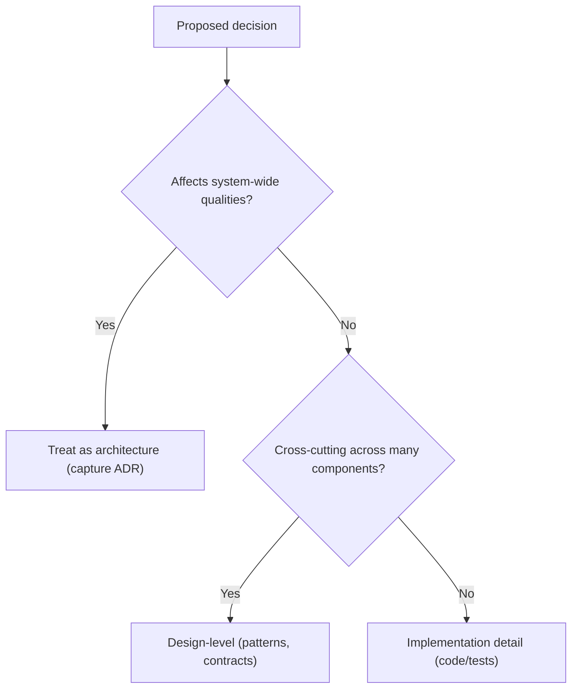

import DocCardList from "@theme/DocCardList";
import { useCurrentSidebarCategory } from "@docusaurus/theme-common";

# What Is Software Architecture

Software architecture is the set of high‑impact design decisions that shape a system’s structure, boundaries, and evolution. It focuses on choices that are hard (or costly) to change, aligns technical direction with business goals, and sets the constraints and principles within which teams build.

> "Architecture is about the important stuff—whatever that is." — Martin Fowler

Why this matters: architecture choices set the stage for quality attributes such as availability, performance, security, and evolvability. Getting these wrong creates organizational drag and expensive rework later. Getting them right lets teams move fast with safety and clarity.

What this section covers (and how to navigate it):

- Distinguish architecture from design and implementation—and learn when a decision “graduates” to architectural scope.
- Identify stakeholders and map their concerns to viewpoints and concrete, testable quality attribute scenarios.
- Make decisions deliberately, capture them concisely, and reduce the cost of change through seams, evidence, and safe rollout strategies.

Quick decision cue: use the flow below to place a decision at the right level and guide the amount of rigor you apply.

Tips for effective architecture in practice:

- Favor reversible choices early; keep options open with clear boundaries (modular monoliths, ports and adapters).
- Express concerns as measurable scenarios; connect them to views, monitors, and SLOs.
- Prefer lightweight artifacts: short principles, a few key views, and focused Architecture Decision Records (ADRs).

<DocCardList items={useCurrentSidebarCategory().items} />
