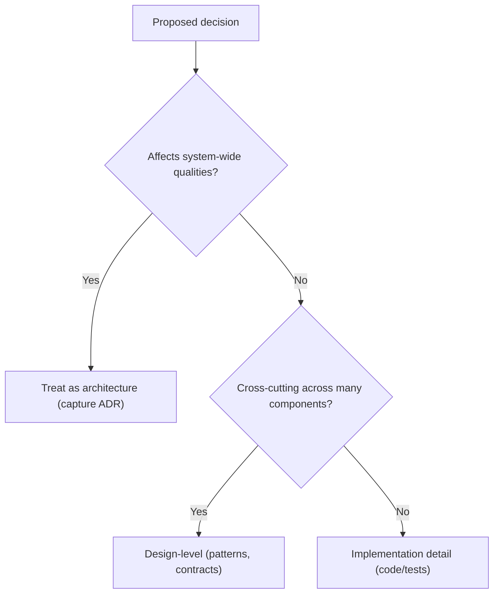

import Figure from '@site/src/components/Figure';
import DocCardList from '@theme/DocCardList';
import { useCurrentSidebarCategory } from '@docusaurus/theme-common';

# What Is Software Architecture

Software architecture is the set of high-impact design decisions that shape a system’s structure, boundaries, and evolution. It focuses on choices that are hard (or costly) to change, aligns technical direction with business goals, and sets the constraints and principles within which teams build. Good architecture provides a clear path for the system to grow and adapt over time, while poor architecture can lead to a system that is brittle, expensive to maintain, and unable to meet future needs.

> "Architecture is about the important stuff—whatever that is." — Martin Fowler

**Why this matters**: Architecture choices set the stage for [quality attributes](../../quality-attributes) such as availability, performance, security, and evolvability. Getting these wrong creates organizational drag and expensive rework later. Getting them right lets teams move fast with safety and clarity. It's the blueprint that guides development, ensuring that the final product is not only functional but also robust, scalable, and maintainable.

**What this section covers (and how to navigate it)**:

*   **Distinguish architecture from design and implementation**—and learn when a decision “graduates” to architectural scope.
*   **Identify stakeholders and map their concerns** to viewpoints and concrete, testable quality attribute scenarios.
*   **Make decisions deliberately and capture them concisely**, often using [Architecture Decision Records (ADRs)](../../documentation-and-modeling/architecture-decision-records-adr).
*   **Reduce the cost of change** through seams, evidence, and safe rollout strategies.

<Figure caption="Use this flow to place a decision at the right level and guide the amount of rigor you apply.">

</Figure>

**Tips for effective architecture in practice**:

*   **Favor reversible choices early**; keep options open with clear boundaries (e.g., modular monoliths, ports and adapters).
*   **Express concerns as measurable scenarios**; connect them to views, monitors, and Service Level Objectives (SLOs).
*   **Prefer lightweight artifacts**: short principles, a few key views, and focused [Architecture Decision Records (ADRs)](../../documentation-and-modeling/architecture-decision-records-adr).

<DocCardList items={useCurrentSidebarCategory().items} />

## References

1.  <a href="https://martinfowler.com/ieeeSoftware/whoNeedsArchitect.pdf" target="_blank" rel="nofollow noopener noreferrer">Martin Fowler, "Who Needs an Architect?" ↗️</a>
