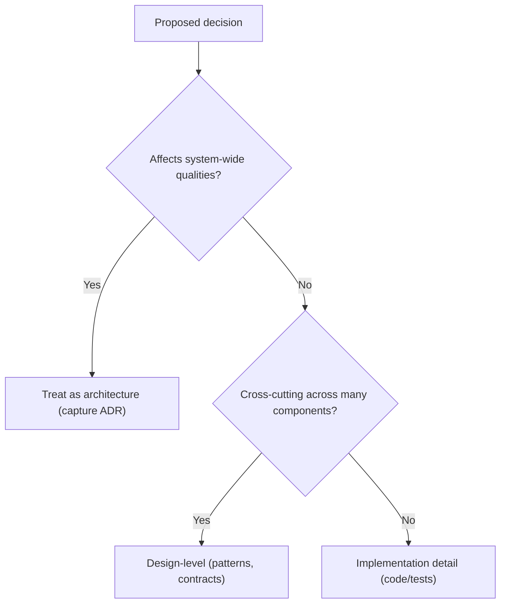

import { useCurrentSidebarCategory } from "@docusaurus/theme-common";

# What Is Software Architecture

Software architecture is the set of high‑impact design decisions that shape a system’s structure, boundaries, and evolution. It focuses on choices that are hard (or costly) to change, aligns technical direction with business goals, and sets the constraints and principles within which teams build. Good architecture creates clear seams and contracts so components and teams can collaborate safely; poor architecture amplifies coupling, drags delivery, and inflates the cost of change.

> "Architecture is about the important stuff—whatever that is." — Martin Fowler

**Why this matters**: Architecture choices set the stage for [quality attributes](../../quality-attributes) such as availability, performance, security, and evolvability. Getting these wrong creates organizational drag and expensive rework; getting them right lets teams move fast with safety and clarity. Architectural intent also drives operational reality: boundaries, protocols, and data contracts directly influence incident blast radius, observability, and rollout safety.

**What this section covers (and how to navigate it)**:

*   **Distinguish architecture from design and implementation**—and learn when a decision “graduates” to architectural scope. See: [Architecture vs. Design vs. Implementation](./architecture-vs-design-vs-implementation).
*   **Identify stakeholders and map their concerns** to viewpoints and concrete, testable quality attribute scenarios. See: [Stakeholders & Concerns](./stakeholders-and-concerns).
*   **Make decisions deliberately and capture them concisely**, often using [Architecture Decision Records (ADRs)](../../documentation-and-modeling/architecture-decision-records-adr).
*   **Reduce the cost of change** through seams, evidence, and safe rollout strategies. See: [Impact & Cost of Change](./architectural-decision-impact-and-cost-of-change) and rollout strategies like [Blue‑Green, Rolling, and Canary](../../delivery-engineering/ci-cd-pipelines/blue-green-rolling-canary).

<Figure caption="Use this flow to place a decision at the right level and guide the amount of rigor you apply.">

</Figure>

**Tips for effective architecture in practice**:

*   **Favor reversible choices early**; keep options open with clear boundaries (e.g., [monoliths](../../architectural-styles/monolith) with strong modularity, [hexagonal/ports‑and‑adapters](../../architectural-styles/hexagonal-ports-and-adapters)).
*   **Express concerns as measurable scenarios**; connect them to views, monitors, and [Service Level Objectives (SLOs)](../../distributed-systems-and-microservices/observability/slo-sli-sla-and-error-budgets).
*   **Prefer lightweight artifacts**: short principles, a few key views, and focused [Architecture Decision Records (ADRs)](../../documentation-and-modeling/architecture-decision-records-adr).
*   **Roll out change safely** using progressive delivery where appropriate (see [Blue‑Green, Rolling, and Canary](../../delivery-engineering/ci-cd-pipelines/blue-green-rolling-canary)).

<DocCardList items={useCurrentSidebarCategory().items} />

### Related topics

- [Architecture vs. Design vs. Implementation](./architecture-vs-design-vs-implementation)
- [Stakeholders & Concerns](./stakeholders-and-concerns)
- [Quality Attributes](../../quality-attributes)

## References

1.  <a href="https://martinfowler.com/ieeeSoftware/whoNeedsArchitect.pdf" target="_blank" rel="nofollow noopener noreferrer">Martin Fowler, "Who Needs an Architect?" ↗️</a>
2.  <a href="https://www.iso-architecture.org/42010/" target="_blank" rel="nofollow noopener noreferrer">ISO/IEC/IEEE 42010: Systems and software engineering — Architecture description ↗️</a>
