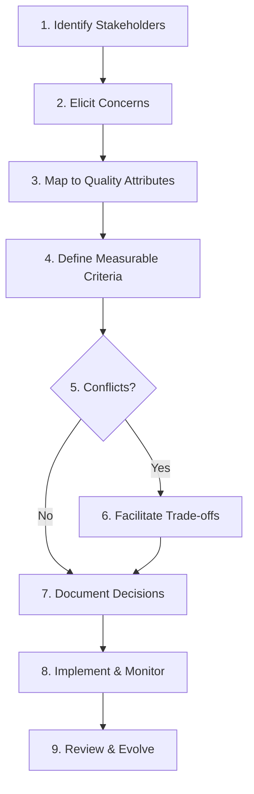
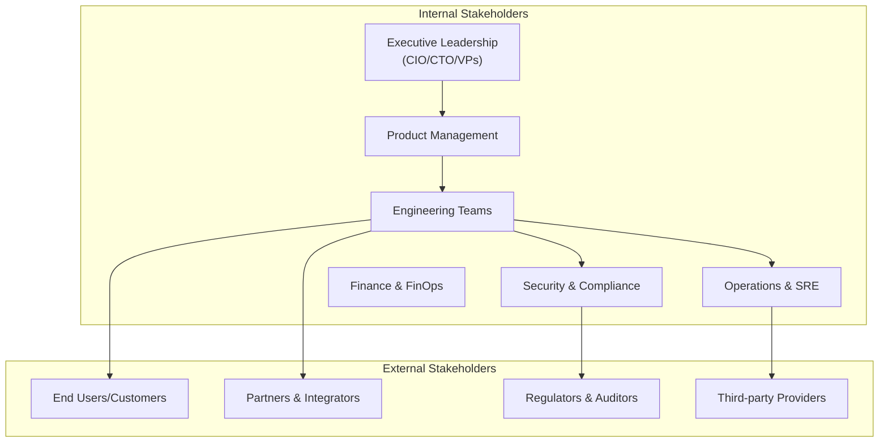
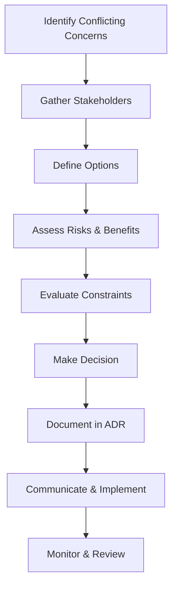
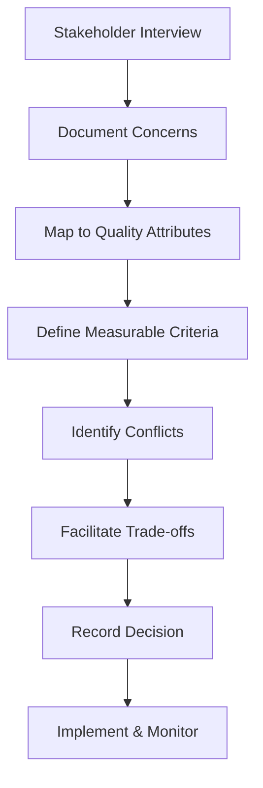

<Hero
  title="Stakeholders & Concerns"
  subtitle="Identify stakeholders, elicit their concerns, and reconcile trade-offs into architecture decisions"
  imageAlt="Stakeholder analysis and concern mapping illustration"
  size="large"
/>

**TL;DR**: Architecture aligns diverse stakeholder needs with system qualities. Identify stakeholders, elicit their concerns, prioritize and negotiate trade-offs, then record decisions and rationale.

## Learning Objectives
- You will be able to identify key stakeholder groups and their primary concerns
- You will be able to map concerns to system qualities and measurable objectives
- You will be able to facilitate trade-off decisions and document them transparently
- You will be able to trace design choices to stakeholder needs over time

## Motivating Scenario
Your team is designing a new payments API. Product wants fast time-to-market, Security requires PCI alignment, SRE cares about SLOs, and Sales needs EU data residency assurances. Without an explicit stakeholder–concerns model, design debates become circular. With it, you can prioritize and justify decisions, avoid costly rework, and align execution across teams.

## The Stakeholder-Concerns Process

<Figure caption="The complete stakeholder-concerns analysis process from identification to implementation.">



</Figure>

## Part 1: Understanding Stakeholders and Concerns

### What Are Stakeholders and Concerns?

**Stakeholders** are individuals, groups, or organizations that have a vested interest in the system's success, failure, or operation. They influence or are influenced by architectural decisions.

**Concerns** are matters of interest that affect the system's architecture—they represent what stakeholders care about and what drives their requirements.

### Why This Matters

Understanding stakeholders and their concerns is fundamental to software architecture because:

- **Architecture decisions must serve stakeholder needs** - Every design choice should trace back to addressing specific stakeholder concerns
- **Trade-offs become explicit** - When concerns conflict, you can make informed decisions about priorities
- **Communication improves** - Clear stakeholder-concern mapping enables better collaboration and reduces misunderstandings
- **Change management becomes systematic** - As stakeholder needs evolve, you can assess impact and adjust architecture accordingly

### Stakeholder Categories

Stakeholders can be categorized by their relationship to the system:

- **Primary stakeholders**: Direct users, customers, and those who directly benefit from or are affected by the system
- **Secondary stakeholders**: Those who influence or are influenced by the system but don't directly use it (regulators, partners, auditors)
- **Internal stakeholders**: Team members, management, and organizational units within your company
- **External stakeholders**: Customers, partners, regulators, and third-party service providers

### Comprehensive Stakeholder Catalog

<Figure caption="Stakeholder ecosystem showing primary, secondary, internal, and external stakeholder relationships.">


</Figure>

| Stakeholder | Common Concerns | Priority Level |
| --- | --- | --- |
| **Executive leadership** (CIO/CTO/VPs) | Strategy alignment, ROI, risk, governance, regulatory posture | High |
| **Product management** / Owners | Time-to-market, differentiation, roadmap feasibility, scope trade-offs | High |
| **Business / Finance** / FinOps | Unit economics, budgets, cost visibility, chargeback/showback | High |
| **End users** / Customers | Usability/UX, performance (TTFB/TTI), reliability, accessibility | High |
| **Engineering** / Development | Modularity, maintainability, testability, developer experience | High |
| **SRE / Operations** / Incident Response | Availability, resilience, observability, capacity, run cost | High |
| **Security / AppSec** | Least privilege, authn/z, secrets, supply chain, threat model | High |
| **Privacy / Legal** / DPO | Data classification, residency, retention, DPIA/consent, contracts | High |
| **Regulators** / Standards Bodies | Regulatory obligations, reporting, lawful basis, sanctions | High |
| **Program / Project** / PMO | Dependencies, delivery risk, milestones, cross-team coordination | Medium |
| **Sales / Pre-sales** / Solutions | Customer commitments, SLAs, integration promises, demos/POCs | Medium |
| **Marketing / Analytics** | Attribution, SEO, experimentation, consent, data flows | Medium |
| **Customer Success** / Support | Diagnostics, error clarity, feature flags, rollback paths | Medium |
| **Tenant admins** (B2B) | SSO/SCIM, RBAC, audit logs, data export, deprovisioning | Medium |
| **UX / Design** / Accessibility | Information architecture, a11y compliance, design system constraints | Medium |
| **QA / Testing** | Testability, environments, data management, determinism, flake control | Medium |
| **Platform / Infrastructure** / DevOps | Standardization, portability, quotas/limits, golden paths | Medium |
| **Network / DBA** | Connectivity, latency, resiliency, schema health, backups/restore | Medium |
| **Data Eng** / Analytics / Science / MLOps | Data quality, lineage, drift, feature stores, privacy | Medium |
| **Risk Management** / Internal Audit | Controls effectiveness, evidence, segregation of duties | Medium |
| **External Auditors** / Certifiers | Compliance scope, audit trails, change control, findings | Medium |
| **Partners** / ISVs / Integrators | Stable contracts, versioning, deprecations, sandboxing | Medium |
| **Third-party providers** (Cloud/IdP/PSP/SaaS) | SLAs, incident comms, integration limits, pricing/quotas | Medium |
| **Localization** / Regional Ops | i18n/l10n, local regulations, data residency, formats | Medium |
| **Procurement** / Vendor Mgmt | Sourcing, licensing, contractual obligations, exit strategy | Low |
| **IT Service Desk** / Field Eng | Runbooks, support tooling, access, escalation paths | Low |
| **Documentation** / Training / DevRel | Developer experience, docs completeness, examples, SDKs | Low |
| **Open-source community** (if applicable) | Contribution model, governance, release cadence | Low |

This catalog is intentionally broad. Select and tailor to your context; add domain‑specific stakeholders (e.g., clinicians, drivers, merchants) as needed.

## Part 2: Mapping Concerns to Quality Attributes

### The Translation Process

The key to effective stakeholder management is translating vague concerns into measurable objectives tied to [quality attributes](../../quality-attributes). This process involves:

1. **Eliciting specific requirements** from stakeholder concerns
2. **Defining measurable criteria** for each concern
3. **Establishing acceptance thresholds** and monitoring mechanisms
4. **Creating traceability** from concerns to implementation

### Common Concern-to-Quality Mappings

<Showcase
  title="Concern Translation Examples"
  sections={[
    { label: 'Performance', body: 'p95 latency ≤ 300ms under 2x peak load; TTFB ≤ 100ms; throughput ≥ 10k req/s', tone: 'info' },
    { label: 'Availability', body: 'Monthly SLO 99.9% with error budget policy; RTO ≤ 4 hours; RPO ≤ 1 hour', tone: 'info' },
    { label: 'Security', body: 'All PII encrypted at rest; mTLS in transit; admin RBAC; vulnerability scan monthly', tone: 'warning' },
    { label: 'Cost', body: '≤ $X monthly at baseline traffic; unit cost ≤ $Y per 1k requests; cost alerts at 120%', tone: 'info' },
    { label: 'Usability', body: 'Task completion rate ≥ 95%; user satisfaction ≥ 4.5/5; accessibility WCAG 2.1 AA', tone: 'positive' },
    { label: 'Maintainability', body: 'Code coverage ≥ 80%; cyclomatic complexity ≤ 10; build time ≤ 5 minutes', tone: 'info' }
  ]}
/>

### Quality Attribute Scenarios

For each concern, develop **quality attribute scenarios** that specify:
- **Source**: Who or what triggers the scenario
- **Stimulus**: The event or condition that occurs
- **Environment**: The system state when the stimulus occurs
- **Artifact**: The part of the system affected
- **Response**: How the system should respond
- **Response measure**: How to measure the response

**Example scenario for performance:**
- **Source**: End user
- **Stimulus**: Submits payment form during peak hours
- **Environment**: System under 2x normal load
- **Artifact**: Payment processing service
- **Response**: Process payment and return confirmation
- **Response measure**: 95% of requests complete within 300ms

## Part 3: Managing Conflicts and Trade-offs

### When Concerns Conflict

When concerns conflict (e.g., time-to-market vs. long-term maintainability), facilitate explicit choices. Use small, time-boxed decision workshops that surface options, risks, and acceptance criteria. Record rationale in [Architecture Decision Records (ADRs)](../../documentation-and-modeling).

### Trade-off Analysis Framework

<Figure caption="Decision facilitation process for resolving conflicting stakeholder concerns.">


</Figure>

### Common Trade-off Patterns

<Figure caption="Comparison of common architectural trade-off approaches across key criteria.">

| Approach | Time to Market | Technical Quality | Cost | Risk | Best For |
| --- | --- | --- | --- | --- | --- |
| **MVP Approach** | ⭐⭐⭐⭐⭐ (9/10) | ⭐⭐ (4/10) | ⭐⭐⭐⭐ (7/10) | ⭐⭐⭐ (6/10) | High uncertainty, time-critical projects |
| **Modular Design** | ⭐⭐ (5/10) | ⭐⭐⭐⭐⭐ (9/10) | ⭐⭐ (5/10) | ⭐⭐⭐⭐ (8/10) | Stable domain, long-term evolution |
| **Hybrid Approach** | ⭐⭐⭐⭐ (7/10) | ⭐⭐⭐⭐ (7/10) | ⭐⭐⭐ (6/10) | ⭐⭐⭐⭐ (7/10) | Balanced timeline and quality needs |

**Legend**: ⭐ = Score out of 10, where 10 is best for that criterion

</Figure>

#### Trade-off Analysis Details

**MVP Approach**
- **Pros**: Fast delivery, early feedback, lower initial cost
- **Cons**: Technical debt risk, potential rework, scalability concerns
- **When to use**: High uncertainty, time-critical projects, proof of concept

**Modular Design**
- **Pros**: Easier evolution, better maintainability, lower long-term risk
- **Cons**: Longer lead time, higher initial cost, over-engineering risk
- **When to use**: Stable domain, core capabilities, long-term projects

**Hybrid Approach**
- **Pros**: Balanced timeline, selective investment, managed risk
- **Cons**: Complexity in decision-making, potential inconsistency
- **When to use**: Mixed requirements, phased delivery, evolving understanding

### Decision Workshop Process

1. **Preparation** (1-2 hours)
   - Identify conflicting concerns and stakeholders
   - Gather relevant data and constraints
   - Prepare decision framework and criteria

2. **Workshop** (2-4 hours)
   - Present context and constraints
   - Brainstorm options and alternatives
   - Evaluate trade-offs using structured criteria
   - Reach consensus on decision and rationale

3. **Documentation** (1 hour)
   - Record decision in ADR format
   - Define acceptance criteria and success metrics
   - Plan communication and implementation

4. **Follow-up** (ongoing)
   - Monitor decision outcomes
   - Review and adjust as context changes
   - Update stakeholders on progress

## Part 4: Practical Application

### Real-World Example: Payment API

<Figure caption="Call flow for stakeholder concern elicitation and decision-making process.">


</Figure>

### Comprehensive Stakeholder-Concerns Register

```yaml title="stakeholder-concerns.yaml" showLineNumbers
# Stakeholder-Concerns Register for Payment API
project: "Payment Processing API v2"
version: "1.0"
last_updated: "2025-09-10"

stakeholders:
  - name: "Product Management"
    type: "internal"
    priority: "high"
    concerns:
      - label: "time-to-market"
        priority: "high"
        description: "Ship core checkout functionality in Q4"
        evidence: "Customer commitments and competitive pressure"
        measurable_criteria: "Feature complete by Dec 15, 2025"
      - label: "user-experience"
        priority: "medium"
        description: "Seamless checkout flow with minimal friction"
        evidence: "User research showing 15% abandonment rate"
        measurable_criteria: "Checkout completion rate ≥ 85%"

  - name: "Security Team"
    type: "internal"
    priority: "high"
      concerns:
      - label: "pci-compliance"
        priority: "high"
        description: "Full PCI DSS Level 1 compliance"
        evidence: "Regulatory requirement for card processing"
        measurable_criteria: "Pass quarterly PCI audit; no card data stored"
      - label: "data-protection"
        priority: "high"
        description: "Protect customer PII and payment data"
        evidence: "GDPR and CCPA requirements"
        measurable_criteria: "All PII encrypted; audit logs for access"

  - name: "SRE Team"
    type: "internal"
    priority: "high"
      concerns:
      - label: "availability"
        priority: "high"
        description: "High availability during peak shopping periods"
        evidence: "Black Friday traffic spikes cause outages"
        measurable_criteria: "SLO 99.9% monthly; RTO ≤ 4 hours"
      - label: "observability"
        priority: "medium"
        description: "Comprehensive monitoring and alerting"
        evidence: "Previous incidents lacked visibility"
        measurable_criteria: "All critical paths instrumented; &lt;5min MTTR"

  - name: "End Users"
    type: "external"
    priority: "high"
      concerns:
      - label: "performance"
        priority: "high"
        description: "Fast, responsive payment experience"
        evidence: "User research on payment page performance"
        measurable_criteria: "p95 latency ≤ 300ms; TTFB ≤ 100ms"
      - label: "security-trust"
        priority: "high"
        description: "Confidence in payment security"
        evidence: "Security incidents damage brand trust"
        measurable_criteria: "Zero security incidents; visible security indicators"

quality_objectives:
  - attribute: "performance"
    metric: "p95_latency_ms"
      target: 300
    measurement: "Application metrics"
    owner: "SRE Team"
  - attribute: "availability"
    metric: "monthly_slo"
      target: "99.9%"
    measurement: "Uptime monitoring"
    owner: "SRE Team"
  - attribute: "security"
    metric: "pci_compliance_score"
    target: "100%"
    measurement: "Quarterly audit"
    owner: "Security Team"
  - attribute: "usability"
    metric: "checkout_completion_rate"
    target: "85%"
    measurement: "Analytics tracking"
    owner: "Product Management"

decisions:
  - id: "ADR-012"
    title: "Tokenization via PSP Vault"
    status: "accepted"
    date: "2025-09-10"
    stakeholders: ["Security Team", "Product Management", "SRE Team"]
    rationale: "Meets PCI compliance requirements while maintaining acceptable latency"
    trade_offs:
      - concern: "time-to-market"
        impact: "positive"
        note: "Faster implementation than building in-house"
      - concern: "performance"
        impact: "negative"
        note: "Additional network call adds ~50ms latency"
    acceptance_criteria:
      - "PCI audit passes"
      - "p95 latency ≤ 300ms maintained"
      - "Integration complete by Nov 1"
      links:
      - "./architectural-decision-impact-and-cost-of-change"
      - "./quality-attributes"

conflicts:
  - id: "CONFLICT-001"
    title: "Time-to-market vs Security"
    stakeholders: ["Product Management", "Security Team"]
    description: "Product wants quick delivery; Security requires thorough review"
    resolution: "Phased approach with security review gates"
    decision_ref: "ADR-012"
```

### Hands-on Exercise

Complete this exercise to practice stakeholder analysis and concern mapping:

#### Step 1: Stakeholder Identification (30 minutes)
1. **List all stakeholders** for your current system or project
2. **Categorize them** as internal/external and primary/secondary
3. **Prioritize stakeholders** based on influence and impact
4. **Document contact information** and preferred communication methods

#### Step 2: Concern Elicitation (60 minutes)
1. **Schedule interviews** with top 5-8 stakeholders (30-45 minutes each)
2. **Use structured questions**:
   - What are your top 3 concerns about this system?
   - What evidence supports these concerns?
   - What would success look like?
   - What are the consequences if these concerns aren't addressed?
3. **Document concerns** with evidence and rationale

#### Step 3: Quality Mapping (45 minutes)
1. **Map each concern** to measurable quality attributes
2. **Define specific metrics** and thresholds
3. **Identify measurement methods** and owners
4. **Create quality attribute scenarios** for key concerns

#### Step 4: Conflict Resolution (60 minutes)
1. **Identify conflicting concerns** between stakeholders
2. **Facilitate a decision workshop** with relevant stakeholders
3. **Use structured criteria** to evaluate options
4. **Document the decision** in ADR format

#### Step 5: Implementation Planning (30 minutes)
1. **Create acceptance criteria** for each quality objective
2. **Plan monitoring and measurement** approach
3. **Schedule regular reviews** of stakeholder concerns
4. **Establish communication plan** for decision updates

## Part 5: Validation and Best Practices

### Self-Check Questions

Answer these questions to validate your understanding:

1. **Can you name at least five distinct stakeholder groups** for your system and their primary concerns?
2. **For a stated concern, can you express a measurable objective** or SLO/metric with specific thresholds?
3. **Where is the decision rationale recorded** and how is it traced to tests/roadmap implementation?
4. **How do you handle conflicting concerns** between different stakeholder groups?
5. **What process do you use** to keep stakeholder concerns current as the system evolves?

### Signals and Anti-Signals

<Showcase
  title="Applying Stakeholder-Concerns Analysis"
  sections={[
    { 
      label: 'Signals', 
      body: 'Measurable SLOs, explicit ADRs, traceability from concerns to tests, regular stakeholder reviews, documented trade-offs', 
      tone: 'positive' 
    },
    { 
      label: 'Anti-Signals', 
      body: 'Vague "secure"/"fast" goals, hidden assumptions, decisions without rationale, no stakeholder input, unmeasured quality attributes', 
      tone: 'warning' 
    },
  ]}
/>

### Common Patterns

**Stakeholder Mapping Pattern**: Systematically identify and categorize stakeholders by influence and interest level. Use a stakeholder matrix to prioritize engagement efforts.

**Concern Elicitation Pattern**: Use structured interviews and workshops to gather concerns. Focus on evidence, consequences, and success criteria rather than solutions.

**Quality Translation Pattern**: Convert vague concerns into measurable quality attributes with specific metrics, thresholds, and measurement methods.

**Trade-off Documentation Pattern**: Record all architectural decisions with clear rationale, trade-offs, and acceptance criteria in ADRs.

### Common Pitfalls

**Stakeholder Blindness**: Failing to identify all relevant stakeholders, especially external ones like regulators, partners, or end users.

**Vague Concerns**: Accepting concerns like "make it secure" or "make it fast" without defining measurable criteria.

**Hidden Assumptions**: Not surfacing and validating assumptions about stakeholder needs, constraints, or priorities.

**Decision Amnesia**: Making architectural decisions without documenting rationale, leading to repeated debates and inconsistent choices.

**Static Analysis**: Treating stakeholder concerns as fixed requirements rather than evolving needs that require regular review.

### Design Review Checklist

<Checklist
  title="Stakeholder-Concerns Analysis Checklist"
  items={[
    { label: 'All relevant stakeholders identified and categorized' },
    { label: 'Top concerns elicited with evidence and rationale' },
    { label: 'Concerns mapped to measurable quality attributes (SLIs/SLOs)' },
    { label: 'Conflicts and trade-offs explicitly identified and discussed' },
    { label: 'Decisions recorded in ADRs with clear rationale and impacts' },
    { label: 'Traceability established from concerns to roadmap, tests, and alerts' },
    { label: 'Stakeholder communication plan defined and executed' },
    { label: 'Regular review process established for evolving concerns' },
    { label: 'Quality attribute scenarios defined for key concerns' },
    { label: 'Acceptance criteria specified for each quality objective' },
    { label: 'Monitoring and measurement approach planned' },
    { label: 'Decision workshop process documented and followed' }
  ]}
/>

## Part 6: Implementation Considerations

### Operational Considerations

#### SLO Ownership and Monitoring
- **Define clear owners** for each SLO and link to dashboards/alerts
- **Establish escalation procedures** when SLOs are at risk
- **Create runbooks** for decision fallbacks or feature kill-switches when trade-offs go wrong
- **Implement cost controls** and budget alerts based on stakeholder cost concerns
- **Plan capacity management** based on performance and availability requirements

#### Change Management
- **Version stakeholder concerns** and track changes over time
- **Communicate impact** of architectural changes to affected stakeholders
- **Plan rollback strategies** for decisions that don't meet stakeholder expectations
- **Establish feedback loops** to validate that decisions address original concerns

See [Observability & Operations](../../observability-and-operations) for detailed monitoring and operational guidance.

### Security, Privacy, and Compliance

#### Stakeholder Engagement
- **Engage Security and Privacy** as first-class stakeholders from project inception
- **Document security controls** (authentication, authorization, encryption, secrets management)
- **Map regulatory requirements** to specific stakeholder concerns (PCI, GDPR, HIPAA, SOX)
- **Establish compliance review gates** in the decision-making process

#### Risk Management
- **Conduct threat modeling** based on stakeholder security concerns
- **Define security metrics** and monitoring for stakeholder security requirements
- **Plan incident response** procedures for security-related stakeholder concerns
- **Establish audit trails** for compliance with regulatory stakeholder requirements

See [Security Architecture](../../security-architecture) for comprehensive security guidance.

### Observability

#### Metrics and Monitoring
- **Derive logs, metrics, and traces** from stakeholder concerns (e.g., latency SLI, auth failures)
- **Ensure correlation IDs** support traceability from concerns to implementation
- **Create stakeholder-specific dashboards** for different concern categories
- **Implement alerting** based on stakeholder-defined thresholds and SLOs

#### Performance Monitoring
- **Monitor quality attribute metrics** that map to stakeholder concerns
- **Track business metrics** that stakeholders care about (conversion rates, user satisfaction)
- **Implement synthetic monitoring** for critical stakeholder scenarios
- **Plan capacity forecasting** based on stakeholder growth expectations

See [Observability & Operations](../../observability-and-operations) for detailed monitoring strategies.

### Testing

#### Test Strategy Alignment
- **Align tests to concerns**: performance tests to latency targets, resilience tests to error budgets, security scans to policy
- **Create stakeholder-specific test scenarios** that validate quality attribute requirements
- **Implement contract testing** for external stakeholder integrations
- **Plan user acceptance testing** with end-user stakeholders

#### Quality Assurance
- **Define test coverage requirements** based on stakeholder risk tolerance
- **Implement automated testing** for stakeholder-critical quality attributes
- **Plan chaos engineering** to validate resilience stakeholder concerns
- **Establish testing environments** that mirror stakeholder usage patterns

See [Testing Strategy](../../testing-strategy) for comprehensive testing approaches.

## Part 7: When to Use This Framework

### When to Use This Framework

**Project Initiation**: At the start of major initiatives to establish clear stakeholder alignment and quality objectives.

**Milestone Reviews**: At key project milestones to validate that stakeholder concerns are being addressed and to identify new concerns.

**Change Events**: When risks, constraints, or stakeholder needs change materially (new regulations, market shifts, technology changes).

**Decision Points**: Before making significant architectural decisions that could impact multiple stakeholder groups.

**Crisis Situations**: When stakeholder concerns are not being met and you need to understand root causes and trade-offs.

### When Not to Use

**Over-Engineering**: Don't apply this framework to trivial decisions or simple systems with minimal stakeholder complexity.

**Fixed Requirements**: Don't treat concerns as immutable requirements; they should evolve with context and learning.

**Optimization Paralysis**: Avoid trying to optimize all quality attributes simultaneously—prioritize based on stakeholder impact.

**One-Time Analysis**: Don't treat stakeholder analysis as a one-time activity; concerns evolve and require regular review.

**Solo Decisions**: Don't use this framework for decisions that don't impact multiple stakeholders or have clear technical trade-offs.

## Part 8: Next Steps and Key Takeaways

### Next Steps

Continue your architecture journey with these related topics:

- **Read** [Architecture vs. Design vs. Implementation](./architecture-vs-design-vs-implementation) to understand the relationship between architecture and implementation decisions
- **Study** [Architectural Decision Impact & Cost of Change](./architectural-decision-impact-and-cost-of-change) to learn how to evaluate and document architectural decisions
- **Explore** [Architecture Governance & Organization](../../architecture-governance-and-organization) and [Roles](../../architecture-governance-and-organization/roles) to understand organizational aspects of architecture
- **Review** [Quality Attributes](../../quality-attributes) for detailed guidance on defining and measuring system qualities
- **Learn** [Documentation & Modeling](../../documentation-and-modeling) for best practices in documenting architectural decisions and models

### Questions This Article Answers

- **Who are the stakeholders** of a software system and what do they care about?
- **How do I turn vague concerns** into measurable architecture objectives?
- **How do I reconcile conflicting concerns** and record the rationale?
- **What process should I use** to identify and prioritize stakeholder concerns?
- **How do I ensure decisions** are traceable back to stakeholder needs?
- **When should I revisit** stakeholder concerns and how often?

### Key Takeaways

:::info
**One takeaway**: Make concerns measurable and trace decisions to them—it keeps architecture honest and evolvable. Every architectural decision should be traceable back to specific stakeholder concerns with clear rationale for trade-offs.

**Stakeholder analysis is foundational** to good architecture. Without understanding who cares about what, architectural decisions become arbitrary and disconnected from real needs.

**Concerns must be measurable** to be actionable. Vague requirements like "make it secure" or "make it fast" lead to inconsistent implementations and missed expectations.

**Trade-offs are inevitable** and should be explicit. Documenting the rationale for decisions helps teams understand constraints and make better choices in the future.

**Stakeholder concerns evolve** with context, learning, and changing business needs. Regular review and update of stakeholder analysis ensures architecture remains relevant and valuable.

:::

## References
1. <a href="https://www.iso.org/standard/50508.html" target="_blank" rel="nofollow noopener noreferrer">ISO/IEC/IEEE 42010: Systems and software engineering — Architecture description ↗️</a>
2. <a href="https://www.viewpoints-and-perspectives.info/" target="_blank" rel="nofollow noopener noreferrer">Rozanski & Woods, Software Systems Architecture: Viewpoints & Perspectives ↗️</a>

