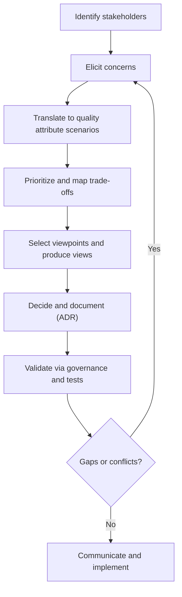

# Stakeholders & Concerns

Understanding who your stakeholders are and what they care about is the starting point for any architectural work. This article frames stakeholders, their typical concerns, and how to elicit and prioritize them so architectural decisions align with the right outcomes. Scope: we focus on architecture-level concerns (mostly non-functional qualities and cross-cutting constraints), not detailed feature design. For how this topic fits alongside siblings, see [Architecture vs. Design vs. Implementation](./architecture-vs-design-vs-implementation) and [Architectural Decision Impact & Cost of Change](./architectural-decision-impact-and-cost-of-change).

import Figure from '@site/src/components/Figure';
import Checklist from '@site/src/components/Checklist';
import Showcase from '@site/src/components/Showcase';
import DecisionMatrix from '@site/src/components/DecisionMatrix';

## Core ideas

- **Stakeholder**: anyone who has a vested interest in the system or is affected by it (customers, internal users, business/product, engineers, operations/SRE, platform/infra, security, compliance/legal, data, support, partners, regulators).
- **Concern**: a matter of interest to a stakeholder that architecture should address, often expressed as desired quality attributes (e.g., availability, performance, security) or constraints (e.g., regulatory, cost caps, tech choices).
- **Viewpoint**: a template for describing the system from a perspective that addresses a set of concerns. Views applying these viewpoints help communicate how the architecture satisfies concerns. See [Views & Viewpoints](../../documentation-and-modeling/views-and-viewpoints/).
- **Quality attributes** provide the language to express and test concerns. See [Quality Attributes](../../quality-attributes/).

## Typical stakeholders and their concerns

The list is illustrative; your context may include more (e.g., open‑source community, auditors) or fewer.

| Stakeholder          | Typical concerns                                                 | Example measures/signals                                 |
| -------------------- | ---------------------------------------------------------------- | -------------------------------------------------------- |
| Business/Product     | Time‑to‑market, differentiation, roadmap feasibility, cost, risk | Cycle time, lead time, burn rate, OKRs                   |
| End Users/Customers  | Usability, performance, reliability, accessibility, privacy      | Core Web Vitals, app latency, uptime/SLA, a11y checks    |
| Engineering/Teams    | Modularity, testability, maintainability, devX, tooling          | Change failure rate, MTTR, code health metrics           |
| Operations/SRE       | Availability, resilience, observability, capacity, run cost      | SLO/SLI, error budgets, saturation, cloud spend          |
| Security             | Threat surfaces, authn/z, data protection, secrets, supply chain | Security posture, vuln MTTR, mTLS coverage, SBOM         |
| Compliance/Legal     | Data residency, PII handling, auditability, retention            | Evidence artifacts, controls mapping, retention policy   |
| Data/Analytics       | Data quality, lineage, access patterns, schema evolution         | Freshness, completeness, lineage trace, CDC stability    |
| Platform/Infra       | Standardization, operability, portability, quota/cost            | Golden path adoption, image provenance, quotas           |
| Partners/Integrators | Stable contracts, SLAs, versioning, deprecation policy           | API error rates, version lifecycle, partner satisfaction |
| Support/CS           | Diagnostics, feature flags, error clarity, rollback paths        | Ticket volume, first‑response time, rollback MTTR        |

Related topics for deeper dives: [Observability & Operations](../../observability-and-operations/), [Security Architecture](../../security-architecture/), and [Architecture Governance & Organization](../../architecture-governance-and-organization/).

## Eliciting and prioritizing concerns

1. **Identify stakeholders** — start from the value stream: who builds, runs, uses, sells, supports, audits, or integrates with the system?
2. **Elicit concerns** — interviews/workshops, review of incidents/postmortems, contracts/SLAs, regulatory commitments; convert concerns into testable quality attribute scenarios (stimulus → environment → response → measure). See [Quality Attributes](../../quality-attributes/).
3. **Prioritize** — use impact vs. likelihood, business value, and risk exposure. Establish explicit trade‑offs (e.g., latency vs. consistency, speed vs. safety).
4. **Trace to views and decisions** — choose appropriate viewpoints and produce views that address the concerns. See [Views & Viewpoints](../../documentation-and-modeling/views-and-viewpoints/). Capture decisions as ADRs with rationale and consequences. See [Architecture Decision Records (ADR)](../../documentation-and-modeling/architecture-decision-records-adr/).
5. **Validate** — align with governance/review practices. See [Review Boards & Design Reviews](../../architecture-governance-and-organization/processes/review-boards-and-design-reviews). Define acceptance criteria and, where possible, executable checks (tests, budgets, policy-as-code).

### Decision flow

<Figure caption="A decision flow for eliciting and prioritizing stakeholder concerns.">

</Figure>

## Decision matrix: prioritization approaches

<DecisionMatrix
  caption="Comparing common ways to prioritize stakeholder concerns."
  columns={[
    'Best for',
    'Pros',
    'Cons',
    'Inputs/Signals',
  ]}
  rows={[
    {
      name: 'ATAM-style evaluation',
      cells: [
        'Architecture trade-off analysis across qualities',
        'Structured scenarios, risk themes, sensitivity points',
        'Workshop time and facilitation needed',
        'Quality attribute scenarios, risks, sensitivity points',
      ],
      recommended: true,
      highlightTone: 'positive',
    },
    {
      name: 'WSJF (Weighted Shortest Job First)',
      cells: [
        'Economic prioritization where sequencing matters',
        'Balances value, urgency, and effort',
        'Quality signals may be underweighted if hard to quantify',
        'Business value, time criticality, risk reduction, effort',
      ],
    },
    {
      name: 'RICE (Reach, Impact, Confidence, Effort)',
      cells: [
        'Backlog triage for product/UX-heavy concerns',
        'Simple scoring; highlights confidence explicitly',
        'Not tailored to cross-cutting qualities or systemic risks',
        'Reach/impact estimates, confidence, effort',
      ],
    },
    {
      name: 'Risk-first (Likelihood × Impact)',
      cells: [
        'Safety, compliance, resilience-critical systems',
        'Focuses on reducing catastrophic exposure early',
        'May delay upside/value-oriented improvements',
        'Threats, hazards, incident history, regulatory duties',
      ],
      highlightTone: 'info',
    },
  ]}
/>

<Showcase
  title="Examples (Scenarios)"
  sections={[
    {
      label: "Payments Checkout",
      body: "Security demands PCI obligations; Product wants a new promo engine live in 4 weeks; SRE holds a 99.9% availability SLO. A feasible compromise: introduce a queue-backed promo calculator to decouple latency from spikes, keep the payment flow isolated under stricter controls, and adopt feature flags for controlled rollout; capture trade-offs in an ADR and define SLO-based alerts.",
      tone: "info",
    },
    {
      label: "Data Export API for Partners",
      body: "Partners require stable contracts and deprecation notices; Legal requires data residency. Provide region-pinned storage, versioned APIs with long deprecation windows, schema evolution with additive changes, and publish a compatibility policy.",
      tone: "neutral",
    },
  ]}
/>

## Implementation notes and pitfalls

### Implementation notes

- Use a lightweight RACI for major decisions to clarify who approves vs. who is consulted.
- Maintain a traceability matrix from concern → quality attribute scenario → view(s) → ADR(s) → tests/monitors.
- Turn critical concerns into budgets and guardrails (latency/error budgets, cost/bandwidth budgets, policy-as-code for security/compliance).

### Operational considerations

- Capture top concerns as SLIs/SLOs and wire dashboards early; align alerting to error budgets, not just static thresholds.
- Define rollout and rollback strategies that respect stakeholder tolerances (e.g., canary for risky security changes, staged enablement for high-impact UX changes).

### Observability

- Ensure trace context and correlation IDs flow across all critical paths to tie concerns to actual runtime behavior. See [Observability & Operations](../../observability-and-operations/).
- Instrument logs and metrics using a common vocabulary for concerns (e.g., latency_budget_ms, error_budget_burn) so dashboards reflect stakeholder language.

### Common pitfalls

- Solutionizing too early: jumping to technology choices before clarifying concerns and trade‑offs.
- Ignoring “quiet” stakeholders: compliance, support, or downstream integrators not present in early meetings.
- Treating security and operability as afterthoughts—these are primary concerns, not add‑ons.
- Design by committee: lack of a clear decision owner stalls progress; use ADRs and RACI.

## Security, privacy, and compliance

- Map stakeholder concerns to data classification and control objectives (e.g., PII handling, encryption, key management). See [Security Architecture](../../security-architecture/).
- Express privacy/compliance requirements as policy-as-code where feasible (e.g., data residency, retention, access approval workflows) and include them in CI checks.
- Ensure third-party integrations reflect contractual obligations (SLAs, deprecations) and regulatory duties in relevant regions.

## Testing

- Turn top quality attribute scenarios into executable checks (fitness functions): latency budgets, availability SLO burn-rate alerts, concurrency limits.
- Add contract tests for external/partner APIs to guard versioning and schema evolution promises.
- Include chaos and failure-injection tests to validate resilience concerns and rollback paths.

## Edge cases

- Conflicting priorities between powerful stakeholders (e.g., speed vs. safety): require explicit trade-off decision and ADR.
- Multi-tenant contexts: isolation, noisy neighbor effects, data segmentation by region/customer class.
- Long-lived contracts: deprecation windows, compatibility shims, and backfill strategies for data schemas.

## Practical example: SLO config

```yaml title="slo.yaml" showLineNumbers
service: checkout
slos:
    - name: availability
      objective: 99.9
      window: 30d
      sli:
          type: events
          good_events: http_requests{status_class="2xx"}
          total_events: http_requests{status_class=~"[245]xx"}
      alerts:
          - name: burn-rate-fast
            burn_rate: 14.4
            window: 5m
          - name: burn-rate-slow
            burn_rate: 2.0
            window: 1h
```

## When to use

- At project inception, when scoping an initiative or new architecture.
- Before significant changes (e.g., major dependency, new region, multi‑tenant shift).
- After incidents or major SLO breaches to re‑validate priorities.

## When not to use

- Tiny prototypes or throwaway spikes where architecture decisions are intentionally deferred.
- When concerns are already well understood and validated for a very similar context—avoid re‑running heavy workshops; do a light refresh instead.

<Checklist
  title="Design Review Checklist"
  items={[
    { label: "Have all key stakeholders been identified?" },
    { label: "Are the top 3-5 quality attribute scenarios defined and prioritized?" },
    { label: "Have conflicting concerns been acknowledged and trade-offs documented?" },
    { label: "Is there a clear mapping from concerns to architectural decisions?" },
    { label: "Are there views that address the primary concerns of key stakeholders?" },
    { label: "Have security, operational, and compliance concerns been treated as first-class requirements?" },
  ]}
/>

## Related topics

- [Architecture vs. Design vs. Implementation](./architecture-vs-design-vs-implementation)
- [Architectural Decision Impact & Cost of Change](./architectural-decision-impact-and-cost-of-change)
- [Quality Attributes](../../quality-attributes/)
- [Views & Viewpoints](../../documentation-and-modeling/views-and-viewpoints/)
- [Architecture Decision Records (ADR)](../../documentation-and-modeling/architecture-decision-records-adr/)
- [Architecture Governance & Organization](../../architecture-governance-and-organization/)

## References

<!-- markdownlint-disable MD033 -->
1. <a href="https://www.iso.org/standard/74393.html" target="_blank" rel="nofollow noopener noreferrer">ISO/IEC/IEEE 42010:2022 — Systems and software engineering — Architecture description ↗️</a>
2. <a href="https://www.viewpoints-and-perspectives.info/" target="_blank" rel="nofollow noopener noreferrer">Rozanski & Woods, Software Systems Architecture: Viewpoints and Perspectives ↗️</a>
3. <a href="https://www.sei.cmu.edu/library/architecture-tradeoff-analysis-method-collection/" target="_blank" rel="nofollow noopener noreferrer">SEI, Architecture Tradeoff Analysis Method (ATAM) — collection/overview ↗️</a>
4. <a href="https://resources.sei.cmu.edu/asset_files/TechnicalReport/2000_005_001_13706.pdf" target="_blank" rel="nofollow noopener noreferrer">Kazman, Klein, Clements. ATAM: Method for Architecture Evaluation (SEI Technical Report) ↗️</a>
<!-- markdownlint-enable MD033 -->


