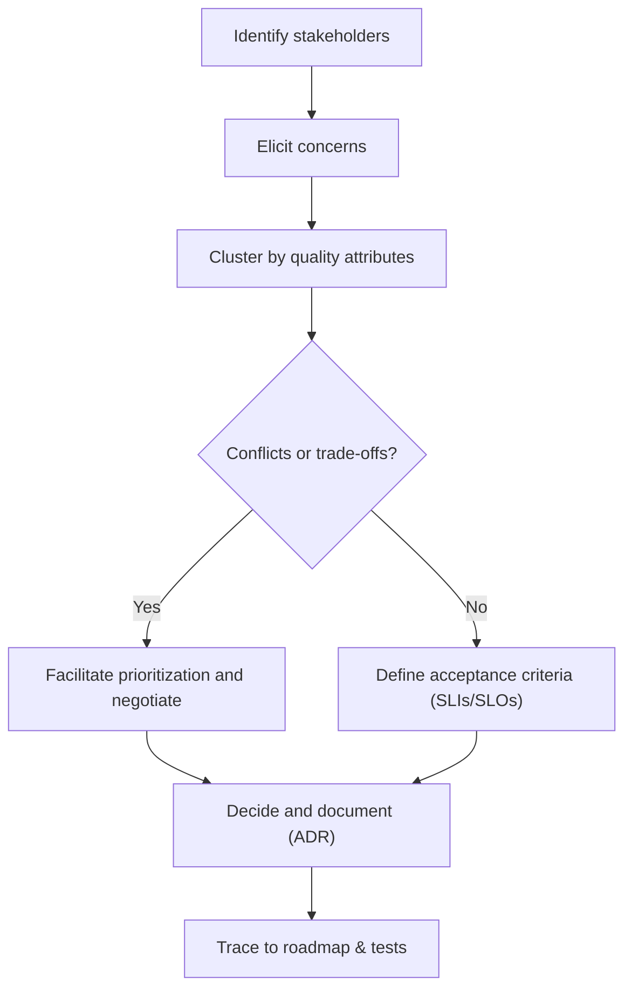

import Head from '@docusaurus/Head'
import Checklist from '@site/src/components/Checklist'
import Figure from '@site/src/components/Figure'
import Showcase from '@site/src/components/Showcase'
import DecisionMatrix from '@site/src/components/DecisionMatrix'

<Head>
  <script type="application/ld+json">{JSON.stringify({
    "@context": "https://schema.org",
    "@type": "Article",
    "headline": "Stakeholders & Concerns",
    "description": "Identify stakeholders, elicit their concerns, and reconcile trade-offs into architecture decisions.",
    "image": "https://archman.dev/img/archman-social-card.webp",
    "keywords": [
      "stakeholders","concerns","quality attributes","non-functional",
      "trade-offs","governance","security","compliance","operations","UX","risk"
    ],
    "author": {"@type":"Person","name":"Archman"},
    "dateModified": "2025-09-10"
  })}</script>
  <script type="application/ld+json">{JSON.stringify({
    "@context":"https://schema.org",
    "@type":"BreadcrumbList",
    "itemListElement":[
      {"@type":"ListItem","position":1,"name":"Foundational Concepts","item":"https://archman.dev/docs/foundational-concepts"},
      {"@type":"ListItem","position":2,"name":"What Is Software Architecture","item":"https://archman.dev/docs/foundational-concepts/what-is-software-architecture"},
      {"@type":"ListItem","position":3,"name":"Stakeholders & Concerns","item":"https://archman.dev/docs/foundational-concepts/what-is-software-architecture/stakeholders-and-concerns"}
    ]
  })}</script>
</Head>

# Stakeholders & Concerns

**TL;DR**: Architecture aligns diverse stakeholder needs with system qualities. Identify stakeholders, elicit their concerns, prioritize and negotiate trade-offs, then record decisions and rationale.

## Learning objectives
- You will be able to identify key stakeholder groups and their primary concerns.
- You will be able to map concerns to system qualities and measurable objectives.
- You will be able to facilitate trade-off decisions and document them transparently.
- You will be able to trace design choices to stakeholder needs over time.

## Motivating scenario
Your team is designing a new payments API. Product wants fast time-to-market, Security requires PCI alignment, SRE cares about SLOs, and Sales needs EU data residency assurances. Without an explicit stakeholder–concerns model, design debates become circular. With it, you can prioritize and justify decisions, avoid costly rework, and align execution across teams.

<Figure caption="Vertical flow for identifying stakeholders, eliciting concerns, mapping to qualities, and recording decisions.">



</Figure>

## Core concepts and definitions
- **Stakeholder**: Anyone with a vested interest in the system (users, product, engineering, security, operations, compliance, finance, support, partners).
- **Concern**: A matter of interest that affects the system’s architecture (e.g., performance, security, cost, maintainability). Concerns often map to **quality attributes** (see [Quality Attributes](../../quality-attributes)).
- **Trade-off**: A deliberate decision to favor certain concerns over others due to constraints (time, budget, risk, capability).
- **Traceability**: The ability to link requirements, decisions, and tests back to stakeholder concerns.

## Scope and boundaries
This article focuses on stakeholder identification, concern elicitation, prioritization, and traceable decision-making. It complements:
- [Architecture vs. Design vs. Implementation](./architecture-vs-design-vs-implementation)
- [Architectural Decision Impact & Cost of Change](./architectural-decision-impact-and-cost-of-change)
- [Architecture Governance & Organization](../../architecture-governance-and-organization)

## Stakeholder categories and typical concerns

| Stakeholder | Common concerns |
| --- | --- |
| Executive leadership (CIO/CTO/VPs) | Strategy alignment, ROI, risk, governance, regulatory posture |
| Product management / Owners | Time-to-market, differentiation, roadmap feasibility, scope trade-offs |
| Program / Project / PMO | Dependencies, delivery risk, milestones, cross-team coordination |
| Business / Finance / FinOps | Unit economics, budgets, cost visibility, chargeback/showback |
| Sales / Pre-sales / Solutions | Customer commitments, SLAs, integration promises, demos/POCs |
| Marketing / Analytics | Attribution, SEO, experimentation, consent, data flows |
| Customer Success / Support | Diagnostics, error clarity, feature flags, rollback paths |
| End users / Customers | Usability/UX, performance (TTFB/TTI), reliability, accessibility |
| Tenant admins (B2B) | SSO/SCIM, RBAC, audit logs, data export, deprovisioning |
| UX / Design / Accessibility | Information architecture, a11y compliance, design system constraints |
| Engineering / Development | Modularity, maintainability, testability, developer experience |
| QA / Testing | Testability, environments, data management, determinism, flake control |
| SRE / Operations / Incident Response | Availability, resilience, observability, capacity, run cost |
| Platform / Infrastructure / DevOps | Standardization, portability, quotas/limits, golden paths |
| Network / DBA | Connectivity, latency, resiliency, schema health, backups/restore |
| Data Eng / Analytics / Science / MLOps | Data quality, lineage, drift, feature stores, privacy |
| Security / AppSec | Least privilege, authn/z, secrets, supply chain, threat model |
| Privacy / Legal / DPO | Data classification, residency, retention, DPIA/consent, contracts |
| Risk Management / Internal Audit | Controls effectiveness, evidence, segregation of duties |
| External Auditors / Certifiers | Compliance scope, audit trails, change control, findings |
| Regulators / Standards Bodies | Regulatory obligations, reporting, lawful basis, sanctions |
| Partners / ISVs / Integrators | Stable contracts, versioning, deprecations, sandboxing |
| Third‑party providers (Cloud/IdP/PSP/SaaS) | SLAs, incident comms, integration limits, pricing/quotas |
| Procurement / Vendor Mgmt | Sourcing, licensing, contractual obligations, exit strategy |
| IT Service Desk / Field Eng | Runbooks, support tooling, access, escalation paths |
| Documentation / Training / DevRel | Developer experience, docs completeness, examples, SDKs |
| Localization / Regional Ops | i18n/l10n, local regulations, data residency, formats |
| Open‑source community (if applicable) | Contribution model, governance, release cadence |

This catalog is intentionally broad. Select and tailor to your context; add domain‑specific stakeholders (e.g., clinicians, drivers, merchants) as needed.

## From concerns to measurable qualities
Translate concerns into measurable objectives tied to [Quality Attributes](../../quality-attributes):
- Performance: “p95 latency ≤ 300 ms under 2x peak”.
- Availability: “Monthly SLO 99.9% with 1 error budget policy”.
- Security: “All PII encrypted at rest; mTLS in transit; admin RBAC”.
- Cost: “≤ $X monthly at baseline traffic; unit cost ≤ $Y per 1k requests”.

## Decision facilitation and trade-offs
When concerns conflict (e.g., time-to-market vs. long-term maintainability), facilitate explicit choices. Use small, time-boxed decision workshops that surface options, risks, and acceptance criteria. Record rationale in ADRs (see [Documentation & Modeling](../../documentation-and-modeling)).

### Simple trade-off grid (example)

| Option | Pros | Cons | When it fits |
| --- | --- | --- | --- |
| Build MVP quickly | Fast delivery, feedback | Tech debt, rework risk | High uncertainty, time-critical |
| Invest in modular design | Easier evolution | Longer lead time | Stable domain/core capabilities |

## Practical example: Stakeholder–concerns register (YAML)

```yaml title="stakeholder-concerns.yaml" showLineNumbers
stakeholders:
    - name: Product
      concerns:
          - label: time-to-market
            priority: high
            notes: "Ship core checkout in Q4"
    - name: Security
      concerns:
          - label: pci-alignment
            priority: high
            notes: "Tokenize PAN; no card data stored"
    - name: SRE
      concerns:
          - label: availability
            priority: medium
            target: "SLO 99.9%"
quality_objectives:
    - attribute: performance
      metric: p95_latency_ms
      target: 300
    - attribute: availability
      metric: slo
      target: "99.9%"
decisions:
    - id: ADR-012
      title: "Tokenization via PSP vault"
      rationale: "Meets PCI concern; minor latency trade-off accepted"
      links:
          - ./architectural-decision-impact-and-cost-of-change
```

## Hands-on exercise

1. List stakeholders for your system (users, product, security, ops, data, legal).
2. Interview or workshop to capture their top 3 concerns (why, evidence, risk).
3. Map each concern to a measurable quality objective (SLO/metric/threshold).
4. Identify conflicts; list options and risks; time-box a decision.
5. Create an ADR documenting the chosen option, rationale, and acceptance criteria.

## Self‑check (answer mentally)
1. Can you name at least five distinct stakeholder groups for your system?
2. For a stated concern, can you express a measurable objective or SLO/metric?
3. Where is the decision rationale recorded and how is it traced to tests/roadmap?

## Signals and anti‑signals

<Showcase
  title="Applying stakeholder–concerns well"
  sections={[
    { label: 'Signals', body: 'Measurable SLOs, explicit ADRs, traceability from concerns to tests', tone: 'positive' },
    { label: 'Anti‑signals', body: 'Vague "secure"/"fast" goals, hidden assumptions, decisions without rationale', tone: 'warning' },
  ]}
/>

## Design review checklist

<Checklist
  title="Stakeholders & concerns (acceptance)"
  items={[
    { label: 'Stakeholders identified and documented' },
    { label: 'Top concerns elicited with evidence or rationale' },
    { label: 'Concerns mapped to measurable qualities (SLIs/SLOs)' },
    { label: 'Conflicts and trade-offs explicitly discussed' },
    { label: 'Decision recorded in ADR with rationale and impacts' },
    { label: 'Traceability to roadmap, tests, and alerts established' },
  ]}
/>

## Operational considerations
- Define owner for each SLO and link to dashboards/alerts. See [Observability & Operations](../../observability-and-operations).
- Capture runbooks for decision fallbacks or feature kill-switches when trade-offs go wrong.

## Security, privacy, and compliance
- Engage Security and Privacy as first-class stakeholders. Document controls (authn/z, encryption, secrets) and regulatory assumptions (e.g., PCI, GDPR). See [Security Architecture](../../security-architecture).

## Observability
- Derive logs, metrics, and traces from stakeholder concerns (e.g., latency SLI, auth failures). Ensure correlation IDs support traceability. See [Observability & Operations](../../observability-and-operations).

## Testing
- Align tests to concerns: performance tests to latency targets, resilience tests to error budgets, security scans to policy. See [Testing Strategy](../../testing-strategy).

## When to use / When not to use
- Use this framework at the start of major initiatives, at key milestones, and whenever risks or concerns change materially.
- Do not treat concerns as fixed requirements; revisit them as context evolves. Avoid optimizing all qualities at once—prioritize.

## Next steps
- Read [Architecture vs. Design vs. Implementation](./architecture-vs-design-vs-implementation).
- Study [Architectural Decision Impact & Cost of Change](./architectural-decision-impact-and-cost-of-change).
- Explore [Architecture Governance & Organization](../../architecture-governance-and-organization) and [Roles](../../architecture-governance-and-organization/roles).
- Review [Quality Attributes](../../quality-attributes) and [Documentation & Modeling](../../documentation-and-modeling).

## Questions this article answers
- Who are the stakeholders of a software system and what do they care about?
- How do I turn vague concerns into measurable architecture objectives?
- How do I reconcile conflicting concerns and record the rationale?

:::info
One takeaway: Make concerns measurable and trace decisions to them—it keeps architecture honest and evolvable.
:::

## References
1. <a href="https://www.iso.org/standard/50508.html" target="_blank" rel="nofollow noopener noreferrer">ISO/IEC/IEEE 42010: Systems and software engineering — Architecture description ↗️</a>
2. <a href="https://www.viewpoints-and-perspectives.info/" target="_blank" rel="nofollow noopener noreferrer">Rozanski & Woods, Software Systems Architecture: Viewpoints & Perspectives ↗️</a>


