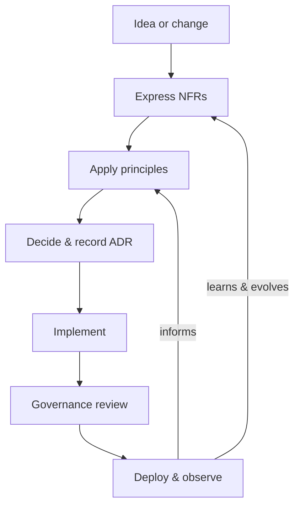

## What this is

A practical way to make architectural decisions on purpose, not by accident. It names the qualities that matter, turns them into measurable Non‑Functional Requirements (NFRs), uses a few clear principles to steer trade‑offs, and captures decisions with Architecture Decision Records (ADRs) under light governance. Essential for systems where early choices stick and consistency across teams matters.

## When to use it

- New service or big change where early choices will stick (data model, integration style, runtime).
- Shifts with real impact: multi‑region rollout, event‑driven vs. request/response, authentication model, sharding/partitioning.
- More teams touching the same platform and consistency is needed without a central bottleneck.
- Regulated or high‑risk work (Payment Card Industry Data Security Standard (PCI DSS), Health Insurance Portability and Accountability Act (HIPAA), safety) where rationale and traceability matter.

## When not to

- Trivial refactors or local code moves — better captured briefly in the Pull Request (PR).
- Spikes intended for learning — capture a short “what was learned” note; formalization can follow if useful.
- Throwaway prototypes with no production path — additional ceremony adds little value.

## Core decisions

- Quality targets: 3–5 that matter now (p95 latency under 200ms, 99.9% availability, monthly cost budget, error budget) with a clearly named owner.
- Principles: 5–7 crisp rules that guide design (prefer idempotent APIs; isolate write paths; limit blast radius; fail fast with graceful degradation).
- Decision record: one‑page ADR with context → options → decision → consequences; statuses track evolution (Proposed/Accepted/Superseded).
- Governance: what triggers a design review, and the paved path (templates, example repo, Pull Request (PR) checks) that makes the right thing easy.
- Trade‑off: ceremony vs. speed — favor the smallest artifact that still preserves intent across teams and future maintainers.

## Mental model

_Figure: Decision loop that keeps architecture intentional, measurable, and learnable._

## What to read next

- [Define and measure quality with Non‑Functional Requirements](/docs/foundations/nfrs)
- [Understand common Quality Attributes and their interactions](/docs/foundations/quality-attributes)
- [Apply Principles to guide everyday trade‑offs](/docs/foundations/principles)
- [Capture decisions with Architecture Decision Records](/docs/foundations/adrs)
- [Set up who decides what with Governance](/docs/foundations/governance)

:::note
Orientation: Non‑Functional Requirements (NFRs) and Architecture Decision Records (ADRs) are natural starting points for teams new to structured architecture practices.
:::
