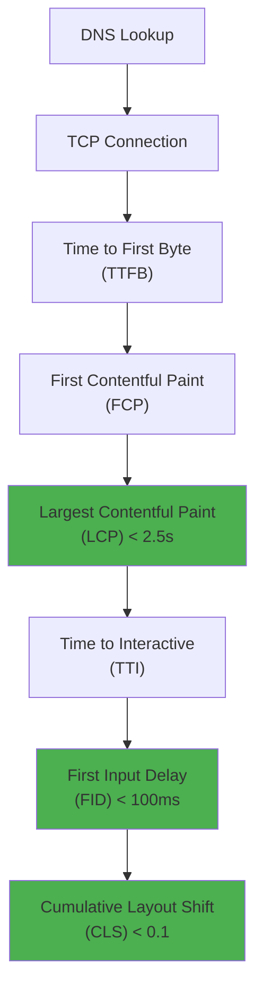

<Hero
  title="Frontend Performance Fundamentals"
  subtitle="Optimize user experience with Core Web Vitals, efficient bundling, image optimization, and strategic resource loading to maximize conversion and engagement."
  difficulty="intermediate"
  time="15 min read"
/>

## TL;DR

Frontend performance centers on three Core Web Vitals: Largest Contentful Paint (LCP < 2.5s), First Input Delay (FID < 100ms), and Cumulative Layout Shift (CLS < 0.1). Optimize via code splitting, lazy loading, image optimization (WebP, responsive sizes), tree-shaking, and establishing performance budgets. Monitor with Lighthouse, Web Vitals API, and synthetic monitoring to maintain sub-3s load times across your user base.

## Learning Objectives

By the end of this article, you'll understand:
- Core Web Vitals metrics and their impact on SEO and UX
- Bundle optimization techniques: code splitting, tree-shaking, minification
- Image optimization strategies: format selection, responsive sizing, lazy loading
- Render-blocking resource identification and mitigation
- Performance budgeting and continuous monitoring approaches

## Motivating Scenario

Your e-commerce site loads in 5+ seconds on 4G connections, causing 40% cart abandonment. Analytics show users leave within 3 seconds. A competitor loads in 2 seconds and captures your market share. You need a systematic approach to identify bottlenecks, establish performance targets, and maintain speed gains as the codebase grows. How do you architect for sustained performance?

## Core Concepts

<Figure title="Frontend Performance Pipeline and Metrics">

</Figure>

### Core Web Vitals: The Three Pillars

**Largest Contentful Paint (LCP)** measures when the largest visible content element renders. Target: < 2.5 seconds.
- Driven by: server response time, render-blocking resources, client-side rendering
- Optimize: minimize TTFB, defer non-critical CSS/JS, preload critical images

**First Input Delay (FID)** measures delay between user interaction and browser response. Target: < 100ms.
- Driven by: JavaScript execution blocking the main thread
- Optimize: break up long tasks, use Web Workers, defer non-critical JS

**Cumulative Layout Shift (CLS)** measures unexpected layout changes. Target: < 0.1.
- Driven by: images without dimensions, dynamic content insertion, web fonts
- Optimize: reserve space for dynamic content, lazy load with containers, avoid flash of unstyled content

### Bundle Optimization Strategies

**Code Splitting:**
- Split code into critical (above-the-fold) vs non-critical (below-the-fold)
- Route-based splitting: load only code needed for current route
- Component-based splitting: lazy load heavy components on visibility
- Typical result: 30-50% reduction in initial bundle

**Tree-Shaking:**
- Remove unused code during build process
- Requires ES6 modules and production builds
- Common savings: 10-20% for large libraries
- Tools: Webpack, Rollup, esbuild

**Minification & Compression:**
- Minify JS/CSS/HTML: 20-30% size reduction
- Gzip compression: 50-70% additional reduction
- Brotli compression: 5-10% better than Gzip (requires server support)
- HTTP/2 header compression: eliminates header redundancy

### Image Optimization

**Format Selection:**
- JPEG: photographs, complex images (80-85% quality typical)
- WebP: modern browsers, 25-35% smaller than JPEG
- AVIF: next-generation, 20% smaller than WebP (limited browser support)
- SVG: icons, logos, scalable graphics
- PNG: transparency, lossless (avoid for photos)

**Responsive Images:**
```html
<picture>
  <source srcset="image-1200w.webp" media="(min-width: 1200px)">
  <source srcset="image-600w.webp" media="(min-width: 600px)">
  
</picture>
```

**Lazy Loading:**
- Load images only when entering viewport
- Native `loading="lazy"` support in modern browsers
- Fallback: Intersection Observer API for older browsers
- Typical impact: 40-60% reduction in initial image load

## Practical Example

<Tabs>
<TabItem value="react" label="React (Performance Optimization)">
```javascript

// Performance monitoring hook
const usePerformanceMetrics = () => {
  useEffect(() => {
    if ('web-vital' in window) {
      window.addEventListener('web-vital', (event) => {
        const { name, value } = event.detail;
        console.log(`${name}: ${value}ms`);

        // Send to analytics
        fetch('/api/metrics', {
          method: 'POST',
          body: JSON.stringify({ metric: name, value })
        });
      });
    }
  }, []);
};

// Code-split heavy component
const HeavyComponent = dynamic(
  () => import('./HeavyComponent'),
  { loading: () => <div>Loading...</div> }
);

// Image optimization component
const OptimizedImage = ({ src, alt, width, height }) => {
  const webpSrc = src.replace(/\.[^/.]+$/, '.webp');

  return (
    <picture>
      <source srcSet={webpSrc} type="image/webp" />
      
    </picture>
  );
};

// Performance budget tracking
const PerformanceBudget = {
  'bundle.js': 50,      // KB
  'vendor.js': 100,     // KB
  'styles.css': 30,     // KB
  'LCP': 2500,          // ms
  'FID': 100,           // ms
  'CLS': 0.1
};

// Bundle analyzer output example
export function checkBudget() {
  const bundles = {
    'bundle.js': 45,
    'vendor.js': 95,
    'styles.css': 28
  };

  Object.entries(bundles).forEach(([name, size]) => {
    const budget = PerformanceBudget[name];
    const exceeded = size > budget;
    console.log(`${name}: ${size}KB ${exceeded ? '⚠️ EXCEEDS' : '✓'} budget of ${budget}KB`);
  });
}

// Lazy load below-the-fold content
const ScrollDetectionComponent = ({ children }) => {
  const [isVisible, setIsVisible] = React.useState(false);
  const ref = React.useRef(null);

  React.useEffect(() => {
    const observer = new IntersectionObserver(
      ([entry]) => {
        if (entry.isIntersecting) {
          setIsVisible(true);
          observer.unobserve(entry.target);
        }
      },
      { rootMargin: '50px' }
    );

    if (ref.current) {
      observer.observe(ref.current);
    }

    return () => observer.disconnect();
  }, []);

  return (
    <div ref={ref}>
      {isVisible ? children : <div style={{ height: '300px' }} />}
    </div>
  );
};

// Main component
export default function Page() {
  usePerformanceMetrics();

  return (
    <div>
      <h1>Performance-Optimized Page</h1>

      {/* Critical image above fold */}
      <OptimizedImage
        src="hero.jpg"
        alt="Hero"
        width={1200}
        height={600}
      />

      {/* Below-fold content loaded on demand */}
      <ScrollDetectionComponent>
        <HeavyComponent />
      </ScrollDetectionComponent>

      <Suspense fallback={<div>Loading...</div>}>
        <lazy component={HeavyComponent} />
      </Suspense>
    </div>
  );
}
```
</TabItem>

<TabItem value="vue" label="Vue 3 (Bundle & Image Optimization)">
```vue
<template>
  <div class="optimized-page">
    <h1>Performance-First Page</h1>

    <!-- Hero image with optimization -->
    <picture>
      <source
        srcset="hero-1200w.webp"
        media="(min-width: 1200px)"
        type="image/webp"
      />
      <source srcset="hero-600w.webp" type="image/webp" />
      
    </picture>

    <!-- Lazy-loaded heavy component -->
    <Suspense fallback="Loading...">
      <HeavyComponent v-if="showHeavyComponent" />
    </Suspense>

    <!-- Scroll-triggered lazy loading -->
    <div
      v-for="item in items"
      :key="item.id"
      v-intersection-observer="{ threshold: 0.1 }"
      @intersect="onIntersect(item)"
    >
      <component
        :is="item.component"
        v-if="item.isVisible"
      />
    </div>
  </div>
</template>

<script setup>

const showHeavyComponent = ref(false);
const items = ref([]);

// Performance budget definition
const PERFORMANCE_BUDGET = {
  'bundle.js': 50,      // KB
  'vendor.js': 100,     // KB
  'LCP': 2500,          // ms
  'FID': 100,           // ms
  'CLS': 0.1
};

// Code-split heavy components
const HeavyComponent = defineAsyncComponent(() =>
  import('./HeavyComponent.vue')
);

// Track Web Vitals
const trackWebVitals = () => {
  // Largest Contentful Paint
  new PerformanceObserver((list) => {
    const entry = list.getEntries().pop();
    console.log('LCP:', entry.renderTime || entry.loadTime);
  }).observe({ entryTypes: ['largest-contentful-paint'] });

  // Cumulative Layout Shift
  let cls = 0;
  new PerformanceObserver((list) => {
    for (const entry of list.getEntries()) {
      if (!entry.hadRecentInput) {
        cls += entry.value;
        console.log('CLS Update:', cls);
      }
    }
  }).observe({ entryTypes: ['layout-shift'] });
};

// Intersection Observer for lazy loading
const onIntersect = (item) => {
  item.isVisible = true;
};

const onImageLoad = () => {
  console.log('Critical image loaded');
  showHeavyComponent.value = true;
};

onMounted(() => {
  trackWebVitals();
  // Load below-fold items
  items.value = [
    { id: 1, component: 'Component1', isVisible: false },
    { id: 2, component: 'Component2', isVisible: false },
    { id: 3, component: 'Component3', isVisible: false }
  ];
});
</script>

<style scoped>
img {
  content-visibility: auto;
  contain-intrinsic-size: 1200px 600px;
}
</style>
```
</TabItem>

<TabItem value="bundler" label="Build Configuration (Webpack)">
```javascript
const webpack = require('webpack');
const TerserPlugin = require('terser-webpack-plugin');
const CompressionPlugin = require('compression-webpack-plugin');
const BundleAnalyzerPlugin = require('webpack-bundle-analyzer')
  .BundleAnalyzerPlugin;

module.exports = {
  mode: 'production',
  entry: './src/index.js',
  output: {
    filename: '[name].[contenthash].js',
    path: __dirname + '/dist',
    publicPath: '/assets/'
  },

  optimization: {
    minimize: true,
    minimizer: [
      new TerserPlugin({
        terserOptions: {
          compress: {
            drop_console: true,
            drop_debugger: true
          },
          output: {
            comments: false
          }
        },
        extractComments: false
      })
    ],
    // Code splitting configuration
    splitChunks: {
      chunks: 'all',
      cacheGroups: {
        // Vendor libraries
        vendor: {
          test: /[\\/]node_modules[\\/]/,
          name: 'vendors',
          priority: 10,
          reuseExistingChunk: true
        },
        // Shared code
        common: {
          minChunks: 2,
          priority: 5,
          reuseExistingChunk: true,
          name: 'common'
        },
        // React-specific
        react: {
          test: /[\\/]node_modules[\\/](react|react-dom)[\\/]/,
          name: 'react-vendors',
          priority: 20
        }
      }
    }
  },

  module: {
    rules: [
      {
        test: /\.js$/,
        exclude: /node_modules/,
        use: {
          loader: 'babel-loader',
          options: {
            presets: ['@babel/preset-env', '@babel/preset-react']
          }
        }
      },
      {
        test: /\.(png|jpg|webp|avif)$/,
        type: 'asset',
        parser: {
          dataUrlCondition: {
            maxSize: 8 * 1024 // 8 KB
          }
        },
        generator: {
          filename: 'images/[name].[hash:8][ext]'
        }
      },
      {
        test: /\.svg$/,
        type: 'asset/resource',
        generator: {
          filename: 'icons/[name].[hash:8].svg'
        }
      }
  },

  plugins: [
    // Analyze bundle size
    new BundleAnalyzerPlugin({
      openAnalyzer: false,
      reportFilename: 'bundle-report.html'
    }),

    // Gzip compression
    new CompressionPlugin({
      algorithm: 'gzip',
      test: /\.(js|css|html|svg)$/,
      threshold: 8192,
      minRatio: 0.8
    }),

    // Brotli compression
    new CompressionPlugin({
      algorithm: 'brotliCompress',
      test: /\.(js|css|html|svg)$/,
      threshold: 8192,
      minRatio: 0.8,
      filename: '[path][base].br'
    })
  ],

  // Performance budgets
  performance: {
    maxEntrypointSize: 512000,
    maxAssetSize: 512000,
    hints: 'warning'
  }
};
```
</TabItem>
</Tabs>

## When to Use / When Not to Use

<Vs items={[
{
    label: "Optimize Aggressively When:",
    points: ["E-commerce or high-conversion funnels (every 100ms = 1% conversion loss)", "Mobile-first audience (slow 4G networks common)", "SEO-critical content (Core Web Vitals impact rankings)", "Expensive compute (images, video, analytics)", "High traffic volume (latency multiplied across millions)"]
  },
{
    label: "Defer Optimization When:",
    points: ["Internal tools with limited users (UX matters less)", "Early-stage startups (product-market fit first)", "Network-independent features (offline-first apps)", "Rare user interactions (not on critical path)", "Small budgets and technical debt (maintenance first)"]
  }
]} />

## Patterns & Pitfalls

<Showcase  sections={[{
      title: "Image Optimization with Formats",
      description: "Serve WebP/AVIF with JPEG fallback; automatically select based on device pixel ratio and viewport width. Saves 30-40% bandwidth.",
      icon: "✓",
      positive: true
    }, {
      title: "Render-Blocking Resources",
      description: "CSS in the head section and JS in the body section block rendering. Defer non-critical CSS and JS; inline critical styles; use async/defer attributes.",
      icon: "✓",
      positive: true
    }, {
      title: "Premature Optimization",
      description: "Optimizing unused features kills developer velocity. Focus on critical path first; measure before optimizing; profile before guessing.",
      icon: "✗",
      positive: false
    }, {
      title: "Font Loading Strategies",
      description: "System fonts render instantly; web fonts block text. Use font-display: swap for user-installable fonts; preload critical fonts.",
      icon: "✓",
      positive: true
    }, {
      title: "Layout Thrashing",
      description: "Interleaving reads and writes forces browser reflows. Batch DOM reads, then writes; use RequestAnimationFrame for animations.",
      icon: "✓",
      positive: true
    }, {
      title: "Cargo Cult Minification",
      description: "Modern bundlers auto-minify; manual minification is redundant. Focus on code splitting and tree-shaking instead.",
      icon: "✗",
      positive: false
    }]}
/>

## Design Review Checklist

<Checklist
  items={[
    { label: "Core Web Vitals tracked and < targets (LCP 2.5s, FID 100ms, CLS 0.1)", checked: false },
    { label: "Critical rendering path identified (DNS, TCP, TLS, TTFB, FCP, LCP)", checked: false },
    { label: "Code splitting implemented (route-based, component-based, vendor)", checked: false },
    { label: "Tree-shaking enabled and verified (production build only)", checked: false },
    { label: "Images optimized (format, size, lazy loading, responsive)", checked: false },
    { label: "Render-blocking resources minimized (CSS, JS, fonts)", checked: false },
    { label: "Performance budget established and monitored in CI/CD", checked: false },
    { label: "Web Workers used for heavy JavaScript (if needed)", checked: false },
    { label: "Monitoring in place (RUM, synthetic tests, dashboards)", checked: false },
    { label: "Documentation covers performance trade-offs and decisions", checked: false }
  ]}
/>

## Self-Check

Ask yourself:
- What's my page load time on 4G networks and lower-end devices?
- Can I identify the single largest bottleneck in my critical path?
- Do I track Web Vitals continuously or only at release?
- Can I explain the trade-off between bundle size and feature richness?
- Is my performance budget enforced in CI/CD?

## One Key Takeaway

:::info
**Frontend performance is not a one-time optimization but a continuous discipline. Establish Core Web Vitals targets, create performance budgets, automate monitoring, and review trade-offs regularly. Most 3x performance improvements come from architectural decisions (code splitting, lazy loading) rather than micro-optimizations.**

:::

## Next Steps

1. **Audit current performance** - Run Lighthouse on top 10 pages
2. **Identify bottlenecks** - Use Chrome DevTools performance profiler
3. **Establish budgets** - Set targets for bundle size and Core Web Vitals
4. **Implement code splitting** - Separate critical vs non-critical code
5. **Optimize images** - Convert to WebP, add responsive sizing
6. **Automate monitoring** - Set up RUM and continuous performance tracking
7. **Document trade-offs** - Create runbooks for performance decisions

## References

- <a href="https://web.dev/vitals/" target="_blank" rel="nofollow noopener noreferrer">Web Vitals Guide ↗️</a>
- <a href="https://web.dev/lighthouse/" target="_blank" rel="nofollow noopener noreferrer">Lighthouse Documentation ↗️</a>
- <a href="https://web.dev/performance/" target="_blank" rel="nofollow noopener noreferrer">Web Performance Fundamentals ↗️</a>
- <a href="https://developer.mozilla.org/en-US/docs/Glossary/First_Input_Delay" target="_blank" rel="nofollow noopener noreferrer">MDN: First Input Delay ↗️</a>
- <a href="https://www.smashingmagazine.com/guides/web-performance/" target="_blank" rel="nofollow noopener noreferrer">Smashing Magazine Web Performance ↗️</a>
