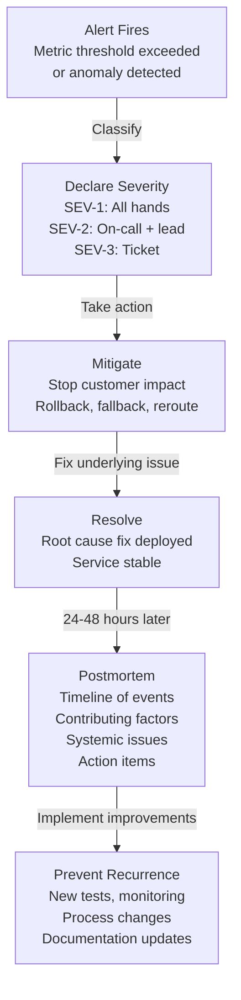

<Hero title="Incident Response Lifecycle and Postmortems" subtitle="Manage incidents from detection to resolution to learning. Blameless postmortems prevent recurrence." imageAlt="Incident response illustration" size="large" />

## TL;DR

Incident lifecycle: detect (alerts fire) → declare (classify severity) → mitigate (stop customer impact) → resolve (fix root cause) → postmortem (extract systemic learning). Blameless postmortems assume everyone has good intent: no one intentionally breaks production. Postmortems investigate systems, not scapegoat people. Questions: what failed? Why didn't monitoring catch it? What processes failed? What changes prevent recurrence? Action items: improve alerting, add tests, change deployment procedures. Incidents reveal gaps in systems. Treat them as learning gifts, not shameful failures to hide. Organizations with healthy incident cultures improve fastest.

## Learning Objectives

- Manage incident lifecycle from detection through resolution
- Declare severity appropriately; coordinate response by severity
- Facilitate effective incident response and communication
- Run blameless postmortems that drive systemic change
- Convert postmortems into concrete, actionable improvement items
- Track action items to completion
- Build a learning culture that treats incidents as opportunities

## Motivating Scenario

A deploy introduces a subtle bug that causes 10% of API calls to timeout after 30 seconds. The on-call engineer is paged at 2 AM. After 45 minutes, the issue is identified: a new database connection pool configuration is exhausting connections. Rollback happens, service recovers. Users experienced 45 minutes of degradation.

In a blame-focused culture, the postmortem focuses on the engineer: "Why didn't you test this?" In a learning culture, the postmortem asks: "Why didn't our tests catch this? Why didn't our monitoring alert us immediately? Why was rollback not faster? What processes can prevent this class of bug?"

Learning-focused postmortems lead to: automated load tests that catch connection pool issues, monitoring that alerts on timeout rates within 2 minutes (not 45), and automated rollback procedures. The next similar bug is caught in CI/CD, never reaching production.

## Core Concepts

<Figure caption="Incident Response Lifecycle: Detection to Learning">

</Figure>

### Incident Severity Levels

**SEV-1 (Critical)**: Service entirely down or severely degraded. Customer-facing, significant business impact. Declare immediately, page all on-call, escalate to leadership. Target MTTR: &lt;15 minutes.

**SEV-2 (Major)**: Significant customer impact, but service partially available. Page on-call + service lead. Target MTTR: &lt;1 hour.

**SEV-3 (Minor)**: Isolated customer impact, non-critical functionality affected. Create ticket, investigate during business hours. Target MTTR: &lt;24 hours.

**SEV-4 (Degradation)**: No customer impact yet, but metrics concerning. No page. Create ticket for investigation.

### Blameless Postmortem Structure

**Timeline**: Chronological events. "2:15 AM: Alert fired. 2:17 AM: On-call checked monitoring. 2:25 AM: Root cause identified (connection pool exhausted). 2:32 AM: Rollback initiated. 2:38 AM: Service recovered."

**Contributing factors**: What conditions allowed this incident? "Lack of connection pool monitoring, high QA traffic during peak load, no load testing before deploy."

**Root cause**: Systemic gap. "New connection pool config not tested under load. Monitoring did not alert on connection pool exhaustion. Runbook didn't cover this failure mode."

**Action items**: Concrete changes. "Add connection pool monitoring (owner: Bob, due in 1 week). Add load testing to CI/CD (owner: Alice, due in 2 weeks). Update runbook with connection pool troubleshooting (owner: Carol, due in 3 days)."

## Practical Example

<Tabs>
  <TabItem value="template" label="Postmortem Template" default>

```markdown
# Postmortem: API Timeout Incident - 2025-02-14

## Summary
Production API experienced timeout errors (10% of requests) for 45 minutes due to database connection pool exhaustion.

## Impact
- Duration: 02:15 - 03:00 UTC (45 minutes)
- Severity: SEV-2
- Services affected: User API, Orders API
- Customers impacted: ~5% of active users experienced timeouts
- Estimated revenue impact: $12K

## Timeline
| Time    | Event |
|---------|-------|
| 02:15   | Alert fires: "API error rate > 5%" |
| 02:17   | On-call (John) acknowledged alert |
| 02:20   | John checked error logs: "timeout exceeded" |
| 02:25   | John identified: database connection pool full |
| 02:27   | John escalated to DBA (Sarah) |
| 02:32   | Sarah found root cause: new connection pool config from deploy at 01:45 |
| 02:35   | Decision made: rollback the deploy |
| 02:38   | Rollback initiated |
| 02:42   | Error rate returned to normal |
| 03:00   | Service stable, all-clear given |

## Root Cause Analysis

### What Went Wrong
1. **Insufficient load testing before deploy**: New connection pool configuration reduced pool size from 100 to 50, assuming similar load. Testing with realistic load not done.
2. **Missing monitoring**: No alerts on connection pool utilization or exhaustion.
3. **Unclear runbook**: Runbook didn't include connection pool troubleshooting steps. On-call spent 5 minutes identifying the issue.

### Contributing Factors
- High baseline traffic during this time window (peak usage)
- New code path added more queries per request (higher pool demand)
- No peer review of infrastructure changes (connection pool config change approved without discussion)

## Blameless Analysis
The engineer who deployed the config change acted with good intent: they were optimizing connection pool overhead. The lack of systems (monitoring, load testing) enabled the problem, not the engineer's competence.

## Action Items

| Action | Owner | Due Date | Priority |
|--------|-------|----------|----------|
| Add connection pool monitoring and alerts | Sarah (DBA) | 2025-02-21 | P0 |
| Add load testing to CI/CD pipeline | Alice (DevOps) | 2025-02-28 | P0 |
| Update runbook: connection pool troubleshooting | John (On-call) | 2025-02-17 | P1 |
| Require peer review for infrastructure changes | Bob (Platform Lead) | 2025-02-21 | P1 |
| Add connection pool metrics dashboard | Sarah | 2025-02-28 | P2 |

## Prevention for Future

1. **Monitoring**: Alert on connection pool utilization >80%, exhaustion, timeout latency
2. **Testing**: Load tests validate connection pool sizing for realistic peak load
3. **Process**: Infrastructure changes require peer review, especially resource pools
4. **Documentation**: Expanded runbook with connection pool failure modes and remediation

## Learning
This incident revealed that while our database is reliable, our observability around resource constraints is weak. We now have a system to prevent similar incidents for other pooled resources (memory pools, thread pools, etc.).
```

  </TabItem>
  <TabItem value="tracking" label="Action Item Tracking">

```yaml
# Incident action items tracking system
# Store in spreadsheet, Jira, or incident management platform

incidents:
  - id: INC-2025-001
    title: "API Timeout - Connection Pool Exhaustion"
    severity: SEV-2
    date: "2025-02-14"

    action_items:
      - id: AIT-001
        action: "Add connection pool monitoring and alerts"
        owner: sarah
        due_date: "2025-02-21"
        priority: P0
        status: "in_progress"
        created: "2025-02-14"
        updated: "2025-02-18"
        notes: "Grafana dashboards created. Alerts configured. Testing in staging."

      - id: AIT-002
        action: "Add load testing to CI/CD pipeline"
        owner: alice
        due_date: "2025-02-28"
        priority: P0
        status: "pending"
        created: "2025-02-14"
        notes: "Scoped: k6 load tests in pull request checks. Need performance baseline."

      - id: AIT-003
        action: "Update runbook: connection pool troubleshooting"
        owner: john
        due_date: "2025-02-17"
        priority: P1
        status: "completed"
        created: "2025-02-14"
        completed_date: "2025-02-16"
        notes: "Runbook updated with diagnostics and recovery steps. Reviewed by team."

# Metrics
tracking_stats:
  total_incidents_this_quarter: 12
  avg_mttr: "32 minutes"
  action_item_completion_rate: "87%"
  incidents_with_repeated_root_causes: 1  # Should be 0
  culture_survey: "88% feel safe reporting incidents"
```

  </TabItem>
  <TabItem value="blameless-guide" label="Facilitating Blameless Postmortems">

```markdown
# Guide: Facilitating Blameless Postmortems

## Pre-Postmortem (First 24 Hours)
- Schedule postmortem within 24-48 hours of incident resolution
- Invite: on-call responder, service owner, impacted team members, optional: broader team
- Gather facts: logs, metrics, deployment history, alert history
- Don't blame anyone yet. This is data collection, not judgment.

## During Postmortem (60-90 Minutes)

### Part 1: Timeline (20 minutes)
- Chronologically list events. Who noticed what, when?
- Facilitator asks: "What did you see at that moment?" Not "Why didn't you..."
- Write timeline without interpretation. Stick to facts.

Example good question: "What did the monitoring show at 02:25?"
Example bad question: "Why didn't you check the logs faster?"

### Part 2: Contributing Factors (30 minutes)
- What conditions allowed this incident?
- Ask: "What made this possible?" Not "Who caused this?"
- Multiple factors are normal. "Perfect storm" incidents have 4-5 factors.

Questions to ask:
- What didn't we monitor?
- What tests didn't catch this?
- What information wasn't available?
- What process gaps existed?
- Were there any automation failures?

### Part 3: Root Cause (15 minutes)
- Dig deeper. Don't stop at "engineer made a mistake." That's blame, not root cause.
- Root cause: systemic gaps that enabled the mistake

Bad root cause: "Engineer didn't test the change."
Better: "We don't have automated load testing in CI/CD to catch performance regressions."

### Part 4: Action Items (15 minutes)
- For each root cause, what changes prevent recurrence?
- Assign owners and due dates.
- Action items should be concrete: "Add monitoring," not "Be more careful."

## Post-Postmortem

1. **Document**: Write postmortem, share with team and leadership
2. **Track**: Add action items to project tracking system
3. **Follow up**: Check on action item progress monthly
4. **Celebrate learning**: This incident improved your systems

## Culture: What NOT To Do
- Don't ask "Why did you..." (implies blame)
- Don't focus on individual decisions; focus on system failures
- Don't punish. An incident postmortem is not a disciplinary process.
- Don't skip hard conversations. "We didn't trust anyone to make changes safely" is a real issue.

## Signs of a Healthy Incident Culture
- Engineers report incidents quickly, not hiding them
- Postmortems focus on systems, not scapegoats
- Action items are tracked and completed
- Teams improve after incidents (fewer repeat incidents)
- Engineers feel safe experimenting and taking risks
```

  </TabItem>
</Tabs>

## When to Use / When Not to Use

<Vs items={[
{label: "Blameless, Learning-Focused Culture", points: [
      "Growing, innovative organizations",
      "Systems with complex interactions",
      "Teams experimenting with new technologies",
      "High-reliability requirements",
      "Organizations that value long-term improvement"
    ]},
{label: "Different Approaches", points: [
      "Highly regulated industries (may need compliance focus)",
      "Organizations optimizing for short-term stability",
      "Siloed teams with clear boundaries",
      "Systems with single points of failure",
      "Cultures with existing trust issues"
    ]}
]} highlight={[0, 1]} />

## Patterns and Pitfalls

<Showcase
  sections={[
    {
      label: "Pattern: Five Whys to Find Root Cause",
      body: "Don't stop at surface explanations. Ask 'Why?' repeatedly. Surface: 'Config was wrong.' Why? 'No validation.' Why? 'No test for this scenario.' Why? 'Tests don't cover edge cases.' Root cause: 'Testing strategy insufficient for this type of failure.' Systemic improvement: strengthen testing."
    },
    {
      label: "Pitfall: Postmortems That Blame Individuals",
      body: "If postmortem concludes 'John was careless,' you've failed. That's blame, not learning. Even if John made a mistake, the system allowed it. Root cause should be: 'No peer review process, insufficient automation, unclear procedures.' Action: add peer review."
    },
    {
      label: "Pattern: Action Items for Monitoring Gaps",
      body: "Most incidents reveal monitoring gaps. If you didn't detect the problem for 45 minutes, your monitoring was insufficient. Action items should include: 'Alert on X metric within Y minutes of issue start.' Monitoring improvements prevent similar incidents faster."
    },
    {
      label: "Pitfall: Forgotten Action Items",
      body: "Postmortem concludes with 10 action items. Six months later, none are done. Incidents repeat. Treat action items with urgency. Track them. Review monthly. Close or explicitly defer. If action items aren't done, the postmortem failed."
    },
    {
      label: "Pattern: Incident Metrics Show Culture Health",
      body: "Track: incidents per month (decreasing = improving), MTTR (decreasing = improving), action item completion rate (should be >90%), repeat root causes (should be 0). These metrics show if your learning cycle works."
    },
    {
      label: "Pitfall: Postmortems Only for Severe Incidents",
      body: "Some teams only postmortem SEV-1 incidents. But SEV-3 incidents reveal patterns too. A SEV-3 today might become SEV-1 tomorrow if not addressed. Postmortem on patterns: 5 SEV-3 incidents from authentication? Postmortem auth service."
    }
  ]}
/>

## Design Review Checklist

<Checklist items={[
  "Are incident severity levels clearly defined and understood?",
  "Is there a documented process for incident response?",
  "Are postmortems scheduled within 24-48 hours of incident resolution?",
  "Do postmortems focus on systems, not individual blame?",
  "Are action items created with owners and due dates?",
  "Is action item progress tracked monthly?",
  "Do you measure MTTR, incidents per month, action completion rate?",
  "Are postmortems shared transparently with the team?",
  "Do you celebrate learning from incidents (not hide them)?",
  "Are repeat root causes identified and escalated?"
]} />

## Self-Check

- What was your most recent incident?
- What's the longest action item still pending?
- Have you had repeat root causes? Why?
- How many incidents did you have last quarter?
- Is your team eager to report incidents or hiding them?

## Next Steps

1. **Define severity levels**: Create SEV-1/2/3 definitions with response expectations
2. **Create postmortem process**: Document who, when, format, action item tracking
3. **Train facilitators**: Ensure someone understands blameless postmortem principles
4. **Establish tracking**: Use spreadsheet or Jira for action item progress
5. **Measure and improve**: Track metrics; celebrate improvements

## References

1. Beyer, B., et al. (2016). Site Reliability Engineering. <a href="https://www.oreilly.com/library/view/site-reliability-engineering/9781491929881/" target="_blank" rel="nofollow noopener noreferrer">O'Reilly Media ↗️</a>
2. Edmondson, A. (2018). The Fearless Organization. <a href="https://www.wiley.com/en-us/The+Fearless+Organization%3A+Creating+Psychological+Safety+in+the+Workplace+for+Learning%2C+Innovation%2C+and+Growth-p-9781119477242" target="_blank" rel="nofollow noopener noreferrer">Wiley ↗️</a>
3. Weick, K. E., & Sutcliffe, K. M. (2015). Managing the Unexpected. <a href="https://www.wiley.com/en-us/Managing+the+Unexpected%3A+Resilient+Performance+in+an+Age+of+Uncertainty+-p-9781119156895" target="_blank" rel="nofollow noopener noreferrer">Wiley ↗️</a>
