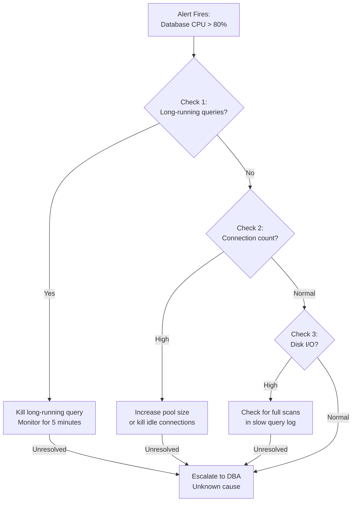

<Hero title="Runbooks and On-Call" subtitle="Guide incident response with runbooks; structure on-call rotations for coverage and sustainability." imageAlt="On-call illustration" size="large" />

## TL;DR

A runbook is a decision tree and action guide: when alert X fires, follow these steps. Check these metrics, try these remediation steps, escalate if unresolved. Without runbooks, incident response is chaotic—people guess, responses are inconsistent, MTTR increases. Runbooks are living documents updated after each incident. On-call rotations balance 24/7 coverage with human sustainability. Target: 1 person per rotation (not 3), shift length of 1 week (not 1 month), and compensation time off (time in lieu, not just "thanks for covering"). Clear escalation paths: if person A can't resolve in 15 minutes, escalate to person B automatically. Automate all feasible remediation (restart service, scale up, clear cache) so on-call execution is pushing buttons, not debugging.

## Learning Objectives

- Write effective, tested runbooks for common incidents
- Structure runbooks for rapid decision-making
- Design on-call rotations for coverage and sustainability
- Define clear escalation criteria and paths
- Automate routine incident remediation steps
- Measure on-call load and burnout
- Ensure junior engineers can follow runbooks and resolve incidents

## Motivating Scenario

Your database alert fires at 3 AM. The on-call engineer is a junior developer unfamiliar with the database. They waste 30 minutes checking random metrics and guessing at fixes. When the senior on-call finally gets paged 40 minutes later, they identify the issue in 5 minutes (replication lag) and fix it in 2 minutes (resync).

A runbook would have guided the junior: "If replication lag alert fires, check these specific metrics. If lag > 1000ms, run this resync command. If resync fails, escalate to senior DBA." The issue would be resolved in 10 minutes, not 75.

Runbooks transfer expertise into procedures. Escalation paths ensure appropriate expertise is applied quickly.

## Core Concepts

<Figure caption="Runbook Decision Tree: From Alert to Resolution">

</Figure>

### Runbook Elements

**Alert context**: Which alert fired? What does it mean? Is it an immediate emergency (customer impact now) or a leading indicator (problem in progress)?

**Initial diagnosis steps**: What metrics/logs should the on-call check first? Should be rapid checks (30 seconds max per step).

**Common causes & fixes**: Most incidents of this type fall into a few categories. List them with diagnostic queries/commands and fixes.

**Remediation procedures**: Step-by-step commands to execute. Copy-paste ready, not "figure it out yourself."

**Escalation criteria**: If after 15 minutes the issue isn't fixed, escalate to whom? Provide escalation decision tree.

**External communication**: Which slack channels to notify? Who are impacted stakeholders?

**Prevention**: After incident is resolved, what prevents recurrence? (Feeds postmortem process)

### On-Call Rotation Design

**Primary rotation**: 1 person carries the pager for the defined shift (1 week typical). They respond to all alerts.

**Secondary rotation**: 2nd person available to escalate to or support. Typically the person who was on-call the previous week or a senior person.

**Shift length**: 1-week shifts are sustainable (5 business days, 2 nights, 2 weekends). Anything longer causes burnout and degraded sleep.

**Time off**: After on-call week, engineer gets 1-2 days off to recover. Not "you can take time off next month," but immediate recovery.

**Fair distribution**: Each engineer takes on-call ~4-6 weeks per year (depending on team size). Prevents burnout concentrating on a few people.

## Practical Example

<Tabs>
  <TabItem value="runbook" label="Example Runbook: High API Latency" default>

```markdown
# Runbook: API Latency Alert (P99 > 1000ms)

## Alert Triggers
- Alert name: `api-latency-p99-high`
- Condition: P99 latency > 1000ms for > 5 minutes
- Severity: SEV-2

## Initial Diagnosis (Do This First, < 5 minutes)

### Step 1: Confirm the alert
- Check Prometheus/Datadog dashboard for `api_request_latency_p99_ms`
- Is it sustained above 1000ms? (not a spike)
- Check dashboard "API Health" for overview

### Step 2: Error rate check
- Check dashboard: API error rate (`api_errors_total`)
- Is error rate elevated? (> 0.5%)
- If yes: there's a service outage, see runbook "API Errors"

### Step 3: Identify affected endpoint
- Check dashboard: latency by endpoint
- Which endpoint has highest latency?
- Is it widespread (all endpoints slow) or specific endpoint?

## Common Causes & Fixes

### Cause 1: Database Slow/Overloaded (50% of latency incidents)

**Diagnosis**:
```bash
# Check database latency
curl http://metrics.internal/api/db_latency_ms
# Should be < 50ms. If > 200ms, database is slow.

# Check database connections
curl http://metrics.internal/api/db_connections_used
# Should be < 80. If > 95, connection pool exhausted.

# Check slow queries
ssh dbmaster
mysql> SELECT * FROM information_schema.PROCESSLIST WHERE TIME > 10;
```

**Fix options** (try in order):
```bash
# Option 1: Restart slow query (if query is obvious)
mysql> KILL QUERY <query_id>;

# Option 2: Increase query timeout to shed load
# (Edit config, restart service if needed)

# Option 3: Escalate (see escalation section below)
```

**Verification**:
```bash
# After fix, check latency returns to normal
curl http://metrics.internal/api/api_latency_p99_ms
# Should drop below 500ms within 2 minutes
```

### Cause 2: Service Overloaded/Memory Leak (30% of latency incidents)

**Diagnosis**:
```bash
# Check service resource utilization
curl http://metrics.internal/api/service_cpu_percent
curl http://metrics.internal/api/service_memory_mb

# Check request queue depth
curl http://metrics.internal/api/service_queue_depth
# If queue depth is high, service can't keep up
```

**Fix**:
```bash
# Restart the service
kubectl rollout restart deployment/api-service -n prod

# Monitor recovery
kubectl logs -n prod -l app=api-service -f --tail=50
# Wait 2 minutes, then check latency
```

### Cause 3: Upstream Service Slow (15% of latency incidents)

**Diagnosis**:
```bash
# Check service dependencies latency
# API calls (Auth Service)
curl http://metrics.internal/api/upstream_auth_latency_ms
# API calls (Search Service)
curl http://metrics.internal/api/upstream_search_latency_ms

# If > 500ms, upstream is the bottleneck
```

**Fix**:
```bash
# You can't fix another team's service
# Escalate to their on-call (see escalation below)

# Meanwhile, temporary mitigation: cache or fallback
# Contact on-call team and escalate
```

### Cause 4: Traffic Spike / DDoS (5% of latency incidents)

**Diagnosis**:
```bash
curl http://metrics.internal/api/requests_per_second
# Normal: 500 req/s. If > 2000 req/s, you have a spike.

# Check if legitimate traffic or DDoS
curl http://metrics.internal/api/top_clients
# Are requests from many unique IPs (DDoS) or known clients?
```

**Fix**:
```bash
# For legitimate spike: auto-scaling should handle this
# Check if auto-scaling kicked in
kubectl get hpa api-service -n prod

# For DDoS: block at CDN/WAF level
# Contact security on-call: #security-oncall
```

## Escalation

If the issue isn't resolved after 15 minutes:

### Step 1: Gather evidence
- Collect logs and metrics (30 second snapshot)
- Save dashboard link with affected time range
- Note what you've already tried

### Step 2: Escalate based on diagnosis

| Diagnosis | Escalate To | Contact Method |
|-----------|------------|-----------------|
| Database issue | DBA on-call (Bob) | Slack: @bob-dba or 555-0001 |
| Upstream service | That team's on-call | Check runbook for their escalation |
| Infrastructure issue | Infrastructure on-call (Alice) | Slack: @alice-infra or 555-0002 |
| Unknown | Senior engineer (whoever's available) | Slack: #eng-oncall |

### Step 3: During escalation
- Stay available to answer questions
- Don't disappear once escalated
- Help the escalated person understand what you've done

## External Communication

### Notify these channels
- `#customer-support`: "Investigating API latency. ETA for fix: 20 mins"
- `#incidents`: "SEV-2 API latency. Root cause: [diagnosis]. Status: investigating"

### Customer impact message
Use template from `/runbooks/comms_templates.md`:
> "We're experiencing elevated API latency affecting searches and product details. Our team is investigating. We expect resolution within 30 minutes."

## Prevention (After Resolution)

- Add dashboard for [root cause metric] to alert earlier
- Add test coverage for [code path that broke]
- Implement [caching/optimization] to reduce database load
- Add capacity planning for [resource]

## Runbook Improvement
- When was this runbook last tested? 2025-01-20
- Next full test: 2025-02-20
- If you had to deviate from this runbook, update it with what you learned
```

  </TabItem>
  <TabItem value="oncall-schedule" label="On-Call Rotation Schedule">

```yaml
# On-call rotation configuration
# Team: API Backend (4 engineers)

rotation:
  name: "API Backend On-Call"
  team: "api-backend"
  primary_shift_length_days: 7
  secondary_shift_length_days: 7
  timezone: "America/New_York"
  handoff_time: "Monday 10:00 AM"

# Current quarter schedule
engineers:
  - name: "Alice"
    capacity_per_quarter: "2 weeks"  # Alice does 2 weeks on-call per quarter

  - name: "Bob"
    capacity_per_quarter: "2 weeks"

  - name: "Carol"
    capacity_per_quarter: "1 week"  # Carol less available

  - name: "Dave"
    capacity_per_quarter: "2 weeks"

schedule:
  - week: "2025-02-03"
    primary: "Alice"
    secondary: "Bob"
    notes: "Standard week"

  - week: "2025-02-10"
    primary: "Bob"
    secondary: "Carol"
    notes: "Carol on secondary (lighter load)"

  - week: "2025-02-17"
    primary: "Carol"
    secondary: "Alice"
    notes: "Carol primary (short week only)"

  - week: "2025-02-24"
    primary: "Dave"
    secondary: "Bob"
    notes: "Standard week"

# Time-off policy
compensation:
  after_oncall_week: "2 days off in lieu"  # Not optional
  before_holidays: "No on-call week scheduled"
  coverage_gaps: "Senior engineer covers, computes overtime"

# Escalation paths
escalation:
  first_level: "Secondary on-call"
  second_level: "Engineering manager"
  emergency: "VP Engineering (24/7 available for critical)"

# Performance metrics
metrics:
  avg_pages_per_week: 3  # Target: 2-4 pages
  avg_mttr: 20  # minutes
  page_to_acknowledgement: 3  # minutes
  escalations_per_quarter: 2  # Should be rare

# Burnout detection
burnout_indicators:
  - avg_pages_per_week > 7
  - engineer_reports_sleep_disruption
  - mttr degradation month-over-month
  - high turnover in on-call engineers
```

  </TabItem>
  <TabItem value="automation" label="Automated Remediation Examples">

```python
#!/usr/bin/env python3
"""
Automated incident remediation using PagerDuty webhooks.
Execute common fixes automatically before paging on-call.
"""

from flask import Flask, request
import requests
import logging

app = Flask(__name__)

# Common automated remediations

def restart_service(service_name: str):
    """Restart a Kubernetes service"""
    cmd = f"kubectl rollout restart deployment/{service_name} -n prod"
    result = os.system(cmd)
    return result == 0

def scale_service(service_name: str, replicas: int):
    """Increase replicas to handle load"""
    cmd = f"kubectl scale deployment/{service_name} --replicas={replicas} -n prod"
    result = os.system(cmd)
    return result == 0

def clear_cache(cache_service: str):
    """Clear Redis cache to fix stale data"""
    r = redis.Redis(host=cache_service)
    r.flushdb()
    return True

def kill_long_running_queries(db_host: str):
    """Kill queries running > 30 seconds"""
    import pymysql
    conn = pymysql.connect(host=db_host, user='ops', password='***')
    cursor = conn.cursor()
    cursor.execute("""
        SELECT ID FROM INFORMATION_SCHEMA.PROCESSLIST
        WHERE TIME > 30 AND COMMAND != 'Sleep'
    """)
    for (query_id,) in cursor.fetchall():
        cursor.execute(f"KILL {query_id}")
    conn.close()
    return True

# Alert to automated remediation mapping

ALERT_TO_REMEDY = {
    'database-cpu-high': [
        ('kill-long-queries', lambda: kill_long_running_queries('db.prod')),
    ],
    'api-memory-leak': [
        ('restart-service', lambda: restart_service('api-service')),
    ],
    'search-latency-high': [
        ('clear-cache', lambda: clear_cache('redis.prod')),
        ('scale-up', lambda: scale_service('search-service', 5)),
    ],
    'connection-pool-exhausted': [
        ('restart-service', lambda: restart_service('database-connector')),
    ],
}

@app.route('/alerts/auto-remediate', methods=['POST'])
def auto_remediate():
    """
    Webhook endpoint for monitoring system.
    When alert fires, automatically try remediation before paging.
    """
    data = request.json
    alert_name = data['alert_name']

    if alert_name not in ALERT_TO_REMEDY:
        # No known remedy, page on-call immediately
        page_oncall(alert_name)
        return {'status': 'paged_oncall', 'reason': 'no_remedy_known'}

    remedies = ALERT_TO_REMEDY[alert_name]

    for remedy_name, remedy_func in remedies:
        try:
            logging.info(f"Attempting remedy: {remedy_name} for alert {alert_name}")
            success = remedy_func()

            if success:
                logging.info(f"Remedy {remedy_name} succeeded. Monitoring...")

                # Wait 2 minutes, check if alert clears
                time.sleep(120)
                alert_status = check_alert_status(alert_name)

                if alert_status == 'cleared':
                    logging.info(f"Alert cleared by remedy {remedy_name}")
                    notify_slack(f"Alert {alert_name} auto-resolved by {remedy_name}")
                    return {'status': 'auto_resolved', 'remedy': remedy_name}

        except Exception as e:
            logging.error(f"Remedy {remedy_name} failed: {e}")
            # Try next remedy
            continue

    # No remedy succeeded, page on-call
    page_oncall(alert_name)
    return {'status': 'paged_oncall', 'reason': 'remedies_failed'}

def page_oncall(alert_name: str):
    """Page the on-call engineer"""
    import pdpyras
    pd = pdpyras.APISession(token=os.environ['PAGERDUTY_TOKEN'])

    incident = pd.rpost('/incidents', data={
        'type': 'incident',
        'title': f'Alert: {alert_name}',
        'service': {
            'id': 'PXXXXX',  # PagerDuty service ID
            'type': 'service_reference',
        },
        'urgency': 'high',
        'body': {
            'type': 'incident_body',
            'details': f'Auto-remediation failed. Manual investigation needed.',
        }
    })
    return incident['id']

def notify_slack(message: str):
    """Send message to incident channel"""
    requests.post(
        os.environ['SLACK_WEBHOOK'],
        json={'text': message},
    )

if __name__ == '__main__':
    app.run(port=5000)
```

  </TabItem>
</Tabs>

## When to Use / When Not to Use

<Vs items={[
{label: "Runbooks Essential", points: [
      "Production systems with on-call coverage",
      "Complex systems with known failure modes",
      "Teams with varied experience levels",
      "Services handling customer-facing traffic",
      "Systems with historical incident patterns"
    ]},
{label: "Less Critical For", points: [
      "Development/staging environments",
      "Single-engineer teams (everyone knows everything)",
      "Simple services with few failure modes",
      "Non-critical batch workloads",
      "Systems in active development phase"
    ]}
]} highlight={[0, 1]} />

## Patterns and Pitfalls

<Showcase
  sections={[
    {
      label: "Pattern: Test Runbooks Regularly",
      body: "A runbook that's never been executed will fail under pressure. Schedule monthly runbook drills: fire a fake alert, have on-call follow the runbook. Catch missing steps and outdated commands before a real incident."
    },
    {
      label: "Pitfall: Runbooks That Are Too Long",
      body: "A 5-page runbook in a 3 AM incident is useless. On-call can't remember it all. Keep runbooks to 1-2 pages, with rapid decision trees and copy-paste commands. Complex procedures belong in detailed documentation, not the runbook."
    },
    {
      label: "Pattern: Version and Document Runbook Changes",
      body: "When a runbook is updated (usually after an incident), version it. Old versions might still be running in people's heads. If 'curl endpoint X' changed to 'run script Y,' make that crystal clear."
    },
    {
      label: "Pitfall: On-Call Rotation Burnout",
      body: "One engineer on-call for 1 month, or 3 engineers all paged together, leads to burnout. Burned-out engineers make mistakes. Stick to: 1 primary per week, clear secondary escalation, compensation time off, fair distribution."
    },
    {
      label: "Pattern: Automate All Possible Remediations",
      body: "If you have a 'restart the service' step in the runbook, it should be a button-push, not 10 kubectl commands. Better yet: auto-remediate common issues before paging. 70% of incidents resolve without human intervention if you automate the fixes."
    },
    {
      label: "Pitfall: Incomplete Escalation Paths",
      body: "A runbook that ends with 'escalate' but doesn't say to whom is useless. Every 'escalate' step must have a name, phone number, Slack handle. Make escalation as easy as the primary response."
    }
  ]}
/>

## Design Review Checklist

<Checklist items={[
  "Does every monitored alert have a runbook?",
  "Are runbooks kept up-to-date after each incident?",
  "Can a junior engineer follow a runbook and resolve common issues?",
  "Are runbooks tested regularly (monthly drills)?",
  "Is on-call load sustainable (1-2 weeks per quarter per engineer)?",
  "Are escalation paths clear with names and contact info?",
  "Is there compensation time off after on-call duty?",
  "Are common remediation steps automated (not manual)?",
  "Is escalation automatic (not 'oh, I forgot to page them')?",
  "Are on-call burnout metrics tracked and acted upon?"
]} />

## Self-Check

- How many runbooks do you have? Should equal your alert count.
- When was the last runbook drill? (Should be monthly)
- How long was your last on-call week?
- Did you take time off after? (Yes/No/Maybe)
- What's your average page response time? (Should be &lt;5 minutes)

## Next Steps

1. **Audit alerts vs runbooks**: List all alerts; create runbooks for any without them
2. **Test runbooks**: Monthly drill for top 3 most-fired alerts
3. **Design rotation**: Define shift length, secondary role, escalation
4. **Automate remediation**: Pick top 3 incident types; automate common fixes
5. **Monitor on-call health**: Track pages per week, response time, burnout signals

## References

1. Beyer, B., et al. (2016). Site Reliability Engineering. <a href="https://www.oreilly.com/library/view/site-reliability-engineering/9781491929881/" target="_blank" rel="nofollow noopener noreferrer">O'Reilly Media ↗️</a>
2. Jones, C., et al. (2021). Effective DevOps. <a href="https://www.oreilly.com/library/view/effective-devops/9781491927281/" target="_blank" rel="nofollow noopener noreferrer">O'Reilly Media ↗️</a>
3. O'Neill, C. (2020). Incident Management for Operations. <a href="https://www.oreilly.com/library/view/incident-management-for/9781491967522/" target="_blank" rel="nofollow noopener noreferrer">O'Reilly Media ↗️</a>
