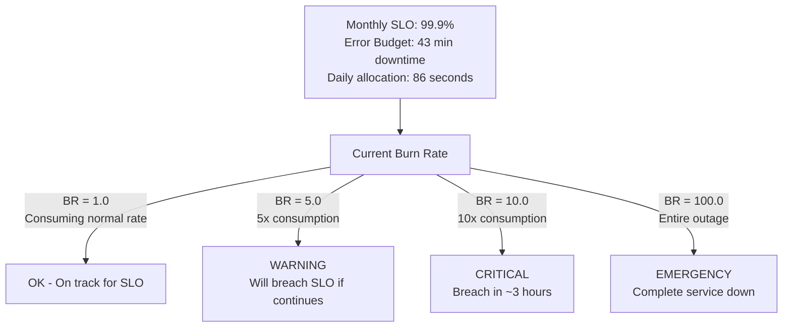

<Hero title="SLO-Based Alerts vs Static Thresholds" subtitle="Alert on service-level objectives, not arbitrary thresholds. Align alerts with actual user impact." imageAlt="Alerting illustration" size="large" />

## TL;DR

Static threshold alerting: "Alert if latency > 500ms." Problem: if your SLO permits 95% of requests under 1000ms, a few requests over 500ms don't violate the SLO. You alert for nothing; on-call gets paged for a non-issue. SLO-based alerting: "Alert if error budget is depleting faster than expected." Your SLO of 99.9% availability grants 43 minutes of downtime per month. If you consume 40 minutes in the first week, you're on pace to breach the SLO—alert immediately. Static thresholds measure system behavior; SLO-based alerts measure user impact. SLO-based alerts eliminate false positives and focus on what business cares about: meeting commitments to customers.

## Learning Objectives

- Define SLOs (Service-Level Objectives) and error budgets
- Calculate error budget and remaining budget
- Design alerts based on burn rate and budget consumption
- Distinguish between SLO violations and degradation
- Use burn rate to automate escalation decisions
- Reduce false positives through SLO-aligned alerting
- Use error budget to guide feature velocity vs. reliability trade-offs

## Motivating Scenario

Your search service has two different SLOs: search availability (99.9%) and search latency (p95 < 500ms). A bug causes search latency to degrade: 20% of requests now exceed 500ms. You have two options for alerting:

**Option 1 (Static Threshold)**: Alert when p95 latency > 500ms. Alert fires immediately. On-call paged.

**Option 2 (SLO-Based)**: Alert when burn rate on latency SLO > 5 for 15 minutes. Calculation: your monthly budget is 5% of requests allowed to exceed 500ms. Current burn: 20%. You're consuming budget 4x faster than monthly pace. Alert fires, on-call paged.

Both pages the on-call, but the reasoning differs. Static threshold is context-blind: maybe 500ms isn't critical for your business. SLO-based alert is business-aligned: you know the user impact (5% of searches will fail SLO), and you know the trend (consuming monthly budget in one week).

## Core Concepts

<Figure caption="Error Budget Depletion: Burn Rate Determines Urgency">

</Figure>

### Error Budget and Burn Rate

**SLO**: Service-Level Objective. Example: "99.9% of requests succeed within 1000ms."

**Error budget**: The allowed failures. If SLO is 99.9% availability, error budget is 0.1% failures.

For a monthly window: 0.1% of all requests allowed to fail. If you handle 1B requests/month, error budget is 1M failures.

**Burn rate**: How fast you're consuming error budget relative to the allowed rate.

- Burn rate = 1.0: Consuming budget at rate that lets you meet SLO by month-end
- Burn rate = 5.0: Consuming 5x as fast—will breach SLO unless trend changes
- Burn rate = 10.0+: Critical—will violate SLO within hours

### Alerting by Burn Rate Windows

Multiple burn rate windows catch incidents at different stages:

| Burn Rate | Duration | Action | Purpose |
|-----------|----------|--------|---------|
| > 100 | 1 min | Page on-call immediately (total outage) | Catch catastrophic failures instantly |
| > 10 | 5 min | Page on-call immediately (will breach SLO soon) | Catch severe incidents early |
| > 5 | 15 min | Page on-call (will breach SLO in ~2 hours) | Catch major issues before they worsen |
| > 1 | Multiple hours | Warn/create ticket (SLO at risk) | Long-term trend monitoring |

## Practical Example

<Tabs>
  <TabItem value="prometheus" label="Prometheus SLO Alerts" default>

```yaml
# Prometheus alert rules for SLO-based alerting

groups:
  - name: slo_alerts
    interval: 30s

    rules:
      # SLO: 99.9% availability (0.1% error budget)
      # Monthly window: ~2.5M requests, 2500 allowed failures

      - alert: APIAvailabilitySLOBreachImmediate
        expr: |
          (
            rate(http_requests_total{status=~"5.."}[5m]) /
            rate(http_requests_total[5m])
          ) > 0.001  # > 0.1% error rate
        for: 5m
        labels:
          severity: critical
          slo: api_availability
        annotations:
          summary: "API availability SLO being violated"
          description: "Error rate {{ $value | humanizePercentage }} exceeds SLO threshold"

      - alert: APIAvailabilitySLOBurnRateWarning
        expr: |
          (
            rate(http_requests_total{status=~"5.."}[15m]) /
            rate(http_requests_total[15m])
          ) > 0.0005  # > 5x burn rate (5 * 0.1%)
        for: 15m
        labels:
          severity: warning
          slo: api_availability
        annotations:
          summary: "API availability error budget burning quickly"
          description: "Burn rate {{ $value | humanizePercentage }} is {{ $value | divideFloat 0.001 | humanize }}x expected"

      - alert: APIAvailabilitySLOTrendingBreach
        expr: |
          (
            rate(http_requests_total{status=~"5.."}[1h]) /
            rate(http_requests_total[1h])
          ) > 0.0002  # > 2x monthly burn rate
        for: 1h
        labels:
          severity: info
          slo: api_availability
        annotations:
          summary: "API availability will breach SLO if trend continues"
          description: "At current burn rate, SLO breach in {{ $value | humanize }} days"

      # SLO: P95 latency < 500ms (5% of requests allowed above threshold)
      - alert: APILatencySLOBreach
        expr: |
          histogram_quantile(0.95, rate(http_request_duration_seconds_bucket[5m])) > 0.5
        for: 5m
        labels:
          severity: critical
          slo: api_latency
        annotations:
          summary: "API P95 latency SLO breached"
          description: "P95 latency {{ $value | humanizeDuration }} exceeds 500ms SLO"

      # Error budget remaining (informational)
      - alert: APIAvailabilityErrorBudgetLow
        expr: |
          (
            1 - (
              rate(http_requests_total{status!~"5.."}[30d]) /
              rate(http_requests_total[30d])
            )
          ) > 0.0009  # Consumed > 90% of monthly budget
        for: 1h
        labels:
          severity: info
          slo: api_availability
        annotations:
          summary: "API availability error budget 90% consumed"
          description: "Only {{ $value | humanizePercentage }} of monthly budget remaining"
```

  </TabItem>
  <TabItem value="calculation" label="Error Budget Calculator">

```python
#!/usr/bin/env python3
"""SLO and error budget calculator"""

from datetime import datetime, timedelta

class SLOCalculator:
    def __init__(self, slo_percentage: float, window_days: int = 30):
        """
        Initialize SLO calculator

        Args:
            slo_percentage: Target SLO (e.g., 99.9)
            window_days: Time window for SLO (default: 1 month)
        """
        self.slo_percentage = slo_percentage
        self.window_days = window_days
        self.error_budget_percentage = 100 - slo_percentage

    def total_seconds_in_window(self) -> int:
        """Total seconds in the SLO window"""
        return self.window_days * 24 * 3600

    def error_budget_seconds(self) -> float:
        """Total downtime allowed in the window"""
        return self.total_seconds_in_window() * (self.error_budget_percentage / 100)

    def error_budget_remaining(self, seconds_already_used: float) -> float:
        """How much error budget remains"""
        return self.error_budget_seconds() - seconds_already_used

    def burn_rate(self, current_error_rate: float, daily_consumption: float) -> float:
        """
        Calculate burn rate multiplier

        Args:
            current_error_rate: Current error rate (0.0 to 1.0)
            daily_consumption: How many seconds of budget consumed today

        Returns:
            Burn rate multiple (1.0 = on pace, 10.0 = 10x pace)
        """
        daily_budget = self.error_budget_seconds() / self.window_days
        return daily_consumption / daily_budget if daily_budget > 0 else 0

    def days_until_breach(self, current_burn_rate: float) -> float:
        """How many days until SLO breach at current burn rate"""
        if current_burn_rate <= 1.0:
            return float('inf')  # Not breaching

        daily_budget = self.error_budget_seconds() / self.window_days
        daily_consumption = daily_budget * current_burn_rate
        remaining_budget = self.error_budget_remaining(0)  # Assume just starting

        return remaining_budget / (daily_consumption * 86400)

    def alert_threshold_by_time(self, minutes_since_window_start: int) -> float:
        """
        Burn rate alert threshold based on time elapsed in window

        Alert if we can't recover even with 0% errors for the rest of the month
        """
        elapsed_seconds = minutes_since_window_start * 60
        remaining_seconds = self.total_seconds_in_window() - elapsed_seconds

        if remaining_seconds <= 0:
            return 0  # Window ended, any error breaches

        # Maximum burn rate we can tolerate
        return self.error_budget_seconds() / (elapsed_seconds if elapsed_seconds > 0 else 1)

# Example: API service with 99.9% SLO

api_slo = SLOCalculator(slo_percentage=99.9, window_days=30)

print("=== API Service SLO Analysis ===")
print(f"SLO Target: {api_slo.slo_percentage}%")
print(f"Error Budget: {api_slo.error_budget_percentage}%")
print(f"Window: {api_slo.window_days} days")
print()

# Scenario 1: Normal operations
print("Scenario 1: Normal Operations")
print(f"  Target error rate: {api_slo.error_budget_percentage}%")
print(f"  Allowed downtime: {api_slo.error_budget_seconds() / 60:.1f} minutes")
print(f"  Daily allocation: {api_slo.error_budget_seconds() / api_slo.window_days / 60:.1f} minutes")
print()

# Scenario 2: Incident consuming error budget quickly
print("Scenario 2: Incident Day 1")
seconds_consumed_day1 = 600  # 10 minutes downtime on day 1
remaining = api_slo.error_budget_remaining(seconds_consumed_day1)
daily_budget = api_slo.error_budget_seconds() / api_slo.window_days
burn_rate = api_slo.burn_rate(0, seconds_consumed_day1)

print(f"  Downtime on Day 1: {seconds_consumed_day1 / 60:.1f} minutes")
print(f"  Daily budget: {daily_budget / 60:.1f} minutes")
print(f"  Burn rate: {burn_rate:.1f}x")
print(f"  Remaining budget: {remaining / 60:.1f} minutes")
print(f"  Days until breach: {api_slo.days_until_breach(burn_rate):.1f}")
print()

# Scenario 3: Check alert thresholds at different times
print("Scenario 3: Alert Thresholds Over Time")
for hours_elapsed in [0.5, 6, 12, 24]:
    minutes_elapsed = hours_elapsed * 60
    threshold = api_slo.alert_threshold_by_time(minutes_elapsed)
    print(f"  After {hours_elapsed} hours: alert if burn rate > {threshold:.1f}x")

if __name__ == '__main__':
    # Example: Customer reports 2% error rate in the API
    error_rate = 0.02  # 2% errors
    minutes_at_this_rate = 10  # For 10 minutes

    seconds_consumed = (minutes_at_this_rate * 60) * error_rate
    burn_rate = api_slo.burn_rate(error_rate, seconds_consumed)

    print("\n=== Emergency Scenario ===")
    print(f"Error rate: {error_rate * 100:.1f}%")
    print(f"Duration: {minutes_at_this_rate} minutes")
    print(f"Error budget consumed: {seconds_consumed / 60:.2f} minutes")
    print(f"Burn rate: {burn_rate:.1f}x (CRITICAL - alert immediately)" if burn_rate > 5 else f"Burn rate: {burn_rate:.1f}x")
```

  </TabItem>
  <TabItem value="grafana-slo" label="Grafana SLO Dashboard">

```json
{
  "dashboard": {
    "title": "API Service SLO Dashboard",
    "panels": [
      {
        "id": 1,
        "title": "Error Budget Remaining (Monthly)",
        "targets": [
          {
            "expr": "(\n  1 - (\n    rate(http_requests_total{status!~\"5..\"}[30d]) /\n    rate(http_requests_total[30d])\n  )\n) * 100",
            "legendFormat": "Budget remaining %"
          }
        ],
        "alert": {
          "conditions": [
            {
              "evaluator": {"type": "lt"},
              "operator": {"type": "and"},
              "query": {"params": ["A", "5m", "now"]},
              "type": "query",
              "value": 10
            }
          ],
          "message": "Error budget < 10% remaining",
          "frequency": "1h"
        }
      },
      {
        "id": 2,
        "title": "Burn Rate (5-minute window)",
        "targets": [
          {
            "expr": "(\n  rate(http_requests_total{status=~\"5..\"}[5m]) /\n  rate(http_requests_total[5m])\n) / 0.001",
            "legendFormat": "Burn rate multiplier"
          }
        ]
      },
      {
        "id": 3,
        "title": "SLO Compliance (P95 Latency)",
        "targets": [
          {
            "expr": "(\n  count(rate(http_request_duration_seconds_bucket{le=\"0.5\"}[5m])) /\n  count(rate(http_request_duration_seconds_bucket[5m]))\n) * 100",
            "legendFormat": "% within SLO"
          }
        ]
      },
      {
        "id": 4,
        "title": "Error Rate vs SLO Budget",
        "targets": [
          {
            "expr": "rate(http_requests_total{status=~\"5..\"}[5m]) * 100",
            "legendFormat": "Current error rate %"
          },
          {
            "expr": "0.001 * 100",
            "legendFormat": "SLO threshold (0.1%)"
          }
        ]
      }
    ]
  }
}
```

  </TabItem>
</Tabs>

## When to Use / When Not to Use

<Vs highlight={[0]} items={[
{label: "Use SLO-Based Alerting", points: [
      "Services with defined SLOs",
      "Need to reduce alert fatigue",
      "Multiple services with different criticality",
      "Want to align operations with business goals",
      "Need to make trade-off decisions (speed vs reliability)"
    ], highlightTone: "positive"},
{label: "Static Thresholds Still Useful", points: [
      "Resource utilization (CPU, memory, disk)",
      "Infrastructure health (node down, replica lag)",
      "External system health (payment processor down)",
      "Early warning signals (before SLO breach)",
      "Development/test environments"
    ]}
]} highlight={[0, 1]} />

## Patterns and Pitfalls

<Showcase
  sections={[
    {
      label: "Pattern: Combine SLO + Infrastructure Alerts",
      body: "SLO-based alerts detect user impact. Infrastructure alerts detect problems before they impact users. A high database CPU alert (infrastructure) fires before latency SLO breaches (user impact). Use both: infrastructure alerts for early detection, SLO alerts as the business-facing measure."
    },
    {
      label: "Pitfall: SLOs Set Too Loosely",
      body: "If you set 99.9% availability but your infrastructure can reliably achieve 99.99%, you're leaving customers disappointed. If you set 99.9% but then create tight alerting to never breach it, you're wasting on-call time. SLO should match business needs, not operational convenience."
    },
    {
      label: "Pattern: Use Error Budget to Guide Decisions",
      body: "Halfway through the month, you have 50% error budget remaining. New feature request arrives but adds risk (5% error rate increase). You can evaluate: will we breach SLO? If no, deploy. If yes, fix or defer. Error budget becomes a resource for velocity trade-offs."
    },
    {
      label: "Pitfall: Forgetting Non-Error-Rate SLOs",
      body: "Not all SLOs are about availability. Latency SLOs (p95 < 500ms) are equally important. Batch processing SLOs (complete within 1 hour) matter for different services. Don't just track availability; track all SLO dimensions."
    },
    {
      label: "Pattern: Burn Rate Thresholds Adjust Over Time",
      body: "Early in the month, tolerate higher burn rates (still time to recover). Late in the month, lower tolerance. Alert thresholds should tighten as you approach the window end. Day 1: alert if burn rate > 20. Day 25: alert if burn rate > 2."
    },
    {
      label: "Pitfall: Not Reviewing SLOs After Incidents",
      body: "Incident: hard drive fails, database replicas go down for 2 hours. This doesn't breach 99.9% monthly SLO (only consumes 2% of budget). But it was painful. Maybe you need a stronger SLO? Review SLOs after significant incidents."
    }
  ]}
/>

## Design Review Checklist

<Checklist items={[
  "Are SLOs defined for all critical services?",
  "Can you explain the business reason for each SLO?",
  "Are alerts based on burn rate, not arbitrary thresholds?",
  "Do you have multiple burn rate windows (immediate, short-term, long-term)?",
  "Is error budget visibility shared with the team?",
  "Are SLO dashboards easily accessible to on-call?",
  "Do you distinguish between SLO violations and degradation alerts?",
  "Are infrastructure alerts layered with SLO alerts?",
  "Is alert fatigue minimal (few false positives)?",
  "Are SLOs reviewed and adjusted after major incidents?"
]} />

## Self-Check

- What's your API service SLO and error budget?
- How much error budget is left this month?
- What's your current burn rate?
- Which SLO is closest to being breached?
- Can you explain why you set that SLO?

## Next Steps

1. **Define SLOs**: For each critical service, define availability and latency SLOs
2. **Calculate error budgets**: For each SLO, determine allowed failure rate
3. **Set burn rate alerts**: Create alerts at 10x, 5x, and 1x burn rates
4. **Dashboard SLO metrics**: Visualize error budget, burn rate, and compliance
5. **Review monthly**: Track SLO breach incidents; adjust SLOs if needed

## References

1. Beyer, B., et al. (2016). Site Reliability Engineering. <a href="https://www.oreilly.com/library/view/site-reliability-engineering/9781491929881/" target="_blank" rel="nofollow noopener noreferrer">O'Reilly Media ↗️</a>
2. Humble, J., & Farley, D. (2010). Continuous Delivery. <a href="https://www.oreilly.com/library/view/continuous-delivery/9780133039593/" target="_blank" rel="nofollow noopener noreferrer">Addison-Wesley ↗️</a>
3. Rong, K. (2019). Error Budget Alerts. <a href="https://sre.google/books/" target="_blank" rel="nofollow noopener noreferrer">Google SRE Book ↗️</a>
