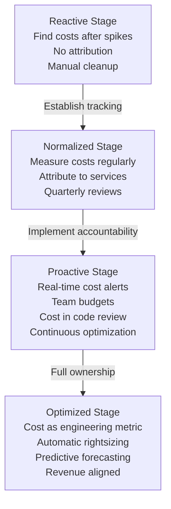

<Hero title="Cost Monitoring and FinOps Integration" subtitle="Track infrastructure costs, attribute costs to services, and optimize spend." imageAlt="Cost monitoring illustration" size="large" />

## TL;DR

Track costs: measure total infrastructure spend per month and per service. Attribution: which service costs how much? Which team owns which cost? Optimization: what can be reduced without impacting users? Tools: resource tagging (label by service/team), showback (visibility without charge), chargeback (costs impact team budgets). Target: dedicate 30% of engineering effort to cost optimization and achieve 30% savings. Measure cost per transaction: decreasing cost per unit processed indicates better efficiency. Monitor trends: is cost growing faster than revenue? Investigate spikes immediately—they indicate scaling events, inefficient code, or wasted resources that need addressing.

## Learning Objectives

- Measure and track total infrastructure costs
- Attribute costs to services and responsible teams
- Identify waste and elimination opportunities
- Right-size resources based on cost-benefit analysis
- Present cost data to stakeholders and engineers
- Build a cost-conscious engineering culture

## Motivating Scenario

Your infrastructure team notices the monthly cloud bill jumped from $250K to $340K in a single month. No major feature shipped, no traffic increase. Investigation reveals three problems: (1) a deprecated service still running with no traffic, consuming $40K/month; (2) a microservice with inefficient database queries consuming 5x more computing than needed; (3) old snapshots and backups no longer needed but never cleaned up.

Without cost visibility, these problems persist indefinitely. With cost monitoring and attribution, each team sees their service cost. Engineers become cost-conscious: they optimize queries, clean up resources, and right-size instances. The engineering team owns cost as seriously as they own latency.

## Core Concepts

<Figure caption="FinOps Maturity: From Reactive to Proactive Cost Management">

</Figure>

### Cost Attribution Model

**Tagging strategy**: Label every resource (compute, storage, database) with metadata:
- `service`: Which service owns this (payment-service, user-api, analytics)
- `team`: Which team owns the service (payments-team, platform-team)
- `environment`: prod, staging, dev
- `cost-center`: For chargeback, which business unit

From tags, cloud providers (AWS, GCP, Azure) can generate cost reports broken down by service, team, or cost-center.

### Showback vs. Chargeback

**Showback**: "Your team's services cost $50K/month. Here's the breakdown." Visibility without financial impact. Builds awareness without forcing strict accountability.

**Chargeback**: "Your team's budget is $40K/month. You're using $50K. You need to optimize or request more budget." Financial accountability drives behavior change. Creates tension between engineering and finance if not managed carefully.

Most organizations start with showback, graduate to chargeback over time.

### Key Cost Metrics

**Cost per transaction**: If your service processes 1M requests/month at $10K cost, that's $0.01 per request. Track this trend. Decreasing cost per unit = increasing efficiency.

**Cost growth vs. revenue growth**: Healthy companies: cost growth < revenue growth. If cost grows faster than revenue, margins compress. Signal: something is inefficient.

**Utilization**: If you're paying for 100 CPU cores but using only 40, you're overprovisioned by 60%. Target: 60-70% average utilization at peak (headroom for spikes, but not massive waste).

## Practical Example

<Tabs>
  <TabItem value="aws-tagging" label="AWS Resource Tagging" default>

```hcl
# Terraform: Tag all resources for cost attribution
resource "aws_instance" "api_server" {
  ami           = "ami-0c55b159cbfafe1f0"
  instance_type = "t3.large"

  tags = {
    Name          = "api-server-1"
    Service       = "user-api"
    Team          = "platform"
    Environment   = "prod"
    CostCenter    = "engineering"
    ManagedBy     = "terraform"
    Project       = "core-infrastructure"
  }
}

resource "aws_rds_cluster" "payments_db" {
  cluster_identifier = "payments-db"
  engine             = "aurora-postgresql"

  tags = {
    Service      = "payment-service"
    Team         = "payments"
    Environment  = "prod"
    CostCenter   = "engineering"
    Criticality  = "high"
  }
}

resource "aws_s3_bucket" "data_lake" {
  bucket = "company-data-lake"

  tags = {
    Service     = "analytics"
    Team        = "data"
    Environment = "prod"
    CostCenter  = "analytics"
  }
}
```

  </TabItem>
  <TabItem value="cost-report" label="Monthly Cost Report Query">

```sql
-- Generate monthly cost report from AWS Cost Explorer
-- Aggregate by Service and Team tags
SELECT
  resource_tags_user_service AS service,
  resource_tags_user_team AS team,
  SUM(CAST(unblended_cost AS DECIMAL(10,2))) AS total_cost,
  COUNT(DISTINCT resource_id) AS resource_count,
  ROUND(SUM(CAST(unblended_cost AS DECIMAL(10,2))) /
    SUM(SUM(CAST(unblended_cost AS DECIMAL(10,2))))
    OVER () * 100, 2) AS pct_of_total
FROM
  aws_cost_and_usage_reports
WHERE
  billing_period = '2025-02'
  AND resource_tags_user_environment = 'prod'
GROUP BY
  resource_tags_user_service,
  resource_tags_user_team
ORDER BY
  total_cost DESC;

-- Results example:
-- service        | team            | total_cost | resource_count | pct_of_total
-- user-api       | platform        | 45200.00   | 12            | 32.5
-- payment-svc    | payments        | 38900.00   | 8             | 27.9
-- analytics-svc  | data            | 32100.00   | 15            | 23.0
-- admin-portal   | platform        | 24800.00   | 5             | 17.8
```

  </TabItem>
  <TabItem value="cost-alert" label="Cost Anomaly Detection">

```python
#!/usr/bin/env python3
import boto3
from datetime import datetime, timedelta
import json

def get_cost_anomalies():
    """Detect anomalies in cost trends"""
    ce_client = boto3.client('ce')

    # Get cost trends for the last 30 days
    end_date = datetime.now().date()
    start_date = end_date - timedelta(days=30)

    response = ce_client.get_cost_and_usage(
        TimePeriod={
            'Start': start_date.isoformat(),
            'End': end_date.isoformat(),
        },
        Granularity='DAILY',
        Metrics=['UnblendedCost'],
        GroupBy=[
            {'Type': 'TAG', 'Key': 'Service'},
            {'Type': 'TAG', 'Key': 'Environment'},
        ],
    )

    # Analyze costs by service
    services = {}
    for result in response['ResultsByTime']:
        for group in result['Groups']:
            service = group['Keys'][0]
            env = group['Keys'][1]
            cost = float(group['Metrics']['UnblendedCost']['Amount'])

            key = f"{service}/{env}"
            if key not in services:
                services[key] = []
            services[key].append(cost)

    # Detect anomalies: costs > 1.5x average
    anomalies = []
    for service_env, costs in services.items():
        avg = sum(costs) / len(costs)
        latest = costs[-1]
        threshold = avg * 1.5

        if latest > threshold:
            anomaly_pct = ((latest - avg) / avg * 100)
            anomalies.append({
                'service': service_env,
                'expected_cost': round(avg, 2),
                'actual_cost': round(latest, 2),
                'increase_pct': round(anomaly_pct, 1),
                'severity': 'HIGH' if anomaly_pct > 50 else 'MEDIUM'
            })

    return sorted(anomalies, key=lambda x: x['increase_pct'], reverse=True)

if __name__ == '__main__':
    anomalies = get_cost_anomalies()

    if anomalies:
        print("Cost Anomalies Detected:")
        for a in anomalies:
            print(f"  {a['service']}: ${a['actual_cost']} (was ${a['expected_cost']}, +{a['increase_pct']}%) [{a['severity']}]")

        # Send alert to Slack
        import requests
        slack_message = {
            'text': f"Cost anomalies detected: {len(anomalies)} services",
            'blocks': [
                {
                    'type': 'section',
                    'text': {'type': 'mrkdwn', 'text': '*Cost Anomalies Detected*'}
                }
            ] + [
                {
                    'type': 'section',
                    'text': {
                        'type': 'mrkdwn',
                        'text': f"*{a['service']}*\nCost: ${a['actual_cost']} (expected ${a['expected_cost']}) +{a['increase_pct']}%"
                    }
                }
                for a in anomalies[:5]  # Top 5 anomalies
            ]
        }
        requests.post(os.environ['SLACK_WEBHOOK'], json=slack_message)
```

  </TabItem>
</Tabs>

## When to Use / When Not to Use

<Vs highlight={[0]} items={[
{label: "Use FinOps & Cost Monitoring", points: [
      "High cloud infrastructure spend (>$50K/month)",
      "Multiple teams sharing infrastructure",
      "Rapidly scaling systems with unpredictable growth",
      "Cost-sensitive business with margin pressures",
      "Multi-service architecture with shared resources"
    ], highlightTone: "positive"},
{label: "Less Critical For", points: [
      "Startups with minimal cloud spend (<$10K/month)",
      "Single-team organizations",
      "Fixed infrastructure (on-premises)",
      "Services with stable, predictable usage",
      "Early-stage projects in active development"
    ]}
]} highlight={[0, 1]} />

## Patterns and Pitfalls

<Showcase
  sections={[
    {
      label: "Pattern: Cost as a Design Constraint",
      body: "Include cost in architecture design decisions. Choosing between RDS and DynamoDB? Calculate cost per transaction. Considering a third-party API? Account for per-request fees. When engineers see the cost upfront, they make better trade-off decisions and explore more efficient alternatives."
    },
    {
      label: "Pitfall: Overly Granular Tagging",
      body: "Don't try to tag every detail (environment, tier, owner, project, cost-center, team, squad, pod...). Too many tags create maintenance burden and inconsistency. Use 4-6 core tags (service, team, environment, cost-center) and leave it at that."
    },
    {
      label: "Pattern: Monthly Cost Reviews",
      body: "Schedule 30-minute monthly cost reviews: service leads review their costs, identify trends, celebrate decreases, investigate increases. When teams see cost data regularly, problems are caught early. Spike of 10% last month? Often due to known scaling event or temporary load."
    },
    {
      label: "Pitfall: Treating Costs as Someone Else's Problem",
      body: "If only finance tracks costs and engineers never see them, no one optimizes. Cost visibility is necessary but not sufficient. Engineers must own cost outcomes. This requires culture change: cost is a design constraint, like latency or reliability."
    },
    {
      label: "Pattern: Right-Sizing Based on Actual Usage",
      body: "Don't buy based on theoretical maximum. Measure actual utilization for 2-4 weeks, then right-size. A database that runs at 40% CPU 99% of the time doesn't need the size you bought for peak capacity. Right-sizing saves 20-40% on compute costs."
    },
    {
      label: "Pitfall: Ignoring Reserved Instances",
      body: "Buying on-demand resources is expensive. For stable, long-term workloads (production databases, always-on services), reserved instances or commitments save 30-60%. However, reserved instances require forecasting accuracy and lock-in."
    }
  ]}
/>

## Design Review Checklist

<Checklist items={[
  "Are all production resources tagged by service and team?",
  "Do you measure cost per transaction or per unit of work?",
  "Is cost data visible to engineers (not just finance)?",
  "Do you identify and remove unused resources monthly?",
  "Are cost anomalies detected and investigated automatically?",
  "Does each team have a cost budget or quota?",
  "Are cost trends monitored (growth vs. revenue, utilization)?",
  "Is cost data used in architecture design decisions?",
  "Do you conduct monthly cost reviews with service owners?",
  "Are reserved instances or commitments used for stable workloads?"
]} />

## Self-Check

- What's your largest cost driver? Why does it cost that much?
- What's your cost per transaction across all services?
- How has your cost per transaction changed month-over-month?
- Can you explain a 20% spike in your cloud bill?
- What's your utilization for compute, database, and storage?

## Next Steps

1. **Implement tagging**: Add service, team, environment, cost-center tags to all resources
2. **Generate cost reports**: Set up monthly automated reports broken down by service and team
3. **Identify waste**: Audit for unused resources, overprovisioned instances, old snapshots
4. **Establish baselines**: Measure cost per transaction by service for the last quarter
5. **Share visibility**: Publish cost data to engineers; celebrate improvements, investigate increases

## References

1. FinOps Foundation. <a href="https://www.finops.org/" target="_blank" rel="nofollow noopener noreferrer">FinOps Principles & Practices ↗️</a>
2. AWS Cost Optimization. <a href="https://aws.amazon.com/architecture/cost-optimization/" target="_blank" rel="nofollow noopener noreferrer">AWS Cost Optimization Guide ↗️</a>
3. Humble, J., & Molesky, J. (2011). Lean Enterprise. <a href="https://www.oreilly.com/library/view/lean-enterprise/9781491946527/" target="_blank" rel="nofollow noopener noreferrer">O'Reilly Media ↗️</a>
