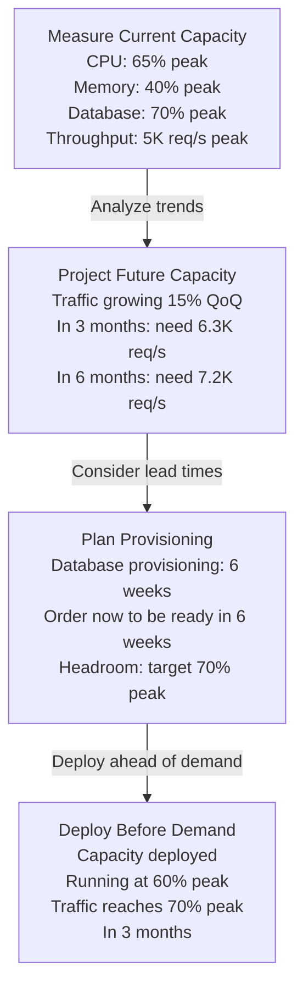

<Hero title="Forecasting and Right-Sizing" subtitle="Predict growth, measure resource needs, and provision infrastructure to meet demand with margin." imageAlt="Forecasting illustration" size="large" />

## TL;DR

Measure: How much traffic do you handle today? How much resource (CPU, memory, database connections) per unit traffic? Forecast: Trend historical data to predict traffic 3-6 months ahead. Project: Calculate when you'll exhaust capacity; if it's in 3 months, start provisioning now because infrastructure has 6-month lead times. Right-sizing: Are you over-provisioned (paying for 50% unused capacity) or under-provisioned (running at 90% utilization during peak)? Target 60-70% peak utilization: enough headroom for growth and traffic spikes without massive waste. Monitor utilization trends daily; capacity planning is continuous, not quarterly.

## Learning Objectives

- Measure current traffic and resource capacity
- Establish capacity baselines across peak and off-peak periods
- Forecast traffic growth using historical trends
- Calculate provisioning needs with appropriate safety margin
- Identify and eliminate over/under-provisioned components
- Monitor utilization trends continuously
- Understand infrastructure lead times and procurement constraints

## Motivating Scenario

Your SaaS product experienced 40% year-over-year growth in users. Three weeks ago, your database started hitting 85% CPU during peak hours. At 85%, queries slow, connections queue, and degradation begins. You request new database capacity. Procurement, setup, and migration take 4 weeks. You're now three weeks into degradation and one week away from running out of capacity entirely.

If you'd forecasted six months ago (when running at 60% capacity), you'd have ordered capacity with a 4-week lead time, receiving it just as you needed it. Instead, reactive capacity planning meant weeks of customer-facing slowness and firefighting.

Proactive forecasting and right-sizing prevent this: measure trends, forecast quarter-ahead, provision with headroom.

## Core Concepts

<Figure caption="Capacity Planning Timeline: From Measurement to Headroom">

</Figure>

### Key Measurements

**Throughput**: Requests per second (or transactions per second for databases). Measure at peak hours and off-peak hours. Percentiles matter: p50, p95, p99. Peak p99 is your critical load.

**Resource utilization**: CPU, memory, disk, network, database connections. Measure as percentage of available. 0% = idle, 100% = at capacity, can't go higher.

**Resource-per-request**: If serving 1000 req/s uses 2 CPU cores, then ratio = 0.002 cores/req. This ratio usually stays constant unless code changes.

### Forecasting Methods

**Linear regression**: If traffic is growing steadily (10% per quarter), project linearly. Simple but assumes growth continues indefinitely.

**Seasonal patterns**: Many products have weekly (weekday > weekend) and yearly (holidays, season) patterns. Account for seasonality when forecasting.

**Event-driven**: Major features, marketing campaigns, acquisitions cause traffic jumps. Collaborate with product and marketing to forecast these events.

### Right-Sizing Targets

**60-70% peak utilization**: Leaves 30-40% headroom for:
- Traffic spikes (traffic can spike 20-30% above average)
- Future growth (plan for 6-month horizon)
- Failures (if one node fails, others can absorb load)

**Never run above 85%**: At 85%+, small spikes cause cascading failures. Queue latencies spike, requests fail, users churn.

## Practical Example

<Tabs>
  <TabItem value="forecasting" label="Capacity Forecasting Script" default>

```python
#!/usr/bin/env python3
import pandas as pd
import numpy as np
from datetime import datetime, timedelta
from sklearn.linear_model import LinearRegression

def forecast_capacity(historical_data_csv, lead_time_days=42):
    """
    Forecast capacity needs using historical data.

    Args:
      historical_data_csv: CSV with columns: date, peak_throughput_rps
      lead_time_days: How many days ahead to forecast (procurement lead time)
    """
    df = pd.read_csv(historical_data_csv)
    df['date'] = pd.to_datetime(df['date'])
    df = df.sort_values('date')

    # Calculate day-of-week seasonality
    df['dow'] = df['date'].dt.dayofweek
    seasonal_factor = df.groupby('dow')['peak_throughput_rps'].mean()

    # Remove seasonality for trend calculation
    df['deseasonalized'] = df.apply(
        lambda row: row['peak_throughput_rps'] / seasonal_factor[row['dow']], axis=1
    )

    # Fit linear regression to trend
    X = np.arange(len(df)).reshape(-1, 1)
    y = df['deseasonalized'].values

    model = LinearRegression()
    model.fit(X, y)

    # Forecast
    future_days = lead_time_days
    future_X = np.arange(len(df), len(df) + future_days).reshape(-1, 1)
    future_deseasonalized = model.predict(future_X)

    # Re-apply seasonality
    future_dates = [df['date'].max() + timedelta(days=i) for i in range(1, future_days + 1)]
    future_dow = [d.weekday() for d in future_dates]
    future_throughput = [
        future_deseasonalized[i] * seasonal_factor[future_dow[i]]
        for i in range(future_days)
    ]

    # Current capacity
    current_peak = df['peak_throughput_rps'].iloc[-1]
    current_utilization = current_peak / 10000  # Assume 10K req/s capacity

    # Forecast at end of lead time
    forecast_peak = future_throughput[-1]
    forecast_utilization = forecast_peak / 10000

    # Capacity needed for 70% peak utilization target
    capacity_needed = forecast_peak / 0.70

    print(f"Capacity Forecast Report")
    print(f"=======================")
    print(f"Current: {current_peak:.0f} req/s peak ({current_utilization*100:.1f}% utilization)")
    print(f"Forecast ({lead_time_days} days): {forecast_peak:.0f} req/s peak ({forecast_utilization*100:.1f}% utilization)")
    print(f"Target capacity (70% peak utilization): {capacity_needed:.0f} req/s")

    # Check if provisioning needed
    if forecast_utilization > 0.70:
        needed_capacity = capacity_needed - 10000
        print(f"\nPROVISIONING NEEDED: +{needed_capacity:.0f} req/s capacity")
        print(f"Lead time: {lead_time_days} days. Order now to avoid running out of capacity.")
    else:
        print(f"\nNo provisioning needed. Current capacity sufficient.")

    return {
        'current_peak': current_peak,
        'forecast_peak': forecast_peak,
        'capacity_needed': capacity_needed,
    }

def identify_over_provisioned(metrics_csv):
    """Identify over-provisioned resources"""
    df = pd.read_csv(metrics_csv)

    for resource in ['cpu', 'memory', 'disk']:
        utilization = df[f'{resource}_utilization_pct']
        avg_util = utilization.mean()
        p99_util = utilization.quantile(0.99)

        # Over-provisioned: average < 30%, p99 < 60%
        if avg_util < 30 and p99_util < 60:
            print(f"{resource.upper()} is over-provisioned (avg {avg_util:.1f}%, p99 {p99_util:.1f}%)")
            print(f"  -> Recommendation: reduce capacity by 20-30%")

if __name__ == '__main__':
    forecast_capacity('historical_throughput.csv', lead_time_days=42)
    identify_over_provisioned('resource_metrics.csv')
```

  </TabItem>
  <TabItem value="terraform" label="Infrastructure as Code: Right-Sizing">

```hcl
# Terraform: Right-sized infrastructure based on forecasted capacity
variable "forecast_peak_rps" {
  description = "Forecasted peak requests per second"
  type        = number
  default     = 7500  # 42 days from now
}

variable "target_peak_utilization" {
  description = "Target utilization at peak traffic"
  type        = number
  default     = 0.70  # 70%
}

# Calculate required capacity
locals {
  required_capacity_rps = var.forecast_peak_rps / var.target_peak_utilization

  # CPU cores: assume 500 req/s per core
  required_cpu_cores = ceil(local.required_capacity_rps / 500)

  # Memory: assume 2GB per core
  required_memory_gb = local.required_cpu_cores * 2
}

# Auto-scaling group configured for forecasted demand
resource "aws_launch_template" "app_server" {
  image_id      = "ami-0c55b159cbfafe1f0"
  instance_type = "t3.xlarge"  # 4 CPU, 16GB memory

  tag_specifications {
    resource_type = "instance"
    tags = {
      Name = "app-server"
    }
  }
}

resource "aws_autoscaling_group" "app" {
  name                = "app-asg"
  vpc_zone_identifier = var.subnet_ids

  # Minimum: 2 instances (for redundancy)
  min_size = 2

  # Desired: sized for 70% peak utilization
  desired_capacity = local.required_cpu_cores / 4  # 4 CPUs per instance

  # Maximum: 20% buffer above desired
  max_size = ceil(local.required_cpu_cores / 4 * 1.2)

  health_check_type          = "ELB"
  health_check_grace_period  = 300

  launch_template {
    id      = aws_launch_template.app_server.id
    version = "$Latest"
  }

  tag {
    key                 = "Name"
    value               = "app-server"
    propagate_at_launch = true
  }
}

# Scale up/down based on CPU utilization
resource "aws_autoscaling_policy" "scale_up" {
  name                   = "app-scale-up"
  autoscaling_group_name = aws_autoscaling_group.app.name
  adjustment_type        = "ChangeInCapacity"
  scaling_adjustment     = 2
  cooldown               = 300

  policy_type = "TargetTrackingScaling"
}

output "required_capacity_rps" {
  value = local.required_capacity_rps
}

output "required_cpu_cores" {
  value = local.required_cpu_cores
}
```

  </TabItem>
  <TabItem value="monitoring" label="Capacity Monitoring Dashboard">

```yaml
# Prometheus alerts for capacity planning
groups:
  - name: capacity_planning
    rules:
      - alert: HighUtilizationTrend
        expr: |
          rate(requests_per_second[1h]) > 0.15
        for: 2w
        annotations:
          summary: "Sustained high growth detected"
          description: "Request rate growing >15% week-over-week. Start capacity planning."

      - alert: ApproachingCapacityLimit
        expr: |
          (node_cpu_seconds_total / node_cpu_seconds_total_capacity) > 0.85
        for: 10m
        annotations:
          summary: "Approaching capacity"
          description: "Peak utilization >85%. Begin emergency provisioning."

      - alert: OverProvisionedResource
        expr: |
          (instance:node_memory_utilization:ratio > 0, instance:node_cpu_utilization:ratio < 0.30)
        for: 1w
        annotations:
          summary: "Over-provisioned instance"
          description: "CPU <30% average. Consider right-sizing down."

# Grafana dashboard variables
variables:
  - name: forecast_horizon_days
    type: constant
    value: "42"
  - name: target_utilization
    type: constant
    value: "0.70"
```

  </TabItem>
</Tabs>

## When to Use / When Not to Use

<Vs highlight={[0]} items={[
{label: "Use Proactive Forecasting", points: [
      "Sustained growth (>10% per quarter)",
      "Long infrastructure lead times (4+ weeks)",
      "Capacity constraints visible (utilization trending up)",
      "SaaS/subscription models with predictable growth",
      "Critical infrastructure with uptime requirements"
    ], highlightTone: "positive"},
{label: "Reactive Sizing Acceptable", points: [
      "Stable, flat traffic (no growth)",
      "Short infrastructure lead times (<1 week)",
      "Cloud-native with auto-scaling",
      "Non-critical batch workloads",
      "Development and staging environments"
    ]}
]} highlight={[0, 1]} />

## Patterns and Pitfalls

<Showcase
  sections={[
    {
      label: "Pattern: Measure Accurate Baselines",
      body: "Don't forecast from last week's data. Collect at least 8-12 weeks of baseline to account for seasonality (weekly and monthly patterns). A product with weekly spikes (weekday > weekend traffic) needs seasonal adjustment when forecasting."
    },
    {
      label: "Pitfall: Ignoring Infrastructure Lead Times",
      body: "Many teams forecast but forget about procurement lead times. Database provisioning takes 6 weeks. By the time you realize you're approaching limits, it's too late to order. Always forecast 1.5x to 2x your procurement lead time ahead."
    },
    {
      label: "Pattern: Collaborate with Product on Major Features",
      body: "When product launches a major feature or acquires a company, traffic often jumps unexpectedly. Work with product and marketing teams: when is the next big feature? Major campaign? Build buffer for these known events into your provisioning plan."
    },
    {
      label: "Pitfall: Overprovisioning Against Unknown Growth",
      body: "Some teams provision for 2x or 3x growth 'just in case.' Overprovisioning wastes money and masks efficiency problems. Target 60-70% peak utilization; let auto-scaling handle unexpected spikes. If you're consistently under 30% utilization, you overprovisioned."
    },
    {
      label: "Pattern: Resource-Specific Forecasting",
      body: "Different resources scale differently. CPU might grow linearly, but database connections might grow superlinearly (if query complexity increases). Forecast each resource separately: CPU, memory, disk I/O, database connections, network bandwidth."
    },
    {
      label: "Pitfall: Static Capacity Planning",
      body: "Don't forecast once per year. Capacity planning is continuous. Review utilization trends weekly, forecast quarterly, adjust as needed. Product changes, growth patterns shift, user behavior evolves. Static planning becomes obsolete."
    }
  ]}
/>

## Design Review Checklist

<Checklist items={[
  "Do you measure current capacity and peak utilization for all critical resources?",
  "Can you forecast traffic 3-6 months ahead with seasonal adjustment?",
  "Do you know your infrastructure procurement lead times?",
  "Is forecasting done quarterly, reviewing and adjusting plans?",
  "Do you target 60-70% peak utilization (not 95%, not 30%)?",
  "Are you collaborating with product on major feature launches?",
  "Is over-provisioning (resources <30% avg utilization) identified and corrected?",
  "Are alerts configured for high utilization trends (approaching 85%)?",
  "Is infrastructure deployed ahead of demand, not reactively?",
  "Are forecasts documented and tracked against actual results?"
]} />

## Self-Check

- What's your traffic growth rate? (% per month or per quarter)
- What's your peak utilization right now for CPU, database, memory?
- When will you run out of capacity at current growth rate?
- How long does it take to provision new infrastructure?
- Are you ordered and deployed for capacity 3-6 months ahead?

## Next Steps

1. **Establish baselines**: Collect 8-12 weeks of traffic and utilization data
2. **Identify trends**: Calculate growth rate and seasonal patterns
3. **Forecast**: Project traffic 6 months ahead; identify capacity constraints
4. **Calculate requirements**: What resources needed for 70% peak utilization?
5. **Order ahead**: Begin procurement with sufficient lead time buffer

## References

1. Beyer, B., et al. (2016). Site Reliability Engineering. <a href="https://www.oreilly.com/library/view/site-reliability-engineering/9781491929881/" target="_blank" rel="nofollow noopener noreferrer">O'Reilly Media ↗️</a>
2. Gregg, B. (2013). Systems Performance: Enterprise and the Cloud. <a href="https://www.brendangregg.com/systems-performance-book.html" target="_blank" rel="nofollow noopener noreferrer">Prentice Hall ↗️</a>
3. Humble, J., & Farley, D. (2010). Continuous Delivery. <a href="https://www.oreilly.com/library/view/continuous-delivery/9780133039593/" target="_blank" rel="nofollow noopener noreferrer">Addison-Wesley ↗️</a>
