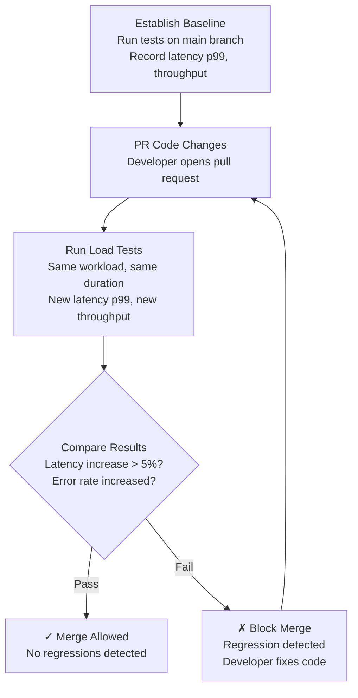

<Hero title="Load Testing in Pipelines" subtitle="Validate capacity assumptions with load testing before production; detect regressions automatically." imageAlt="Load testing illustration" size="large" />

## TL;DR

Manual load testing is expensive and rare. Automated load tests in CI/CD run on every commit, measuring latency, throughput, and resource utilization. Establish baseline metrics on the main branch, then compare PR changes against it. If latency increases by more than 5% or error rate spikes above thresholds, fail the build. This prevents performance regressions from shipping. Load tests don't require production-scale resources—test at 10% scale if constrained. Focus on bottleneck endpoints (slowest, most CPU-intensive) and critical resources (database queries, cache operations). Load testing in staging catches problems before production deployment.

## Learning Objectives

- Design realistic load tests for CI/CD pipelines
- Measure and establish performance baselines
- Detect performance regressions automatically
- Run cost-effective load tests with limited resources
- Configure meaningful regression detection thresholds
- Interpret load test results and act on findings

## Motivating Scenario

Your product ships a new feature that handles user requests differently. The code looks efficient, passes functional tests, and deploys smoothly. Three days later, customer complaints arrive: the system feels slower. Investigation reveals a 12% latency increase on the critical user search endpoint. Rollback costs an hour of downtime and customer trust.

A load test in your CI/CD pipeline would have caught this before merge. The regression would have been visible, visible, and fixable during code review—where the fix takes minutes. This pattern repeats: developers make innocent changes, aggregate effects cause performance degradation, and the first signal is customer impact.

## Core Concepts

<Figure caption="Load Testing Pipeline: From Baseline to Regression Detection">

</Figure>

### Key Metrics in Load Testing

**Latency percentiles**: Measure response time at p50, p95, p99. P99 matters most—even if 99% of requests are fast, one slow response degrades user experience.

**Throughput**: Requests per second the system handles before degradation. Measure stable throughput (after initial warmup) and peak throughput.

**Error rate**: Percentage of requests that fail under load. Should remain near 0% for acceptable load levels. If error rate rises under load, you've found the breaking point.

**Resource utilization**: CPU, memory, database connections. Identify bottlenecks—if CPU is 95% but memory is 30%, you're CPU-bound.

### Load Testing Patterns

**Constant load**: Fixed request rate (1000 req/s for 5 minutes). Simple, reproducible.

**Ramp-up load**: Gradually increase request rate. Models gradual traffic growth, reveals when degradation begins.

**Spike load**: Sudden jump to high request rate. Models traffic spikes, reveals spike resilience.

For CI/CD, constant load is ideal: predictable, fast, consistent results.

## Practical Example

<Tabs>
  <TabItem value="k6" label="k6 Load Test Script" default>

```javascript
import http from 'k6/http';
import { check, group } from 'k6';
import { Rate, Trend } from 'k6/metrics';

// Custom metrics
const errorRate = new Rate('errors');
const searchLatency = new Trend('search_latency');

export const options = {
  stages: [
    { duration: '30s', target: 100 }, // Ramp-up to 100 VUs
    { duration: '2m', target: 100 },  // Stay at 100 VUs
    { duration: '30s', target: 0 },   // Ramp-down
  ],
  thresholds: {
    'http_req_duration': ['p(95)<500', 'p(99)<1000'], // 95% under 500ms, 99% under 1s
    'errors': ['rate<0.01'], // Error rate below 1%
  },
};

export default function () {
  group('Search Endpoint', () => {
    const response = http.get('https://api.example.com/search?q=test');
    const success = check(response, {
      'status 200': (r) => r.status === 200,
      'latency < 500ms': (r) => r.timings.duration < 500,
    });

    errorRate.add(!success);
    searchLatency.add(response.timings.duration);
  });

  group('Details Endpoint', () => {
    const response = http.get('https://api.example.com/details/123');
    check(response, {
      'status 200': (r) => r.status === 200,
    });
    errorRate.add(response.status !== 200);
  });
}
```

  </TabItem>
  <TabItem value="github-actions" label="GitHub Actions CI Integration">

```yaml
name: Performance Tests
on: [pull_request]

jobs:
  load-test:
    runs-on: ubuntu-latest
    steps:
      - uses: actions/checkout@v3

      - name: Deploy to staging
        run: |
          docker build -t app:pr-${{ github.event.number }} .
          docker run -d -p 8080:8080 app:pr-${{ github.event.number }}
          sleep 10 # Wait for startup

      - name: Establish baseline (main branch)
        run: |
          git fetch origin main
          git checkout origin/main
          npm run load-test:main > baseline.json

      - name: Run load tests (PR changes)
        run: npm run load-test:pr > current.json

      - name: Compare results
        run: |
          npm run compare-metrics baseline.json current.json
          if [ $? -ne 0 ]; then
            echo "Performance regression detected!"
            exit 1
          fi

      - name: Comment results on PR
        uses: actions/github-script@v6
        with:
          script: |
            const fs = require('fs');
            const current = JSON.parse(fs.readFileSync('current.json'));
            const baseline = JSON.parse(fs.readFileSync('baseline.json'));

            const latencyChange = ((current.p99 - baseline.p99) / baseline.p99 * 100).toFixed(2);
            const comment = `Performance Test Results:\n- P99 Latency: ${current.p99}ms (${latencyChange > 0 ? '+' : ''}${latencyChange}%)\n- Throughput: ${current.throughput} req/s\n- Errors: ${current.errorRate * 100}%`;

            github.rest.issues.createComment({
              issue_number: context.issue.number,
              owner: context.repo.owner,
              repo: context.repo.repo,
              body: comment
            });
```

  </TabItem>
  <TabItem value="comparison" label="Metrics Comparison Script">

```python
#!/usr/bin/env python3
import json
import sys

def compare_metrics(baseline_file, current_file):
    with open(baseline_file) as f:
        baseline = json.load(f)
    with open(current_file) as f:
        current = json.load(f)

    # Define acceptable thresholds
    thresholds = {
        'p99_latency': 0.05,  # 5% increase
        'throughput': -0.05,  # 5% decrease
        'error_rate': 0.005,  # 0.5% increase
    }

    regressions = []

    # Check P99 latency
    latency_change = (current['p99'] - baseline['p99']) / baseline['p99']
    if latency_change > thresholds['p99_latency']:
        regressions.append(
            f"P99 latency regressed: {baseline['p99']}ms → {current['p99']}ms ({latency_change*100:.1f}%)"
        )

    # Check throughput
    throughput_change = (current['throughput'] - baseline['throughput']) / baseline['throughput']
    if throughput_change < thresholds['throughput']:
        regressions.append(
            f"Throughput degraded: {baseline['throughput']} → {current['throughput']} req/s ({throughput_change*100:.1f}%)"
        )

    # Check error rate
    error_change = current['error_rate'] - baseline['error_rate']
    if error_change > thresholds['error_rate']:
        regressions.append(
            f"Error rate increased: {baseline['error_rate']*100:.2f}% → {current['error_rate']*100:.2f}%"
        )

    if regressions:
        print("Performance Regressions Detected:")
        for regression in regressions:
            print(f"  ✗ {regression}")
        return 1
    else:
        print("✓ No regressions detected")
        return 0

if __name__ == '__main__':
    sys.exit(compare_metrics(sys.argv[1], sys.argv[2]))
```

  </TabItem>
</Tabs>

## When to Use / When Not to Use

<Vs highlight={[0,1]} items={[
{label: "Use SLO-Based Load Testing", points: [
      "Services with strict availability/latency SLOs",
      "Critical customer-facing endpoints",
      "High-traffic scenarios where performance matters",
      "Cost-sensitive systems (efficiency = revenue)",
      "Microservices architecture with interdependencies"
    ], highlightTone: "positive"},
{label: "Use Static Threshold Testing", points: [
      "Internal tools with flexible SLOs",
      "Batch processing with no real-time requirements",
      "One-off tests (not recurring in CI/CD)",
      "Exploratory testing without established baselines",
      "Development environment testing"
    ], highlightTone: "positive"}
]} highlight={[0, 1]} />

## Patterns and Pitfalls

<Showcase
  sections={[
    {
      label: "Pattern: Measure Bottleneck Endpoints",
      body: "Don't test every endpoint equally. Identify which endpoints are slowest, consume most resources, or receive most traffic. Load test those aggressively. A slow search endpoint matters more than slow admin endpoints. Bottleneck endpoints reveal where optimization efforts yield highest ROI."
    },
    {
      label: "Pitfall: Testing with Production-Scale Data",
      body: "You don't need to test at production scale every time. A 10% scale load test in a smaller staging environment runs faster, costs less, and still reveals regressions if your endpoints scale linearly. For expensive resources, 10% scale is often sufficient."
    },
    {
      label: "Pattern: Warm-Up Before Measurement",
      body: "Cold starts skew results. JIT compilation, connection pooling, caching all take time. Always include a warm-up phase (2-3 minutes at lower load) before measuring. Ignore warm-up results; measure only after system reaches steady state."
    },
    {
      label: "Pitfall: Ignoring Resource Constraints",
      body: "A test that pushes 1000 req/s requires staging infrastructure to support 1000 req/s. Without proper sizing, tests themselves become bottlenecks. Baseline your staging infrastructure capacity first; design tests to stay within that."
    },
    {
      label: "Pattern: Alert on Degradation, Not Absolute Thresholds",
      body: "Don't alert when latency hits 500ms—alert when latency increased by 10% from baseline. Absolute thresholds are context-blind; relative changes show degradation. A service might legitimately have 800ms latency; a jump to 900ms is the signal."
    },
    {
      label: "Pitfall: Flaky Tests from External Dependencies",
      body: "If load tests depend on external APIs or services, they're flaky. Isolate load tests from external systems. Mock external dependencies or test against staging instances you control. External flakiness should not block your CI/CD pipeline."
    }
  ]}
/>

## Design Review Checklist

<Checklist items={[
  "Do you run load tests on every pull request?",
  "Is there a baseline performance measurement for the main branch?",
  "Are regression thresholds defined (e.g., 5% latency increase)?",
  "Do failed load tests block merge or just warn?",
  "Are you testing at least the top 3 bottleneck endpoints?",
  "Is warm-up time included in test setup?",
  "Are staging resources sufficient for test load?",
  "Do developers understand why a test failed?",
  "Are results tracked over time (trends, improvements)?",
  "Is load testing documentation updated after each incident?"
]} />

## Self-Check

- What are your top 3 slowest endpoints? Are they load-tested?
- What's your regression detection threshold? Why that number?
- How long do load tests take? Is that acceptable for every PR?
- Can a new engineer understand a failed load test result?
- Do you correlate load test regressions with actual production impact?

## Next Steps

1. **Identify bottleneck endpoints**: Profile production traffic, find slowest endpoints by p99 latency and request volume
2. **Establish baseline**: Run load tests on main branch daily for 1 week, compute stable averages
3. **Set regression thresholds**: Choose thresholds (e.g., 5% latency, 1% throughput, 0.1% error rate) based on SLOs
4. **Integrate into CI/CD**: Add load tests to pull request checks; fail builds if regressions detected
5. **Measure effectiveness**: Track how many regressions are caught pre-deployment vs. discovered in production

## References

1. Newman, S. (2015). Building Microservices. <a href="https://www.oreilly.com/library/view/building-microservices/9781491950340/" target="_blank" rel="nofollow noopener noreferrer">O'Reilly Media ↗️</a>
2. Gregg, B. (2013). Systems Performance: Enterprise and the Cloud. <a href="https://www.brendangregg.com/systems-performance-book.html" target="_blank" rel="nofollow noopener noreferrer">Prentice Hall ↗️</a>
3. k6 Documentation. <a href="https://k6.io/docs/" target="_blank" rel="nofollow noopener noreferrer">k6 Load Testing ↗️</a>
