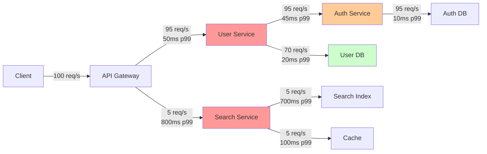

<Hero title="Service Maps and Dependency Visualization" subtitle="Visualize service dependencies and communication patterns to understand system topology." imageAlt="Service map illustration" size="large" />

## TL;DR

Service maps are generated automatically from distributed traces: when service A calls service B, both appear as nodes in a directed graph. An edge connects them with metrics (throughput, latency, error rate). Service maps answer: what services does a user request touch? Which services are in the critical path? Are there unexpected cross-team dependencies? Which services are bottlenecks? Don't maintain service maps manually—derive them from traces, and they stay accurate automatically. Service maps catch architectural problems: deep call chains (excessive latency), circular dependencies (deadlock risks), chatty services (too many calls), and single points of failure. Use service maps for incident response, architecture reviews, and capacity planning.

## Learning Objectives

- Understand how service maps are derived from traces
- Interpret service map topology and identify critical paths
- Detect architectural anti-patterns (deep chains, circular deps)
- Use service maps for incident investigation
- Leverage service maps for architecture reviews
- Monitor service dependencies for unexpected changes

## Motivating Scenario

Your product has grown to 25+ microservices. When an incident occurs, you don't know which services are affected. You spend 30 minutes chasing through logs trying to understand the request flow. Meanwhile, customers are impacted.

A service map shows the complete dependency graph. When an incident alert fires for "user-api," you immediately see: user-api → auth-service → identity-db (on critical path), and user-api → recommendation-service → cache (off critical path). If the incident is latency, you know to focus on identity-db. If the incident is errors, you check auth-service.

Without a service map, you're flying blind. With one, you navigate confidently.

## Core Concepts

<Figure caption="Service Map: Dependencies, Metrics, and Critical Paths">

</Figure>

### Service Map Elements

**Nodes**: Individual services, external dependencies, data stores
- Service-to-service: APIs, gRPC endpoints
- Service-to-data: Databases, caches, data warehouses
- Service-to-queue: Message brokers, event streams

**Edges**: Represent communication, labeled with:
- **Throughput**: Requests per second on this path
- **Latency**: p50, p95, p99 latency for calls on this edge
- **Error rate**: Percentage of failed requests on this edge

**Edge directions**: Directed edges show which service initiates. A → B means A calls B. Bidirectional edges indicate mutual calls (problematic pattern).

### Architectural Patterns

**Deep call chains**: User → API → Service1 → Service2 → Service3 → Database. Each hop adds latency. If each hop is 50ms, total is 250ms. Tail latencies multiply: p99 becomes even worse.

**Circular dependencies**: A calls B, B calls A (or longer cycles: A→B→C→A). Increases failure propagation. If A is slow, B queues requests, requests to B pile up, A gets backed up further—cascading.

**Chatty patterns**: Service A calls Service B 100 times per request. Better to batch: one call with 100 items. Reduces network overhead, improves throughput.

**Single points of failure**: Every request goes through Auth Service. If Auth Service is down or slow, everything degrades. Requires extra redundancy and monitoring.

## Practical Example

<Tabs>
  <TabItem value="jaeger" label="Service Map Query (Jaeger)" default>

```python
#!/usr/bin/env python3
import requests
import json
from collections import defaultdict

class ServiceMapGenerator:
    """Generate service map from Jaeger traces"""

    def __init__(self, jaeger_url="http://localhost:16686"):
        self.jaeger_url = jaeger_url
        self.services = set()
        self.edges = defaultdict(lambda: {
            'calls': 0,
            'errors': 0,
            'latency_samples': []
        })

    def fetch_traces(self, service_name, limit=1000):
        """Fetch traces from a service"""
        response = requests.get(
            f"{self.jaeger_url}/api/traces",
            params={'service': service_name, 'limit': limit}
        )
        return response.json().get('data', [])

    def build_map(self, service_names):
        """Build service map from traces"""
        for service in service_names:
            traces = self.fetch_traces(service)

            for trace in traces:
                spans = trace['spans']
                self._process_trace(spans)

    def _process_trace(self, spans):
        """Extract dependencies from spans"""
        span_map = {s['spanID']: s for s in spans}

        for span in spans:
            self.services.add(span['process']['serviceName'])

            # Find child spans to detect calls
            for s in spans:
                if s['parentSpanID'] == span['spanID']:
                    child_service = s['process']['serviceName']
                    parent_service = span['process']['serviceName']

                    edge_key = (parent_service, child_service)
                    self.edges[edge_key]['calls'] += 1

                    # Track latency
                    latency = s['duration']
                    self.edges[edge_key]['latency_samples'].append(latency)

                    # Track errors
                    if any(t['key'] == 'error' and t['value']
                           for t in s.get('tags', [])):
                        self.edges[edge_key]['errors'] += 1

    def analyze_map(self):
        """Analyze service map for anti-patterns"""
        issues = []

        # Check for deep call chains
        call_depth = self._find_max_chain_depth()
        if call_depth > 4:
            issues.append({
                'type': 'DEEP_CALL_CHAIN',
                'severity': 'WARNING',
                'depth': call_depth,
                'message': f"Deep call chain detected ({call_depth} hops). Consider caching or batching."
            })

        # Check for circular dependencies
        cycles = self._find_cycles()
        for cycle in cycles:
            issues.append({
                'type': 'CIRCULAR_DEPENDENCY',
                'severity': 'ERROR',
                'cycle': cycle,
                'message': f"Circular dependency detected: {' -> '.join(cycle)}"
            })

        # Check for chatty services
        for (src, dst), metrics in self.edges.items():
            if metrics['calls'] > 100:  # Threshold
                issues.append({
                    'type': 'CHATTY_SERVICES',
                    'severity': 'WARNING',
                    'edge': (src, dst),
                    'calls': metrics['calls'],
                    'message': f"{src} calls {dst} {metrics['calls']} times. Consider batching."
                })

        return issues

    def _find_max_chain_depth(self):
        """Find longest call chain"""
        # Build adjacency list
        graph = defaultdict(list)
        for (src, dst) in self.edges:
            graph[src].append(dst)

        def dfs(node, visited):
            if node in visited:
                return 0
            visited.add(node)
            max_depth = 0
            for neighbor in graph[node]:
                max_depth = max(max_depth, 1 + dfs(neighbor, visited))
            visited.remove(node)
            return max_depth

        max_chain = 0
        for service in self.services:
            max_chain = max(max_chain, dfs(service, set()))
        return max_chain

    def _find_cycles(self):
        """Find circular dependencies"""
        cycles = []
        visited = set()
        rec_stack = set()

        def dfs(node, path):
            visited.add(node)
            rec_stack.add(node)
            path.append(node)

            for _, neighbor in [e for e in self.edges if e[0] == node]:
                if neighbor not in visited:
                    dfs(neighbor, path[:])
                elif neighbor in rec_stack:
                    # Found cycle
                    cycle_start = path.index(neighbor)
                    cycles.append(path[cycle_start:] + [neighbor])

            rec_stack.remove(node)

        for service in self.services:
            if service not in visited:
                dfs(service, [])

        return cycles

    def export_json(self, filename):
        """Export service map as JSON"""
        output = {
            'services': list(self.services),
            'edges': [
                {
                    'source': src,
                    'target': dst,
                    'throughput_rps': metrics['calls'],
                    'error_rate': metrics['errors'] / metrics['calls'] if metrics['calls'] > 0 else 0,
                    'latency_p99_ms': sorted(metrics['latency_samples'])[int(len(metrics['latency_samples']) * 0.99)]
                    if metrics['latency_samples'] else 0
                }
                for (src, dst), metrics in self.edges.items()
            ]
        }

        with open(filename, 'w') as f:
            json.dump(output, f, indent=2)

if __name__ == '__main__':
    generator = ServiceMapGenerator()
    services = ['user-api', 'auth-service', 'search-service', 'recommendation-service']

    generator.build_map(services)
    issues = generator.analyze_map()

    print("Service Map Issues Found:")
    for issue in issues:
        print(f"  [{issue['severity']}] {issue['type']}: {issue['message']}")

    generator.export_json('service_map.json')
```

  </TabItem>
  <TabItem value="grafana-loki" label="Service Map from Log Patterns">

```promql
# Grafana Loki query to detect service dependencies from logs
# Assumes logs contain caller and callee information

# Extract edges: which service called which
{job="api-gateway"}
| json
| unwrap caller_service
| stats count() as calls by caller_service, callee_service

# Calculate error rates per edge
{job="api-gateway"}
| json
| unwrap caller_service
| stats
  count() as total_calls,
  count(logfmt) by status="5xx" as error_calls
  by caller_service, callee_service
| line_format "{{.caller_service}} -> {{.callee_service}}: {{.error_calls}}/{{.total_calls}}"

# Detect latency anomalies on specific edges
{job="api-gateway"}
| json
| latency_ms=duration
| stats p99(latency_ms) by caller_service, callee_service
| latency_ms > 500  # Alert if p99 latency > 500ms
```

  </TabItem>
  <TabItem value="visualization" label="Visualization with D3.js">

```javascript
// D3.js visualization of service map
import * as d3 from "d3";

function renderServiceMap(data, containerSelector) {
  const width = 960;
  const height = 600;

  // Create SVG
  const svg = d3.select(containerSelector)
    .append('svg')
    .attr('width', width)
    .attr('height', height);

  // Define forces
  const simulation = d3.forceSimulation(data.services)
    .force('link', d3.forceLink(data.edges)
      .id(d => d.id)
      .distance(100))
    .force('charge', d3.forceManyBody().strength(-300))
    .force('center', d3.forceCenter(width / 2, height / 2));

  // Create links
  const link = svg.selectAll('line')
    .data(data.edges)
    .enter()
    .append('line')
    .attr('stroke', d => {
      if (d.error_rate > 0.05) return '#ff6b6b'; // Error rate > 5%
      if (d.latency_p99_ms > 500) return '#ffa94d'; // High latency
      return '#ccc';
    })
    .attr('stroke-width', d => Math.log(d.throughput_rps + 1));

  // Create nodes
  const node = svg.selectAll('circle')
    .data(data.services)
    .enter()
    .append('circle')
    .attr('r', 20)
    .attr('fill', d => {
      // Color by criticality (how many edges point to this node)
      const incoming = data.edges.filter(e => e.target === d.id).length;
      if (incoming > 5) return '#ff6b6b'; // Critical
      if (incoming > 2) return '#ffa94d'; // Important
      return '#748ede'; // Normal
    })
    .call(d3.drag()
      .on('start', dragstarted)
      .on('drag', dragged)
      .on('end', dragended));

  // Add labels
  const labels = svg.selectAll('text')
    .data(data.services)
    .enter()
    .append('text')
    .text(d => d.id)
    .attr('font-size', '10px')
    .attr('text-anchor', 'middle');

  // Update positions on simulation tick
  simulation.on('tick', () => {
    link
      .attr('x1', d => d.source.x)
      .attr('y1', d => d.source.y)
      .attr('x2', d => d.target.x)
      .attr('y2', d => d.target.y);

    node
      .attr('cx', d => d.x)
      .attr('cy', d => d.y);

    labels
      .attr('x', d => d.x)
      .attr('y', d => d.y + 25);
  });

  function dragstarted(event, d) {
    if (!event.active) simulation.alphaTarget(0.3).restart();
    d.fx = d.x;
    d.fy = d.y;
  }

  function dragged(event, d) {
    d.fx = event.x;
    d.fy = event.y;
  }

  function dragended(event, d) {
    if (!event.active) simulation.alphaTarget(0);
    d.fx = null;
    d.fy = null;
  }
}

// Usage
const serviceMap = {
  services: [
    { id: 'user-api' },
    { id: 'auth-service' },
    { id: 'user-db' },
    { id: 'search-service' },
    { id: 'cache' }
  ],
  edges: [
    { source: 'user-api', target: 'auth-service', throughput_rps: 100, error_rate: 0.01, latency_p99_ms: 50 },
    { source: 'user-api', target: 'user-db', throughput_rps: 80, error_rate: 0.005, latency_p99_ms: 30 },
    { source: 'auth-service', target: 'user-db', throughput_rps: 100, error_rate: 0.01, latency_p99_ms: 25 },
    { source: 'user-api', target: 'search-service', throughput_rps: 20, error_rate: 0.02, latency_p99_ms: 200 },
    { source: 'search-service', target: 'cache', throughput_rps: 200, error_rate: 0.005, latency_p99_ms: 10 }
  ]
};

renderServiceMap(serviceMap, '#service-map-container');
```

  </TabItem>
</Tabs>

## When to Use / When Not to Use

<Vs items={[
{label: "Service Maps Essential", points: [
      "Microservices architecture (>5 services)",
      "Multiple teams owning different services",
      "Complex dependency chains",
      "Frequent incidents and debugging",
      "Architecture reviews and planning"
    ]},
{label: "Service Maps Less Critical", points: [
      "Monolithic architecture",
      "Few services (<3) with simple dependencies",
      "Single team full-stack ownership",
      "Stable, mature systems with known topology",
      "Development and staging environments"
    ]}
]} highlight={[0, 1]} />

## Patterns and Pitfalls

<Showcase
  sections={[
    {
      label: "Pattern: Detect Architectural Drift",
      body: "Your documented architecture says User Service calls Auth Service. The actual service map (from traces) shows User Service calling Auth Service, then Auth Service calling User Service (circular). Service maps reveal what actually happens, not what architecture documents claim. This catches undocumented dependencies and drift."
    },
    {
      label: "Pitfall: Service Map Complexity",
      body: "A service map with 50+ services becomes unreadable. Visualizations become hairballs. Filter by traffic criticality: show only edges with >1% of total traffic. Or show views per team: platform team's internal services separate from product team's. Hierarchical visualization helps."
    },
    {
      label: "Pattern: Service Maps for Incident Response",
      body: "When an alert fires, pull up the service map. See the critical path immediately. If alert is for Search Service, you know it doesn't affect User Service (different branch). If it's for Auth Service, you know everything is affected. This speeds MTTR from 30 minutes to 5 minutes."
    },
    {
      label: "Pitfall: Over-Aggregation",
      body: "A service map that averages all requests loses important distinctions. Checkout flow might follow a different path than search flow. Show multiple service maps for different scenarios: typical request, checkout flow, admin operations. Scenario-specific maps are more useful."
    },
    {
      label: "Pattern: Color-Code by Criticality",
      body: "Nodes receiving many incoming calls are critical. Color them red. Nodes with high error rates or latencies color yellow. At a glance, you see which services are bottlenecks or unhealthy. This focuses attention where it matters."
    },
    {
      label: "Pitfall: Stale Service Maps",
      body: "If service maps are generated weekly but services deploy daily, maps are outdated. Generate service maps continuously from live traces. Or update them real-time using an observability platform that ingests traces directly. Stale maps are worse than no maps."
    }
  ]}
/>

## Design Review Checklist

<Checklist items={[
  "Do you generate service maps automatically from traces (not manually maintain)?",
  "Are service maps available in your observability platform?",
  "Can you identify the critical path for key user workflows?",
  "Are deep call chains (>4 hops) visible and tracked?",
  "Do you check for circular dependencies in service maps?",
  "Are chatty services (high call count) identified and optimized?",
  "Are single points of failure (highly depended-on services) flagged?",
  "Is latency and error rate shown on edges?",
  "Are service maps updated in real-time (not stale)?",
  "Are service maps used during architecture reviews and incidents?"
]} />

## Self-Check

- What's the longest call chain in your service map?
- Which service has the most incoming dependencies?
- Are there any circular dependencies?
- What services have error rates >1%?
- Which edges have latency >200ms?

## Next Steps

1. **Enable distributed tracing**: Ensure all services emit traces with context propagation
2. **Generate service map**: Use your observability platform (Jaeger, Datadog, NewRelic) to render the map
3. **Analyze for issues**: Check for deep chains, circular deps, chatty patterns, bottlenecks
4. **Document critical path**: Identify the services that matter most for key workflows
5. **Monitor continuously**: Set up alerts for topology changes (new dependencies, new services)

## References

1. Pignata, L., & Stafford, U. (2022). Observability Engineering. <a href="https://www.oreilly.com/library/view/observability-engineering/9781492076438/" target="_blank" rel="nofollow noopener noreferrer">O'Reilly Media ↗️</a>
2. Jaeger Documentation. <a href="https://www.jaegertracing.io/" target="_blank" rel="nofollow noopener noreferrer">Jaeger ↗️</a>
3. OpenTelemetry. <a href="https://opentelemetry.io/" target="_blank" rel="nofollow noopener noreferrer">OpenTelemetry Project ↗️</a>
