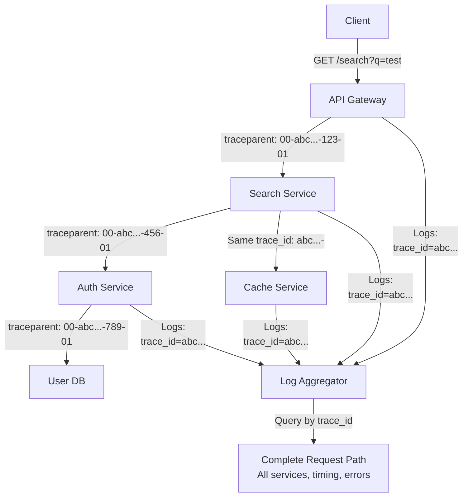

<Hero title="Trace Context Propagation" subtitle="Propagate trace context across service calls to build complete request flow visibility." imageAlt="Tracing illustration" size="large" />

## TL;DR

Trace context (trace ID, span ID, sampling decision) must propagate through all services handling a request. Use W3C Trace Context standard headers (`traceparent`, `tracestate`) for HTTP. Include trace context in logs (as correlation IDs), message queues, and async operations. OpenTelemetry handles propagation automatically when configured correctly. Without propagation, you see isolated requests in logs—each service logs independently, and you can't connect the dots. With propagation, a single trace ID reveals the complete request path, all services touched, timing at each hop, and errors. Propagate trace context consistently, automatically, across all communication boundaries.

## Learning Objectives

- Understand W3C Trace Context standard and its structure
- Implement automatic trace context propagation in HTTP
- Propagate trace context across message queues and async operations
- Use OpenTelemetry to handle propagation without code changes
- Integrate trace IDs into logging systems
- Balance sampling decisions with overhead
- Debug distributed requests end-to-end

## Motivating Scenario

A user reports that searching for products takes 10 seconds. You check the search service logs: search returned in 500ms. You check the API gateway: request took 10 seconds. You check the frontend: request completed in 10 seconds.

The mystery: where did the 9.5 seconds go? Without trace context propagation, each service logs independently. You can't connect logs from search service to logs from API gateway to understand the full flow. With trace context propagation, a single trace ID connects all logs:

- API gateway: received request, trace_id=abc123
- API gateway calls search service, passes trace_id=abc123
- Search service logs with trace_id=abc123
- You see: API gateway → search (0.5s) → auth check (3s) → cache lookup (2s) → database (3s) → returned

The trace reveals the bottleneck (auth check + database) that you would have missed.

## Core Concepts

<Figure caption="Trace Context Propagation Across Services">

</Figure>

### W3C Trace Context Standard

Standard HTTP headers for propagating trace context:

**traceparent header format**:
```
traceparent: version-trace_id-parent_span_id-trace_flags
```

Example: `traceparent: 00-0af7651916cd43dd8448eb211c80319c-b7ad6b7169203331-01`

- `version` (00): Protocol version
- `trace_id` (32 hex chars): Identifies the entire request across all services
- `parent_span_id` (16 hex chars): ID of the span that initiated this call
- `trace_flags` (2 hex chars): Sampling flag (01 = sampled/trace, 00 = not sampled)

**tracestate header**: Vendor-specific state. Allows tracing vendors to extend with proprietary information while maintaining standard compatibility.

### Context Propagation Methods

**HTTP headers**: For synchronous service-to-service calls. Headers automatically propagate. Use `traceparent` as standard.

**Message queues**: For asynchronous operations. Include trace context in message headers or body. When consumer processes the message, resume the trace context.

**Logging**: Include trace ID in every log line. Use structured logging: `{"timestamp": "...", "trace_id": "...", "message": "..."}`. Allows correlating logs across services.

**Database operations**: Some tracing frameworks allow attaching trace context to database queries (via comments or tags). Helps when analyzing slow queries.

## Practical Example

<Tabs>
  <TabItem value="nodejs" label="Node.js with OpenTelemetry" default>

```javascript
// Node.js: Automatic trace context propagation with OpenTelemetry

const { NodeTracerProvider } = require('@opentelemetry/node');
const { registerInstrumentations } = require('@opentelemetry/auto-instrumentations-node');
const { JaegerExporter } = require('@opentelemetry/exporter-jaeger');
const { SimpleSpanProcessor } = require('@opentelemetry/tracing');
const { W3CTraceContextPropagator } = require('@opentelemetry/core');
const { CompositePropagator } = require('@opentelemetry/core');
const express = require('express');

// Setup tracing
const tracerProvider = new NodeTracerProvider();

const jaegerExporter = new JaegerExporter({
  serviceName: 'search-service',
  host: 'jaeger.example.com',
  port: 6832,
});

tracerProvider.addSpanProcessor(new SimpleSpanProcessor(jaegerExporter));

// Setup propagators for HTTP headers
tracerProvider.register();

const propagator = new CompositePropagator({
  propagators: [new W3CTraceContextPropagator()],
});

// Auto-instrument common libraries (express, http, database drivers)
registerInstrumentations({
  tracerProvider,
});

const app = express();

// Middleware to extract trace context from incoming requests
app.use((req, res, next) => {
  // W3CTraceContextPropagator automatically extracts traceparent header
  // and sets context for downstream calls
  next();
});

// Example endpoint
app.get('/search', async (req, res) => {
  // Tracer automatically captured the request span
  // Any downstream calls (HTTP, database) automatically include trace context

  const tracer = require('@opentelemetry/api').trace.getTracer('search-service');

  // Create a custom span for business logic
  const span = tracer.startSpan('process_search_query');

  try {
    const query = req.query.q;
    span.addEvent('search_started', { query });

    // Call auth service - trace context automatically propagated
    const authResult = await fetch('http://auth-service/verify', {
      headers: {
        'Authorization': `Bearer ${req.headers.authorization}`,
        // W3CTraceContextPropagator automatically adds traceparent header
      },
    });

    span.addEvent('auth_completed');

    // Query database - trace context automatically propagated
    const results = await db.query('SELECT * FROM products WHERE name LIKE ?', [query]);

    span.addEvent('search_completed', { result_count: results.length });
    span.setStatus({ code: 0 });

    res.json(results);
  } catch (error) {
    span.recordException(error);
    span.setStatus({ code: 2, message: error.message });
    res.status(500).json({ error: error.message });
  } finally {
    span.end();
  }
});

app.listen(3000);
```

  </TabItem>
  <TabItem value="python" label="Python with OpenTelemetry">

```python
# Python: Trace context propagation in Flask app

from opentelemetry import trace, context
from opentelemetry.exporter.jaeger.thrift import JaegerExporter
from opentelemetry.sdk.trace import TracerProvider
from opentelemetry.sdk.trace.export import BatchSpanProcessor
from opentelemetry.instrumentation.flask import FlaskInstrumentor
from opentelemetry.instrumentation.requests import RequestsInstrumentor
from opentelemetry.instrumentation.sqlalchemy import SQLAlchemyInstrumentor
from opentelemetry.propagators.textmap import DefaultTextMapPropagator
from opentelemetry.propagators.jaeger_propagator import JaegerPropagator
from opentelemetry.propagators.b3_format import B3Format
from flask import Flask, request
import logging

# Setup jaeger exporter
jaeger_exporter = JaegerExporter(
    agent_host_name="jaeger.example.com",
    agent_port=6831,
)

trace.set_tracer_provider(TracerProvider())
trace.get_tracer_provider().add_span_processor(
    BatchSpanProcessor(jaeger_exporter)
)

# Auto-instrument Flask, requests, SQLAlchemy
app = Flask(__name__)
FlaskInstrumentor().instrument_app(app)
RequestsInstrumentor().instrument()
SQLAlchemyInstrumentor().instrument(engine=db.engine)

# Setup structured logging with trace context
logging.basicConfig(
    format='%(asctime)s %(name)s %(levelname)s %(message)s trace_id=%(trace_id)s span_id=%(span_id)s'
)

class TraceContextFilter(logging.Filter):
    """Add trace_id and span_id to log records"""
    def filter(self, record):
        span = trace.get_current_span()
        ctx = span.get_span_context()
        record.trace_id = format(ctx.trace_id, '032x')
        record.span_id = format(ctx.span_id, '016x')
        return True

logger = logging.getLogger(__name__)
logger.addFilter(TraceContextFilter())

@app.route('/search')
def search():
    query = request.args.get('q')
    tracer = trace.get_tracer(__name__)

    with tracer.start_as_current_span('search_query') as span:
        span.set_attribute('query', query)
        logger.info(f"Starting search for: {query}")

        try:
            # Call auth service - trace context automatically propagated
            # via requests library instrumentation
            import requests
            auth_response = requests.get(
                'http://auth-service/verify',
                headers={'Authorization': request.headers.get('Authorization')}
            )
            # Trace context automatically included in request headers

            logger.info("Auth verified")

            # Database query - trace context automatically propagated
            # via SQLAlchemy instrumentation
            results = db.session.query(Product).filter(
                Product.name.ilike(f'%{query}%')
            ).all()

            logger.info(f"Search completed, found {len(results)} results")
            span.set_status(trace.Status(trace.StatusCode.OK))

            return {'results': [r.to_dict() for r in results]}

        except Exception as e:
            logger.error(f"Search failed: {str(e)}")
            span.record_exception(e)
            span.set_status(trace.Status(trace.StatusCode.ERROR))
            return {'error': str(e)}, 500

if __name__ == '__main__':
    app.run(port=3000)
```

  </TabItem>
  <TabItem value="message-queue" label="Trace Context in Message Queues">

```python
# Propagate trace context across message queues (RabbitMQ, Kafka)

from opentelemetry import trace, context
from opentelemetry.instrumentation.pika import PikaInstrumentor
import pika
import json

# Setup message queue instrumentation
PikaInstrumentor().instrument()

# Producer: Send message with trace context
def publish_order_event(order_id):
    tracer = trace.get_tracer(__name__)

    with tracer.start_as_current_span('publish_order_event') as span:
        span.set_attribute('order_id', order_id)

        # Get current trace context
        current_context = context.get_current()

        # Create message with trace context in headers
        message = {
            'order_id': order_id,
            'data': {...},
        }

        # Serialize trace context for transport
        from opentelemetry.propagators.jaeger_propagator import JaegerPropagator
        propagator = JaegerPropagator()
        trace_headers = {}
        propagator.inject(trace_headers, context=current_context)

        message['_trace_context'] = trace_headers

        # Publish to queue
        connection = pika.BlockingConnection(pika.ConnectionParameters('rabbitmq'))
        channel = connection.channel()
        channel.basic_publish(
            exchange='orders',
            routing_key='order.created',
            body=json.dumps(message),
            properties=pika.BasicProperties(
                headers=trace_headers,  # Also in headers for compatibility
            ),
        )
        connection.close()

# Consumer: Extract and resume trace context from message
def consume_order_events():
    tracer = trace.get_tracer(__name__)

    from opentelemetry.propagators.jaeger_propagator import JaegerPropagator
    propagator = JaegerPropagator()

    def callback(ch, method, properties, body):
        # Extract trace context from message headers
        trace_headers = dict(properties.headers or {})

        # Resume trace context
        ctx = propagator.extract(trace_headers)
        context.attach(ctx)

        with tracer.start_as_current_span('process_order_event'):
            message = json.loads(body)
            order_id = message['order_id']

            logger.info(f"Processing order: {order_id}")
            # Process order...

    connection = pika.BlockingConnection(pika.ConnectionParameters('rabbitmq'))
    channel = connection.channel()
    channel.basic_consume(
        queue='order_processing',
        on_message_callback=callback,
        auto_ack=True,
    )
    channel.start_consuming()

if __name__ == '__main__':
    publish_order_event(12345)
    consume_order_events()
```

  </TabItem>
</Tabs>

## When to Use / When Not to Use

<Vs items={[
{label: "Propagate Trace Context", points: [
      "Distributed systems (multiple services)",
      "Asynchronous operations and message queues",
      "Multi-language/multi-framework systems",
      "Need end-to-end request visibility",
      "Performance debugging across services"
    ]},
{label: "Less Critical For", points: [
      "Monolithic applications",
      "Single-threaded, synchronous code",
      "Non-distributed systems",
      "Development/testing environments",
      "Systems with limited service count"
    ]}
]} highlight={[0, 1]} />

## Patterns and Pitfalls

<Showcase
  sections={[
    {
      label: "Pattern: Automatic Propagation Over Manual",
      body: "Don't manually extract/inject trace context in every function. Use instrumentation libraries (OpenTelemetry, DataDog) that automatically handle propagation. Manual propagation is error-prone and duplicates work. Let frameworks handle it."
    },
    {
      label: "Pitfall: Inconsistent Propagation Methods",
      body: "Some services use W3C Trace Context, others use Jaeger format, others use Zipkin format. Incompatible formats break trace correlation. Standardize on W3C Trace Context (HTTP headers) + your language's OpenTelemetry library for consistency."
    },
    {
      label: "Pattern: Include Trace Context in All Logs",
      body: "Add trace_id and span_id to every log entry via structured logging. Allows grepping logs: `grep trace_id=abc123 all-service-logs.log` returns all logs for a single request across all services. This is invaluable for debugging."
    },
    {
      label: "Pitfall: Over-Sampling Causing Trace Overhead",
      body: "Tracing every request at 100% sampling can add 5-10% overhead. Use adaptive sampling: sample all error responses, sample 1% of successful responses. Adjust sampling rate based on traffic volume and overhead. Sampling decisions should be consistent (once decided for a trace, all services use same decision)."
    },
    {
      label: "Pattern: Trace Context in Async/Queued Operations",
      body: "When services communicate via queues, include trace context in message headers. When consumer picks up message, extract and resume context. This connects async operations into a single trace, showing where time is spent (producer → queue → consumer)."
    },
    {
      label: "Pitfall: Losing Context in Thread Pools",
      body: "Async frameworks (async/await, threadpools) can lose context if not configured properly. OpenTelemetry handles this automatically, but custom async code might lose context. Test: verify trace_id shows in logs from thread pool tasks."
    }
  ]}
/>

## Design Review Checklist

<Checklist items={[
  "Is W3C Trace Context (traceparent header) used for HTTP propagation?",
  "Is trace context propagated to all service-to-service calls?",
  "Is trace context included in message queue headers for async operations?",
  "Are trace IDs logged with every log entry (structured logging)?",
  "Can you query logs by trace_id to get complete request flow?",
  "Is sampling decision consistent across all services in a trace?",
  "Is trace overhead monitored (<1% performance impact)?",
  "Are all language runtimes using OpenTelemetry or equivalent?",
  "Is trace context tested (unit tests verify headers propagated)?",
  "Can you follow a single request through all services in your traces?"
]} />

## Self-Check

- Can you query a single trace and see all services touched?
- Do all your logs include trace_id?
- Is latency broken down by service?
- Can you identify which service caused slowness?
- Is trace overhead acceptable for your traffic volume?

## Next Steps

1. **Standardize on W3C Trace Context**: Update all services to use traceparent header
2. **Install OpenTelemetry SDK**: Add to all language runtimes in your stack
3. **Auto-instrument libraries**: Enable auto-instrumentation for HTTP, database, message queues
4. **Add structured logging**: Include trace_id in all log entries
5. **Test propagation**: Verify trace context flows through all service boundaries

## References

1. W3C Trace Context. <a href="https://www.w3.org/TR/trace-context/" target="_blank" rel="nofollow noopener noreferrer">W3C Trace Context Standard ↗️</a>
2. OpenTelemetry Documentation. <a href="https://opentelemetry.io/" target="_blank" rel="nofollow noopener noreferrer">OpenTelemetry ↗️</a>
3. Pignata, L., & Stafford, U. (2022). Observability Engineering. <a href="https://www.oreilly.com/library/view/observability-engineering/9781492076438/" target="_blank" rel="nofollow noopener noreferrer">O'Reilly Media ↗️</a>
