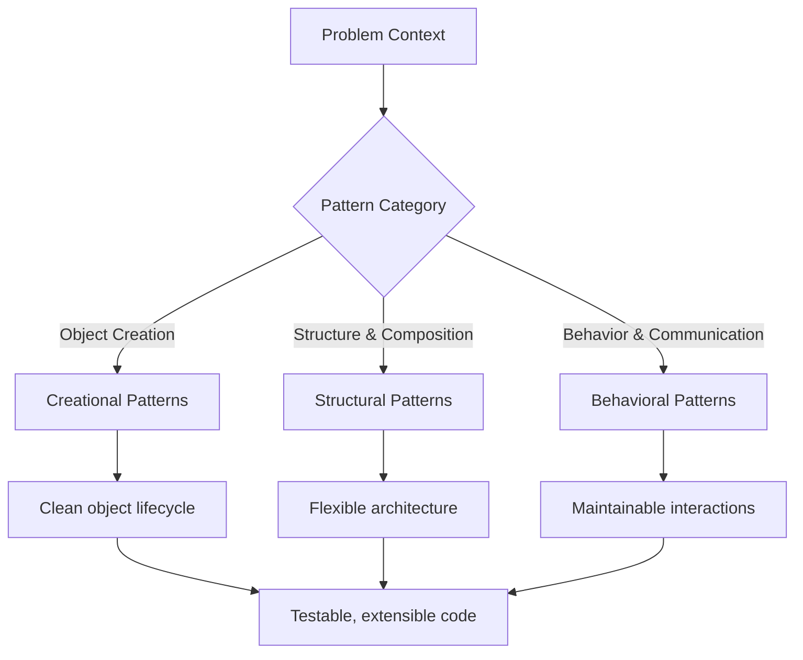

## What this is

A comprehensive guide to design patterns that solve recurring programming problems with proven, reusable solutions. These patterns form the essential vocabulary of professional software development, providing tested approaches for object creation, structure composition, and behavior coordination. Master these patterns to write code that's maintainable, testable, and extensible.

## When to use it

- Building new systems where clean architecture and maintainability matter long-term.
- Refactoring legacy code to improve structure and reduce coupling.
- Team development where consistent design vocabulary accelerates communication.
- Complex domain logic that benefits from clear separation of concerns.
- Systems requiring flexibility for future changes and extensions.

## When not to

- Simple scripts or one-off utilities where patterns add unnecessary complexity.
- Performance-critical code where pattern overhead is unacceptable.
- Very small teams working on throwaway prototypes.
- Domains so unique that standard patterns don't apply well.

## Core pattern categories

### Creational Patterns

**Purpose:** Flexible object creation that adapts to changing requirements.

- **[Factory](/docs/programming-patterns/creational/factory)** — Create objects without specifying exact classes
- **[Abstract Factory](/docs/programming-patterns/creational/abstract-factory)** — Create families of related objects
- **[Builder](/docs/programming-patterns/creational/builder)** — Construct complex objects step by step
- **[Prototype](/docs/programming-patterns/creational/prototype)** — Create objects by cloning existing instances
- **[Singleton](/docs/programming-patterns/creational/singleton)** — Ensure only one instance exists globally

### Structural Patterns

**Purpose:** Clean composition of classes and objects into larger, flexible structures.

- **[Adapter](/docs/programming-patterns/structural/adapter)** — Make incompatible interfaces work together
- **[Bridge](/docs/programming-patterns/structural/bridge)** — Separate abstraction from implementation
- **[Composite](/docs/programming-patterns/structural/composite)** — Treat individual and composite objects uniformly
- **[Decorator](/docs/programming-patterns/structural/decorator)** — Add behavior to objects dynamically
- **[Facade](/docs/programming-patterns/structural/facade)** — Provide simple interface to complex subsystem
- **[Flyweight](/docs/programming-patterns/structural/flyweight)** — Share common object state efficiently
- **[Proxy](/docs/programming-patterns/structural/proxy)** — Control access to expensive or remote objects

### Behavioral Patterns

**Purpose:** Elegant communication and responsibility distribution between objects.

- **[Chain of Responsibility](/docs/programming-patterns/behavioral/chain-of-responsibility)** — Pass requests through handler chain
- **[Command](/docs/programming-patterns/behavioral/command)** — Encapsulate requests as objects
- **[Interpreter](/docs/programming-patterns/behavioral/interpreter)** — Define grammar and interpret language
- **[Iterator](/docs/programming-patterns/behavioral/iterator)** — Access collection elements sequentially
- **[Mediator](/docs/programming-patterns/behavioral/mediator)** — Define object interaction protocols
- **[Memento](/docs/programming-patterns/behavioral/memento)** — Capture and restore object state
- **[Observer](/docs/programming-patterns/behavioral/observer)** — Notify multiple objects of state changes
- **[State](/docs/programming-patterns/behavioral/state)** — Change object behavior based on internal state
- **[Strategy](/docs/programming-patterns/behavioral/strategy)** — Swap algorithms at runtime
- **[Template Method](/docs/programming-patterns/behavioral/template-method)** — Define algorithm skeleton with customizable steps
- **[Visitor](/docs/programming-patterns/behavioral/visitor)** — Add operations to objects without modifying them

## Mental model

_Figure: Pattern selection based on the type of design problem you're solving._

## Getting started

1. **Start with your pain point:** Identify what's hard to change, test, or understand in your current code
2. **Match the pattern category:** Creation problems → Creational; Structure problems → Structural; Behavior problems → Behavioral
3. **Study the intent:** Understand the core problem each pattern solves before diving into implementation
4. **Apply incrementally:** Introduce patterns during refactoring rather than forcing them into working code
5. **Focus on communication:** Use patterns to create a shared vocabulary with your team

## Common pitfalls

- **Overengineering:** Adding patterns before you need the flexibility they provide
- **Pattern obsession:** Using patterns for their own sake rather than solving real problems
- **Wrong pattern choice:** Mismatching pattern to problem type (e.g., using Observer when you need Strategy)
- **Implementation over intent:** Getting lost in code details instead of understanding the design principle
- **Premature optimization:** Applying complex patterns when simple solutions would suffice

Remember: Patterns are tools, not goals. Use them to solve real problems and improve code quality, not to demonstrate pattern knowledge.
