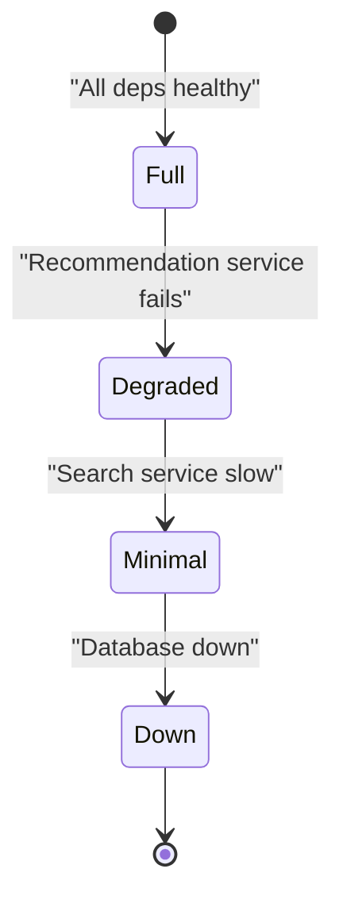

<Hero title="Graceful Degradation and Feature Kill Switches" subtitle="Serve degraded functionality rather than fail; quickly disable problematic features." size="large" />

## TL;DR

Graceful degradation means the system continues to work, albeit with reduced functionality, when a dependency fails. Show empty recommendations instead of error when ML service is down. Serve cached results instead of failing. Use feature kill switches (feature flags) to instantly disable expensive or problematic features without redeploying. Circuit breakers detect dependency failures and short-circuit calls. Fallback handlers provide safe defaults. Design for degradation from day one—it's not an afterthought.

## Learning Objectives

- Design services to degrade gracefully under dependency failures
- Implement circuit breakers and fallback handlers
- Use feature flags and kill switches for incident response
- Distinguish graceful degradation from cascading failures
- Monitor degradation metrics

## Motivating Scenario

Recommendation engine is slow. Without graceful degradation, the entire product listing page fails (bad UX). With degradation, show products without recommendations (acceptable). With a kill switch, ops can instantly disable recommendations without deploying code, letting the service recover.

## Core Concepts

### Degradation Levels

**Full service**: All features available.
**Degraded**: Some features disabled or reduced (e.g., cached data, fewer results).
**Minimal**: Core functionality only (view products, no recommendations/reviews).
**Down**: Service unavailable.

<Figure caption="Graceful degradation path: maintain service as dependencies fail.">

</Figure>

### Feature Flags vs. Kill Switches

- **Feature flag**: Enables/disables features for deployment, testing, rollout control.
- **Kill switch**: Instantly disables feature without code change; for incident response.

Both use the same infrastructure; intent differs.

## Practical Examples

<Tabs>
<TabItem value="circuit_breaker" label="Circuit Breaker Pattern">

```python
import time
import requests
from enum import Enum

class CircuitState(Enum):
    CLOSED = "closed"        # Normal operation
    OPEN = "open"            # Failing, stop calling
    HALF_OPEN = "half_open"  # Testing recovery

class CircuitBreaker:
    def __init__(self, failure_threshold=5, timeout=60):
        self.failure_threshold = failure_threshold
        self.timeout = timeout
        self.failures = 0
        self.last_failure = None
        self.state = CircuitState.CLOSED

    def call(self, func, *args, **kwargs):
        # If circuit is open and timeout not expired, fail fast
        if self.state == CircuitState.OPEN:
            if time.time() - self.last_failure > self.timeout:
                self.state = CircuitState.HALF_OPEN
            else:
                raise Exception("Circuit breaker OPEN: service unavailable")

        try:
            result = func(*args, **kwargs)
            # Success: reset failures
            self.failures = 0
            self.state = CircuitState.CLOSED
            return result
        except Exception as e:
            self.failures += 1
            self.last_failure = time.time()

            if self.failures >= self.failure_threshold:
                self.state = CircuitState.OPEN
                print(f"Circuit opened: too many failures")

            raise

# Usage: product recommendations service
recommendations_breaker = CircuitBreaker(failure_threshold=3, timeout=30)

def get_recommendations(product_id):
    """Get recommendations with graceful degradation."""
    def fetch():
        resp = requests.get(
            f"https://ml-service/recommend/{product_id}",
            timeout=5
        )
        resp.raise_for_status()
        return resp.json()

    try:
        return recommendations_breaker.call(fetch)
    except Exception as e:
        print(f"Recommendation service failed: {e}")
        # Graceful degradation: return empty recommendations
        return {
            "recommendations": [],
            "degraded": True,
            "reason": "recommendation_service_unavailable"
        }

# Example product page:
# - Fetch product details (critical, fail if unavailable)
# - Fetch recommendations (nice-to-have, gracefully degrade)
# - Fetch reviews (nice-to-have, gracefully degrade)
```

</TabItem>
<TabItem value="feature_flags" label="Feature Flags & Kill Switches">

```python
import requests
from typing import Dict, Any
from datetime import datetime

class FeatureFlagManager:
    """Centralized feature flag management."""

    def __init__(self):
        self.flags: Dict[str, Dict[str, Any]] = {
            "recommendations_enabled": {
                "enabled": True,
                "rollout_percentage": 100,
                "users_disabled": ["user_123"],
                "regions_disabled": ["cn"],
                "version_min": "2.0.0",
            },
            "new_checkout_flow": {
                "enabled": True,
                "rollout_percentage": 25,  # Canary: 25% of users
                "users_disabled": [],
                "regions_disabled": [],
            },
            "experimental_search": {
                "enabled": False,  # Not yet live
                "rollout_percentage": 0,
                "users_disabled": [],
                "regions_disabled": [],
            }
        }

    def is_enabled(self, flag_name: str, user_id: str = None, region: str = None) -> bool:
        """Check if feature flag is enabled for this user/region."""
        if flag_name not in self.flags:
            return False

        flag = self.flags[flag_name]

        # Global disable
        if not flag["enabled"]:
            return False

        # User-specific disable
        if user_id and user_id in flag.get("users_disabled", []):
            return False

        # Region-specific disable
        if region and region in flag.get("regions_disabled", []):
            return False

        # Rollout percentage (canary deployment)
        if flag.get("rollout_percentage", 100) < 100:
            # Hash user_id to consistent rollout
            hash_val = hash(user_id or "") % 100
            if hash_val >= flag["rollout_percentage"]:
                return False

        return True

    def kill_switch(self, flag_name: str):
        """Emergency kill switch: disable feature immediately."""
        if flag_name in self.flags:
            self.flags[flag_name]["enabled"] = False
            # Notify: send alert to ops, disable in all regions instantly
            print(f"KILL SWITCH: {flag_name} disabled")

# Usage in application:
flag_manager = FeatureFlagManager()

def render_product_page(product_id, user_id, region):
    page = {
        "product": get_product(product_id),
        "reviews": get_reviews(product_id),
    }

    # Conditionally include recommendations
    if flag_manager.is_enabled("recommendations_enabled", user_id, region):
        page["recommendations"] = get_recommendations(product_id)
    else:
        page["recommendations"] = []

    # Conditionally use new checkout
    if flag_manager.is_enabled("new_checkout_flow", user_id):
        page["checkout"] = render_new_checkout()
    else:
        page["checkout"] = render_old_checkout()

    return page

# Operational use:
# If ML service is having issues:
# flag_manager.kill_switch("recommendations_enabled")
# → Instantly disable recommendations, no code deploy needed
```

</TabItem>
<TabItem value="fallback" label="Fallback Handlers">

```python
def get_user_profile(user_id: str) -> dict:
    """Get user profile with fallbacks."""
    try:
        # Attempt 1: Real-time service
        response = requests.get(
            f"https://profile-service/users/{user_id}",
            timeout=2
        )
        response.raise_for_status()
        return response.json()
    except requests.exceptions.Timeout:
        print(f"Profile service timeout, using cache")
        # Fallback 1: Cache
        cached = cache.get(f"profile:{user_id}")
        if cached:
            return {**cached, "cached": True}

    except requests.exceptions.ConnectionError:
        print(f"Profile service unavailable, using minimal profile")
        # Fallback 2: Minimal profile
        return {
            "id": user_id,
            "name": "User",
            "email": "unknown@example.com",
            "degraded": True
        }

    except Exception as e:
        print(f"Unexpected error getting profile: {e}")
        # Fallback 3: Empty/safe default
        return {}

# Degradation pyramid:
# Level 1: Full service (all data, real-time)
# Level 2: Cache (outdated, but complete)
# Level 3: Minimal (only essential fields)
# Level 4: Empty (service down, but app still works)
```

</TabItem>
</Tabs>

## Design Review Checklist

<Checklist items={[
  "Critical dependencies identified?",
  "Fallback strategies defined for each?",
  "Circuit breakers implemented?",
  "Feature flags for instant disabling?",
  "Degradation levels documented?",
  "Timeout values appropriate?",
  "Failure detection automated?",
  "Graceful degradation tested?",
  "Monitoring for degraded states?",
  "Alerting configured?",
  "Team trained on kill switches?",
  "Metrics track feature unavailability?"
]} />

## Self-Check

- What's a circuit breaker and when does it trip?
- How do feature flags differ from kill switches?
- Can you design degradation for your critical features?
- What's a safe fallback for your dependencies?
- How would you test graceful degradation?

## Advanced Kill Switch Implementation

### Remote Kill Switch Service
```python
class RemoteKillSwitchManager:
    """Centralized kill switch management with caching."""

    def __init__(self, remote_config_url):
        self.remote_url = remote_config_url
        self.local_cache = {}
        self.cache_ttl = 30  # 30 second cache
        self.last_update = 0

    def is_enabled(self, feature_name):
        """Check if feature is enabled (with cache)."""
        now = time.time()

        # Check cache first (fast path)
        if feature_name in self.local_cache:
            if now - self.last_update < self.cache_ttl:
                return self.local_cache[feature_name]

        # Cache expired, fetch from remote
        try:
            response = requests.get(
                f"{self.remote_url}/features/{feature_name}",
                timeout=1
            )
            enabled = response.json()['enabled']
            self.local_cache[feature_name] = enabled
            self.last_update = now
            return enabled
        except Exception as e:
            # Remote unavailable, use last known state (degraded)
            logger.warning(f"Can't reach config service: {e}")
            return self.local_cache.get(feature_name, True)  # Default: enabled

    def kill_switch(self, feature_name):
        """Emergency: disable feature immediately."""
        self.local_cache[feature_name] = False
        self.last_update = time.time()

        # Notify remote async (don't wait for response)
        asyncio.create_task(self._notify_remote(feature_name))

    async def _notify_remote(self, feature_name):
        """Async notification to central config (fire-and-forget)."""
        try:
            requests.post(
                f"{self.remote_url}/features/{feature_name}/disable",
                timeout=5
            )
        except Exception as e:
            logger.error(f"Failed to notify remote: {e}")
```

### Feature Flag Framework

```python
class FeatureFlag:
    """Structured feature flag with metadata."""

    def __init__(self, name, enabled, config):
        self.name = name
        self.enabled = enabled
        self.config = config
        self.created_at = datetime.now()
        self.last_modified = datetime.now()
        self.modified_by = None
        self.reason = None  # Why was it created?
        self.rollout_strategy = config.get('rollout', 'all_or_nothing')
        self.dependencies = config.get('dependencies', [])

    def is_enabled_for_user(self, user_id, region=None):
        """Detailed check considering user, region, dependencies."""
        if not self.enabled:
            return False

        # Check dependencies (other flags this depends on)
        for dep_flag in self.dependencies:
            if not dep_flag.enabled:
                return False

        # Canary rollout: gradually roll out to users
        if self.rollout_strategy == 'canary':
            rollout_pct = self.config.get('rollout_percentage', 0)
            user_hash = hash(user_id) % 100
            return user_hash < rollout_pct

        # Regional rollout: enabled in some regions only
        if self.rollout_strategy == 'regional':
            enabled_regions = self.config.get('regions', [])
            return region in enabled_regions

        return True

# Usage
recommendations_flag = FeatureFlag(
    name='recommendations_v2',
    enabled=True,
    config={
        'rollout': 'canary',
        'rollout_percentage': 25,  # 25% of users
        'dependencies': [],
    }
)

if recommendations_flag.is_enabled_for_user(user_id):
    recommendations = get_recommendations(user_id)
else:
    recommendations = []  # Use degraded experience
```

### Kill Switch Audit Log

```python
class KillSwitchAuditLog:
    """Track all kill switch events for compliance."""

    def log_event(self, event_type, feature, user, reason, details):
        """Log kill switch event."""
        event = {
            'timestamp': datetime.now().isoformat(),
            'type': event_type,  # 'enable', 'disable', 'check'
            'feature': feature,
            'user': user,
            'reason': reason,
            'details': details,
        }

        # Log to multiple destinations
        logger.info(f"Kill switch event: {event}")
        metrics.increment(f'kill_switch.{event_type}')
        audit_db.insert('kill_switch_events', event)

        # Alert on kill switch activation
        if event_type == 'disable':
            alert_ops(f"Feature {feature} disabled: {reason}")

# Usage
audit_log.log_event(
    event_type='disable',
    feature='recommendations',
    user='ops-alice',
    reason='High error rate, investigating',
    details={
        'error_rate': '15%',
        'latency_p99': '8000ms',
        'expected_recovery': '30min'
    }
)
```

## Testing Graceful Degradation

```python
class DegradationTestSuite:
    """Test graceful degradation scenarios."""

    def test_single_dependency_failure(self):
        """Test when one dependency fails."""
        with patch('recommendations_service.get') as mock:
            mock.side_effect = TimeoutError()
            response = render_product_page(product_id=123)
            assert 'recommendations' not in response  # Gracefully omitted
            assert response.status == 200  # Still works

    def test_multiple_failures(self):
        """Test cascading failures."""
        failures = {
            'recommendations': TimeoutError(),
            'reviews': ConnectionError(),
            'pricing': TimeoutError(),
        }
        # Only product and inventory work
        response = render_product_page()
        assert response.status == 200
        assert 'product' in response
        assert 'inventory' in response
        assert 'recommendations' not in response

    def test_kill_switch_instant_disable(self):
        """Test instant disabling via kill switch."""
        # Feature enabled initially
        assert feature_flag.is_enabled('recommendations')

        # Kill switch activated
        kill_switch_manager.kill_switch('recommendations')

        # Feature immediately disabled
        assert not feature_flag.is_enabled('recommendations')

    def test_fallback_handler_response(self):
        """Test fallback when primary service fails."""
        with patch('primary_service.get') as mock:
            mock.side_effect = Exception("Service down")
            result = get_user_profile_with_fallback(user_id=123)
            # Should return fallback data
            assert result['id'] == 123
            assert result['degraded'] == True
```

## Next Steps

1. **Identify critical paths** — Which dependencies would break UX if failed?
2. **Design fallbacks** — What's a safe default for each dependency?
3. **Implement circuit breakers** — Detect failures, short-circuit calls
4. **Add feature flags** — Enable instant disable without redeploying
5. **Test degradation** — Chaos engineering, failure simulation
6. **Monitor degradation** — Track disabled features, analyze root causes
7. **Document degradation levels** — What works when at each level?
8. **Train ops team** — When to activate kill switches, what to expect

## References

- <a href="https://pragprog.com/titles/mnee2/release-it-second-edition/" target="_blank" rel="nofollow noopener noreferrer">Release It! (Michael Nygard) ↗</a>
- <a href="https://sre.google/sre-book/addressing-cascading-failures/" target="_blank" rel="nofollow noopener noreferrer">Google SRE: Cascading Failures ↗</a>
- <a href="https://martinfowler.com/bliki/CircuitBreaker.html" target="_blank" rel="nofollow noopener noreferrer">Martin Fowler: Circuit Breaker Pattern ↗</a>
