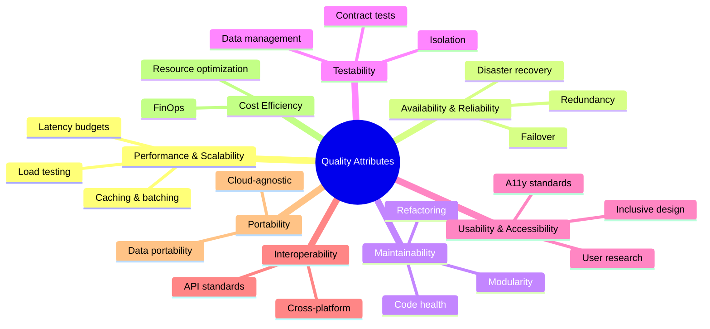

import { useCurrentSidebarCategory } from "@docusaurus/theme-common";

# Quality Attributes (Non-Functional Requirements)

Quality attributes define *how well* a system performs its intended functions. Unlike functional requirements (what the system does), quality attributes specify non-functional concerns: how fast, how reliable, how maintainable, how testable, and how cost-effective.

This section organizes quality attributes using the **ISO/IEC 25010:2023 standard**, the international framework for software product quality. You'll learn to define, measure, and architect for eight core quality attributes that shape every architectural decision.

## What you'll find here

**[ISO/IEC 25010 Conceptual Mapping](./iso-iec-25010-conceptual-mapping/)** — Understand the international standard and map it to practical architecture concerns.

**[Performance & Scalability](./performance-and-scalability/)** — Latency budgets, load testing, profiling, caching, and batching to ship fast systems.

**[Availability & Reliability](./availability-and-reliability/)** — Redundancy, failover, graceful degradation, disaster recovery, and RTO/RPO planning.

**[Maintainability & Modifiability](./maintainability-and-modifiability/)** — Modularity, contracts, code health, and refactoring strategies.

**[Testability](./testability/)** — Test isolation, determinism, data management, and contract-driven testing.

**[Observability](./observability-cross-ref-section-12/)** — Cross-reference to Observability & Operations section (Section 12).

**[Usability & Accessibility (A11y)](./usability-and-accessibility-a11y/)** — Design for diverse users, inclusive UX, and compliance.

**[Interoperability & Portability](./interoperability-and-portability/)** — Cross-platform, API standards, and vendor neutrality.

**[Cost Efficiency (FinOps)](./cost-efficiency-finops/)** — Cloud economics, resource optimization, and sustainable infrastructure.

## Why quality attributes matter

Quality attributes directly impact:

- **User satisfaction**: Fast, available, intuitive systems retain users.
- **Business value**: Reliability and maintainability reduce operational costs; performance enables new features.
- **Team velocity**: Testability and modularity accelerate development and reduce bugs.
- **Risk management**: Disaster recovery, resilience, and monitoring mitigate failures.
- **Competitive advantage**: Cost efficiency and performance differentiate products.

## How to use this section

1. **Understand the standard** — Start with [ISO/IEC 25010 Conceptual Mapping](./iso-iec-25010-conceptual-mapping/) to align terminology across teams.
2. **Define your targets** — For each quality attribute, set measurable goals (e.g., P99 latency < 200ms, 99.95% availability, MTTR < 15 min).
3. **Architect for attributes** — Each subsection gives patterns and trade-offs (e.g., replication vs. partitioning for availability; caching vs. cost for performance).
4. **Measure and validate** — Use observability and testing strategies from [Section 12 (Observability)](../observability-and-operations/) and [Testing Strategy](../testing-strategy/) to instrument and verify.
5. **Iterate** — Quality attributes are not one-time decisions; revisit them as scale, requirements, and constraints evolve.

## Quick reference: Quality attributes at a glance

<Figure caption="ISO/IEC 25010 quality model: eight attributes and their key concerns.">

</Figure>

<DocCardList items={useCurrentSidebarCategory().items} />

## References

1. [ISO/IEC 25010:2023 — Systems and software quality models](https://www.iso.org/standard/35733.html)
2. [NIST Software Quality](https://www.nist.gov/)
3. [The Art of Software Architecture — Quality Attributes (Richards & Ford)](https://www.oreilly.com/library/view/fundamentals-of-software/9781491927961/)
